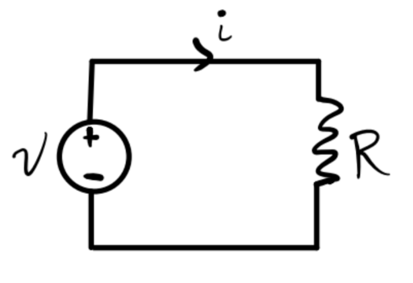

# The Lumped Circuit Abstraction

Engineering can be loosely speaking defined as "the purposeful use of science". Electrical engineering can then be thought of as "the gainful employment of Maxwell's Equations". Here's a broad overview of the topics we'll cover in this course.

{fig-align="center" width=500}

## Maxwell's Equations

Maxwell's Equations are taught in electrodynamics courses. In SI units, they're given as follows.

| Name                  |                      Differential Form                       |                        Integral Form                         |
| --------------------- | :----------------------------------------------------------: | :----------------------------------------------------------: |
| Gauss's Law           |    $\nabla \cdot \mathbf{E} = \frac{\rho}{\varepsilon_0}$    | $\oint \mathbf{E} \cdot d\mathbf{a} = \frac{q}{\varepsilon_0}$ |
| Faraday's Law         | $\nabla \times \mathbf{E} = -\frac{\partial \mathbf{B}}{\partial t}$ | $\oint \mathbf{E} \cdot d\boldsymbol{\ell} = -\frac{\partial \Phi_M}{\partial t}$ |
| No Magnetic Monopoles |                $\nabla \cdot \mathbf{B} = 0$                 |           $\oint \mathbf{B} \cdot d\mathbf{a} = 0$           |
| Ampere's Law          | $\nabla \times \mathbf{B} = \mu_0 \mathbf{J} + \frac{1}{\varepsilon_0 \mu_0} \frac{\partial \mathbf{E}}{\partial t}$ | $\oint \mathbf{B} \cdot d\boldsymbol{\ell} = \mu_0 I + \frac{1}{\varepsilon_0 \mu_0} \frac{\partial \Phi_E}{\partial t}$ |
| Continuity Equation   | $\frac{\partial \rho}{\partial t} - \nabla \cdot \mathbf{J} = 0$ | $\frac{\partial q}{\partial t} - \oint \mathbf{J} \cdot d\mathbf{a} = 0$ |

Rather than use these equations directly we'll derive three simpler laws that hold for circuits:

- Ohm's Law: $v = iR$.
- Kirchoff's Voltage Law (KVL): $\sum_{loop} v = 0$.
- Kirchoff's Current Law (KCL): $\sum_{node} i = 0$.

## Ohm's Law

For many materials, a linear relation holds between the electric field $\mathbf{E}$ inside the material and its current density $\mathbf{J}$. This is the Generalized Ohm's Law: $$\mathbf{E} = \rho \mathbf{J},$$ where $\rho$ is the material's **resistivity**. Consider a piece of cylindrical material, called a **resistor**, with a current $i$ pumped through its ends.

{fig-align="center" width=150}

Since $\mathbf{E} = E \mathbf{e}_y$ and $\mathbf{J} = J \mathbf{e}_y$, and $A$ and $\ell$ are constant, we have

\begin{align*}

i &= \oint \mathbf{J} \cdot d\mathbf{a} = J \cdot A, \\\

v &= \oint \mathbf{E} \cdot d\mathbf{\ell} = E \cdot l.

\end{align*}

Thus, we have $v = \frac{\rho \ell}{A}i \equiv Ri$, where $R \equiv \frac{\rho \ell}{A}$ is a constant, called the **resistence** of the material. The relation then becomes $$v = iR,$$ which is the standard **Ohm's Law**. Note Ohm's Law as stated is only true for resistive materials.

## The Lumped Circuit Abstraction

To easily and reliably analyze circuits we make a number of simplifying assumptions, or **abstractions**. By restricting ourselves to situations where these abstractions hold, we set up a simpler playground in which to work.

The most fundamental abstraction in circuit analysis is the **lumped circuit abstraction** or **LCA**. In the LCA, we assume a circuit is made of a set of lumped elements that are connected to each other with ideal wires (i.e. wires with no voltage drop across any two points and a uniform current throughout).

As an example, let's consider a lightbulb connected to a battery supplying a voltage $v$, which causes a current $i$ to flow across the bulb from the positive terminal of the battery to the negative terminal.

{fig-align="center" width=300}

We'd like to solve for the current $i$ as a function of the input voltage $v$. How should we do this? The *hard way* would be to just use Maxwell's Equations. But this is unnecessary. 

Notice that we don't care about many of the physical properties of the circuit, including the bulb's shape, temperature, filament design, or what the wires are made of. We *only* care about the bulb's resistance, since Ohm's law says $v=iR$. We can thus abstract the details of the bulb and the battery away, treating the bulb as a resistor and the battery as a voltage source.

{fig-align="center" width=300}

Once we've done this, we can simply solve for the current in terms of the voltage simply as $$i = \frac{v}{R}.$$

A more abstract way to express this simple circuit is to use special symbols for the resistor and the voltage source. We'd write the exact same setup like this.

{fig-align="center" width=200}

Now, how do we know we can do this? How do we even know that $v$ and $i$ are even defined? After all, neither voltage nor current need exist in a well-defined way. However, under certain conditions, they do exist. Consider the following setup, where a current $i$ flows through a wire from $A$ to $B$. The voltage across the wire is $v$. The cross-sectional areas through $A$ and $B$ are $s_A$ and $s_B$, respectively.

{fig-align="center" width=200}

By the continuity equation, we have $$i_A - i_B \equiv \int_{s_A} \mathbf{J} \cdot d\mathbf{a} - \int_{s_B} \mathbf{J} \cdot d\mathbf{a} = \frac{\partial q}{\partial t}.$$ Provided no charge can build up inside the wire, we have $$\frac{\partial q}{\partial t} = 0 \Rightarrow i_A = i_B \equiv i.$$ That is, we have a well-defined current $i$ flowing through the wire provided we forbid a buildup of charge inside the wire.

By Faraday's Law, we also have $$v_A - v_B \equiv \int_A^B \mathbf{E} \cdot d \boldsymbol{\ell} = -\frac{\partial \Phi_M}{\partial t}.$$ Provided magnetic flux is constant outside the wires, we can conclude $$\frac{\partial \Phi_M}{\partial t} = 0 \Rightarrow v_A = v_b \equiv v.$$ That is, we have a well-defined voltage $v$ across the wire provided we forbid any change in magnetic flux outside the wire.

The last condition we must require is that currents move much slower than the speed of light. This says that currents aren't allowed to *radiate*.

The requirement that circuits obey each of these properties is called the **lumped matter discipline**:

- Elements are discrete and independent of each other.
- No charge can build up inside of wires.
- Magnetic flux is constant outside of the circuit.
- Currents must move much slower than the speed of light.

## Lumped Elements

