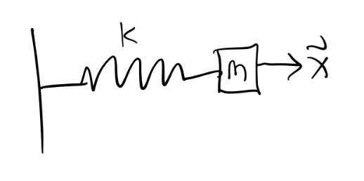
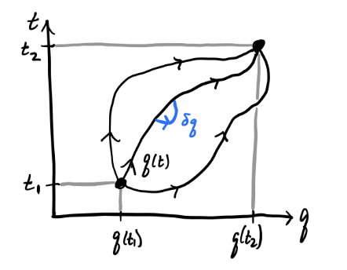
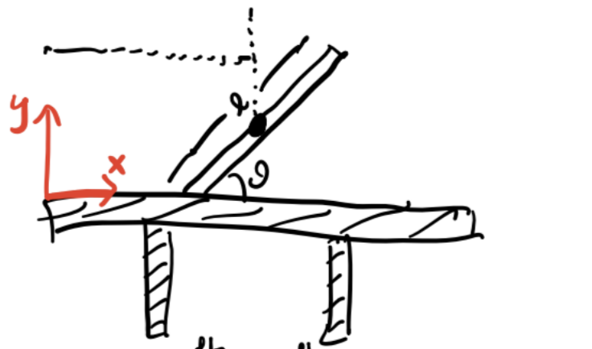
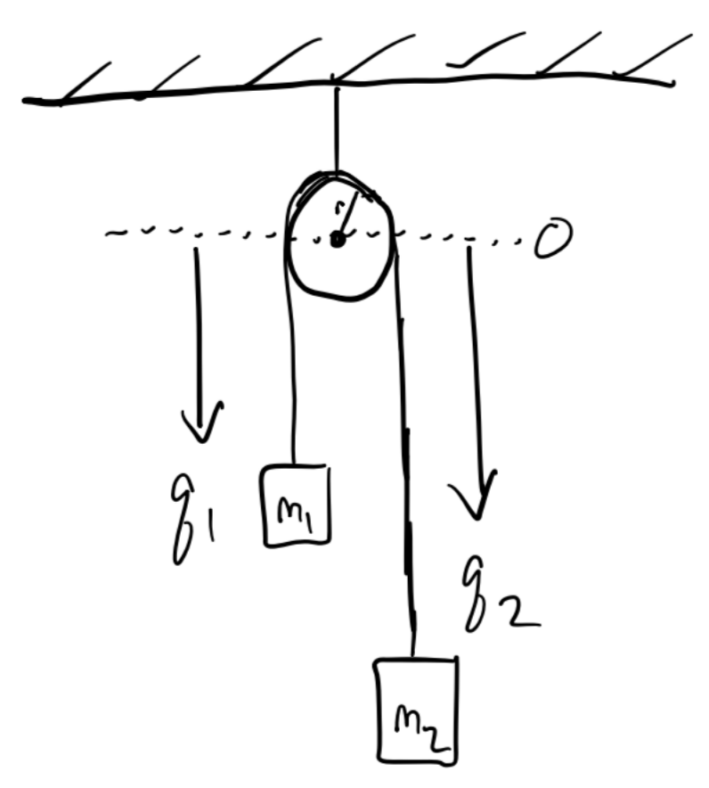
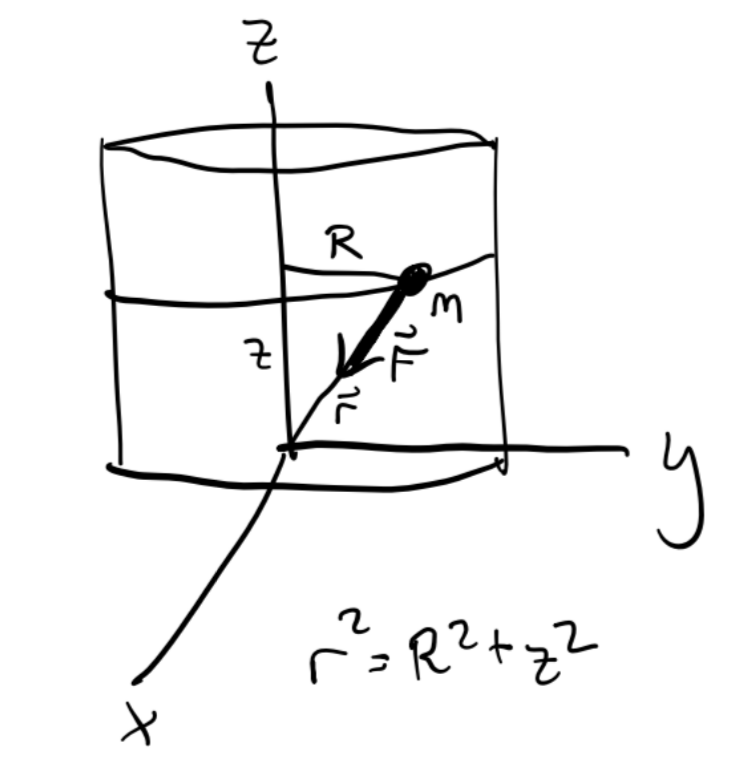
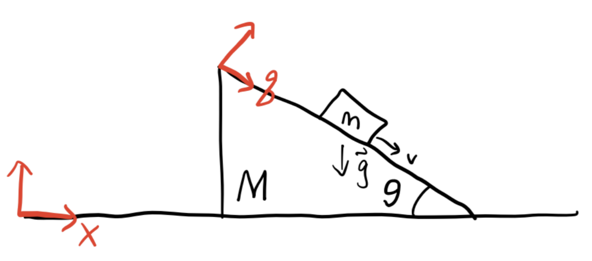
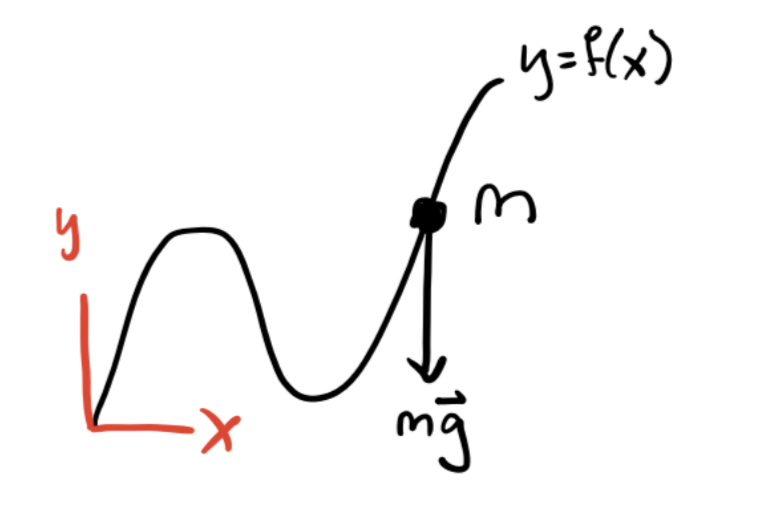

# Lagrangian Mechanics

While Newton's Laws give a complete description of classical mechanics, they can be cumbersome to apply when complicated forces are present. Lagrangian mechanics is an alternative but completely equivalent approach to Newtonian mechanics that greatly simplifies many problems, particularly where constraint forces are present. Not only that, but unlike Newtonian mechanics, the Lagrangian formulation can be extended to many other areas of physics, including quantum mechanics and general relativity.

## Configuration Space

Many forces acting on a system do no work. They serve only to keep particles confined to some surface in space. Such forces are called **forces of constraint**. Examples of forces of constraint include the tension in a string and the normal force keeping an object on a physical surface.

Suppose we have a system of $N$ particles with positions $\mathbf{x}_1, \mathbf{x}_2, \cdots, \mathbf{x}_N$ respectively. Taken together, these positions can be thought of as defining a trajectory in the $3N$-dimensional space $\mathbb{R}^{3N}$. A **holonomic constraint** is a constraint that keeps the $N$ particles confined to some lower-dimensional sub-manifold $\mathcal{Q}$ of $\mathbb{R}^{3N}$. Equivalently, it's a (possibly time-dependent) function of the form
$$
f(\mathbf{x}_1, \mathbf{x}_2, \cdots, \mathbf{x}_N, t) = 0.
$$
The dimension of $\mathcal{Q}$ is $n=3N-C$, where $C$ is the total number of constraints on the system. These are the number of **degrees of freedom** of the system. This sub-manifold is called the **configuration space** of the system. Since $\mathcal{Q}$ is $n$-dimensional, we should be able to parametrize it with $n$ coordinates $q_1, q_2, \cdots, q_n$. We call these **generalized coordinates**. They're not ordinary coordinates in real space. They're a way of describing where in configuration space the system is at a given point in time.

{width=300 fig-align=center}

Holonomicity requires that we be able to find a 1-1 map going back and forth between generalized coordinates and the position vectors,
$$
q_i = q_i(\mathbf{x}_1, \mathbf{x}_2, \cdots, \mathbf{x}_N, t), \quad \mathbf{x}_\alpha = \mathbf{x}_\alpha(q_1, q_2, \cdots, q_n, t).
$$
When the holonomic constraint isn't time-dependent, they're called **scleronomic** constraints. Otherwise they're called **rheonomic** constraints. A system that's not holonomic is called **non-holonomic**.

---

#### Example: Simple Pendulum

As an easy example, consider the simple pendulum. Since there's only one particle, $N=1$. Since the length of the pendulum is fixed, that's one constraint. Since the motion is confined to a plane, that's another constraint. We thus have $n=3N-C=3-2=1$ degrees of freedom, which we can of course take to be the angle $\theta$.

---

#### Example: Rigid Bodies

A more interesting example is the rigid body. A **rigid body** is a system of $N$ particles whose particles are always a fixed distance apart, i.e. $d_{ij} = |\mathbf{x}_i - \mathbf{x}_j|$ is fixed for all $i, j$. This fixed distance requirement introduces a lot of constraints on the system. To see this, suppose $N=4$. Then there are $C=6$ constraints, since each particle must connect to each other particle. This means there are $n=3N-C=6$ degrees of freedom.

{width=200 fig-align=center}

It turns out this fact extends to rigid bodies with arbitrarily many particles as well since adding a new particle gives 3 more coordinates, but also 3 more constraints. A rigid body will *always* have exactly 6 degrees of freedom, which we usually take to be the 3 center of mass coordinates and the three Euler angles.

---

## Principle of Virtual Work

Suppose we have a system of $N$ particles in mechanical equilibrium, so $\mathbf{F}_i=\mathbf{0}$ for all $i$. Let's imagine we perturb each particle $\mathbf{x}_i$ by some amount $\delta \mathbf{x}_i$, but only in a way that doesn't change the configuration space. This means each perturbation must be a function of the generalized coordinates, $\delta \mathbf{x}_i = \delta \mathbf{x}_i(q_1, q_2, \cdots, q_n, t)$. Define the **virtual work** done on the system by,
$$
\delta W \equiv \sum \mathbf{F}_i \cdot \delta\mathbf{x}_i
$$
Now, let's decompose each force $\mathbf{F}_i$ into a sum of two components, an *applied force* $\mathbf{F}_i^{app}$ and a constraint force $\mathbf{F}_i^{con}$. The applied forces are the ones that do work on each particle, while the constraint forces are the ones that keep them confined to the configuration space. If the system is exactly in equilibrium, then  $\mathbf{F}_i = \mathbf{F}_i^{app} + \mathbf{F}_i^{con} = \mathbf{0}$, which means $\delta W = 0$ in equilibrium. But since constraint forces do no work, we get
$$
\delta W = \sum \mathbf{F}_i^{app} \cdot \delta\mathbf{x}_i = 0
$$
This is called the **principle of virtual work**.

**Note:** Sometimes constraint forces *do* in fact do work on a system. One major example is a system in rolling motion, e.g. a wheel rolling down a ramp. We'll mostly ignore these situations in this lesson.

More generally, if a system is not in equilibrium, we have $\mathbf{F}_i = m_i \mathbf{\dot v}_i$. If we insist the principle of virtual work must apply to these situations as well, we have
$$
\begin{align*}
0 = \delta W &= \sum_i (\mathbf{F}_i^{app} - m_i \mathbf{\dot v}_i) \cdot \delta \mathbf{x}_i \\
&= \sum_i (\mathbf{F}_i^{app} - m_i \mathbf{\dot v}_i) \cdot \sum_j\frac{\partial \mathbf{x}_i}{\partial q_j} \delta q_j \\
&= \sum_j \bigg(\sum_i \mathbf{F}_i^{app} \cdot \frac{\partial \mathbf{x}_i}{\partial q_j}  - m_i \mathbf{\dot v}_i \cdot \frac{\partial \mathbf{x}_i}{\partial q_j} \bigg) \delta q_j \\
&= \sum_j \bigg[ Q_j - \bigg(\frac{d}{dt} \frac{\partial T}{\partial \dot q_j} - \frac{\partial T}{\partial q_j} \bigg) \bigg] \delta q_j.
\end{align*}
$$
Here I defined $Q_j \equiv \mathbf{F}_i^{app} \cdot \frac{\partial \mathbf{x}_i}{\partial q_j}$. This term is called the **generalized force**. It acts as a force, but on the generalized coordinates instead of the position vectors directly. The other thing I did was re-wrote the momentum term by using the total kinetic energy $T = \frac{1}{2} \sum_i m_i \mathbf{v}_i^2$. Now, if we insist that all the $q_i$ are independent of each other, then the terms in the sum must vanish individually, which means for all $j=1,\cdots,n$ we have
$$
Q_j = \frac{d}{dt} \frac{\partial T}{\partial \dot q_j} - \frac{\partial T}{\partial q_j}.
$$
In the special case where the forces on the system are conservative, we can use the potential energy $V$ to express the generalized forces as $Q_j = -\frac{\partial V}{\partial q_i}$. Defining a function $L \equiv T - V$ called the **Lagrangian** and re-arranging terms, we finally have
$$
\frac{\partial L}{\partial q_j} - \frac{d}{dt} \frac{\partial L}{\partial \dot q_j} = 0.
$$
This gives a set of $n$ equations for the generalized coordinates, called **Lagrange's equations**.

To see why Lagrange's equations are useful, consider the case when $T=\frac{1}{2} \sum_i m_i \dot x_i^2$ and $V = V(x_1, x_2, \cdots, x_n)$. Then we have a Lagrangian of the form
$$
L = T - V = \frac{1}{2} \sum_i m_i \dot x_i^2 - V(x_1, x_2, \cdots, x_n),
$$
which we can plug into the Euler-Lagrange Equations to get
$$
m \ddot x_i = - \frac{\partial V}{\partial x_i} \quad \forall i=1,2,\cdots,n.
$$
But this is just $\mathbf{F} = m \mathbf{a}$! Evidently we've managed to reproduce Newton's Laws from Lagrange's equations. This in some sense suggest that Lagrange's equations might be more general than Newton's Laws, and in fact they are as we'll see later.

## Solving Lagrange's Equations

The Lagrangian formulation is very useful for solving problems that would be very complicated to solve using Newtonian approaches. This is particular true when there are complex constraints present. It's thus very helpful to see a bunch of examples showing how to solve problems using Lagrangian methods.

To solve a problem using Lagrange's equations we need to do the following steps:

1. Figure out how many degrees of freedom the system has using $n=3N-C$.

2. Identify the generalized coordinates $q_1,q_2,\cdots,q_n$.

3. Express the velocity vectors as a function of the generalized coordinates, $\mathbf{v}_i = \mathbf{v}_i(q_1,q_2,\cdots,q_n)$. 

4. Write down the kinetic energy $T = \frac{1}{2}\sum_i m_i \mathbf{v_i}^2(q_1,q_2,\cdots,q_n)$, the potential energy $V=V(q_1,q_2,\cdots,q_n)$, and finally the Lagrangian
   $$
   L = T - V.
   $$

5. Use Lagrange's equations to derive the equations of motion for the generalized coordinates,
   $$
   \frac{\partial L}{\partial q_j} - \frac{d}{dt} \frac{\partial L}{\partial \dot q_j} = 0 \quad \forall j=1,2\cdots,n.
   $$

6. Integrate the equations of motion to get the generalized trajectories $q_1(t),q_2(t),\cdots,q_n(t)$.

7. If desired, convert back to real space coordinates via $\mathbf{x}_\alpha = \mathbf{x}_\alpha(q_1,q_2,\cdots,q_n)$.

---

#### Example: The Simple Spring

Suppose a mass $m$ is attached to an ideal spring with spring constant $k$.

{width=300 fig-align=center}

In this case, $N = 1$, and the spring is constrained to move along, say, the x-axis, so $C=2$, and there's just $n=3N-C=1$ degree of freedom (as expected). If the generalized coordinate is just $q=x$, we have
$$
T = \frac{1}{2} m \dot q^2, \quad V = \frac{1}{2}kq^2,
$$
which means the Lagrangian is
$$
L = \frac{1}{2} m \dot q^2 - \frac{1}{2}kq^2.
$$
Solving Lagrange's equation in this case gives
$$
-\frac{\partial}{\partial q} \frac{k q^2}{2} - \frac{d}{dt} \frac{\partial}{\partial \dot q} \frac{m\dot q^2}{2} = 0 \quad \Rightarrow \quad m\ddot q = -k q.
$$
We've already seen the solution to this equation is just the SHO solution
$$
q(t) = A\cos(\omega t - \delta), \quad \omega^2 \equiv \frac{k}{m}.
$$
If desired, in this case we could convert back to real coordinates via
$$
\mathbf{x}(t) = q(t) \mathbf{e}_x = A\cos(\omega t - \delta)\mathbf{e}_x.
$$

---

#### Example: Simple Pendulum

Suppose a mass $m$ is attached to a massless string of fixed length $\ell$ and allowed to swing.

{fig-align="center" width=300}

In this problem, there's $N=1$ particle. The string being fixed adds one constraint, and motion being confined to the plane adds another, so we have $n=1$ degrees of freedom here, which we'll take to be the angle $q=\theta$. Using polar coordinates, we can write the kinetic and potential energies as
$$
T = \frac{1}{2} m\ell^2 \dot q^2, \quad V = -mg\ell\cos q,
$$
which gives a Lagrangian
$$
L = \frac{1}{2} m\ell^2 \dot q^2 + mg\ell\cos q.
$$
Solving Lagrange's equation, we get the equation of motion
$$
m\ell^2 \ddot q + mg\ell\sin q = 0,
$$
which is of course the usual equation of motion for the pendulum when $q=\theta$.

---

#### Example: Central Potential

Suppose a particle of mass $m$ is in the presence of a central force field $V=V(r)$. There's one constraint since the problem must be spherically symmetric, which means we have $n=2$ degrees of freedom. Working in spherical coordinates, the kinetic and potential energies are given by
$$
T = \frac{1}{2} m (\dot r^2 + r \dot \varphi^2), \quad V = V(r).
$$
Plugging these into Lagrange's equation and solving gives two equations of motion for $r$ and $\varphi$,
$$
m \ddot r = mr \dot\varphi^2 - \frac{dV}{dr}\\
\frac{d}{dt} mr^2 \dot\varphi = 0.
$$
The second equation is interesting. It says the quantity $\ell = mr^2 \dot\varphi$ must be conserved. But this is just the angular momentum of the system! Evidently, conservation laws somehow fall out of Lagrange's equations provided the right generalized coordinates are chosen.

---

#### Example: Double Pendulum

The examples considered so far are pretty easy to solve using Newtonian methods. Here's an example where it's far easier to write down the equations of motion in the Lagrangian formulation. Consider the double pendulum, where a mass is attached to the end of another pendulum and both are allowed to swing. Suppose both masses have mass $m$ and both strings are a fixed length $\ell$.

{fig-align="center" width=300}

Here there are $N=2$ particles, each of which has two constraints. That means there are $n=2$ total degrees of freedom in this system. From the above diagram we can see
$$
\begin{align*}
&x_1 = \ell \sin\theta_1, \quad &&x_2 = \ell(\sin\theta_1 + \sin\theta_2), \\
&y_1 = -\ell \cos\theta_1, \quad &&y_2 = -\ell(\cos\theta_1 + \cos\theta_2). \\
\end{align*}
$$
We'll choose the two angles $\theta_1, \theta_2$ to be the generalized coordinates. The energies for each mass are given by
$$
\begin{align*}
T_1 &= \frac{1}{2}m (\dot x_1^2 + \dot y_1^2) = \frac{1}{2}m \ell^2 \dot \theta_1^2, \quad && 
T_2 = \frac{1}{2}m (\dot x_2^2 + \dot y_2^2) = \frac{1}{2}m \ell^2\big(\dot\theta_1^2 + \dot\theta_2^2 + 2\cos(\theta_1-\theta_2)\dot\theta_1\dot\theta_2\big), \\
V_1 &= mgy_1 = -mg\ell\cos\theta_1, \quad && V_2 = mgy_2 = -mg\ell(\cos\theta_1 + \cos\theta_2).\\
\end{align*}
$$

Putting these all into the Lagrangian and simplifying, we evidently get
$$
L = \frac{1}{2}m\ell^2\big(2\dot \theta_1^2 + \dot \theta_2^2 + 2\dot\theta_1\dot\theta_2\cos(\theta_1-\theta_2) \big) + mg\ell(2\cos\theta_1 + \cos\theta_2).
$$
This then gives the following two equations of motion
$$
\begin{align*}
-m\ell^2\dot\theta_1\dot\theta_2\sin(\theta_1-\theta_2) - 2mg\ell\sin\theta_1 &= m\ell^2 \frac{d}{dt} \big(\dot\theta_1 + 2\dot\theta_2\cos(\theta_1-\theta_2)\big), \\
m\ell^2\dot\theta_1\dot\theta_2\sin(\theta_1-\theta_2) - mg\ell\sin\theta_2 &= m\ell^2 \frac{d}{dt} \big(\dot\theta_2 + 2\dot\theta_1\cos(\theta_1-\theta_2) \big). \\
\end{align*}
$$

---

## Principle of Least Action

A more general, first principles way to derive Lagrange's equations is via an action principle. Action principles are a very general and powerful tool that applies across pretty much all of modern physics. Suppose we have $n$ generalized coordinates $q_1,q_2,\cdots,q_n$. For simplicity I'll write these as a vector,
$$
\mathbf{q} = (q_1,q_2,\cdots,q_n).
$$
Define the **action** $S$ as a *functional* of $\mathbf{q}$ of the form
$$
S[\mathbf{q}] \equiv \int_{t_1}^{t_2} L(\mathbf{q}, \mathbf{\dot q}, t) dt.
$$
We assume the times $t_1$ and $t_2$ are fixed. The integrand function $L(\mathbf{q}, \mathbf{\dot q}, t)$ is called the **Lagrangian**. Note in general the Lagrangian can depend explicitly on time.

{fig-align="center" width=300}

Similar to how it's useful to analyze a function by looking at its behavior around its minima, we'll want to analyze the functional $S$ by looking at its behavior around the *stationary points* of $\mathbf{q}$. To do so, consider a small perturbation $\delta\mathbf{q} \equiv \varepsilon\boldsymbol{\eta}$ of the coordinates, where $\boldsymbol{\eta} = \boldsymbol{\eta}(t)$ is a function that vanishes at the endpoints $t_1$ and $t_2$, and $\varepsilon \ll 1$. To proceed, we'll assume the following fundamental principle:

**Principle of Least Action: ** Physical trajectories evolve in such a way that the action remains stationary, i.e.
$$
\delta S[\mathbf{q}] \equiv \frac{\partial S}{\partial \varepsilon} \bigg|_{\varepsilon=0} = 0.
$$
This means if we want to figure out how physical trajectories evolve, we need to find the optimal $\mathbf{q}$ that make the action $S$ stationary. To do that, let's set $\delta S[\mathbf{q}] = 0$ and solve. We have
$$
0 = \delta S[\mathbf{q}] = \int_{t_1}^{t_2} \delta L(\mathbf{q}, \mathbf{\dot q}, t) dt = \int_{t_1}^{t_2}\bigg(\frac{\partial L}{\partial\mathbf{q}} \cdot \delta \mathbf{q} + \frac{\partial L}{\partial\mathbf{\dot q}} \cdot \delta \mathbf{\dot q} \bigg) \cdot \delta\mathbf{q} dt
$$
Now, if we perform integration by parts on the second term, we can move the time derivative from $\delta\mathbf{\dot q}$ to the derivative $\frac{\partial L}{\partial\mathbf{\dot q}}$ at the cost of a minus sign, so we have
$$
0 = \delta S[\mathbf{q}] = \int_{t_1}^{t_2}\bigg(\frac{\partial L}{\partial\mathbf{q}} - \frac{d}{dt}\frac{\partial L}{\partial\mathbf{\dot q}} \bigg) \cdot \delta \mathbf{q} dt.
$$
Note the boundary terms vanish since we require $\boldsymbol{\eta}$ to vanish at the endpoints. Assuming each of the coordinates in $\mathbf{q}$ are functionally independent the integrand must vanish identically, so we have
$$
\frac{\partial L}{\partial\mathbf{q}} - \frac{d}{dt}\frac{\partial L}{\partial\mathbf{\dot q}} = \mathbf{0}.
$$
Of course, this is just the vector formulation of Lagrange's equations. We've thus fully recovered Lagrange's equations, and by extension Newton's Laws for conservative systems, purely from the Principle of Least Action.

Notice how general this derivation was. We didn't even assume any specific form of the Lagrangian like $L = T-V$. We only assumed it was a function of the generalized positions, velocities, and time. If we believe the Principle of Least Action, evidently *any* Lagrangian $L(\mathbf{q}, \mathbf{\dot q}, t)$ will produce equations of motion for *some* system, not necessarily mechanical, or even classical.

## Symmetries and Conservation Laws

It's a deep fact of physics that the symmetries of a system are intimately connected with its conservation laws. It's both practically and theoretically useful to better understand this connection.

### Cyclic Coordinates

Consider a general Lagrangian of the form $L = L(\mathbf{q}, \mathbf{\dot q}, t)$. Without loss of generality, suppose the Lagrangian happens to *not* be a function of the coordinate $q_1$, so
$$
L = L(q_2,\cdots,q_n,\dot q_1,\dot q_2, \cdots, \dot q_n, t).
$$
Note it can still be a function of the first coordinate's velocity $\dot q_1$. In this situation, we'd say the coordinate  $q_1$ is a **cyclic coordinate** or **ignorable coordinate**. Evidently, it follows that
$$
\frac{\partial L}{\partial q_1} = 0 \quad \Longrightarrow \quad 0 = \frac{d}{dt} \frac{\partial L}{\partial \dot q_1} \quad \Longrightarrow \quad p_1 \equiv \frac{\partial L}{\partial \dot q_1} = const.
$$
We call $p_1$ the **conjugate momentum** to $q_1$. We've thus shown that if $q_1$ is cyclic, then its conjugate momentum $p_1$ is conserved.

---

#### Example: Free Particle

For a free particle, we have $L = \frac{1}{2}m \dot x^2$. Since $L$ is not a function of $x$, evidently $x$ is cyclic, which means its conjugate momentum $p_x$ is conserved,
$$
p_x = \frac{\partial L}{\partial \dot x} = m \dot x = const.
$$
Notice in this case the conjugate momentum is the same thing as the ordinary linear momentum. This need not always be true. The conjugate momentum is more general than this.

---

#### Example: Central Force in a Plane

In this case the Lagrangian is given by
$$
L = \frac{1}{2} m (\dot r^2 + r^2 \dot\varphi^2) - V(r).
$$
Since $\varphi$ is cyclic, its conjugate momentum $p_\varphi$ must evidently be conserved,
$$
p_\varphi = \frac{\partial L}{\partial \dot \varphi} = mr^2\dot\varphi = const.
$$
Notice this is just the $z$-component of angular momentum $L_z = \ell$.

---

### Noether's Theorem

We can still have conserved quantities in a given system even if none of its generalized coordinates are explicitly cyclic. This will happen, for example, if we didn't happen to choose the *natural* choice of coordinates for some given problem, the ones that take advantage of the system's symmetries.

To find conserved quantities, we need to find the symmetries. Formally, we'll say a *symmetry* is any continuous transformation on the generalized coordinates that leaves the Lagrangian invariant. That is, for some parameter $s$, if $\mathbf{q}$ is continuously transformed to $\mathbf{q}_s$, then $s$ is a **symmetry** provided
$$
L(\mathbf{q}_s, \mathbf{\dot q}_s, t) = L(\mathbf{q}, \mathbf{\dot q}, t).
$$
**Noether's Theorem:** If $s$ is a symmetry of a system, then the quantity given by
$$
Q \equiv \mathbf{p} \cdot \frac{\partial \mathbf{q}}{\partial s} = p_i \frac{\partial q_i}{\partial s}
$$
must be conserved under transformation by $s$. We call $Q$ the **Noether charge** associated with $s$.

---

**Proof:** To prove this theorem we need to show that $\dot Q = 0$.  Since $s$ is a symmetry, we must have
$$
\frac{\partial}{\partial s} L(\mathbf{q}_s, \mathbf{\dot q}_s, t) = \frac{\partial}{\partial s} L(\mathbf{q}, \mathbf{\dot q}, t) = 0.
$$
Using the chain rule together with Lagrange's equations on $L(\mathbf{q}_s, \mathbf{\dot q}_s, t)$, we finally get
$$
\begin{align*}
\mathbf{0} &= \frac{\partial}{\partial s} L(\mathbf{q}_s, \mathbf{\dot q}_s, t) \\
&= \frac{\partial L}{\partial \mathbf{q}_s} \cdot \frac{\partial \mathbf{q}_s}{\partial s} + \frac{\partial L}{\partial \mathbf{\dot q}_s} \cdot \frac{\partial \mathbf{\dot q}_s}{\partial s} \\
&= \frac{d}{dt} \frac{\partial L}{\partial \mathbf{\dot q}_s} \cdot \frac{\partial \mathbf{q}_s}{\partial s} + \frac{\partial L}{\partial \mathbf{\dot q}_s} \cdot \frac{d}{dt} \frac{\partial \mathbf{q}_s}{\partial s} \\
&= \frac{d}{dt} \bigg(\frac{\partial L}{\partial \mathbf{\dot q}_s} \cdot \frac{\partial \mathbf{q}_s}{\partial s}\bigg) \\
&= \frac{d}{dt} \bigg(\mathbf{p} \cdot \frac{\partial \mathbf{q}}{\partial s}\bigg). \tag*{$\square$}
\end{align*}
$$

---

#### Example: Conservation of Linear Momentum

Suppose a single particle is moving through space.  Suppose the space is *homogeneous*, that is, the particle's Lagrangian is invariant to translations in space,
$$
L(\mathbf{x}, \mathbf{\dot x}, t) = L(\mathbf{x} + \delta\mathbf{x}, \mathbf{\dot x}, t).
$$
This is equivalent to saying the particle has a symmetry of the form $\mathbf{x}(s) = \mathbf{x} + s\boldsymbol{\varepsilon}$, where $\boldsymbol{\varepsilon}$ is constant. In this case, we'd evidently have
$$
Q = \mathbf{p} \cdot \frac{\partial \mathbf{x}}{\partial s} = \mathbf{p} \cdot \boldsymbol{\varepsilon} = const.
$$
Since $\boldsymbol{\varepsilon}$ is an arbitrary constant, we must have $\mathbf{p} = m \mathbf{\dot x} = const$. That is, the linear momentum of the particle is conserved. Equivalently, if space is *homogeneous*, then the total *linear momentum* will be conserved.

---

#### Example: Conservation of Angular Momentum

Suppose again a single particle is moving through space. Suppose this time that space is *isotropic*, that is, the particle's Lagrangian is invariant to *rotations* in space,
$$
L(\mathbf{x}, \mathbf{\dot x}, t) = L\big(\delta\mathbf{R}\mathbf{x}, \mathbf{\dot x}, t\big).
$$
Now, we can always think of a rotation in space as a rotation about some axis. For simplicity we'll choose that axis to be the $z$-axis, in which case we can think of $\delta\mathbf{R}$ as rotating $\mathbf{x}$ by some azimuthal angle $\delta\varphi$. Take as generalized coordinates the spherical coordinates $r, \theta, \varphi$. Then rotational invariance is equivalent to saying the particle has a symmetry of the form $\varphi(s) = \varphi + s$. We thus have
$$
Q = p_r \frac{\partial r}{\partial s} + p_\theta \frac{\partial \theta}{\partial s} + p_\varphi \frac{\partial \varphi}{\partial s} = p_\varphi = const.
$$
That is, the angular momentum $L_z = mr^2 \dot \varphi = const$. Since choosing the $z$-axis as the rotation axis was arbitrary, this says the total angular momentum $\mathbf{L} = const$. That is, the angular momentum of the particle is conserved. Equivalently, if space is *isotropic*, then the total *angular momentum* will be conserved.

---

What about energy though? When is it conserved? It turns out that energy conservation is connected to *time translation invariance*, which is a little bit more subtle. Suppose a Lagrangian had a time translational symmetry of the form $t(s) = t + s$. Since all of $L$, $\mathbf{q}$, and $\mathbf{\dot q}$ depend explicitly on time, this means we'd have
$$
L\big(\mathbf{q}(t), \mathbf{\dot q}(t), t\big) = L\big(\mathbf{q}(t + s), \mathbf{\dot q}(t + s), t + s\big).
$$
Following along the proof of Noether's Theorem, we'd have
$$
0 = \frac{\partial L}{\partial s} = \frac{\partial L}{\partial t} \frac{\partial t}{\partial s} = \frac{\partial L}{\partial t}.
$$
That is, $\frac{\partial L}{\partial t} = 0$, which means now *time* is cyclic, and the Lagrangian doesn't have any explicit time dependence. Now, if we take the *total* time derivative of the Lagrangian, we get
$$
\begin{align*}
\frac{dL}{dt} &= \frac{\partial L}{\partial \mathbf{q}} \cdot \mathbf{\dot q} + \frac{\partial L}{\partial \mathbf{\dot q}} \cdot \mathbf{\ddot q} + \frac{\partial L}{\partial t} \\
&= \frac{d}{dt} \frac{\partial L}{\partial \mathbf{\dot q}} \cdot \mathbf{\dot q} + \frac{\partial L}{\partial \mathbf{\dot q}} \cdot \mathbf{\ddot q} + \frac{\partial L}{\partial t} \\
&= \mathbf{\dot p} \cdot \mathbf{\dot q} + \mathbf{p} \cdot \mathbf{\ddot q} + \frac{\partial L}{\partial t} \\
&= \frac{d}{dt} \mathbf{p} \cdot \mathbf{\dot q} + \frac{\partial L}{\partial t}.
\end{align*}
$$
When time is cyclic, we must have
$$
H \equiv \mathbf{p} \cdot \mathbf{\dot q} - L = const.
$$
This function is called the **Hamiltonian**. We've just shown that when a system is time translation invariant, its Hamiltonian must be conserved, whatever that is.

To see what exactly $H$ is, let's consider a Lagrangian of the form
$$
L = T - V = \frac{1}{2} \mathbf{\dot q} \cdot \mathbf{T}(\mathbf{q}) \cdot \mathbf{\dot q} - V(\mathbf{q}).
$$
In this case, the Hamiltonian would be
$$
\begin{align*}
H &= \frac{\partial L}{\partial \mathbf{\dot q}} \cdot \mathbf{\dot q} - L \\
&= \mathbf{\dot q} \cdot \mathbf{T}(\mathbf{q}) \cdot \mathbf{\dot q} - \frac{1}{2} \mathbf{\dot q} \cdot \mathbf{T}(\mathbf{q}) \cdot \mathbf{\dot q} + V(\mathbf{q}) \\
&= \frac{1}{2} \mathbf{\dot q} \cdot \mathbf{T}(\mathbf{q}) \cdot \mathbf{\dot q} + V(\mathbf{q}) \\
&= T + V. \\
\end{align*}
$$
That is, if $L = T-V$, then $H=T+V$. But $T+V$ is just the total energy $E$. We thus finally have the conservation of energy. If $L = T-V$ and time is homogeneous, then the total energy $E$ is conserved.

## Non-Conservative Forces

As we've derived them, Lagrange's equations only hold for systems with conservative forces. In some special cases, we can augment non-conservative forces into Lagrange's equations as well. Suppose for example we had $L = T - U$, where $U = U(\mathbf{q}, \mathbf{\dot q}, t)$ is some kind of generalized potential energy. Then the generalized forces have the form
$$
\mathbf{Q} = - \frac{\partial U}{\partial \mathbf{q}} + \frac{d}{dt} \frac{\partial U}{\partial \mathbf{\dot q}}.
$$
In this case, we can solve Lagrange's equations for $L = T-U$ and everything would work fine even though $U$ is not a proper potential energy anymore.

---

#### Example: Charged Particle in an Electromagnetic Field

Suppose a particle of mass $m$ and charge $q$ is moving in the presence of an electromagnetic field. We already know that such a particle obeys the Lorentz force law
$$
\mathbf{F} = q \mathbf{E}(\mathbf{x},t) + \frac{q}{c} \mathbf{v} \times \mathbf{B}(\mathbf{x},t).
$$
Can we derive this from a Lagrangian? Notice that this force isn't conservative since it's a function of the particle's velocity. However, we can still derive a generalized potential energy $U=U(\mathbf{x},\mathbf{v},t)$ as follows. We know from electrodynamics that we can express the electric field $\mathbf{E}$ and magnetic field $\mathbf{B}$ as derivatives of a scalar potential $\phi$ and a vector potential $\mathbf{A}$,
$$
\begin{align*}
\mathbf{E}(\mathbf{x},t) &= - \nabla \phi(\mathbf{x},t) - \frac{1}{c} \frac{\partial}{\partial t} \mathbf{A}(\mathbf{x},t), \\
\mathbf{B}(\mathbf{x},t) &= \nabla \times \mathbf{A}(\mathbf{x},t). \\
\end{align*}
$$
Let's define
$$
U(\mathbf{x},\mathbf{v},t) = q \phi(\mathbf{x},t) - \frac{q}{c} \mathbf{v} \cdot \mathbf{A}(\mathbf{x},t).
$$
Then the Lagrangian for this system is then given by $L=T-U$, or
$$
L = \frac{1}{2} m \mathbf{v}^2 - q \phi + \frac{q}{c} \mathbf{v} \cdot \mathbf{A}.
$$
Though a little painful, it's not hard to show that solving Lagrange's equations reproduces the above Lorentz force law.

---

More generally, we can always just manually add in any non-conservative forces to the equations of motion after Lagrange's equations have been solved, but they'd need to be converted to generalized forces first. Given some force $\mathbf{F}$, we can augment Lagrange's equations by writing
$$
\frac{\partial L}{\partial\mathbf{q}} - \frac{d}{dt}\frac{\partial L}{\partial\mathbf{\dot q}} = \mathbf{Q},
$$
where $\mathbf{Q} = \mathbf{F} \cdot \frac{\partial \mathbf{x}}{\partial \mathbf{q}}$ is the associated generalized force.

In the special case that a non-conservative force is linear in the generalized velocities, we can augment the Lagrangian by defining the **Rayleigh dissipation function** $\mathcal{F}$ given by
$$
\mathcal{F} \equiv \frac{1}{2} \mathbf{\dot q} \cdot \mathbf{B}(\mathbf{q}) \cdot \mathbf{\dot q} = \sum_{i,j} b_{ij}(\mathbf{q}) \dot q_i \dot q_j.
$$
In this case, the generalized forces are just the gradients of $\mathcal{F}$,
$$
\mathbf{Q} = -\frac{\partial \mathcal{F}}{\partial \mathbf{q}} = -\mathbf{B} \cdot \mathbf{\dot q},
$$
which we can plug into the modified Lagrange's equations to give
$$
\frac{\partial L}{\partial\mathbf{q}} - \frac{d}{dt}\frac{\partial L}{\partial\mathbf{\dot q}} = \frac{\partial \mathcal{F}}{\partial\mathbf{\dot q}}.
$$

---

#### Example: Damped Hanging Spring

Suppose we have a spring with mass $m$ and spring constant $k$ allowed to hang from the top of a closed lid of thick syrup. Assume the viscosity of the syrup is high enough that Stoke's Law holds.

In this case, we simply have
$$
\begin{align*}
T &= \frac{1}{2} m \dot x^2, \\
V &= -mgx - \frac{1}{2} kx^2, \\
L &= \frac{1}{2} m \dot x^2 + mgx + \frac{1}{2} kx^2, \\
\mathcal{F} &= \frac{1}{2} b \dot x^2. \\
\end{align*}
$$
Plugging these into the modified Lagrange's equations finally gives the DDHO equation of motion
$$
m \ddot x + b \dot x + kx = mg.
$$

---

## Invariant Transformations

It's natural to ask what kinds of transformations of a Lagrangian leave it invariant. We already saw that when a system has certain symmetries that the Lagrangian will be invariant under those symmetry transformations. In that case, the Lagrangian itself didn't change. More general, we could ask what kinds of transformations will leave the equations of motion unchanged, even if the Lagrangian itself did change.

One natural question to ask is how the Lagrangian behaves under a coordinate transformation. After all, the choice of coordinates should not affect the physical behavior of the system. Suppose we have two sets of coordinates to describe the system, $\mathbf{q}$ and $\mathbf{Q}$. They're related by a transformation $\mathbf{Q} = \mathbf{Q}(\mathbf{q})$, called a **point transformation**. The transformed *velocities* $\mathbf{\dot Q}$ are a function of both $\mathbf{q}$ and $\mathbf{\dot q}$, since
$$
\mathbf{\dot Q} = \mathbf{\dot Q}(\mathbf{q}, \mathbf{\dot q}) = \mathbf{\dot q}\frac{\partial \mathbf{Q}}{\partial \mathbf{q}}.
$$
Suppose the Lagrangian in each coordinate system is given by $L_q = L(\mathbf{q}, \mathbf{\dot q}, t)$ and $L_Q = L(\mathbf{Q}, \mathbf{\dot Q}, t)$ respectively. Assume that $L_q$ satisfies Lagrange's equations, so
$$
\frac{\partial L_q}{\partial \mathbf{q}} + \frac{d}{dt} \frac{\partial L_q}{\partial \mathbf{\dot q}} = \mathbf{0}.
$$
What then can we conclude about $L_Q$? If we express $L_Q$ in terms of $\mathbf{q}$, we'd have
$$
L_Q = L\big(\mathbf{q}(\mathbf{Q}), \mathbf{\dot q}(\mathbf{Q}, \mathbf{\dot Q}), t\big).
$$
Taking derivatives of $L_Q$ with respect to $\mathbf{Q}$, then
$$
\begin{align*}
\frac{\partial L_Q}{\partial \mathbf{Q}} &=  \frac{\partial \mathbf{q}}{\partial \mathbf{Q}} \cdot \frac{\partial L_q}{\partial \mathbf{q}} + \frac{\partial \mathbf{\dot q}}{\partial \mathbf{Q}} \cdot \frac{\partial L_q}{\partial \mathbf{\dot q}} \\
&= \frac{\partial \mathbf{q}}{\partial \mathbf{Q}} \cdot \frac{d}{dt} \frac{\partial L_q}{\partial \mathbf{\dot q}} + \frac{d}{dt} \frac{\partial \mathbf{q}}{\partial \mathbf{Q}} \cdot \frac{\partial L_q}{\partial \mathbf{\dot q}} \\
&= \frac{d}{dt} \bigg(\frac{\partial \mathbf{q}}{\partial \mathbf{Q}} \cdot \frac{\partial L_q}{\partial \mathbf{\dot q}}\bigg) \\
&= \frac{d}{dt} \bigg(\frac{\partial \mathbf{\dot q}}{\partial \mathbf{\dot Q}} \cdot \frac{\partial L_q}{\partial \mathbf{\dot q}}\bigg) \\
&= \frac{d}{dt} \frac{\partial L_Q}{\partial \mathbf{\dot Q}}.
\end{align*}
$$
Thus, if $L_q$ satisfies Lagrange's equations with respect to $\mathbf{q}$, then $L_Q$ satisfies Lagrange's equations with respect to $\mathbf{Q}$. That is, the equations of motion are invariant to point transformations of the coordinates. 

This fact means we're essentially free to write the Lagrangian of a system in whatever set of coordinates we wish. The underlying physics will stay the same. In relativistic language, this result says that the Lagrangian is a *proper scalar*. It doesn't transform under coordinate transformations.

It's also natural to ask if we can add functions to a Lagrangian in a way that leave the equations of motion invariant. This leads to the notion of a *gauge transformation*. To leave the equations of motion invariant, it's important that any such transformation leave the *action* stationary. 

Suppose we transformed a valid Lagrangian by adding a total time derivative to it,
$$
\tilde L(\mathbf{q}, \mathbf{\dot q}, t) = L(\mathbf{q}, \mathbf{\dot q}, t) + \frac{d}{dt} F(t).
$$
If we assume the original equations of motion satisfy the principle of least action, we have $\delta S=0$, where
$$
S = \int_{t_1}^{t_2} L(\mathbf{q}, \mathbf{\dot q}, t) dt.
$$
Evidently, the modified action $\tilde S$ has the form
$$
\begin{align*}
\tilde S &= \int_{t_1}^{t_2} \tilde L(\mathbf{q}, \mathbf{\dot q}, t) dt \\
&= \int_{t_1}^{t_2} \bigg(L(\mathbf{q}, \mathbf{\dot q}, t) +  \frac{d}{dt} F(t) \bigg)dt \\
&= \int_{t_1}^{t_2} L(\mathbf{q}, \mathbf{\dot q}, t)dt + F(t) \bigg|_{t_1}^{t_2} \\
&= S + \Delta F.
\end{align*}
$$
Since $\Delta F$ is a constant that depends only on the endpoints, we must have
$$
\delta S = 0 \quad \Longleftrightarrow \quad \delta\tilde S = 0.
$$
That is, adding a total time derivative to the Lagrangian leaves the equations of motion invariant.

---

#### Example: Gauge Transformations

In electrodynamics, Maxwell's Equations are known to be invariant under a change of *gauge*. We can add the derivative of any scalar field $\lambda(\mathbf{x},t)$ to the electromagnetic potentials in the following way and leave Maxwell's Equations invariant,
$$
\begin{align*}
\phi'(\mathbf{x},t) &= \phi(\mathbf{x},t) - \frac{1}{c} \frac{\partial}{\partial t} \lambda(\mathbf{x},t), \\
\mathbf{A}'(\mathbf{x},t) &= \mathbf{A}(\mathbf{x},t) + \nabla \lambda(\mathbf{x},t). \\
\end{align*}
$$
Suppose we had a particle moving in the presence of an electromagnetic field. We already showed such a Lagrangian would have the form
$$
L = \frac{1}{2} m \mathbf{v}^2 - q \phi(\mathbf{x},t) + \frac{q}{c} \mathbf{v} \cdot \mathbf{A}(\mathbf{x},t).
$$
Let's ask what happens to the Lagrangian if we gauge-transform the potentials. Evidently,
$$
\begin{align*}
L' &= \frac{1}{2} m \mathbf{v}^2 - q \phi' + \frac{q}{c} \mathbf{v} \cdot \mathbf{A}' \\
&= \frac{1}{2} m \mathbf{v}^2 - q \bigg(\phi - \frac{1}{c} \frac{\partial \lambda}{\partial t} \bigg) + \frac{q}{c} \mathbf{v} \cdot (\mathbf{A} + \nabla \lambda) \\
&= \bigg(\frac{1}{2} m \mathbf{v}^2 - q\phi + \frac{q}{c}\mathbf{v} \cdot \mathbf{A}\bigg) + \frac{q}{c} \bigg(\mathbf{v} \cdot \nabla \lambda + \frac{\partial \lambda}{\partial t}\bigg) \\
&= L + \frac{q}{c} \frac{d\lambda}{dt}.
\end{align*}
$$
Since the gauge-transformed Lagrangian is just the original Lagrangian plus a total time derivative, we can conclude the the Lorentz force law must be gauge invariant as well. Of course, this was already obvious from the fact that $\mathbf{E}$ and $\mathbf{B}$ were gauge invariant in Maxwell's equations.

---

## Examples

It's good to get very comfortable being able to find the equations of motion of systems using Lagrange's equations. Here are some more complicated examples, many of which would be highly non-trival to solve using Newton's Laws.

---

#### Example: Uniform Rod on a Frictionless Table

{fig-align="center" width=250}

---

#### Example: Atwood Machine

{fig-align="center" width=250}

---

#### Example: Particle on a Cylinder

{fig-align="center" width=250}

---

#### Example: Block Sliding on Moving Wedge

{fig-align="center" width=400}

---

#### Example: Bead on a Wire

{fig-align="center" width=250}

---

