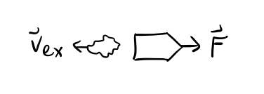
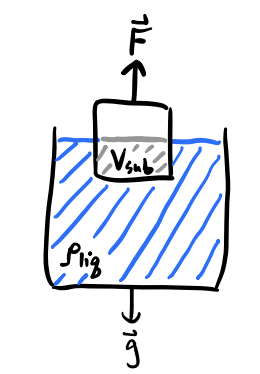
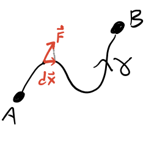
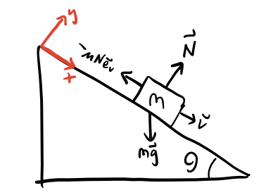
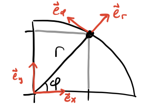
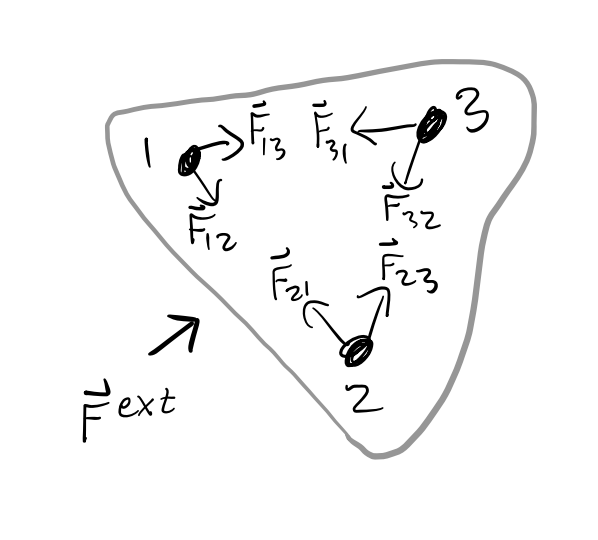
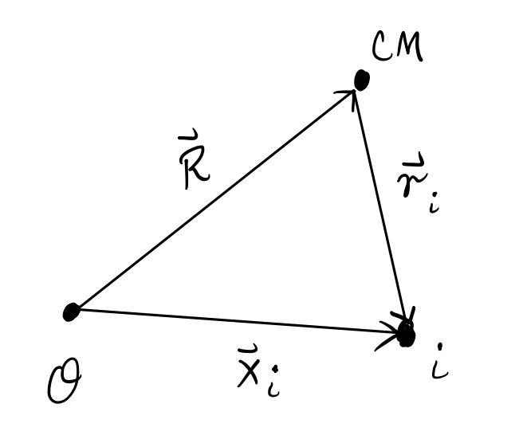
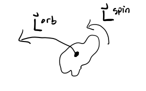

# Newtonian Mechanics

**Classical Mechanics** can be thought of as the branch of physics that focuses on studying the mechanical properties of physical systems using classical laws. By *mechanical*, we mean we're focused on analyzing how objects behave in response to *forces*.

By *classical*, we mean we're limiting ourselves to objects that are neither too big nor too small, and aren't moving too fast. Roughly speaking, this means the size of objects are between the size of a human cell to the size of a galaxy cluster, and that those objects aren't moving anywhere near close to the speed of light.

The oldest and most intuitive formulation of classical mechanics is **Newton's Laws**. The idea is that objects move because of forces that act on them. Understanding mechanics in Newton's formulation is about understanding the underlying forces, as well as derived quantities like momentum, torque, and energy.

## Point Particles

In nature, an object is made of matter. It can be composed of many different molecules arranged in intricate and complicated ways. Further, each molecule is itself made of atoms, and each atom is itself made up of subatomic particles. Trying to model the motion of an object would be extremely cumbersome if we insisted on modeling the dynamics of each subatomic particle. 

Instead, it's convenient to make abstractions. The most convenient abstraction to make is that we can describe the global behavior of an object as if it were a point object with no width. It can't spin or deform. It's one indivisible thing. We call these **point particles**.

We'll think of a point particle as following some trajectory in the 3-dimensional Euclidean space $\mathbb{R}^{3}$. The trajectory or **position** is a time-dependent vector

$$
\mathbf{x}(t) = x(t)\mathbf{e}_x + y(t)\mathbf{e}_y + z(t)\mathbf{e}_z.
$$
A moving particle also has associated to it a **velocity** vector given by

$$
\mathbf{v} = \mathbf{\dot x} = \frac{d\mathbf{x}}{dt}.
$$
Perhaps the most fundamental goal of classical mechanics is to find these two vectors as a function of time. In the Newtonian formulation, if we want to find a particle's trajectory, we start with the particle's **acceleration** vector
$$
\mathbf{a} = \mathbf{\dot v} = \mathbf{\ddot x} = \frac{d^2\mathbf{x}}{dt^2},
$$
and match it with the **force** vector $\mathbf{F}$ via Newton's Second Law to get a second-order differential equation for $\mathbf{x}(t)$.

## Newton's Laws

Newton's Laws efficiently encapsulate the fundamental physics of classical mechanics. They're stated below specifically for a point particle, or *body*, but can be extended to more complex systems as well.

1. A body remains at rest, or in motion at a constant speed in a straight line, unless acted upon by a force. That is,  
   $$
   \mathbf{F} = \mathbf{0} \Rightarrow \mathbf{v}=const.
   $$

2. When a body is acted upon by a force, the time rate of change of its acceleration is proportional to the force. That is, 
   $$
   \mathbf{F} = m \mathbf{a}.
   $$

3. If two bodies exert forces on each other, these forces have the same magnitude but opposite directions. That is, 
   $$
   \mathbf{F}_{12} = \mathbf{F}_{21}.
   $$

   {fig-align="center" width=300}

Forces are **vectors**, which means they obey the superposition principle, and can be analyzed in components. Position, velocity, and acceleration are vectors as well. The proportionality constant between $\mathbf{F}$ and $\mathbf{a}$ is called the **mass **$m$. Loosely speaking, the mass of an object is a measure of its *inertia* or resistance to motion.

The functional form of the forces themselves depend on the particular type of forces applied. Some common forces are:

- Gravitational Force: $\mathbf{F} = -\frac{GMm}{r^2} \mathbf{e}_r$

- Coulomb Force: $\mathbf{F} = k_e \frac{Qq}{r^2} \mathbf{e}_r$

- Harmonic Oscillator: $\mathbf{F} = -k\mathbf{x}$

- Lorentz Force: $\mathbf{F} = q\mathbf{E} + \frac{q}{c}\mathbf{v} \times \mathbf{B}$

- Thrust: $\mathbf{F} = - |\mathbf{v}_{ex}| \dot m \mathbf{e}_v$

  {fig-align="center" width=300}

- Normal Forces: $\mathbf{F} = \mathbf{N}$

- Tension Forces: $\mathbf{F} = \mathbf{T}$

- Frictional Forces: $\mathbf{F} = -\mu |\mathbf{N}| \mathbf{e}_v$

- Drag Forces: $\mathbf{F} = -f(\mathbf{v}) \mathbf{e}_v \approx -a\mathbf{v} -b|\mathbf{v}|^2\mathbf{e}_v$

- Centrifugal Forces: $\mathbf{F} = m\boldsymbol{\omega} \times (\mathbf{x} \times \boldsymbol{\omega})$

- Coriolis Forces: $\mathbf{F} = 2m \mathbf{v} \times \boldsymbol{\omega}$

- Buoyant Forces: $\mathbf{F} = - \rho_{liq} V_{sub} \mathbf{g}$

  {fig-align="center" width=150}

## Conservation Laws

A quantity Q is said to be **conserved** if its time derivative is zero, $\dot Q = 0$. That is, Q is conserved it it's constant in time.

### Momentum

For an object moving at velocity $\mathbf{v}$, define its linear momentum $\mathbf{p}$ by 

$$
\mathbf{p} = m \mathbf{v}.
$$
If the mass $m$ is constant, we evidently have 
$$
\mathbf{F} = \mathbf{\dot p}.
$$
If $\mathbf{F} = \mathbf{0}$, then $\mathbf{p}=const$, hence momentum is conserved if there are no forces applied. This is the conservation of momentum.

### Angular Momentum

Define the angular momentum $\mathbf{L}$ of an object by 
$$
\mathbf{L} = \mathbf{x} \times \mathbf{p}.
$$
Similarly, define the **torque** or **moment** $\mathbf{N}$ by $$\mathbf{N} = \mathbf{x} \times \mathbf{F}.$$

Note both angular momentum and torque depend on the choice of coordinate system used since the position vector $\mathbf{x}$ depends on choice of origin. Now, observe that 
$$
\mathbf{\dot L} = \mathbf{\dot x} \times \mathbf{p} + \mathbf{x} \times \mathbf{\dot p} = m \mathbf{v} \times \mathbf{v} + \mathbf{x} \times \mathbf{F} = \mathbf{N}.
$$
Thus, $\mathbf{N} = \mathbf{\dot L}$. If $\mathbf{N} = \mathbf{0}$, then $\mathbf{L}=const$, hence angular momentum must be conserved if there are no torques applied. This is the conservation of angular momentum.

### Work and Energy

Define the **work** done *on* an object as it moves along a path $\gamma$ from $A$ to $B$ by 

$$
W = \int_A^B \mathbf{F} \cdot d\mathbf{x}.
$$

In general, work depends on the path taken to get from $A$ to $B$, hence it isn't a unique property of the system. 

Observe that 
$$
dW = \mathbf{F} \cdot d\mathbf{x} = \mathbf{F} \cdot \mathbf{v} dt = d\bigg(\frac{1}{2}m\mathbf{v}^2 \bigg).
$$
 Define the **kinetic energy** of the system by $T = \frac{1}{2} m \mathbf{v}^2$. Then we evidently have $dW=dT$. That is, the work done on the system to get from $A$ to $B$ via $\gamma$ is just the change in kinetic energy between $A$ and $B$, 
$$
W = \Delta T = T_B - T_A.
$$
When the work done is independent of the path taken it's a state function of the kinetic energy. In this case, the force $\mathbf{F}$ is said to be **conservative**. 

By the Helmholtz theorem, the following conditions are all equivalent:

- $\mathbf{F}$ is conservative,
- $W$ is path-independent,
- $\nabla \times \mathbf{F} = \mathbf{0}$,
- There is a scalar potential $V=V(\mathbf{x})$ such that $\mathbf{F} = -\nabla V$.

The scalar potential $V$ is called the **potential energy** of the system. Evidently, if $\mathbf{F}$ is conservative, we have 
$$
W = \int_A^B \mathbf{F} \cdot d\mathbf{x} = -\int_A^B \nabla V \cdot d\mathbf{x} = -\int_A^B dV = V_A - V_B = -\Delta V = \Delta T.
$$
That is, $\Delta T + \Delta V = 0$. Define the total mechanical **energy** $E$ of the system by
$$
E = T + V.
$$
Then $\Delta E = \Delta (T + V) = 0$. That is, energy is conserved when the forces on the system are conservative. This is the conservation of energy. 

Energy isn't generally conserved if the forces aren't conservative. Examples of non-conservative forces include any force that's a function of velocity. These include dissipative forces like friction or drag, as well as magnetic forces.

## Using Newton's Laws

The primary goal of mechanics is to understand how systems evolve with time. To understand a particle's given trajectory in Newtonian Mechanics, we need to

- Write down all the forces acting on the particle,
- Use $\mathbf{F} = m \mathbf{a}$ to set up the equations of motion,
- Solve the equations of motion for the trajectory $\mathbf{x}(t)$, either analytically or (usually) numerically.

Here are some examples.

---

#### Example: Projectile motion

Suppose a cannon is launched from the origin at an angle $\theta$ above the ground with initial velocity $\mathbf{v}_0$.

{fig-align="center" width=400}

- Write down the equations of motion. Assume drag is negligible.

  The forces are $\mathbf{F} = \mathbf{g} = -g\mathbf{e}_y$. Then,
  $$
  \mathbf{a} = \ddot x\mathbf{e}_x + \ddot y\mathbf{e}_y = -g\mathbf{e}_y \quad \Longrightarrow \quad 	\ddot x = 0, \ \ \ddot y = -mg.
  $$

- Find the trajectory $\mathbf{x}(t) = x(t)\mathbf{e}_x + y(t)\mathbf{e}_y$.

  Integrating each element twice gives
  $$
  \begin{align*}
  x(t) &= x_0 + v_{0x}t = v_0t \cos \theta, \\
  y(t) &= y_0 + v_{0y}t - \frac{1}{2} gt^2 = v_{0}t\sin \theta - \frac{1}{2} gt^2.
  \end{align*}
  $$

- Find the range, i.e. the value $R=x(T)$ when the cannon hits the ground. Which launch angle maximizes the range?

  First, we need to find the time $T$ when $y(T) = 0$. Setting
  $$
  y(T) = 0 = v_0 T \sin \theta - \frac{1}{2} gT^2 \Longrightarrow T = 0, \frac{2v_0 \sin \theta}{g}.
  $$
  The $T=0$ case is trivial. Plugging the other one in to $x(T)$ finally gives the range,
  $$
  R = x(T) = v_0T \cos \theta = \frac{2v_0^2 \sin \theta}{g} \cos \theta = \frac{v_0^2 \sin 2\theta}{g}.
  $$
  Note that the range is maximized when $\sin 2 \theta = 1$, which is when the launch angle is $\theta = 45^\circ$.

- Find the shape of the motion $y = y(x)$.

  We need to eliminate $t$ in both equations and solve for $y=y(x(t))$. Solving $x(t)$ for $t$ gives,
  $$
  x = v_0 t\cos \theta \Longrightarrow t = \frac{x}{v_0 \cos \theta}.
  $$
  Plugging this into $y$ then gives
  $$
  y = v_{0}\frac{x}{v_0 \cos \theta}\sin \theta - \frac{1}{2} g\bigg(\frac{x}{v_0 \cos \theta}\bigg)^2 =  \tan \theta \cdot x - \frac{g}{2v_0^2 \cos^2 \theta} x^2.
  $$
  This is a downward sloping parabola with vertex at  $\big(\frac{v_0^2 \sin 2\theta}{2g}, \frac{v_0^2 \sin^2 \theta}{g}\big)$.

- Find any conserved quantities.

  - Momentum: Since $\mathbf{F} \neq \mathbf{0}$, momentum isn't conserved. However, $p_x$ *is* conserved.
  - Angular Momentum: Since $\mathbf{N} = \mathbf{x} \times \mathbf{F} = \mathbf{x} \times m\mathbf{g} \neq 0$, angular momentum is not conserved.
  - Energy: Since $V=mgy$, the force $\mathbf{F}$ is conservative, hence energy is conserved.

---

#### Example: Block sliding on a ramp with friction

A block of mass $m$ is sliding down a ramp inclined from the horizontal at an angle $\theta$. Assume the system has a coefficient of friction $\mu$, and that the block starts from rest at the top of the ramp.

{fig-align="center" width=350}

- Write down the equations of motion.

  Choose a coordinate system such that $x$ is pointing downwards parallel to the ramp and $y$ is pointing outwards perpendicular to the ramp. There are three forces acting, gravity, the normal force, and the frictional force, so
  $$
  \mathbf{F} = \mathbf{N} + m\mathbf{g} - \mu \mathbf{N} \mathbf{e}_v = N\mathbf{e}_y + mg(\sin\theta\mathbf{e}_x - \cos\theta\mathbf{e}_y) - \mu N \mathbf{e}_x.
  $$
  Resolving into components, we have
  $$
  \begin{align*} 
  m \ddot x &= mg\sin\theta - \mu N, \\
  m \ddot y &= N - mg\cos\theta = 0.
  \end{align*}
  $$
  The second equation follows from the assumption that the block is constrained to stay on the ramp.

- Find the trajectory $\mathbf{x}(t) = x(t)\mathbf{e}_x + y(t)\mathbf{e}_y$.

  To solve, we need to eliminate the normal force $N$. Using the EOM for $\ddot y$, we get $N = mg\cos\theta$. Plugging this into the equation for $\ddot x$ then gives

  $$
  \begin{align*} 
  \ddot x &= g(\sin\theta - \mu\cos\theta) = const, \\
  \ddot y &= 0.
  \end{align*}
  $$
  Suppose the block starts at the top of the ramp, which we'll call the origin. Then integrating, we get,

  $$
  \begin{align*} 
  x(t) &= v_0 t + \frac{1}{2}g(\sin\theta - \mu\cos\theta)t^2, \\
  y(t) &= 0.
  \end{align*}
  $$
  Notice $x(t)$ is just the equation of an object falling under a modified gravity
  $$
  \mathbf{g}'=-g(\sin\theta - \mu\cos\theta)\mathbf{e}_x.
  $$

- Find the angle $\theta$ at which the block will start sliding.

  The block will move if $\ddot x \geq 0$, i.e. when $\mu \leq \tan\theta$. It will start moving at the angle when $\tan\theta=\mu$ exactly, i.e. when
  $$
  \theta = \arctan\mu.
  $$

- Find any conserved quantities.

  - Momentum: Since $\mathbf{F} \neq \mathbf{0}$, momentum is not conserved. However, $p_y$ is conserved.
  - Angular momentum: Since $\mathbf{N} = \mathbf{x} \times \mathbf{F} \neq \mathbf{0}$, angular momentum is not conserved.
  - Energy: Since friction is present, $\mathbf{F}$ is a dissipative force, hence it's not conservative, and energy is not conserved.

- Find the rate of energy dissipation as the block slides down the ramp.

  Friction dissipates as a heat $Q$. If the block slides a distance $L$, this means $E(0) = E(L) + Q$. Since the block starts from rest, $E(0) = 0$. At $x=L$, the work done is
  $$
  W = \int_0^L F_x dx = \int_0^L mg(\sin\theta - \mu\cos\theta)dx = mgL(\sin\theta - \mu\cos\theta) = T(L) - 0 = T(L),
  $$
   so the energy when the block gets to the bottom is
  $$
  E(L) = T(L) + V(L,0) = mgL(\sin\theta - \mu\cos\theta) - mgL\sin\theta = -\mu mgL\cos\theta.
  $$
  Finally, using this to solve for $Q$, the heat dissipated over the entire trajectory, we get 
  $$
  Q = E(0) - E(L) = \mu mgL\cos\theta.
  $$
  The most important sanity check here is to notice there's no heat dissipation if there is no friction.

---

## Curvilinear Coordinates

For many problems, it's more convenient to take advantage of the underlying symmetry by using special coordinate systems. Other than rectangular coordinates $(x,y,z)$, the most common coordinate systems worth being familiar with are polar coordinates $(r,\varphi)$, cylindrical coordinates $(\rho,\varphi,z)$, and spherical coordinates $(r,\theta,\varphi)$.

### Polar Coordinates

For problems with circular symmetry it's convenient to use polar coordinates $(r,\varphi)$, defined by 

$$
\begin{align*} 
x &=  r\cos\varphi, \\ 
y &=  r\sin\varphi. \\
\end{align*}
$$
where $r \geq 0$ and $0 \leq \varphi \leq 2\pi$. We can assign basis vectors to polar coordinates $\mathbf{e}_r, \mathbf{e}_\varphi$ to each point as usual.

{fig-align="center" width=300}

The thing to keep in mind is that these curvilinear basis vectors are now functions of position, 

$$
\begin{align*} 
\mathbf{e}_r &= \mathbf{e}_r(r, \varphi), \\ 
\mathbf{e}_\varphi &= \mathbf{e}_\varphi(r, \varphi). 
\end{align*}
$$
We can figure out how these basis vectors change by taking their differentials, which follow from the figure above, 

$$
\begin{align*} 
d\mathbf{e}_r &= \mathbf{e}_\varphi d\varphi, \\ 
d\mathbf{e}_\varphi &= -\mathbf{e}_r d\varphi.
\end{align*}
$$
Using these differential forms, we can conclude that the motion vectors change as follows,

$$
\begin{align*}
\mathbf{x} &= r\mathbf{e}_r, \\
\mathbf{v} &= \dot r \mathbf{e}_r + r\dot \varphi \mathbf{e}_\varphi, \\
\mathbf{a} &= (\ddot r - r\dot \varphi^2)\mathbf{e}_r + (2\dot r \dot \varphi + r\ddot \varphi)\mathbf{e}_\varphi.
\end{align*}
$$

---

#### Example: Circular orbits

Suppose an object moves in a circular orbit of radius $r$ at a constant angular velocity $\omega$ due to a central force $\mathbf{F} = -F\mathbf{e}_r$.

{fig-align="center" width=300}

- Find the equations of motion.
  Since the object moves at constant $\omega$, we have $\dot \varphi = \omega = const$. Using the polar equations for velocity and acceleration, we have
  $$
  \begin{align*}
  \mathbf{v} &= \dot r \mathbf{e}_r, \\
  \mathbf{a} &= -r\omega^2\mathbf{e}_r + r \dot \omega\mathbf{e}_\varphi = - \frac{F}{m}\mathbf{e}_r.
  \end{align*}
  $$
  Note we can re-write these equations to get $F = m\omega^2 r$.
  
- Find the *period* $\tau$ of the orbit.
  
  We want the time it takes for $\Delta \varphi = 2\pi$. Since $\Delta \varphi = \omega\tau$, solving for $\tau$ gives $$\tau = \frac{2\pi}{\omega}.$$

- Suppose the central force is the gravitational force, $F = \frac{GMm}{r^2}$. Find the angular velocity, the period, and the orbital velocity as a function of $G, M, r$.

  We have
  $$
  F = \frac{GMm}{r^2} = m\omega^2 r \ \Longrightarrow \ \omega = \sqrt{\frac{GM}{r^3}} \ \Longrightarrow \ \tau = \frac{2\pi}{\sqrt{GM}} r^{3/2}.
  $$
  This is just a special case of Kepler's third law, $\tau^2 \propto r^3$. The orbital velocity is given by
  $$
  v = r\omega = \sqrt{\frac{GM}{r}}.
  $$

---

#### Example: Simple pendulum

Consider the problem of the simple pendulum, where a mass $m$ swings on a massless string of length $\ell$ under the force of gravity. The string is fixed at one point. Assume no damping is present.

{fig-align="center" width=300}

- Find the equations of motion from the forces directly.

  There are two forces in this problem, gravity and the tension in the string,
  $$
  \mathbf{F} = \mathbf{T} + m\mathbf{g} = -T\mathbf{e}_r + mg(\cos\theta \mathbf{e}_r - \sin\theta\mathbf{e}_\theta).
  $$
  Dividing by $m$ and setting equal to the polar form of $\mathbf{a}$, we have
  $$
  \mathbf{a} = (-T+mg\cos\theta)\mathbf{e}_r - mg\sin\theta\mathbf{e}_\theta = -m\ell^2 \dot \theta^2 \mathbf{e}_r + m\ell^2 \ddot \theta \mathbf{e}_\theta.
  $$
  This gives two equations of motion, one for the tension and one for the angular acceleration,
  $$
  \begin{align*}
  T &= m\ell^2 \dot\theta^2 + mg\cos\theta, \\
  \ddot \theta &= -\frac{g}{\ell} \sin\theta. \\
  \end{align*}
  $$

- Find the equations of motion again, but this time using torques.

  Recall  $\mathbf{N} = I \boldsymbol{\dot \omega}$, where $I$ is the scalar moment of inertia and $\boldsymbol{\omega}$ is the angular velocity vector. In this case, $I=m\ell^2$ and $\boldsymbol{\dot \omega} = \ddot \theta \mathbf{e}_z$. Then we have
  $$
  I \boldsymbol{\dot \omega} = m\ell^2 \ddot \theta \mathbf{e}_z \equiv \ell\mathbf{e}_r \times m\mathbf{g} = -mg\ell\sin\theta \mathbf{e}_z = \mathbf{N},
  $$
  which can be solve to get $\ddot \theta = -\frac{g}{\ell}\sin\theta$. Notice how in this approach we don't need to worry about the tension at all.

- Suppose $\theta$ is small. Write down the equations of motion, solve them, and find the period.

  When $\theta \ll 1$ the small angle approximation applies, $\sin\theta \approx \theta$. In this case, the equation of motion reduces to $$\ddot \theta = -\frac{g}{\ell} \theta,$$ which is just simple harmonic oscillation with angular frequency $\omega = \sqrt{\frac{g}{\ell}}$. The solution to SHO is
  $$
  \theta(t) = A\sin(\omega t + \phi),
  $$
  where $A$ is some amplitude and $\phi$ is some phase determined by the initial conditions. Finally, solving for the period, we have
  $$
  \tau = \frac{2\pi}{\omega} = 2\pi\sqrt{\frac{\ell}{g}}.
  $$

---

### Cylindrical Coordinates

Cylindrical coordinates extend polar coodinates by adding in the z-axis from the rectangular system,

$$
\begin{align*} 
x &=  r\cos\varphi, \\ 
y &=  r\sin\varphi, \\
z &= z.
\end{align*}
$$
The basis vectors are $\mathbf{e}_r, \mathbf{e}_\varphi, \mathbf{e}_z$. Their differential forms are just 
$$
\begin{align*} 
d\mathbf{e}_r &= \mathbf{e}_\varphi d\varphi, \\ 
d\mathbf{e}_\varphi &= -\mathbf{e}_r d\varphi \\ 
d\mathbf{e}_z &= 0. 
\end{align*}
$$
The motion vectors in cylindrical coordinates are thus given by,
$$
\begin{align*}
\mathbf{x} &= r\mathbf{e}_r, \\
\mathbf{v} &= \dot r \mathbf{e}_r + r\dot \varphi \mathbf{e}_\varphi + \dot z \mathbf{e}_z , \\
\mathbf{a} &= (\ddot r - r\dot \varphi^2)\mathbf{e}_r + (2\dot r \dot \varphi + r\ddot \varphi)\mathbf{e}_\varphi + \ddot z \mathbf{e}_z.
\end{align*}
$$

### Spherical Coordinates

Spherical coordinates extend polar coordinates in a slightly different way. The radius $r$ is now 3-dimensional, and there are two angles, a *polar angle* $0 \leq \theta \leq \pi$ and an *azimuthal angle* $0 \leq \varphi \leq 2\pi$. The conversion to rectangular coordinates is given by,
$$
\begin{align*} 
x &=  r\sin\theta\cos\varphi, \\ 
y &=  r\sin\theta\sin\varphi, \\
z &= r\cos\theta. \\ 
\end{align*}
$$
The basis vectors are $\mathbf{e}_r, \mathbf{e}_\theta, \mathbf{e}_\varphi$. Deriving the differential forms of these is a good bit more complex. Here they are,
$$
\begin{aligned}
d\mathbf{e}_r &= \dot\theta \sin\varphi d\mathbf{e}_\theta + \dot\varphi d\mathbf{e}_\varphi, \\
d\mathbf{e}_\theta &= - \dot\theta \sin\varphi d\mathbf{e}_r - \dot\theta \cos\varphi d\mathbf{e}_\varphi, \\
d\mathbf{e}_\varphi &= - \dot\varphi \mathbf{e}_r + \dot\theta \cos\varphi \mathbf{e}_\theta. \\
\end{aligned}
$$
These can then be used to get the motion vectors in spherical coordinates,
$$
\begin{align*}
\mathbf{r} &= r \mathbf{e}_r, \\
\mathbf{v} &= \dot{r} \mathbf{e}_r + r \dot\theta \sin\varphi \mathbf{e}_{\theta} + r \dot\varphi \mathbf{e}_{\varphi}, \\
\mathbf{a} &= (\ddot{r} - r \dot{\theta}^2 \sin^2\varphi - r \dot{\varphi}^2) \mathbf{e}_r \\
&\quad + (r \ddot\theta \sin\varphi + 2 \dot{r} \dot\theta \sin\varphi + 2 r \dot\theta \dot\varphi \cos\varphi) \mathbf{e}_{\theta} \\
&\quad + (r \ddot\varphi + 2 \dot{r} \dot\varphi - r \dot{\theta}^2 \sin\varphi \cos\varphi) \mathbf{e}_{\varphi}. \\
\end{align*}
$$

## Many-Particle Systems

Thus far we've worked with single-particle systems. Let's now consider a system of $N$ particles with positions $\mathbf{x}_1, \mathbf{x}_2, \cdots, \mathbf{x}_N$ respectively. We can use the principle of superposition to extend the laws derived above for single particles.

For $N$-particle systems it's convenient to characterize the system's position using the **center of mass** vector $\mathbf{R}$,
$$
\mathbf{R} \equiv \frac{1}{M}\sum_{i=1}^N m_i \mathbf{x}_i,
$$
where $M$ is just the *total mass* of the system, $M \equiv \sum m_i$. The center of mass is just the mass-weighted average of all the particle position vectors.

Suppose an external force $\mathbf{F}^{ext}$ is acting on the system, and suppose each particle $i$ imparts a force $\mathbf{F}_{ij}$ on particle $j \neq i$. Here's what this would look like for $N=3$ particles.

{fig-align="center" width=300}

By superposition, the total force acting on the entire system is thus,
$$
\mathbf{F} = \mathbf{F}^{ext} + \sum_{i \neq j} \mathbf{F}_{ij} = \sum m_i \mathbf{a}_i = M\mathbf{\ddot R}.
$$
Now, by Newton's third law, $\mathbf{F}_{ij} = -\mathbf{F}_{ji}$. This means all the internal forces cancel in pairs, so we have
$$
\mathbf{F}^{ext} = M\mathbf{\ddot R}.
$$
That is, the system as a whole moves as if it were a point mass $M$ with an external force $\mathbf{F}^{ext}$ acting on its center of mass $\mathbf{R}$. 

If the total momentum is defined as $\mathbf{P} = M \mathbf{\dot R}$, this expression then says $\mathbf{F}^{ext} = \mathbf{\dot P}$. Thus, if no external forces act on the system, then its total linear momentum $\mathbf{P}$ is conserved.

Let's now consider the total *torques* on the system. Suppose the system experiences an external torque $\mathbf{N}^{ext}$, and that each particle $i$ exerts a torque $\mathbf{N}_{ij}$ on particle $j$. Then by superposition, the total torque on the system is
$$
\mathbf{N} = \mathbf{N}^{ext} + \sum_{i \neq j} \mathbf{N}_{ij} = \mathbf{N}^{ext} + \sum_{i \neq j} \mathbf{x}_i \times \mathbf{F}_{ij},
$$
Again, we can use the fact that each $\mathbf{F}_{ij} = -\mathbf{F}_{ji}$. If we do this, we can re-write the total torque as

$$
\mathbf{N} = \mathbf{N}^{ext} + \sum_{i<j} (\mathbf{x}_{i}-\mathbf{x}_{j}) \times \mathbf{F}_{ij} = \mathbf{N}^{ext}.
$$
Now, if we further assume that each internal force acts centrally, i.e. $\mathbf{F}_{ij} = \mathbf{F}_{ij}(\mathbf{x}_{i}-\mathbf{x}_{j})$, then the internal cross products all vanish, and we just get $\mathbf{N} = \mathbf{N}^{ext}$. That is, if all the internal forces are central, then the total torque on the system is just the external torque. 

If the total angular momentum on the system is defined as $\mathbf{L} = \mathbf{R} \times \mathbf{P}$, this expression says $\mathbf{\dot L} = \mathbf{N}^{ext}$. Thus, if no external torques act on the system, then its total angular momentum $\mathbf{L}$ is conserved.

It's insightful to separate each particle's motion vectors explicitly into a center of mass component and a relative component,

$$
\begin{align*} 
\mathbf{x}_i &= \mathbf{R} + \boldsymbol{\mathscr{r}}_i, \\
\mathbf{v}_i &= \mathbf{V} + \boldsymbol{\mathscr{v}}_i. \\
\end{align*}
$$

Let's re-write the total angular momentum $\mathbf{L}$ in terms of these vectors,

$$
\begin{align*} 
\mathbf{L} &= \sum \mathbf{x}_i \times \mathbf{p}_i = \sum (\mathbf{R} + \boldsymbol{\mathscr{r}}_i) \times m_i(\mathbf{V} + \boldsymbol{\mathscr{v}}_i) \\
&= M\mathbf{R} \times \mathbf{V} + \sum m_i \boldsymbol{\mathscr{r}}_i \times \boldsymbol{\mathscr{v}}_i + \mathbf{R} \times \bigg(\sum m_i \boldsymbol{\mathscr{v}}_i \bigg) + \bigg(\sum m_i \boldsymbol{\mathscr{r}}_i \bigg)\times \mathbf{V} \\
&= \mathbf{R} \times \mathbf{P} + \sum m_i \boldsymbol{\mathscr{r}}_i \times \boldsymbol{\mathscr{v}}_i \\
&\equiv \mathbf{L}^{orb} + \mathbf{L}^{spin}. \\
\end{align*}
$$
We've thus been able to separate the angular momentum into two components, an **orbital angular momentum** $\mathbf{L}^{orb} = \mathbf{R} \times \mathbf{P}$, and a **spin angular momentum** $\mathbf{L}^{spin} = \sum m_i \boldsymbol{\mathscr{r}}_i \times \boldsymbol{\mathscr{v}}_i$. The orbital angular momentum describes how the center of mass of the object tends to rotate about some external point. The spin angular momentum describes how the system itself tends to rotate about its center of mass.

{fig-align="center" width=200}

Last, let's look at the total energies of the system. For a system with $N$ particles, the potential energy will be a function of all the position vectors, $V = V(\mathbf{x}_1, \mathbf{x}_2, \cdots, \mathbf{x}_N)$. It won't generally simplify. But the kinetic energy we can simplify. Writing it in terms of its relative and center of mass velocities, we have

$$
\begin{align*}
T &= \frac{1}{2}\sum m_i \mathbf{v}_i^2 = \sum m_i (\mathbf{V} + \boldsymbol{\mathscr{v}}_i)^2 \\
&= \frac{1}{2}M\mathbf{V}^2 + \frac{1}{2}\sum m_i\boldsymbol{\mathscr{v}}_i^2 + \mathbf{V} \cdot \bigg(\sum m_i \boldsymbol{\mathscr{v}}_i\bigg) \\
&= \frac{1}{2}M\mathbf{V}^2 + \frac{1}{2}\sum m_i\boldsymbol{\mathscr{v}}_i^2 \\
&= T^{CM} + T^{rel}.
\end{align*}
$$
Thus, the kinetic energy separates into a sum of the kinetic energy on the center of mass $T^{CM} = \frac{1}{2}M\mathbf{V}^2$, and the kinetic energy of the relative components $T^{rel} = \frac{1}{2}\sum m_i\boldsymbol{\mathscr{v}}_i^2$. Evidently, the total energy is
$$
E = T + V = T^{CM} + T^{rel} + V(\mathbf{x}_1, \mathbf{x}_2, \cdots, \mathbf{x}_N).
$$
It's conserved provided the external force $\mathbf{F}^{ext}$ is conservative.

---

#### Example: Rockets

Suppose a rocket of mass $m_0=m(t) + m_{ex}(t)$ is moving through free space with no external forces acting on it. It's expelling fuel for trust at some constant speed $v_{ex}$ with respect to the rocket.

{fig-align="center" width=150}

- What is the force of thrust on the rocket?

  No external forces are present, so $\mathbf{F}^{ext} = \mathbf{0}$. The internal forces are the thrust of the rocket, and the force of the exhaust. In the frame of the rocket they cancel out, $\mathbf{F}_{th} = \mathbf{F}_{ex}$, so we have
  $$
  \mathbf{F}_{th} = -\mathbf{F}_{ex} = -\mathbf{\dot p}_{ex} = -\frac{d}{dt}(m_{ex} \mathbf{v}_{ex}) = -\dot m_{ex} \mathbf{v}_{ex}.
  $$
  Now, since $m_0 = m + m_{ex}$, $\dot m = -\dot m_{ex}$, and $\mathbf{v}_{ex} = -v_{ex}\mathbf{e}_v$, we have
  $$
  \mathbf{F}_{th} = -\dot m v_{ex} \mathbf{e}_v.
  $$

- Find the velocity $\mathbf{v}(t)$ of the rocket.

  Using the fact that $\mathbf{F}_{th} = m\mathbf{a}$, we have $-\dot m v_{ex} = m \dot v$, a first-order differential equation in $v(t)$,
  $$
  \dot v + v_{ex} \frac{\dot m}{m} = 0.
  $$
  Integrating both sides and solving for $v(t)$, we get
  $$
  v(t) = v_0 - v_{ex} \int_{m_0}^m \frac{dm}{m} = -v_{ex} \log \frac{m(t)}{m_0}.
  $$
  Or, expressing in the form of the well-known *rocket equation*,
  $$
  \Delta v = v_{ex} \log\frac{m_0}{m(t)}.
  $$
  
- Find the position $\mathbf{x}(t)$ of the rocket, assuming fuel is expelled form the rocket at a constant rate.

  Assume $\dot m = -k = const$. Since there are no external forces, the rocket must be traveling along some line. Suppose without loss of generality then that $\mathbf{x}(t) =  z(t)\mathbf{e}_z$. Then we have,
  $$
  \begin{align*}
  z(t) &= \int_0^t v(t) dt = v_{ex} \int_0^t dt \log\frac{m_0}{m_0-kt} \\
  &= v_{ex} \bigg[t - \bigg(\frac{m_0-kt}{k} \bigg) \log \bigg(\frac{m_0}{m_0-kt} \bigg) \bigg] \\
  &= v_{ex} t - \frac{v_{ex}}{k}(m_0 - kt)\log\bigg(\frac{m_0}{m_0-kt} \bigg).
  \end{align*}
  $$

---
