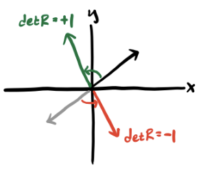
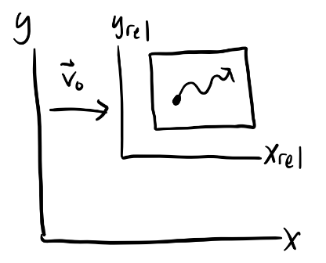
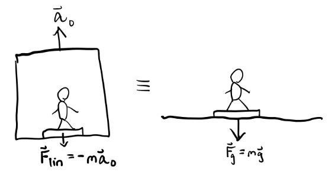
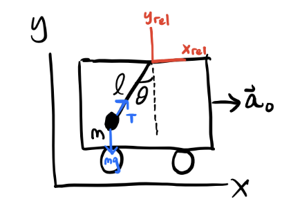
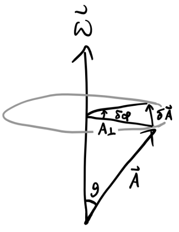
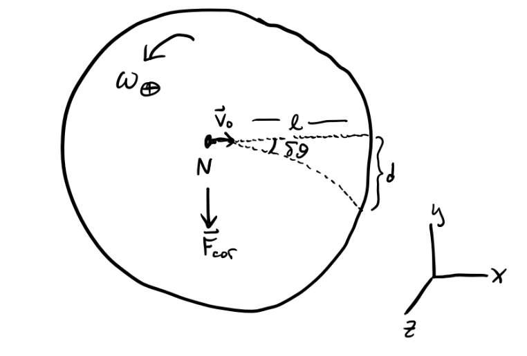
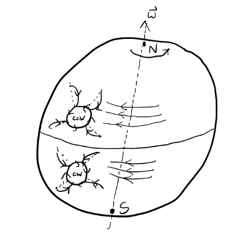
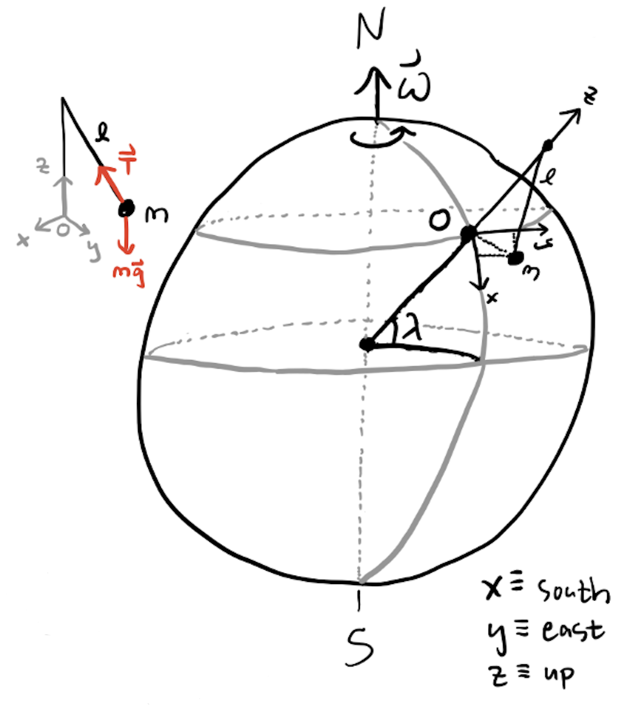

# Reference Frames

The laws of mechanics as formulated thus far are not valid as written for every observer. They are valid only for a special class of observers in *inertial* reference frames. A classical **inertial reference frame** is a reference frame or coordinate system in which Newton's Laws hold with no modifications. That such frames even exist is an experimental fact of nature.

In practice, however, many reference frames of interest are *non-inertial*, which means Newton's Laws does not hold in those reference frames. We have to modify Newton's Laws in these frames by adding so-called **fictitious forces**. We'll begin by focusing on the most common non-inertial frames, the *rotating reference frames*.

## Orthogonal Transformations

 Suppose $\mathbf{x}$ is some vector, and $\{\mathbf{e}_i\}$ and $\{\mathbf{e}_i'\}$ are two orthonormal bases for $\mathbb{R}^3$, then
$$
\mathbf{x} = \sum_{j=1}^3 x_j \mathbf{e}_j = \sum_{i'=1}^3 x_{i'} \mathbf{e}_{i'},
$$
where $x_i = \mathbf{x} \cdot \mathbf{e}_i$ and $x_i' = \mathbf{x} \cdot \mathbf{e}_i'$. 

**Notation:** From now on we'll use the *Einstein summation convention*. If a repeated index occurs in a sum, we'll omit the $\sum$ symbol. For example, we can re-write the above line as the following, where it's understood we're summing over $j$ and $i'$ in each case,
$$
\mathbf{x} = x_j \mathbf{e}_j = x_{i'} \mathbf{e}_{i'}.
$$
Now, observe we can write one component in terms of the other as
$$
x_i' = \mathbf{x} \cdot \mathbf{e}_{i'} = (\mathbf{e}_j \cdot \mathbf{e}_{i'}) x_j \equiv R_{i'j} x_j,
$$
where $R_{i'j} = \mathbf{e}_j \cdot \mathbf{e}_i'$ defines a matrix $\mathbf{R}$ called an **orthogonal transformation**. 

Notice that if we take the inner product of two vectors $\mathbf{x}$ and $\mathbf{y}$, we get
$$
\mathbf{x} \cdot \mathbf{y} = x_{i'} \delta_{i' j'} x_{j'} = R_{ii'} \delta_{i'j'} R_{j'j} x_i x_j = \mathbf{x} \cdot (\mathbf{R}^\top \mathbf{R}) \mathbf{y}.
$$
Thus, an orthogonal transformation $\mathbf{R}$ satisfies the property that
$$
\mathbf{R}^\top \mathbf{R} = \mathbf{I}, \quad \text{or} \quad R_{ij} R_{jk} = \delta_{ik}.
$$
Due to the inner product preserving nature of orthogonal transformations, they can in a sense be used to *define* what we mean by a scalar or vector or tensor in classical mechanics. They're objects that transform a certain way under an orthogonal transformation:

- A **scalar** is any object $\alpha$ that is *invariant* under an orthogonal transformation,
  $$
  \alpha' = \alpha.
  $$

- A **vector** is any object $\mathbf{v}$ that transforms under an orthogonal transformation as,
  $$
  v_{i'} = R_{i'i} v_i.
  $$

- A **tensor** of order $k$ is any object $\mathbf{T}$ that transforms under an orthogonal transformation as,
  $$
  T_{i_1' i_2' \cdots i_k'} = R_{i_1' i_1} R_{i_2' i_2} \cdots R_{i_k' i_k} T_{i_1 i_2 \cdots i_k}.
  $$

Notice since $\mathbf{R}^\top \mathbf{R} = \mathbf{I}$, we can take the determinant of both sides to get $\det(\mathbf{R}^\top \mathbf{R}) = \det^2(\mathbf{R}) = 1$, which implies that $\det(\mathbf{R}) = \pm 1$. This fact divides orthogonal transformations into two distinct classes:

- Proper Rotations ($\det(\mathbf{R}) = 1$): These correspond to pure *rotations* in space. They preserve the *handedness* of the underlying coordinate system.
- Improper Rotations ($\det(\mathbf{R}) = -1$): These correspond to *reflections* in space, which are transformations $\mathbf{v} \Rightarrow -\mathbf{v}$ combined with a pure rotation. These transformations permute the handedness of the underlying coordinate system.

{width=180 fig-align=center}

Most vector operations are proper, in the sense that they preserve the handedness of the underlying coordinate system. If $\mathbf{v}$ is a vector, they'll transform under a reflection to $-\mathbf{v}$. The one major exception is the *cross product*, which reverses the handedness. Under a reflection, it keeps its sign,
$$
\mathbf{v} \times \mathbf{w} \Rightarrow (-\mathbf{v}) \times (-\mathbf{w}) = \mathbf{v} \times \mathbf{w}.
$$
For this reason, cross products are sometimes called **pseudovectors** or **axial vectors** to distinguish them from ordinary vectors that transform under a reflection as $\mathbf{v} \Rightarrow -\mathbf{v}$.

**Aside:** It turns out that the set of all orthogonal transformations on $\mathbb{R}^3$ form a *group* $G$, in the sense that it satisfies the following special "symmetry" properties:

- Closure: If $A, B \in G$ , then $AB \in G$ also.
- Associativity: For any $A,B,C \in G$, we have $(AB)C = A(BC)$.
- Identity: There is a unique element $I \in G$ satisfying $IA = AI$ for any $A \in G$.
- Invertibility: For any $A \in G$, there is an inverse element $A^{-1}$ such that $A^{-1} A = A A^{-1} = I$.

The group of orthogonal transformations under matrix multiplication is called the **orthogonal group**, denoted $O(3)$. The subset of $O(3)$ where $\det(\mathbf{R})=1$ happens to form a **subgroup**, i.e. a subset of $O(3)$ that's closed under group operations. It's called the **special orthogonal group**, denoted $SO(3)$. This is essentially the group of all rotations in 3 dimensions. The orthogonal groups turn out to be very important in understanding the theory of angular momentum, especially in quantum mechanics.

### Example: Rotations in two dimensions

We can easily figure out what proper rotations look like in 2D space by looking at how to relate one basis with another. Suppose $\{\mathbf{e}_x, \mathbf{e}_y \}$ is the standard basis for $\mathbb{R}^2$, and $\{\mathbf{e}_{x'}, \mathbf{e}_{y'}\}$ is some other orthonormal basis. Suppose $\varphi$ is the angle between $\mathbf{e}_x$ and $\mathbf{e}_{x'}$. Using a little geometry, we have,

{width=200 fig-align=center}

$$
\begin{align*}
R_{x'x} &= \mathbf{e}_{x'} \cdot \mathbf{e}_x = \cos\varphi,
&R_{x'y} &= \mathbf{e}_{x'} \cdot \mathbf{e}_y = \sin\varphi, \\
R_{y'x} &= \mathbf{e}_{y'} \cdot \mathbf{e}_x = -\sin\varphi,
&R_{y'y} &= \mathbf{e}_{y'} \cdot \mathbf{e}_y = \cos\varphi. \\
\end{align*}
$$
We can thus express any proper rotation in $\mathbb{R}^2$ using a $2 \times 2$ matrix of the form
$$
\mathbf{R}(\varphi) = 
\begin{pmatrix}
\cos\varphi & \sin\varphi \\
-\sin\varphi & \cos\varphi
\end{pmatrix}.
$$
This is the matrix that rotates the underlying basis $\{\mathbf{e}_x, \mathbf{e}_y \}$ to the new, rotated basis $\{\mathbf{e}_{x'}, \mathbf{e}_{y'} \}$.

### Active vs Passive Transformations

The previous example suggests that we can think about a rotation in space two different ways. One way is to rotate the underlying basis and keep the vector $\mathbf{v}$ fixed. That is, $\mathbf{e}_i \Rightarrow R_{i'i} \mathbf{e}_i$.. This way of looking at a rotation is called a **passive transformation**. It rotates the coordinate system under $\mathbf{v}$, not $\mathbf{v}$ itself.

Another way of looking at a rotation is to imagine keeping the coordinate system fixed, but rotating the components of the vector $\mathbf{v}$ directly. That is, $v_i \Rightarrow R_{i'i}v_i$. This way of looking at a rotation is called an **active transformation**. Despite sounding semantically different, these two ways are physically equivalent. Note though that if a vector rotates actively under $\mathbf{R}(-\varphi)$, it will rotate passively under $\mathbf{R}(\varphi)$.

{width=700 fig-align=center}

It's usually more convenient to assume rotations are active transformations. The major exception is when dealing with rigid bodies, where it's more convenient to passively transform to body coordinates. Note the same logic applies to 3D transformations. In that case, there are now three angles of rotation to deal with, not just one. 

## Linearly Accelerating Frames

Let's now examine the motion of systems in non-inertial reference frames. In examining accelerating frames, we'll treat them as static coordinate systems, completely ignoring the forces that *cause* the reference frame to accelerate in the first place. We'll start with linearly accelerating frames.

Suppose a system is "locked into" a reference frame $S_{rel}$, which is itself moving at a velocity $\mathbf{v}_0$ with respect to an inertial *lab frame* $S$. We'll seek out the equations of motion with respect to the non-inertial frame $S_{rel}$.

{width=250 fig-align=center}

Evidently, $\mathbf{x} = \mathbf{x}_{rel} + \mathbf{v}_0t$, which means $\mathbf{v} = \mathbf{v}_{rel} + \mathbf{v}_0$, and $\mathbf{a} = \mathbf{a}_{rel} + \mathbf{a}_0$. When $\mathbf{a}_0=\mathbf{0}$ we recover the special case of a **Galilean transformation**. In that case, $\mathbf{F} = m \mathbf{a} = m \mathbf{a}_{rel}$, which means $S_{rel}$ is by definition an inertial frame.

If $\mathbf{a}_0 \neq \mathbf{0}$, we get $\mathbf{F} = m(\mathbf{a}_0 + \mathbf{a}_{rel})$, or $m\mathbf{a}_{rel} = \mathbf{F} - m \mathbf{a}_0$. We can think about this in another way, by defining a relative force $\mathbf{F}_{rel} = m\mathbf{a}_{rel}$ and thinking of it as being composed of an *inertial* force $\mathbf{F}$ along with a *fictitious* force $\mathbf{F}_{lin} = -m\mathbf{a}_0$,
$$
\mathbf{F}_{rel} = \mathbf{F} + \mathbf{F}_{lin} = \mathbf{F} - m \mathbf{a}_0.
$$
One special case of a linear accelerating frame is an object free-falling under gravity. In that case, $\mathbf{a}_0=-\mathbf{g}$ is constant. In some sense, this means we can treat gravity as a kind of generalized coordinate transformation that shifts the acceleration from $\mathbf{a}$ to $\mathbf{a}_{rel} = \mathbf{a} + \mathbf{g}$. This curious fact arises due to the **equivalence principle**, which says the gravitational force is proportional to the inertial mass $m$. This curious fact causes the $m$ to cancel from both sides of $m\mathbf{a} = m\mathbf{g}$. As far as we know, gravity is the *only* force in nature with this special property. The equivalence principle is essentially the launch point to Einstein's general theory of relativity.

{width=400 fig-align=center}

---

#### Example: Pendulum in an accelerating railcar

A railcar is moving along the x-axis at a constant acceleration $\mathbf{a}_0$ with respect to the lab frame. Inside the railcar, a pendulum with mass $m$ and length $\ell$ is attached to the ceiling and allowed to swing freely. Find the equations of motion for the swinging pendulum. Also, find the equilibrium position of the pendulum.

{width=300 fig-align=center}

Working in the frame of the railcar, we have $\mathbf{F}_{rel} = \mathbf{F} + \mathbf{F}_{lin}$. The inertial forces on the pendulum are the string tension $\mathbf{T}$ and gravity $m\mathbf{g}$. We thus have
$$
m\mathbf{a}_{rel} = \mathbf{T} + m\mathbf{g} - m\mathbf{a}_0 \equiv \mathbf{T} + m\mathbf{g}_{eff},
$$
where $\mathbf{g}_{eff} \equiv \mathbf{g} - \mathbf{a}_0$ acts as an *effective gravity* on the pendulum inside the moving railcar. We can thus use the standard method to solve for the pendulum, but replacing $\mathbf{g}$ with $\mathbf{g}_{eff}$, to get
$$
\ddot \theta = -\omega^2 \sin \theta, \quad \text{where} \quad \omega^2 \equiv \frac{|\mathbf{g}_{eff}|}{\ell} = \frac{\sqrt{g^2 + a_0^2}}{\ell}.
$$
The equilibrium position occurs when $\mathbf{F}_{rel}=\mathbf{0}$, which is when $\mathbf{T} = -m\mathbf{g}_{eff}$. Using a little trig, we can see the equilibrium angle will be shifted to the angle $\theta_{eq}$ given by

{width=140 fig-align=center}

$$
\theta_{eq} = \tan^{-1} \frac{g}{a_0}.
$$

Notice when $a_0$ we get $\theta_{eq}=0$, which is what we'd expect if the railcar weren't accelerating.

---

## Rotating Frames

Let's now look at reference frames that are rotating about some axis. Without loss of generality, we'll consider a reference frame $S_{rot}$ that's rotating about the z-axis with respect to the lab frame $S$ at some angular velocity $\boldsymbol{\omega} = \dot \varphi \mathbf{e}_z$.

{width=200 fig-align=center}

Let $\mathbf{A}$ be some vector in this rotating frame that's at an angle $\theta$ with the axis of rotation. The amount that $\mathbf{A}$ changes due to the frame's rotation by an amount $\delta\varphi$ is given by
$$
\delta A = A_\perp \delta\varphi = A\sin\theta\delta\varphi = |\mathbf{A} \times \delta\boldsymbol{\varphi}|,
$$
so by the right-hand rule we have $\delta\mathbf{A} = \delta\boldsymbol{\varphi} \times \mathbf{A}$. Dividing both sides by $dt$, we finally have
$$
\frac{d\mathbf{A}}{dt} = \boldsymbol{\omega} \times \mathbf{A}.
$$
**Remark: ** Since velocities add as vectors, so too do angular velocities. This means if $S'$ is a frame rotating relative $S$, and $S''$ is yet *another* frame that's rotating to $S'$, then we have
$$
\mathbf{v}_S'' = \mathbf{v}_S' + \mathbf{v}_{S'}'' \quad \Longrightarrow \quad  \boldsymbol{\omega}_S'' \times \mathbf{r}_S = \boldsymbol{\omega}' \times \mathbf{r}_S + \boldsymbol{\omega}'' \times \mathbf{r}_{S'} \quad \Longrightarrow \quad  \boldsymbol{\omega}_S'' = \boldsymbol{\omega}_S' + \boldsymbol{\omega}_{S'}''.
$$
This fact allows us to easily solve problems involving complex hierarchies of rotations.

Now, suppose $S_{rot}$ is rotating with angular velocity $\boldsymbol{\omega}$ with respect to the origin of $S$. With respect to an observer in each frame, a vector $\mathbf{A} = A_i \mathbf{e}_i = A_i^{rot}\mathbf{e}_i = \mathbf{A}_{rel}$ changes as

$$
\begin{align*}
\frac{d\mathbf{A}}{dt}\bigg|_{rot} &= \dot A_i^{rot} \mathbf{e}_i^{rot}, \\
\frac{d\mathbf{A}}{dt}\bigg|_{lab} &= \dot A_i^{rot} \mathbf{e}_i^{rot} + A_i^{rot} \mathbf{\dot e}_i^{rot}, \\
\frac{d\mathbf{e}_i^{rot}}{dt}\bigg|_{lab} &= \boldsymbol{\omega} \times \mathbf{e}_i^{rot}.
\end{align*}
$$
Thus, we have
$$
\frac{d\mathbf{A}}{dt}\bigg|_{lab} = \frac{d\mathbf{A}}{dt}\bigg|_{rot} + \boldsymbol{\omega} \times \mathbf{A}_{rot}
$$
This evidently defines a *transport* operation between the lab frame and the rotating frame. Namely, time derivatives in the lab frame are related to time derivatives in the rotating frame via
$$
\frac{d}{dt}\bigg|_{lab} = \frac{d}{dt}\bigg|_{rot} + \boldsymbol{\omega} \times.
$$
This result is sometimes called the **transport theorem**.

Using the transport theorem we can now derive what the equations of motion look like inside the rotating frame. Plugging $\mathbf{x}$ into the transport equation, we get
$$
\frac{d\mathbf{x}}{dt}\bigg|_{lab} = \frac{d\mathbf{x}}{dt}\bigg|_{rot} + \boldsymbol{\omega} \times \mathbf{x}_{rot},
$$
or
$$
\mathbf{v} = \mathbf{v}_{rot} + \boldsymbol{\omega} \times \mathbf{x}_{rot}.
$$
To get the acceleration $\mathbf{a}$, we need to apply the transport equation *again* to the velocity vector,

$$
\begin{align*}
\frac{d\mathbf{v}}{dt}\bigg|_{lab} &= \bigg(\frac{d}{dt}\bigg|_{rot} + \boldsymbol{\omega} \times \bigg) (\mathbf{v}_{rot} + \boldsymbol{\omega} \times \mathbf{x}_{rot}) \\
&= \mathbf{\dot v}_{rot} + \boldsymbol{\omega} \times \mathbf{v}_{rot} + \boldsymbol{\dot \omega} \times \mathbf{x}_{rot} + \boldsymbol{\omega} \times \mathbf{v}_{rot} + \boldsymbol{\omega} \times (\boldsymbol{\omega} \times \mathbf{x}_{rot}).
\end{align*}
$$
Or after cleaning up a bit,
$$
\mathbf{a} = \mathbf{a}_{rot} + 2 \boldsymbol{\omega} \times \mathbf{v}_{rot} + \boldsymbol{\dot \omega} \times \mathbf{x}_{rot} + \boldsymbol{\omega} \times (\boldsymbol{\omega} \times \mathbf{x}_{rot}).
$$

Since $\mathbf{F} = m \mathbf{a}$ in the lab frame, we can multiply both sides by $m$ and re-arrange terms to get the force vector $\mathbf{F}_{rot}$,
$$
\mathbf{F}_{rot} = \mathbf{F} + m \boldsymbol{\omega} \times (\mathbf{x}_{rot} \times \boldsymbol{\omega}) + 2m \mathbf{v}_{rot} \times \boldsymbol{\omega} + m \mathbf{x}_{rot} \times \boldsymbol{\dot \omega}.
$$
Evidently, there are three distinct fictitious force terms. Naturally, they each have special names:

- Centrifugal Force: $\mathbf{F}_{cf} = m \boldsymbol{\omega} \times (\mathbf{x}_{rot} \times \boldsymbol{\omega}) = m(\boldsymbol{\omega} \cdot \mathbf{x}_{rot})\mathbf{x}_{rot} - m\omega^2 \mathbf{x}_{rot}$.
- Coriolis Force: $\mathbf{F}_{cor} = 2m \mathbf{v}_{rot} \times \boldsymbol{\omega}$.
- Euler Force:  $\mathbf{F}_{eul} = m \mathbf{x}_{rot} \times \boldsymbol{\dot \omega}$.

In terms of these forces, we can finally write the force experienced in the rotating frame as
$$
\mathbf{F}_{rot} = \mathbf{F} + \mathbf{F}_{cf} + \mathbf{F}_{cor} + \mathbf{F}_{eul}.
$$
The centrifugal force tends to push a rotating object outward radially from the origin, similar to how a centrifuge works. In the simple case when the position is perpendicular to the axis of rotation, the centrifugal force reduces to the more familiar form from elementary physics, 
$$
\mathbf{F}_{cf} = - m\omega^2 \mathbf{x}_{rot} = -\frac{mv_{rot}^2}{r_{rot}} \mathbf{e}_r.
$$
The Coriolis force tends to deflect a moving object away from its line of motion. It arises due to the fact that as the object moves, the frame under it is rotating underneath, which causes an apparent deflection sideward.

---

#### Example: Throwing a baseball from the North Pole

Suppose a baseball is thrown from the North Pole for a distance $\ell$ and a constant velocity $\mathbf{v}_0$ with respect to the lab frame. Find the deflection angle $\delta\theta$ of the ball caused by the Coriolis force.

{width=400 fig-align=center}

The rotating frame in this case is the Earth itself. The Earth rotates counterclockwise about the North Pole with an angular velocity of $\omega_\oplus = \frac{2\pi}{\text{1 day}} \approx 7 \cdot 10^{-5} \frac{\text{rad}}{\text{sec}}$. Suppose $\mathbf{e}_z$ is the direction pointing *skyward*, with the origin at the North Pole. Then $\boldsymbol{\omega} = \omega_{\oplus} \mathbf{e}_z$. Suppose the ball is thrown initially along the positive x-axis, so $\mathbf{x} = \ell \mathbf{e}_x$. Since $\mathbf{v} = \mathbf{v}_{rot} + \boldsymbol{\omega} \times \mathbf{x}_{rot}$, we have
$$
\mathbf{v}_0 = \mathbf{v}_{rot} + \omega_{\oplus} v_0 t (\mathbf{e}_z \times \mathbf{e}_x) = \mathbf{v}_{rot} + \omega_{\oplus} v_0 t \mathbf{e}_y.
$$
On time scales $t \ll \text{1 day}$, we can say $\mathbf{v}_{rot} \approx \mathbf{v}_0$ since in that case $\omega_{\oplus} t$ becomes small. Then we have
$$
\mathbf{F}_{cor} = 2m \mathbf{v}_{rot} \times \boldsymbol{\omega} \approx 2m v_0 \omega_{\oplus} (\mathbf{e}_x \times \mathbf{e}_z) = -2m v_0 \omega_{\oplus} \mathbf{e}_y,
$$
Evidently, the Coriolis force in this case is constant, which means the acceleration $\mathbf{a}_{cor}$ is constant too. We thus get a simple constant equation of motion in $y$,
$$
\ddot y = -2v_0 \omega_{\oplus}.
$$
Solving this EOM gives a deflection distance of
$$
d = |y| = \frac{1}{2}(2v_0 \omega_{\oplus})^2 = v_0 \omega_{\oplus} t^2.
$$
Finally, we can use this to calculate the deflection angle $\delta\theta$, 
$$
\delta\theta \approx \frac{d}{\ell} = \frac{\omega_{\oplus}v_0 t^2}{v_0 t} = \omega_{\oplus} t.
$$
To plug in some numbers, suppose the ball stays in the air for $t = \text{100 sec}$. Then we'd get $\delta\theta \approx 0.4^\circ$, indeed a very small deflection.

---

#### Example: Hurricanes

It turns out that hurricanes rotate the direction they do due to the Coriolis force of the Earth. Pressure gradients cause water currents flowing east-west to spiral inward. In the Northern hemisphere, water deflects rightward, causing the gradients (or "hurricanes") to spiral counterclockwise. Whereas in the Southern hemisphere, water deflects leftward, causing gradients (or "typhoons") to spiral clockwise.

{width=300 fig-align=center}

---

#### Example: The Foucalt pendulum

The Foucalt pendulum is a classic problem that's often used to demonstrate that the Earth rotates. Suppose a very long pendulum of length $l$ and mass $m$ is fixed near the Earth's surface at some latitude $\lambda$ above the equator. Here's a picture of what's going on.

{width=400 fig-align=center}

It's reasonable to assume that $\omega_{\oplus}$ is constant, so the Euler force is zero. It's also reasonable to assume the centrifugal force is zero since $\omega_{\oplus}$ is small. Thus, in the frame of the rotating Earth, we're left with the inertial forces on the pendulum and the Coriolis force,
$$
m\mathbf{a}_{rot} = m\mathbf{g} + \mathbf{T} - 2m\boldsymbol{\omega} \times \mathbf{v}_{rot}.
$$
Choose the axes such that the z-axis is pointing outward from the Earth's surface at the pendulum and the other axes are planar to the surface. Now, we can write $\mathbf{g} = -g \mathbf{e}_z$, and using some trig it's not too hard to show that
$$
\mathbf{T} \approx -\frac{T}{\ell} (x \mathbf{e}_x + y \mathbf{e}_y + \ell \mathbf{z}).
$$
Using the latitude angle $\lambda$ we can also express the angular velocity $\boldsymbol{\omega}$ as
$$
\boldsymbol{\omega} = -\omega_{\oplus}\cos\lambda\mathbf{e}_x + \omega_{\oplus}\sin\lambda\mathbf{e}_z.
$$
Since the pendulum approximately speaking only moves in the xy-plane, we also have
$$
\mathbf{v}_{rot} = \dot x \mathbf{e}_x + \dot y \mathbf{e}_y.
$$
Together, these together imply
$$
\boldsymbol{\omega} \times \mathbf{v}_{rot} \approx -\dot y \omega_{\oplus} \sin\lambda \mathbf{e}_x + \dot x \omega_{\oplus} \sin\lambda \mathbf{e}_y - \dot y \omega_{\oplus} \cos\lambda \mathbf{e}_z.
$$
This means
$$
\mathbf{a}_{rot} = \bigg(-\frac{Tx}{m\ell} + 2\dot y \omega_{\oplus} \sin\lambda \bigg) \mathbf{e}_x + \bigg(-\frac{Ty}{m\ell} - 2\dot x \omega_{\oplus} \sin\lambda \bigg) \mathbf{e}_x,
$$
which gives equations of motion

$$
\begin{align*}
\ddot x &= -\frac{T}{m\ell} \cdot x + 2\omega_{\oplus}\sin\lambda \cdot \dot y \\
\ddot y &= -\frac{T}{m\ell} \cdot y - 2\omega_{\oplus}\sin\lambda \cdot \dot x. \\
\end{align*}
$$
If we define $\omega_0^2 \equiv \frac{T}{m\ell} = \frac{g}{\ell}$, we can re-arrange and write the equations of motion in the form

$$
\begin{align*}
\ddot x + \omega_0^2 \cdot x &= 2\omega_z \dot y \\
\ddot y + \omega_0^2 \frac{T}{m\ell} \cdot y &= -2\omega_z \dot x, \\
\end{align*}
$$
where $\omega_z = \omega_{\oplus}\sin\lambda$. If we combine these two equations, this is equivalent to a complex DHO problem with imaginary damping,
$$
\ddot z + 2i\omega_z \dot z + \omega_0^2 z = 0.
$$
This means solutions will have the form
$$
z(t) = e^{-i\omega_z t}(A e^{i\omega't} + B e^{-i\omega't}).
$$
where $\omega' \equiv \sqrt{\omega_z^2 + \omega_0^2}$. If we assume the pendulum swings much faster than the Earth rotates, we have $\omega_0 \gg \omega_{\oplus}$, which means we can approximate $z(t)$ as
$$
z(t) \approx e^{-i\omega_z t}(A e^{i\omega_0 t} + B e^{-i\omega_0 t}).
$$
If we define $z'(t) \equiv A e^{i\omega_0 t} + B e^{-i\omega_0 t}$, then $z(t) = e^{-i\omega_z t} z'(t)$, and we can write the real solutions as

$$
\begin{align*}
x(t) &= x'(t) \cos\omega_z t + y'(t) \sin\omega_z t, \\
y(t) &= -x'(t) \sin\omega_z t + y'(t) \cos\omega_z t. \\
\end{align*}
$$
This says that the plane of oscillation itself undergoes a rotation in the xy-plane. That is, the plane of the pendulum's orbit *precesses* with a frequency given by
$$
\omega_z = \omega_{\oplus} \sin\lambda = 2\pi\frac{\sin\lambda}{\text{1 day}}.
$$
For example, at a latitude of $\lambda = 34.5^\circ$, the pendulum precesses counterclockwise with a frequency of $\omega_z \approx \text{3.86 rad/sec}$, or about $8.5^\circ$ per hour. It appears precession is non-existent at the equator and highest at the poles, where precession happens exactly with the Earth's rotation.

---

## General Non-Inertial Frames

More generally, we can combine linearly accelerating and rotating frames by just adding the fictitious forces together. If $S_{rel}$ is both accelerating and rotating about some axis with respect to $S$, we'd have
$$
\mathbf{F}_{rel} = \mathbf{F} + \mathbf{F}_{lin} + \mathbf{F}_{cf} + \mathbf{F}_{cor} + \mathbf{F}_{eul}.
$$
This general form for a force in a non-inertial frame can be used to analyze a surprisingly large number of practical problems, where complicated forces can often be decomposed into a sum of linear forces and rotational forces.

One fact to be aware of about non-inertial frames is that energy need not be conserved. It's only true in inertial frames that energy must be conserved. This has to do with the fact that in the relative frame we're ignoring the forces on the relative frame itself, i.e. the forces that cause the frame to accelerate or rotate. We can generally recover the conservation of energy by transforming back to an inertial frame.

