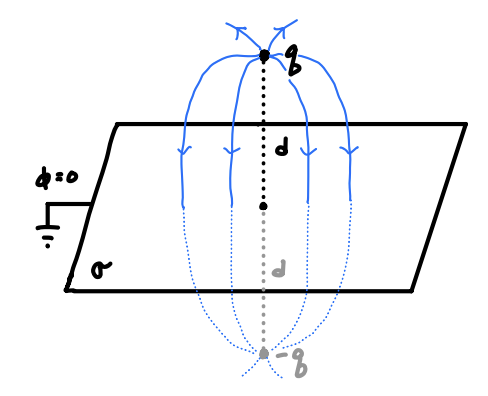
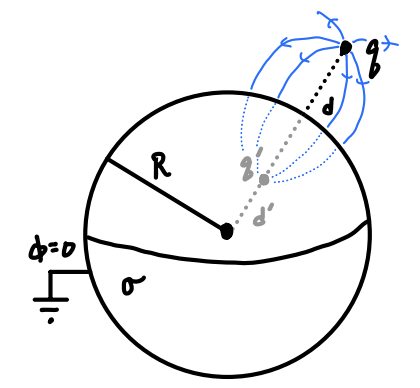

# Boundary Value Problems I

In this chapter and the next, we will continue on with the subject of electrostatics by solving electrostatics problems in the presence of boundary conditions. These are called *boundary value problems*, or BVPs. Many of the things we cover in these two chapters will also apply to other areas of electromagnetism as well, like magnetostatics and electrodynamics, with minor modifications here and there that we'll touch on in future chapters. 

In this chapter, we will derive the formal solution for Poisson's equation using the theory of Green's functions. Once we've done that, we will introduce the closely-related method of images, a technique that can be used to solve electrostatics problems when there are certain symmetries present.

## Poisson's Equation

### Poisson's Equation

We've now found the following two field equations for the electric field of electrostatics,
$$
\begin{align*}
\nabla \cdot \mathbf{E} &= 4\pi\rho \ , \\
\nabla \times \mathbf{E} &= \mathbf{0} \ .
\end{align*}
$$
We can use the scalar potential to combine these two first-order field equations into a single second-order equation for the scalar potential. We've already shown the curl equation is equivalent to the formula $\mathbf{E} = -\nabla \phi$. Plugging this into Gauss's Law, we get
$$
\nabla \cdot \mathbf{E} = \nabla \cdot (-\nabla \phi) = 4\pi\rho \ .
$$
Recognizing that this is just the Laplacian of the scalar potential, we thus have
$$
\boxed{
\nabla^2 \phi = -4\pi\rho
} \ .
$$
This second-order differential equation is called *Poisson's Equation*. It's fully equivalent to the two field equations we derived before. This means that instead of solving two vector first order differential equations to find the electric field, we need only solve Poisson's equation subject to any boundary conditions and then take the gradient to get the electric field. Indeed, for this reason Poisson's equation is perhaps the most important equation in electrostatics. It's the most generally useful way to find the electric field of a charge distribution. We'll  spend considerable time analyzing and solving this equation in the next chapter.

For now, just observe that Coulomb's Law is indeed a solution of Poisson's equation. If we express Coulomb's law as
$$
\mathbf{E}(\mathbf{x}) = \int d^3 \mathbf{x}' \ \rho(\mathbf{x}') \frac{\mathbf{x} - \mathbf{x}'}{|\mathbf{x} - \mathbf{x}'|^3} \ ,
$$
then the Laplacian of the potential is given by
$$
\begin{align*}
\nabla^2 \phi(\mathbf{x}) &= -\nabla \cdot \mathbf{E}(\mathbf{x}) \\
&= -\nabla \cdot \int d^3 \mathbf{x}' \ \rho(\mathbf{x}') \frac{\mathbf{x} - \mathbf{x}'}{|\mathbf{x} - \mathbf{x}'|^3} \\
&= -\int d^3 \mathbf{x}' \ \rho(\mathbf{x}') \nabla \cdot \frac{\mathbf{x} - \mathbf{x}'}{|\mathbf{x} - \mathbf{x}'|^3} \\
&= -\int d^3 \mathbf{x}' \ \rho(\mathbf{x}') 4\pi \delta(\mathbf{x} - \mathbf{x}') \\
&= -4\pi \rho(\mathbf{x}) \ .
\end{align*}
$$
We've thus shown that Coulomb's law satisfies Poisson's equation, as we'd expect. In fact, if the charge distribution is localized and there are no boundary conditions present, like say a set of background conductors, then Coulomb's law is the only valid solution. If boundary conditions are present we have to modify things slightly. We'll see more on this in the next few chapters.

### Surface Boundary Conditions

Recall from earlier the infinite sheet of charge example. Specifically, we saw that the electric field across the sheet of charge changes discontinuously across the surface by an amount $4\pi\sigma$. In fact this is generally true for E-fields across surfaces of charge. Specifically, when crossing a surface of charge, the normal part of the E-field changes discontinuously, while the tangential part of the E-field changes continuously.

FIGURE (show surface of charge with normal and tangential E-fields)

To see why this is the case, suppose $\mathcal{S}$ is some smooth surface carrying a surface charge density $\sigma(\mathbf{x})$. Suppose $\mathbf{x}$ is some point on this surface. The E-field $\mathbf{E}(\mathbf{x})$ at this point can then be decomposed into two parts, one vector $\mathbf{E}^\perp(\mathbf{x})$ normal to the surface at this point, and another vector $\mathbf{E}^\parallel(\mathbf{x})$ tangential to the surface at this point,
$$
\mathbf{E}(\mathbf{x}) = \mathbf{E}^\perp(\mathbf{x}) + \mathbf{E}^\parallel(\mathbf{x}) \ .
$$
To deal with the normal vector, what we can do is apply Gauss's Law just like we did with the infinite sheet. We'll choose an infinitesimally high and very thin pillbox with top and bottom areas $\delta A$ as the Gaussian surface, where $\delta A$ is so small that any deviations in the curvature of the surface $\mathcal{S}$ are negligible inside the Gaussian surface. If $E_+$ is the value of the E-field above the surface and $E_-$ is the value of the E-field below the surface, by Gauss's Law we must have
$$
(E_+^\perp - E_-^\perp) \delta A \approx \int \mathbf{E} \cdot d\mathbf{a} = 4\pi\sigma \delta A \ .
$$
That is, the normal part of the E-field changes discontinuously across the surface by an amount
$$
E_+^\perp(\mathbf{x}) - E_-^\perp(\mathbf{x}) = 4\pi\sigma(\mathbf{x}) \ .
$$
What about the parallel part? To handle this case, we can place an infinitesimally small closed loop of size $\delta\ell$ on the surface centered at the point $\mathbf{x}$. Since the circulation integral of the E-field is zero, we must have
$$
(E_+^\parallel - E_-^\parallel) \delta\ell = \oint_\mathcal{C} \mathbf{E} \cdot d\boldsymbol{\ell} = 0 \ .
$$
Assuming $\delta\ell$ is infinitesimal, we have $E_+^\parallel(\mathbf{x}) = E_-^\parallel(\mathbf{x})$. That is, the tangential part of the E-field remains continuous when crossing the surface of charge.

We can put these two results together by using the (upward) normal vector $\mathbf{n}$​ to write
$$
\mathbf{E}_+(\mathbf{x}) - \mathbf{E}_-(\mathbf{x}) = 4\pi\sigma(\mathbf{x}) \mathbf{n} \ .
$$
What about the scalar potential? In fact the potential *is* continuous across the surface of charge. To see why, suppose $\mathbf{x}_-$ is some point infinitesimally below the surface and $\mathbf{x}_+$ some other point infinitesimally above the surface. If the two points are separated by a small distance $\delta\ell$, the potential difference between these two points must be given by
$$
\phi_+ - \phi_- = -\int_{\mathbf{x}_-}^{\mathbf{x}_+} \mathbf{E} \cdot d\boldsymbol{\ell} \approx -(E_+  + E_-) \delta\ell \ .
$$
Assuming $\delta\ell$ infinitesimal, the right-hand side will be much much smaller than the left-hand side. In this limit, we thus have
$$
\phi_+(\mathbf{x}) = \phi_-(\mathbf{x}) \ .
$$
Since need them to solve boundary value problems in the next few chapters, let's go ahead and formulate these surface conditions as a set of boundary conditions for the potential. For that purpose it'll be convenient to express the condition for the electric field as a normal derivative of the potential. The *normal derivative* of a scalar field on a surface is defined as the component of the scalar field's gradient in the normal direction,
$$
\frac{\partial \phi}{\partial n} \equiv \nabla \phi \cdot \mathbf{n} \ .
$$
We can thus write the two boundary conditions for the potential across a surface of charge as
$$
\begin{align*}
\phi_+(\mathbf{x}) - \phi_-(\mathbf{x}) &= 0 \ , \\
\frac{\partial}{\partial n} \phi_+(\mathbf{x}) - \frac{\partial}{\partial n} \phi_-(\mathbf{x}) &= -4\pi\sigma(\mathbf{x}) \ .
\end{align*}
$$
Here it's of course understood that $\phi_+(\mathbf{x})$ and $\phi_-(\mathbf{x})$ refer to points infinitesimally above and below the surface, respectively.

### Conductors

Electromagnetic materials can often be thought of one of two types: *conductors* and *insulators*. Both are just materials composed of almost all neutral atoms, and hence charge neutral. They differ in one subtle way. Unlike insulators, conductors have a small fraction of *unbound electrons* that are unbound to their nuclei and free to move around the material, causing the material to *conduct* in the presence of an external field by moving its unbound electrons around. Insulators don't have these unbound electrons. The only way an insulator can respond to an external field is by distorting its electron clouds. We'll talk more about insulators in a future chapter. For now we'll just focus on conductors, which are a bit easier to understand macroscopically.

Suppose we have a conductor with some given charge distribution. We place that conductor in the presence of an external electric field and wait for the system to come to electrostatic equilibrium. Once this happens, the electric field becomes time independent, and hence electrostatic. When this happens, the unbound electrons will move in the direction of the external field, creating an internal field inside the conductor of the same strength as the external field, but in opposite direction. The net result is that once the conductor is in electrostatic equilibrium, the net electric field will vanish. Thus, conductors will have the property that the electric field is zero inside the conductor.

In fact, if there is no electric field inside the conductor it must be the case that all the unbound electrons will reside on the surface of the conductor. Indeed, this follows immediately from Gauss's Law. If there is no internal electric field in the conductor, then any Gaussian surface chosen inside the conductor must have $\rho = 0$​. Thus, the only place left for the charge to go is on the surface, where it will distribute itself such that the internal field vanishes.

This also implies that the surface of a conductor must be an *equipotential surface*. Since the internal field is zero, we must have
$$
\phi(\mathbf{b}) - \phi(\mathbf{a}) = -\int_\mathbf{a}^\mathbf{b} \mathbf{E} \cdot d\boldsymbol{\ell} = 0
$$
for any two points $\mathbf{a}$ and $\mathbf{b}$ on the surface of the conductor, meaning $\phi(\mathbf{a}) = \phi(\mathbf{b})$ is constant on the surface. Since the surface of the conductor is an equipotential, this also means that the field lines at the surface must be perpendicular to the surface, since $\mathbf{E} = -\nabla \phi$​ and we know that gradients are perpendicular to their equipotential surfaces.

We'll find it convenient to express these results as a set of boundary conditions for conductors. Surface boundary conditions require that $\mathbf{E}_+ - \mathbf{E}_- = 4\pi\sigma \mathbf{n}$. Since the field inside the conductor is zero, $\mathbf{E}_- = \mathbf{0}$. Thus, just outside the surface we must have
$$
\mathbf{E}_+ = 4\pi\sigma \mathbf{n} \ ,
$$
or, in terms of the normal derivative of the potential, we must have
$$
\frac{\partial\phi}{\partial n} = -4\pi\sigma \ .
$$
This gives us a way to find the surface charge on a conductor if we know the potential, something we'll find useful later on.

---

We saw in the previous chapter that we can in principle calculate the scalar potential $\phi$ due to the presence of a localized charge distribution $\rho$ by evaluating the following integral,
$$
\phi(\mathbf{x}) = \int d^3 \mathbf{x}' \ \frac{\rho(\mathbf{x}')}{|\mathbf{x} - \mathbf{x}'|} \ .
$$
In principle, this integral formula will work as long as the charge distribution is localized, there are no other sources of charge, and we've already specified in advance what the charge density $\rho(\mathbf{x}')$ actually is. Unfortunately, in practice there are often other sources of charge present, and we often don't know what the charge density is for those. For example, there may be background conductors or other charged materials present that are too difficult to model, but we know the potential on those surfaces. We can model situations like this by incorporating them into the problem as *boundary conditions*.

Recall from the previous chapter that we can express the solution for the potential in an equivalent way to the integral given above via a partial differential equation (PDE) known as *Poisson's Equation*,
$$
\nabla^2 \phi = -4\pi\rho \ .
$$
As we can clearly see, Poisson's equation is a linear, second-order PDE that depends only on spatial coordinates. Note that in the absence of source charges, Poisson's equation reduces to another important equation we'll study known as *Laplace's Equation*,
$$
\nabla^2 \phi = 0 \ .
$$
To solve Poisson's equation, it's sufficient to specify some set of *boundary conditions*, or conditions that the solution must satisfy on some given boundary surface $\mathcal{S}$. We imagine the charge distribution $\rho$ lies inside the surface $\mathcal{S}$, which may or may not be closed. On the surface, we know before-hand that some condition is satisfied, for example the value of the potential or the electric field on $\mathcal{S}$.

A problem of this kind is known as a *boundary value problem* or BVP. The entire goal of this chapter and the next will be devoted to solving BVPs of this type in various ways. The first way we will do so is via Green's function methods.

## Green's Functions

We will now introduce the idea of a *Green's Function*, which is a very useful and important concept in electromagnetism and many other field theories, as well as the theory of partial differential equations. We'll see that the Green's function provides a general method for solving Poisson's equation, and indeed for solving any linear differential equation.

We already know that for a localized charge distribution in the absense of boundary conditions that the potential can be found by
$$
\phi(\mathbf{x}) = \int d^3 \mathbf{x}' \ \frac{\rho(\mathbf{x}')}{|\mathbf{x} - \mathbf{x}'|} \ .
$$
If we look at this integral more closely we can see that it's really just a convolution of two functions, $\rho(\mathbf{x}')$ and another function
$$
\boxed{
G(\mathbf{x} - \mathbf{x}') \equiv \frac{1}{|\mathbf{x} - \mathbf{x}'|}
}\ .
$$
This function $G(\mathbf{x} - \mathbf{x}')$ is called a *Green's Function*. This function is evidently a property of the PDE itself, and doesn't depend on any charge distributions or boundary conditions. So where does this function come from?

Suppose we wanted to solve Poisson's equation for a single unit point charge located at a source point $\mathbf{x}'$. Since $q=1$ this means that $\rho(\mathbf{x}) = \delta(\mathbf{x} - \mathbf{x}')$. The potential $G(\mathbf{x} - \mathbf{x}')$ that solves this Poisson's equation in the absence of any boundary conditions is known as a *Green's function*, 
$$
\nabla^2 G(\mathbf{x} - \mathbf{x}') = -4\pi \delta(\mathbf{x} - \mathbf{x}') \ .
$$
Now, suppose as suggested above that we could recover the potential $\phi$ from the Green's function by convolution with the charge density $\rho$,
$$
\phi(\mathbf{x}) = \int d^3 \mathbf{x}' \ \rho(\mathbf{x}') G(\mathbf{x} - \mathbf{x}') \ .
$$
If we take the Laplacian of $\phi(\mathbf{x})$, we then have
$$
\begin{align*}
\nabla^2 \phi(\mathbf{x}) &= \nabla^2 \int d^3 \mathbf{x}' \ \rho(\mathbf{x}') G(\mathbf{x} - \mathbf{x}') \\ 
&= \int d^3 \mathbf{x}' \ \rho(\mathbf{x}') \nabla^2 G(\mathbf{x} - \mathbf{x}') \\
&= -4\pi \int d^3 \mathbf{x}' \ \rho(\mathbf{x}') \delta(\mathbf{x} - \mathbf{x}') \\
&= -4\pi \rho(\mathbf{x}) \ .
\end{align*}
$$
This proves that given the Green's function, we can use it to find the potential for any given charge distribution by convolution.

### Green's Function Solution via the Fourier Transform

Since we already know that the Green's function for Poisson's equation must be given by
$$
G(\mathbf{x} - \mathbf{x}') = \frac{1}{|\mathbf{x} - \mathbf{x}'|} \ ,
$$
we could just skip ahead to the next section. However, we want to derive the Green's function yet another way that's more broadly applicable, namely via the Fourier transform. We cover the mathematical details of the Fourier transform in the appendix, so feel free to stop and read over that first before proceeding.

Let's suppose that we wished to solve Poisson's equation for a unit point charge placed at the origin,
$$
\nabla^2 G(\mathbf{x}) = -4\pi \delta(\mathbf{x}) \ ,
$$
We'll assume that both $G(\mathbf{x})$ and its normal derivative go to zero as $|\mathbf{x}| \rightarrow \infty$, a physically realistic assumption.

Now, we take the Fourier transform of both sides to get the Green's function as a function of the wavevector $\mathbf{k}$. That is, we multiply both sides by $e^{-i \mathbf{k} \cdot \mathbf{x}}$ and integrate with respect to $\mathbf{x}$ over all space,
$$
\int d^3\mathbf{x} \ \nabla^2 G(\mathbf{x}) e^{-i \mathbf{k} \cdot \mathbf{x}} = -4\pi \int d^3\mathbf{x} \ \delta(\mathbf{x}) e^{-i \mathbf{k} \cdot \mathbf{x}} \ .
$$
Now, the right-hand side is easy to work out. By definition of the delta function we get $-4\pi e^{-i \mathbf{k} \cdot \mathbf{0}} = -4\pi$. The left-hand side is more interesting. Those familiar with the Fourier transform will immediately see it must be $-|\mathbf{k}|^2 G(\mathbf{k})$, where $G(\mathbf{k})$ is the Fourier transform of $G(\mathbf{x})$ defined by
$$
G(\mathbf{k}) = \int d^3\mathbf{x} \ G(\mathbf{x}) e^{-i \mathbf{k} \cdot \mathbf{x}} \ .
$$
Let's prove this real quick. If we apply Green's second identity to the left-hand side above and require that $G(\mathbf{x})$ go to zero as $|\mathbf{x}| \rightarrow \pm \infty$, then the boundary terms vanish, leaving us with
$$
\begin{align*}
\int d^3\mathbf{x} \ \nabla^2 G(\mathbf{x}) e^{-i \mathbf{k} \cdot \mathbf{x}} &= 
\int d^3\mathbf{x} \ G(\mathbf{x}) \nabla^2 e^{-i \mathbf{k} \cdot \mathbf{x}} + 
\oint_\mathcal{S} da \ \bigg[e^{-i \mathbf{k} \cdot \mathbf{x}} \frac{\partial G}{\partial n} - G \frac{\partial}{\partial n} e^{-i \mathbf{k} \cdot \mathbf{x}} \bigg] \\
&= -|\mathbf{k}|^2 \int d^3\mathbf{x} \ G(\mathbf{x}) e^{-i \mathbf{k} \cdot \mathbf{x}} \\
&= -|\mathbf{k}|^2 G(\mathbf{k}) \ .
\end{align*}
$$
Putting both sides together, we end up with an algebraic equation in $k$-space that's easily solved for $G(\mathbf{k})$,

$$
-|\mathbf{k}|^2 G(\mathbf{k}) = -4\pi \quad \Longrightarrow \quad G(\mathbf{k}) = \frac{4\pi}{|\mathbf{k}|^2} \ .
$$
Now, we want the Green's function in terms of $\mathbf{x}$, not in terms of $\mathbf{k}$. We can get that by now taking the inverse Fourier transform. That is, we multiply $G(\mathbf{k})$ by $(2\pi)^{-3} e^{i \mathbf{k} \cdot \mathbf{x}}$ and integrate with respect to $\mathbf{k}$ over all $k$-space to get
$$
G(\mathbf{x}) = \int \frac{d^3\mathbf{k}}{(2\pi)^3} \ G(\mathbf{k}) e^{i \mathbf{k} \cdot \mathbf{x}} 
= 4\pi \int \frac{d^3\mathbf{k}}{(2\pi)^3} \ \frac{e^{i \mathbf{k} \cdot \mathbf{x}}}{|\mathbf{k}|^2} \ .
$$
We're now left with an integral to evaluate that's quite non-trivial. First, we observe that the integrand depends on two things, the squared norm $|\mathbf{k}|^2$ and the dot product $\mathbf{k} \cdot \mathbf{x}$. Now, we're free to orient $\mathbf{x}$ along any direction of $k$-space we like. Without loss of generality then, let's suppose $\mathbf{x}$ is oriented along the $k_z$-axis, so that $\mathbf{x} = r \mathbf{e}_{k_z}$. Then $\mathbf{k} \cdot \mathbf{x} = kr\cos\theta_k$, where $k = |\mathbf{k}|$ and $\theta_k$ is the usual polar angle of spherical coordinates in $k$-space. This strongly suggests we should do the integration in $k$-space spherical coordinates $(k, \theta_k, \varphi_k)$. This means the volume element $d^3\mathbf{k}$ becomes
$$
d^3 \mathbf{k} = k^2 \sin\theta_k dk d\theta_k d\phi_k \ .
$$
Plugging this all into the integral and evaluating the trivial integral over $\varphi_k$, we thus have
$$
G(\mathbf{x}) = 4\pi \int_0^\infty dk \int_0^\pi d\theta_k \int_0^{2\pi} d\varphi_k \ \frac{k^2 \sin\theta_k}{(2\pi)^3} \frac{e^{i kr \cos\theta_k}}{k^2} = \frac{1}{\pi} \int_0^\infty dk \int_0^\pi d\theta_k \ \sin\theta_k \ e^{i kr \cos\theta_k} \ .
$$
Next, we need to evaluate the integral over $\theta_k$. This is most easily done by making the useful substitution $\mu = \cos\theta_k$ to get
$$
G(\mathbf{x}) = \frac{1}{\pi} \int_0^\infty dk \int_{-1}^1 d\mu \ e^{i kr \mu} = \frac{1}{\pi} \int_0^\infty dk \ \frac{e^{ikr} - e^{-ikr}}{ikr} = \frac{2}{\pi} \int_0^\infty dk \ \frac{\sin kr}{kr} \ .
$$
All that remains now is the integral over $k$. We'll simplify this remaining integral slightly by substituting $u=kr$ to write
$$
G(\mathbf{x}) = \frac{2}{\pi r} \int_0^\infty du \ \frac{\sin u}{u} \ .
$$
The remaining integral in $u$ is a well-known integral, known as a *Dirichlet integral*. Dirichlet integrals can be evaluated any number of ways. In the appendix we showed that we can evaluate this integral using the residue theorem to get
$$
\int_0^\infty du \ \frac{\sin u}{u} = \frac{\pi}{2} \ .
$$
Plugging this back into the Green's function, we finally get
$$
G(\mathbf{x}) = \frac{2}{\pi r} \cdot \frac{\pi}{2} = \frac{1}{r} = \frac{1}{|\mathbf{x}|} \ .
$$
This is the Green's function that solves the equation posed above. Finally, if we shift the source point from the origin to some other source point $\mathbf{x}'$ we recover the general Green's function derived above,
$$
G(\mathbf{x} - \mathbf{x}') = \frac{1}{|\mathbf{x} - \mathbf{x}'|} \ .
$$

This perhaps seemed like a pointless exercise, but we'll see later that this method for solving PDEs is broadly useful. For example, in a later chapter we'll need to find the Green's function for the Helmholtz equation, and for that we'll need this method.

### Formal Solution to Poisson's Equation

We'll now derive a formal solution to Poisson's equation in the presence of boundary conditions. To do so we'll again make use of Green's second identity. Recall that Green's second identity says that for two scalar fields $\psi(\mathbf{x}')$ and $\phi(\mathbf{x}')$, we have

$$
\int_\mathcal{V} d^3 \mathbf{x}' \ (\phi \nabla'^2 \psi - \psi \nabla'^2 \phi) = \oint_\mathcal{S} da' \ \bigg[\phi \frac{\partial \psi}{\partial n'} - \psi \frac{\partial \phi}{\partial n'} \bigg] \ .
$$
Here $\mathcal{S}$ is some closed surface enclosing a volume $\mathcal{V}$, and $\frac{\partial \phi}{\partial n'} = \nabla' \phi \cdot \mathbf{n}'$ is the normal derivative of $\phi$ across the surface. We write the identity in terms of the source point $\mathbf{x}'$ since that's what will be useful for us here.

Now, what we'll do is set $\psi(\mathbf{x}') = G(\mathbf{x} - \mathbf{x}')$ and $\phi(\mathbf{x}')$ equal to the potential to get
$$
\int_\mathcal{V} d^3 \mathbf{x}' \ (\phi \nabla'^2 G - G \nabla'^2 \phi) = \oint_\mathcal{S} da' \ \bigg[\phi \frac{\partial G}{\partial n'} - G \frac{\partial \phi}{\partial n'} \bigg] \ .
$$
Next, we'll simplify the left-hand side by using Poisson's equation to write $\nabla'^2 \phi = -4\pi\rho$ and the property of the Green's function derived above to write $\nabla'^2 G = -4\pi\delta(\mathbf{x}-\mathbf{x}')$. Plugging these in and rearranging terms, we have
$$
\int_\mathcal{V} d^3 \mathbf{x}' \ \phi(\mathbf{x}') \delta(\mathbf{x}-\mathbf{x}') = \int_\mathcal{V} d^3 \mathbf{x}' \ \rho(\mathbf{x}') G(\mathbf{x} - \mathbf{x}') + \frac{1}{4\pi} \oint_\mathcal{S} da' \ \bigg[G \frac{\partial \phi}{\partial n'} - \phi \frac{\partial G}{\partial n'} \bigg] \ .
$$
Now, we can evaluate the left-hand side of this integral. If $\mathbf{x}$ is outside the surface the left-hand side is zero and we get nowhere. However, if $\mathbf{x}$ is inside the surface we can use the definition of the delta function to write
$$
\boxed{
\phi(\mathbf{x}) = \int_\mathcal{V} d^3 \mathbf{x}' \ \rho(\mathbf{x}') G(\mathbf{x} - \mathbf{x}') + \frac{1}{4\pi} \oint_\mathcal{S} da' \ \bigg[G \frac{\partial \phi}{\partial n'} - \phi \frac{\partial G}{\partial n'} \bigg]
}\ .
$$
Provided we interpret $\mathcal{S}$ as the *boundary surface* we have exactly what we seek, a formal solution for the potential in the presence of boundary conditions acting along the boundary surface. The surface integral term encodes all the information contained in the boundary conditions. Indeed, if we send the boundary surface to infinity the surface integral goes to zero like $r'^{-3}$, and we recover our original integral formula for the potential.

So what exactly is the surface integral encoding? Notice that it contains two terms, one proportional to the *value* of the potential along the boundary surface, and another proportional to the *normal derivative* of the potential along the boundary surface. Since we can write the normal derivative in terms of the electric field via
$$
\frac{\partial \phi}{\partial n'} = \nabla' \phi \cdot \mathbf{n}' = -\mathbf{E} \cdot \mathbf{n}' \ ,
$$
the normal derivative term is just encoding information about the value of the *electric field* along the boundary surface.

We can also see that if there are no source charges present inside the boundary surface we can still find an expression for the potential. It's just the surface integral term. This means we need not have a source charge distribution present at all. We can just specify everything in terms of boundary conditions if we like. If there are no source charges present, Poisson's equation reduces to a simpler PDE known as *Laplace's Equation*,
$$
\nabla^2 \phi = 0 \ .
$$
We can solve many electrostatics problems just by solving Laplace's equation subject to boundary conditions, allowing us to avoid having to specify ahead what the charge distributions are. We'll return to this idea later.

### Uniqueness Theorem

In fact, the formal solution we derived above is redundant. We don't need all of the information encoded in the surface integral to solve Poisson's equation. It turns out we only need one of the two terms, either the value term or the normal derivative term. In fact, including both terms as boundary conditions can result in the problem having no solution at all.

When we solve Poisson's equation with only the *value* of the potential specified on the boundary surface, we say we are using *Dirichlet boundary conditions*. In a Dirichlet problem, we seek to solve the *boundary value problem* (BVP)
$$
\begin{align*}
\begin{cases}
\nabla^2 \phi = -4\pi\rho \ , \\
\text{where} \ \phi = \phi_0 \ \text{on} \ \mathcal{S} \ .
\end{cases}
\end{align*}
$$
On the other hand, when we solve Poisson's equation with only the *normal derivative* specified on the boundary surface, we say we are using *Neumann boundary conditions*. In a Neumann problem, we seek to solve the BVP
$$
\begin{align*}
\begin{cases}
\nabla^2 \phi = -4\pi\rho \ , \\
\text{where} \ \frac{\partial \phi}{\partial n'} = -E_0 \ \text{on} \ \mathcal{S} \ .
\end{cases}
\end{align*}
$$
Here $E_0$ is used to denote the value of the electric field normal to the boundary surface, i.e. $E_0 = \mathbf{E} \cdot \mathbf{n}'$.

We will now show that provided either Cauchy or Neumann boundary conditions are used, the Poisson equation with boundary conditions will yield a unique solution for the potential. Suppose we have two solutions $\phi_1$ and $\phi_2$ to Poisson's equation subject to either Cauchy or Neumann boundary conditions, but not both. That is, we have
$$
\begin{align*}
\begin{cases}
\nabla^2 \phi_1 = \nabla^2 \phi_2 = -4\pi\rho \ , \\
\text{where} \ \phi_1 = \phi_2 = \phi_0 \ \text{on} \ \mathcal{S} \ , \\
\text{or} \ \frac{\partial \phi_1}{\partial n'} = \frac{\partial \phi_1}{\partial n'} = -E_0 \ \text{on} \ \mathcal{S} \ .
\end{cases}
\end{align*}
$$
Now, let $u = \phi_2 - \phi_1$. Then $\nabla^2 u = 0$ by linearity and either $u$ or $\frac{\partial u}{\partial n'}$ equal zero along the boundary surface, so we have
$$
\begin{align*}
\begin{cases}
\nabla^2 u = 0 \ , \\
\text{where} \ u = 0 \ \text{on} \ \mathcal{S} \ , \\
\text{or} \ \frac{\partial u}{\partial n'} = 0 \ \text{on} \ \mathcal{S} \ .
\end{cases}
\end{align*}
$$
This means the BVP for $u$ involves only solving Laplace's equation subject to the condition that either $u$ vanishes along the boundary or its normal derivative does.

Next we'll employ Green's first identity. Recall from the first chapter that this identity says
$$
\int_\mathcal{V} d^3 \mathbf{x}' \ (\nabla' \psi \cdot \nabla' \phi + \psi \nabla'^2 \phi) = \oint_\mathcal{S} da' \ \psi \frac{\partial \phi}{\partial n'} \ .
$$
Again we interpret this identity as $\mathcal{S}$ being a closed boundary surface enclosing a volume $\mathcal{V}$, and each scalar field being a function of the source position $\mathbf{x}'$. What we'll do this time is let $u = \psi = \phi$ in this equation to get
$$
\int_\mathcal{V} d^3 \mathbf{x}' \ \big((\nabla' u)^2 + u \nabla'^2 u\big) = \oint_\mathcal{S} da' \ u \frac{\partial u}{\partial n'} \ .
$$
Now, according to Laplace's equation $\nabla'^2 u = 0$. Also, according to the boundary conditions, either $u$ or $\frac{\partial u}{\partial n'}$ must vanish on the boundary surface, which means the surface integral on the right-hand side must also vanish. We're thus left with
$$
\int_\mathcal{V} d^3 \mathbf{x}' \ |\nabla' u|^2 = 0 \ .
$$
Finally, since $|\nabla' u|^2$ is strictly non-negative, the integral can only vanish if its integrand does. This means we must have
$$
\nabla' u = 0 \ .
$$
The only way the gradient can vanish is if $u$ is constant, meaning $u = \phi_2 - \phi_1 + \text{const}$. Under Dirichlet boundary conditions, this additive constant must in fact be zero since if $\nabla' u = 0$ and $u = 0$ on the boundary, then $u=0$ everywhere. Under Neumann boundary conditions, however, this additive constant can be anything. 

In either case it's physically immaterial what the additive constant is. Since the physical quantity of interest is the electric field, the additions of an additive constant to the potential doesn't physically matter. All together, this means that the solution to Poisson's equation subject to either Cauchy or Neumann boundary conditions must be unique up to an unimportant constant, which is what we wanted to show.

Note that the same proof holds if the problem has *mixed boundary conditions*, where on some parts of the boundary surface the potential is specified, and on other parts the normal derivative is specified. In this case, we only need to break the boundary up into these two pieces and argue the proof for each part.

### Green's Function with Boundary Conditions

We derived the Green's function above under the assumption that no boundary conditions were present, and then later imposed boundary conditions when deriving the formal solution. But we can also define the Green's function so that the boundary conditions are already backed in. The idea is to generalize the definition of the Green's function somewhat by supposing
$$
G(\mathbf{x} - \mathbf{x}') = \frac{1}{|\mathbf{x} - \mathbf{x}'|} + F(\mathbf{x} - \mathbf{x}') \ ,
$$
where $F(\mathbf{x} - \mathbf{x}')$ is some function that satisfies Laplace's equation subject to the boundary conditions,
$$
\begin{align*}
\begin{cases}
\nabla^2 F(\mathbf{x} - \mathbf{x}') = 0 \ , \\
\text{where} \ F(\mathbf{x} - \mathbf{x}') = 0 \ \text{on} \ \mathcal{S} \ , \\
\text{or} \ \frac{\partial F}{\partial n'} = 0 \ \text{on} \ \mathcal{S} \ .
\end{cases}
\end{align*}
$$
We'll call $F(\mathbf{x} - \mathbf{x}')$ the *homogeneous part* of the Green's function. Intuitively, we can think of the homogeneous part as the potential of any charge distributions lying beyond the boundary surface. Our goal in this section however isn't to find $F(\mathbf{x} - \mathbf{x}')$, but to formally show that this generalization of the Green's function gives formal solutions that aren't overdetermined.

Consider first the case of a Poisson BVP with Dirichlet boundary conditions. We'll suppose there exists a Green's function $G_D(\mathbf{x} - \mathbf{x}')$ that satisfies the BVP
$$
\begin{align*}
\begin{cases}
\nabla^2 G_D(\mathbf{x} - \mathbf{x}') = -4\pi\delta(\mathbf{x} - \mathbf{x}') \ , \\
\text{where} \ G_D(\mathbf{x} - \mathbf{x}') = 0 \ \text{on} \ \mathcal{S} \ .
\end{cases}
\end{align*}
$$
Now, if we plug this Green's function into the formal solution for the potential, we get
$$
\phi(\mathbf{x}) = \int_\mathcal{V} d^3 \mathbf{x}' \ \rho(\mathbf{x}') G_D(\mathbf{x} - \mathbf{x}') + \frac{1}{4\pi} \oint_\mathcal{S} da' \ \bigg[G_D \frac{\partial \phi}{\partial n'} - \phi \frac{\partial G_D}{\partial n'} \bigg] \ .
$$
Since $G_D(\mathbf{x} - \mathbf{x}')$ will vanish on the surface $\mathcal{S}$ by assumption, the first term in the surface integral vanishes and we're left with
$$
\boxed{
\phi(\mathbf{x}) = \int_\mathcal{V} d^3 \mathbf{x}' \ \rho(\mathbf{x}') G_D(\mathbf{x} - \mathbf{x}') - \frac{1}{4\pi} \oint_\mathcal{S} da' \ \phi \frac{\partial G_D}{\partial n'}
}\ .
$$
We've thus used this generalized Green's function to eliminate the boundary term we don't care about from the formal solution. What remains is the formal solution for a potential under Dirichlet boundary conditions.

We can do something similar for a Poisson BVP with Neumann boundary conditions, except we have to be slightly more careful. Suppose there exists a Green's function $G_N$ that satisfies the BVP
$$
\begin{align*}
\begin{cases}
\nabla^2 G_N(\mathbf{x} - \mathbf{x}') = -4\pi\delta(\mathbf{x} - \mathbf{x}') \ , \\
\text{where} \ \frac{\partial G_N}{\partial n'} = C \ \text{on} \ \mathcal{S} \ .
\end{cases}
\end{align*}
$$
Notice that we let $\frac{\partial G_N}{\partial n'}$ equal some arbitrary constant $C$ along the boundary instead of setting it to zero. To understand why we did this, recall that the normal derivative of a potential $\phi$ is proportional to the component of the electric field normal to the surface, with $\frac{\partial \phi}{\partial n'} = -\mathbf{E} \cdot \mathbf{n}'$. Since the electric field must satisfy Gauss's Law, this means if we integrate over $\mathcal{S}$ we must have
$$
\oint_\mathcal{S} da' \ \frac{\partial \phi}{\partial n'} = -\oint_\mathcal{S} \mathbf{E} \cdot \mathbf{n}' \ da' = -4\pi Q_{\text{enc}} \ .
$$
Now, we can think of the Green's function as the potential of a unit point charge. This means if we substitute $\phi$ for $G_N$ and set $Q_{\text{enc}} = 1$, we're left with
$$
\oint_\mathcal{S} da' \ \frac{\partial G_N}{\partial n'} = -4\pi \ .
$$
This implies that whatever the normal derivative is doing along the boundary surface, it must have the form
$$
\frac{\partial G_N}{\partial n'} = -\frac{4\pi}{S} \ \text{on} \ \mathcal{S} \ .
$$
We'll thus choose this as our boundary condition for the Neumann BVP, setting the constant $C = -\frac{4\pi}{S}$.

Plugging this form of $G_N$ into the formal solution and substituting in the above boundary condition, we have
$$
\begin{align*}
\phi(\mathbf{x}) &= \int_\mathcal{V} d^3 \mathbf{x}' \ \rho(\mathbf{x}') G_N(\mathbf{x} - \mathbf{x}') + \frac{1}{4\pi} \oint_\mathcal{S} da' \ \bigg[G_N \frac{\partial \phi}{\partial n'} - \phi \frac{\partial G_N}{\partial n'} \bigg] \\
&= \int_\mathcal{V} d^3 \mathbf{x}' \ \rho(\mathbf{x}') G_N(\mathbf{x} - \mathbf{x}') + \frac{1}{4\pi} \oint_\mathcal{S} da' \ G_N \frac{\partial \phi}{\partial n'} + \frac{1}{S} \oint_\mathcal{S} da' \phi \ .
\end{align*}
$$
Notice the last term is just the average value of the potential along the boundary surface, a constant. We'll denote this term by
$$
\langle \phi \rangle_\mathcal{S} \equiv \frac{1}{S} \oint_\mathcal{S} da' \phi \ .
$$
Like all additive constants, this term is irrelevant to the physics and can be absorbed into the potential if we like. We thus finally have the correct formal solution for a potential under Neumann boundary conditions,
$$
\boxed{
\phi(\mathbf{x}) = \langle \phi \rangle_\mathcal{S} + \int_\mathcal{V} d^3 \mathbf{x}' \ \rho(\mathbf{x}') G_N(\mathbf{x} - \mathbf{x}') + \frac{1}{4\pi} \oint_\mathcal{S} da' \ G_N \frac{\partial \phi}{\partial n'}
} \ .
$$
Of course, while having these formal solutions is nice, we still haven't shown how to find these generalized Green's functions. In fact, it usually isn't that helpful to find the generalized Green's function directly when solving a given problem. Its primary use is theoretical, to show that a formal solution for the potential will always exist under certain types of boundary conditions.

### Green's Functions in Other Dimensions

For the special case of the Laplacian operator, there's an easier way to find the (unbounded) Green's function that also happens to work just as easily for any number of dimensions. Let's again consider Poisson's equation for the Green's function free from boundary conditions, but this time we'll assume $\mathbf{x}$ and $\mathbf{x}'$ are vectors in some arbitrary $n$-dimensional space. If we ignore the factor of $4\pi$ from before, we can write
$$
\nabla^2 G(|\mathbf{x} - \mathbf{x}'|) = -\delta(\mathbf{x} - \mathbf{x}') \ .
$$
Here $\nabla^2 = \nabla \cdot \nabla$, where the del operator $\nabla$ is now $n$ dimensional, with
$$
\nabla = \sum_{i=1}^n \frac{\partial}{\partial x_i} \mathbf{e}_i \ .
$$
Let's recall the divergence theorem in 3-dimensions, which says for any vector field $\mathbf{F}(\mathbf{x})$ we have
$$
\int_\mathcal{V} d^3 \mathbf{x} \ \nabla \cdot \mathbf{F} = \oint_\mathcal{S} da \ \mathbf{F} \cdot \mathbf{n} \ ,
$$
where $\mathcal{V}$ is some volume and $\mathcal{S}$ is the closed surface bounding that volume.

It turns out the divergence theorem holds in any number of dimensions. In $n$ dimensions we have
$$
\int_{\mathcal{V}_n} d^n \mathbf{x} \ \nabla \cdot \mathbf{F} = \oint_{\mathcal{S}_{n-1}} da^{n-1} \ \mathbf{F} \cdot \mathbf{n} \ ,
$$
where $\mathcal{V}_n$ is an $n$-dimensional volume and $\mathcal{S}_{n-1}$ is the closed $n-1$ dimensional surface bounding the volume $\mathcal{V}_n$.

In our case, we'll choose $\mathbf{F} = \nabla G$. If we plug this into the divergence theorem above and integrate both sides, the left-hand side becomes the Laplacian $\nabla^2 G$ and the right-hand side becomes the normal derivative $\frac{\partial G}{\partial n}$,
$$
\int_{\mathcal{V}_n} d^n \mathbf{x} \ \nabla^2 G = \oint_{\mathcal{S}_{n-1}} da^{n-1} \ \frac{\partial G}{\partial n} \ .
$$
Now, by Poisson's equation we have $\nabla^2 G = -4\pi \delta(\mathbf{x}-\mathbf{x}')$. If the volume contains the point $\mathbf{x}'$ we thus get
$$
-1 = \oint_{\mathcal{S}_{n-1}} da^{n-1} \ \frac{\partial G}{\partial n}\ .
$$
Now, we can pick any Gaussian surface we like containing $\mathbf{x}'$. We'll thus choose an $n-1$ dimensional sphere of radius $r$ centered at the point $\mathbf{x}'$. In that case we can write the area element $da^{n-1}$ as
$$
da^{n-1} = r^{n-1} d\Omega^{n-1} \ ,
$$
where $d\Omega^{n-1}$ is the $(n-1)$-dimensional solid angle. Since $G(|\mathbf{x}|)$ is radial by assumption, its normal derivative with the sphere will just be its derivative with respect to $r$, meaning we can pull $G(|\mathbf{x}|)$ out of the surface integral to get
$$
\oint_{\mathcal{S}_{n-1}} da^{n-1}  \ \frac{\partial G}{\partial n} = r^{n-1}  \frac{\partial G}{\partial r}\oint_{\mathcal{S}_{n-1}} d\Omega^{n-1} = r^{n-1} \frac{\partial G}{\partial r} \Omega_{n-1} \ ,
$$
where $\Omega_{n-1}$ is the surface area of the sphere in $n-1$ dimensions. Putting this all together, we have
$$
\frac{\partial G}{\partial r} = -\frac{1}{\Omega_{n-1} r^{n-1}} \ .
$$
This can then be integrated to find the $n$-dimensional Green's function $G_n(|\mathbf{x} - \mathbf{x}'|) = G(r)$. For $n \geq 3$ we have
$$
G_n(|\mathbf{x} - \mathbf{x}'|) = \frac{(-1)^{n+1}}{(n-2) \Omega_{n-1}} \frac{1}{|\mathbf{x} - \mathbf{x}'|^{n-2}} \ .
$$
It's easy to see that when $n=3$ we get exactly what we'd derived before aside from the factor of $4\pi$. Indeed, since $\Omega_2 = 4\pi$ is the surface area of a unit sphere, we get
$$
G_3(|\mathbf{x} - \mathbf{x}'|) = \frac{1}{4\pi} \frac{1}{|\mathbf{x} - \mathbf{x}'|} \ .
$$
When $n=2$ we do get a proper function, but it looks different than the rest. In this case $\Omega_1 = 2\pi$ is the circumference of a unit sphere, so we get
$$
G_2(|\mathbf{x} - \mathbf{x}'|) = -\frac{1}{2\pi} \log |\mathbf{x} - \mathbf{x}'| \ .
$$
Finally, when $n=1$, $\Omega_0$ is just the size of a point, which is zero. This means that $G_1(|\mathbf{x} - \mathbf{x}'|) = \infty$, meaning the Green's function isn't well-defined in 1-dimension.

In practice, aside from the 3-dimensional Green's function we already studied in depth, it's the 2-dimensional Green's function that's likely to be of most use to use in electromagnetism. It can be useful, for instance, in solving electrostatics problems where we're only interested in the fields and potentials along some flat 2-dimensional surface.

## Method of Images

Thus far, we've yet to show any practical ways to find the potential in a given boundary value problem. In this section we'll introduce the first method, the powerful *method of images*. This method exploits the uniqueness theorem and the geometry of a problem to quickly find the potential. It doesn't always work, but when it does it can be quite useful.

From the previous section, we know we can express the Green's function satisfying the boundary conditions by letting
$$
G(\mathbf{x} - \mathbf{x}') = \frac{1}{|\mathbf{x} - \mathbf{x}'|} + F(\mathbf{x} - \mathbf{x}') \ ,
$$
where the homogeneous part $F(\mathbf{x} - \mathbf{x}')$ is any function that satisfies Laplace's equation subject to the boundary conditions. By the uniqueness theorem, we know that if we can find such a function $F(\mathbf{x} - \mathbf{x}')$, it will be unique up to an unimportant additive constant to the potential, provided Dirichlet or Neumann (or mixed) boundary conditions are used.

The method of images exploits this property of uniqueness by converting the original boundary value problem into an equivalent unbounded problem that still just happens to satisfy the same boundary conditions. Suppose we have one or more point charges in the presence of some set of boundary conditions, for example a set of conductors held at some fixed potentials. In many cases, we can exploit the geometry of the problem to convert this problem into an equivalent unbounded problem by introducing pseudo-charges outside the boundary surface, called *image charges*, such that when added to the problem the combination of original and image charges together happens to satisfy the original boundary conditions. By the uniqueness theorem, we know that if we find such a solution, it must be the unique solution, even for the original BVP.

### Examples

For example, suppose we wanted to find the potential for a point charge $q$ located at a distance $z=d$ above an infinite grounded sheet, meaning $\phi = 0$ at $z=0$. What we can do is pretend the grounded sheet wasn't there, and instead introduce an image charge $-q$ below the sheet at $z = -d$, which is outside the boundary surface. The potential of this new image problem is just
$$
\phi(\mathbf{x}) = \frac{q}{|\mathbf{x} - d \mathbf{e}_z|} - \frac{q}{|\mathbf{x} + d \mathbf{e}_z|} = \frac{q}{\sqrt{x^2 + y^2 + (z-d)^2}} - \frac{q}{\sqrt{x^2 + y^2 + (z+d)^2}} \ .
$$
The potential of this image problem just happens to solve the original boundary conditions, since $\phi(x,y,0) = 0$. By the uniqueness theorem, then, this same potential must *also* be the solution to the original BVP. See the figure below.

From this potential we can also easily find the Green's function satisfying the boundary conditions. For a point charge $q$ located at a position $\mathbf{x}_0$, we have $\rho(\mathbf{x}') = q \delta(\mathbf{x}' - \mathbf{x}_0)$, meaning
$$
\begin{align*}
\phi(\mathbf{x}) &= \int d^3\mathbf{x}' \ \rho(\mathbf{x}') G(\mathbf{x} - \mathbf{x}') \\
&= \int d^3\mathbf{x}' \ q \delta(\mathbf{x}' - \mathbf{x}_0) G(\mathbf{x} - \mathbf{x}') \\
&= q G(\mathbf{x} - \mathbf{x}_0) \ .
\end{align*}
$$
This means that to get the Green's function all we need to do is divide the potential by $q$ to get
$$
G_D(\mathbf{x} - d\mathbf{e}_z) = \frac{q}{\sqrt{x^2 + y^2 + (z-d)^2}} - \frac{q}{\sqrt{x^2 + y^2 + (z+d)^2}} \ .
$$
Notice that the first term is just the unbounded Green's function. The second term is the homogeneous part
$$
F(\mathbf{x} - d \mathbf{e}_z) = -\frac{q}{\sqrt{x^2 + y^2 + (z+d)^2}} \ .
$$
It's important to note that the potential and Green's function we found is *only* valid above the sheet, where $z > 0$. Below the sheet these formulas will *not* hold. The method of images only guarantees a solution *inside* the boundary surface. If we wanted to know what the potential was beyond the boundary surface as well we'd need to use some other approach.

This in a nutshell is how we use the method of images. Given some problem involving a set of point charges subject to some set of boundary conditions, we convert the problem into an unbounded problem by introducing image charges, find the image charges needed to satisfy the boundary conditions, write down the potential for this image problem and if desired the Green's function. Note that for the method of images to work, it's important that the images charges be *outside* the boundary surface. If we can't find image charges outside the surface that satisfy the boundary conditions, we can't proceed.

Before moving on, it's insightful to calculate the total induced charge on the boundary surface, in this case on the sheet. Using the relation between the surface charge density $\sigma$ and the normal derivative of $\phi$ from the previous chapter, we can find the total charge *induced* on the sheet due to the presence of the point charge $q$. Recall that near the surface the normal derivative must satisfy the condition
$$
\frac{\partial \phi}{\partial n} = -4\pi\sigma \ .
$$
Since the normal vector for the sheet is $\mathbf{n} = z \mathbf{e}_z$, the induced surface charge density is given by
$$
\begin{align*}
\sigma &= -\frac{1}{4\pi} \frac{\partial \phi}{\partial z} \\
&= -\frac{1}{4\pi} \frac{\partial}{\partial z} \bigg(\frac{q}{\sqrt{x^2 + y^2 + (z-d)^2}} - \frac{q}{\sqrt{x^2 + y^2 + (z+d)^2}}\bigg) \\
&= -\frac{1}{4\pi} \bigg(\frac{q(z-d)}{(x^2 + y^2 + (z-d)^2)^{3/2}} - \frac{q(z+d)}{(x^2 + y^2 + (z+d)^2)^{3/2}}\bigg) \\
&= -\frac{qd}{2\pi}\frac{1}{(x^2 + y^2 + d^2)^{3/2}} \ .
\end{align*}
$$
Using this information we can then find the total induced charge $Q$ on the sheet by integrating $\sigma$ along the surface of the sheet. Since the surface is just the entire $xy$-plane. We'll use polar coordinates for the integration since it's slightly easier. Writing $da = r dr d\varphi$ and $r^2 = x^2 + y^2$, we have
$$
\begin{align*}
Q &= \oint_\mathcal{S} da \ \sigma \\
&= -\frac{qd}{2\pi} \int_0^{2\pi} d\varphi \int_0^\infty r dr \ \frac{1}{(r^2 + d^2)^{3/2}} \\
&= \frac{qd}{\sqrt{r^2 + d^2}} \bigg |_{r=0}^\infty \\
&= -q \ .
\end{align*}
$$
Notice that the induced charge on the surface is just the image charge, with $Q = -q$. This will be generally true in method of images problems. In fact it *must* be this way, since the image charges are just a reformulation of the boundary conditions. The net charge in the original BVP should be the same as the net charge in the corresponding image problem.

We'll now work through a few more complicated examples to help solidify these ideas.

##### Example: Point charge near a grounded conducting sphere

Suppose we have a point charge $q$ located at some distance $d$ outside a grounded conducting sphere of radius $R$. This means that the boundary surface is just the surface of the sphere, where we must have $\phi = 0$. To find the potential of this BVP, we'll suppose there is a single image charge $q'$ located inside the sphere at some distance $d' \leq R$ from the center.

If we ignore the presence of the sphere and focus on these two charges alone, the potential will be
$$
\phi(\mathbf{x}) = \frac{q}{|\mathbf{x} - \mathbf{d}|} + \frac{q'}{|\mathbf{x} - \mathbf{d}'|} \ ,
$$
where $\mathbf{d} = d\mathbf{n}$ is the distance vector of $q$ and $\mathbf{d}' = d'\mathbf{n}'$ is the distance vector of $q'$, with $\mathbf{n}$ and $\mathbf{n}'$ their respective normal vectors relative to the surface of the sphere. To satisfy the boundary conditions, we require that $\phi(R\mathbf{e}_r) = 0$. This means we need to find a $q'$ and $d'$ for the image charge that satisfies the condition
$$
0 = \frac{q}{|R\mathbf{e}_r - d \mathbf{n}|} + \frac{q'}{|R\mathbf{e}_r - d' \mathbf{n}'|} = 
\frac{q/R}{|\mathbf{e}_r - \frac{d}{R}\mathbf{n}|} + \frac{q'/d'}{|\frac{R}{d'}\mathbf{e}_r - \mathbf{n}'|} \ .
$$
The only way this equation can evidently be satisfied with a nontrivial solution is if
$$
\frac{q}{R} = -\frac{q'}{d'} \quad , \quad \frac{d}{R} = \frac{R}{d'} \ .
$$
This means we means for the image problem to satisfy the boundary conditions, the image charge must satisfy
$$
q' = -\frac{R}{d} q \quad , \quad \mathbf{d}' = \frac{R^2}{d} \mathbf{n} \ .
$$
Plugging these expressions back into the potential, we thus have
$$
\phi(\mathbf{x}) = \frac{q}{|\mathbf{x} - d \mathbf{n}|} - \frac{\frac{R}{d} q}{|\mathbf{x} - \frac{R^2}{d} \mathbf{n}|} \ .
$$
We can rewrite this expression in a somewhat more useful form by using the law of cosines. If we let $\alpha$ denote the angle between $\mathbf{x}$ and $\mathbf{d}$, we can write
$$
\phi(\mathbf{x}) = \frac{q}{\sqrt{r^2 + d^2 - 2rd\cos\alpha}} - \frac{\frac{R}{d} q}{\sqrt{R^2 + \frac{r^2 d^2}{R^2} - 2rd\cos\alpha}} \ .
$$
By the uniqueness theorem, this must be the solution to the original BVP as well. Let's check that the limits make sense. As $d \rightarrow \infty$, we have $d' \rightarrow 0$, meaning the image charge moves closer towards the origin as the main charge moves farther away. Moreover, the image charge itself goes to zero, since $q' \rightarrow 0$. On the other hand, as $d \rightarrow R$, we have $d' \rightarrow R$ as well, meaning the image charge moves toward the surface as the main charge does. The image charge itself goes to $q' \rightarrow q$ in this limit. This also makes sense, since near the surface we expect the problem to approximate that of the charge above an infinite sheet.

If we like we can also write down the Green's function by again dividing both sides of the potential by $q$ to get
$$
G_D(\mathbf{x} - \mathbf{d}) = \frac{1}{\sqrt{r^2 + d^2 - 2rd\cos\alpha}} - \frac{\frac{R}{d}}{\sqrt{R^2 + \frac{r^2 d^2}{R^2} - 2rd\cos\alpha}} \ .
$$
Again, the first term is just the unbounded Green's function. The second term is the homogeneous part
$$
F(\mathbf{x} - \mathbf{d}) = -\frac{\frac{R}{d}}{\sqrt{R^2 + \frac{r^2 d^2}{R^2} - 2rd\cos\alpha}} \ .
$$
One can check that $F$ also satisfies Laplace's equation subject to the boundary condition $F(R\mathbf{e}_r - \mathbf{d}) = 0$.

Again, it's important to note that the potential and Green's function we found is *only* valid outside the sphere. These formulas do not hold inside the sphere, which is outside the boundary surface.

We can find the charge induced on the surface of the conductor as well. Letting $\mathbf{n} = r \mathbf{e}_r$, the surface charge density $\sigma$ turns out to be given by
$$
\sigma = -\frac{1}{4\pi} \frac{\partial \phi}{\partial r} = -\frac{1}{4\pi R^2} \frac{R}{d} \frac{1-\frac{R^2}{d^2}}{\big(1 + \frac{R^2}{d^2} - 2 \frac{R}{d} \cos\alpha \big)^{3/2}} \ .
$$
Notice that $\sigma$ now depends on the location of the field point as well due to the presence of the $\cos\alpha$ term. The density is evidently highest when $\alpha = 0$, which is the area on the sphere closest to the point charge, and lowest when $\alpha = \pi$, which is the area on the sphere farthest from the point charge. As the point charge moves farther away the density decreases.

By evaluating the surface integral, one can again show that the induced charge is given by the induced charge, with
$$
Q = \oint_{\mathcal{S}} da \ \sigma = q' = -\frac{R}{d} q \ .
$$
We can also calculate the force between the point charge and the conducting sphere if we like. Since the image charge problem is equivalent, we can just use Coulomb's Law between the charge $q$ and its image charge $q'$ to get
$$
\mathbf{F} = \frac{qq'}{|\mathbf{d} - \mathbf{d}'|^2} \mathbf{e}_r = -\frac{q^2 R}{d^3\big(1 - \frac{R^2}{d^2}\big)^2} \mathbf{e}_r \ .
$$
Evidently the force between the conductor and the point charge is always attractive. When the charge is near the conductor, the force goes like $F \sim (d-R)^{-2}$ similar to a monopole field, but as the charge moves farther away the force goes like $F \sim d^{-3}$, more similar to a dipole field.

##### Example: Point charge near an ungrounded conducting sphere

In the previous example we considered the problem of a point charge in the presence of a grounded conducting sphere. In fact, there's no necessary reason that the conductor to be grounded. We can hold it at any fixed potential we like, but to do so we need to modify the potential somewhat to account for this.

Suppose the sphere is held at a constant potential $\phi=V$. We'll again place an image charge $q' = -\frac{R}{d} q$ at a distance $d' = \frac{R^2}{d}$. However, we need to cancel the potential on the surface of the sphere as well. To address this, we can place another image charge at the origin with charge $q'' = VR$, to ensure that when $|\mathbf{x}| = R$ we have $\phi = V$ as expected.

FIGURE

Then we have
$$
\phi(\mathbf{x}) = \frac{q}{|\mathbf{x} - d\mathbf{n}|} - \frac{\frac{R}{d}q}{|\mathbf{x} - \frac{R^2}{d^2}\mathbf{n}|} + \frac{VR}{|\mathbf{x}|} \ .
$$
We can use this to get the Green's function in the usual way by dividing by $q$. In this case, the function
$$
F(\mathbf{x} - \mathbf{d}) = -\frac{\frac{R}{d}q}{|\mathbf{x} - \frac{R^2}{d^2}\mathbf{n}|} + \frac{VR}{|\mathbf{x}|}
$$
will satisfy Laplace's equation. In fact, each term satisfies Laplace's equation separately, as one can check.

One can check that the charge $Q$ on the surface of the sphere is given by $Q = q' + q'' = VR - \frac{R}{d} q$. The force between the  ungrounded sphere and the point charge is evidently given by
$$
\mathbf{F} = q\bigg(\frac{q'}{|\mathbf{d} - \mathbf{d}'|^2} + \frac{VR}{|\mathbf{d}|^2}\bigg)\mathbf{e}_r = \frac{q}{d^2} \bigg(VR - \frac{qRd^3}{\big(d^2 - R^2\big)^2}\bigg) \mathbf{e}_r \ .
$$
Now, the force includes both the dipole contribution from before, as well as a new monopole contribution due to the presence of the fixed potential $V$. This means in the far field limit $d \gg R$ the force reduces to Coulomb's Law between point charges $Q$ and $q$. 

In the opposite limit where $d \approx R$ things are somewhat more interesting. Suppose that $d = R + \delta$, where $\delta \ll r$. After working out the math, we find that very close to the surface $\mathbf{F} \sim -\frac{q^2}{4\delta^2} \mathbf{e}_r$. That is, no matter what the force becomes infinitely attractive near the surface, even if $q$ and $Q$ have the same sign.

The point where this attraction happens is usually very close to the sphere. One can show that when $Q \approx VR \gg q$, the force has an unstable equilibrium at $d \approx R\big(1 + \frac{1}{2}\sqrt{\frac{q}{VR}}\big)$. For example, an electron near the surface of a conductor with radius $R = 30 \ \text{cm}$ and $V = 1 \ \text{V}$ will experience this attraction only when $d-R \lesssim 10 \ \mu\text{m}$.

We can use this fact to interpret why charges almost never leave the surface of a conductor in the presence of an external field. If they tried to, they'd always be pulled back to the surface by this very powerful attractive force.

##### Example: Point charge near two grounded conducting perpendicular sheets

Suppose we have a point charge $q$ located at point $\mathbf{d} = (a,b)$ above two perpendicular grounded conducting sheets in the $xy$-plane. It's not too hard to see that using a single image charge for this problem won't work, no matter what its charge or position is. We'll need multiple. But how many? It turns out we'll need 3 image charges.

Consider an equivalent problem where we have 3 image charges $q',q'',q'''$ located at positions $\mathbf{d}'$, $\mathbf{d}''$, and $\mathbf{d}'''$ respectively. The potential of this configuration is evidently given by
$$
\phi(\mathbf{x}) = \frac{q}{|\mathbf{x}-\mathbf{d}|} + \frac{q'}{|\mathbf{x}-\mathbf{d}'|} + \frac{q''}{|\mathbf{x}-\mathbf{d}''|} + \frac{q'''}{|\mathbf{x}-\mathbf{d}'''|} \ .
$$
To arrange these image charges in a way that satisfies the boundary condition $\phi(0,y)=\phi(x,0)=0$, we'll choose
$$
\begin{align*}
q' = -q \quad &, \quad \mathbf{d}' = (-a,b) \ , \\
q'' = -q \quad &, \quad \mathbf{d}'' = (a,-b) \ , \\
q''' = q \quad &, \quad \mathbf{d}''' = (-a,-b) \ . \\
\end{align*}
$$
This configuration of charges is called the *simple quadrupole*, a concept we'll return to in more generality later.

Now, observe if we plug these values back into the potential we get
$$
\phi(\mathbf{x}) = \frac{q}{\sqrt{(x-a)^2+(y-b)^2}} - \frac{q}{\sqrt{(x+a)^2+(y-b)^2}} - \frac{q}{\sqrt{(x-a)^2+(y+b)^2}} + \frac{q}{\sqrt{(x+a)^2+(y+b)^2}} \ .
$$
Observe now that if we set $\mathbf{x}=(x,0)$ or $\mathbf{x}=(0,y)$ the potential vanishes, meaning this potential satisfies the boundary conditions, and hence by uniqueness must also be the correct potential for the original BVP. Dividing by $q$ will again give us the Green's function as usual.

The force between the point charge and the two sheets is given in the usual way. We end up with
$$
\mathbf{F} = q^2 \bigg(\frac{a}{(a^2+b^2)^{3/2}} - \frac{1}{a^2}\bigg)\mathbf{e}_x + q^2 \bigg(\frac{b}{(a^2+b^2)^{3/2}} - \frac{1}{b^2}\bigg)\mathbf{e}_y \ .
$$
Interestingly, this exact same problem can attempt to be carried out for two conducting sheets separated by an angle $\theta$. One can be convinced that in this general case, the method of images will only work for angles $\theta = \frac{\pi}{4}, \frac{\pi}{3}, \frac{\pi}{2}, \pi$. The lower the angle, the more image charges will be needed to match the problem configuration. If any other angles are tried, one is forced to place image charges inside the boundary surface, which of course is not allowed for the method of images are work.

##### Example: Conducting sphere in a uniform electric field

We'll consider now a problem that involves no point charges at all. Suppose a uniform conducting sphere of radius $R$ lies in the presence of a uniform electric field $\mathbf{E}_0$. Though not at all obvious, we can solve this problem using the method of images as well. 

We'll suppose the sphere is centered at the origin, and that $\mathbf{E}_0 = E_0 \mathbf{e}_z$ points along the $z$-axis of the sphere. To turn this into an image problem, we can think of the electric field as being generated by two opposite charges $q_\pm = \pm q$ each located a distance $d \gg R$ from the origin with positions $\mathbf{d}_\pm = \pm R\mathbf{e}_z$. Then the electric field will be approximately constant near the sphere, with
$$
E_0 \approx \frac{2q}{d^2} \ .
$$
If we send $q, d$ to infinity in a way such that this ratio stays constant, $E_0$ will become exactly uniform at every point.

FIGURE

Now, we know how to solve the problem of point charges in the presence of a conducting sphere. Each charge $q_+$ and $q_-$ will have associated image charges inside the sphere with charges and positions given by
$$
q_\pm' = \mp q \frac{R}{d} \quad , \quad \mathbf{d}_\pm' = \frac{R^2}{d} \mathbf{e}_z \ .
$$
Then the potential near the $\phi(\mathbf{x})$ near the sphere will be given by
$$
\begin{align*}
\phi(\mathbf{x}) &= \frac{q_+}{|\mathbf{x} - \mathbf{d}_+|} + \frac{q_-}{|\mathbf{x} - \mathbf{d}_-|} + \frac{q_+'}{|\mathbf{x} - \mathbf{d}_+'|} + \frac{q_-'}{|\mathbf{x} - \mathbf{d}_-'|} \\
&= q \bigg[\frac{1}{\sqrt{r^2 + d^2 + 2rd\cos\theta}} - \frac{1}{\sqrt{r^2 + d^2 - 2rd\cos\theta}} - \frac{R/d}{\sqrt{r^2 + (R^2/d)^2 + 2r(R^2/d)\cos\theta}} \\
&\quad + \frac{R/d}{\sqrt{r^2 + (R^2/d)^2 - 2r(R^2/d)\cos\theta}}\bigg] \ .
\end{align*}
$$
Again, the term in brackets is the Green's function under Dirichlet boundary conditions.

Now, to make this exact for a uniform field we need to send $d \rightarrow \infty$. In this limit, we can assume that $r \ll d$, meaning we can factor out $d^2$ from the roots and use the binomial approximation on each term to write
$$
\phi(\mathbf{x}) = -\frac{2q}{d^2} r \cos\theta + \frac{2q}{d^2} \frac{R^3}{r^2} \cos\theta + O\bigg(\frac{r}{d}\bigg) \ .
$$
The higher-order terms will vanish as $d \rightarrow \infty$. What remains are terms proportional to the uniform electric field $E_0 = \frac{2q}{d^2}$,
$$
\phi(\mathbf{x}) = -E_0\bigg(r - \frac{R^3}{r^2}\bigg) \cos\theta \ .
$$
Notice the first term is just $-E_0 z = -E_0 r\cos\theta$, which is what we'd expect for the potential of a uniform electric field in the absence of any conductors. The second term then is evidently the potential of the induced charge density on the sphere, which is equivalent of course to the potential of the image charges. The induced charge density is given in the usual way,
$$
\sigma = -\frac{1}{4\pi} \frac{\partial \phi}{\partial r} \bigg|_{r=R} = \frac{3}{4\pi} E_0 \cos\theta \ .
$$
Evidently, the surface integral of $\sigma$ in this case will vanish, meaning no net induced charge will accumulate on the sphere,
$$
Q = \oint_\mathcal{S} da \ \sigma = \frac{3}{2} E_0 R^2 \int_0^\pi d\theta \sin\theta \cos\theta = 0 \ .
$$
This can also be seen, of course, by noticing that the image charges $q'_+$ and $q_-'$ are equal and opposite, so their sum will vanish. This doesn't mean, of course, that there's no charge on the sphere. Indeed, we'd expect that in the direction of the field, positive charges will concentrate at one pole and negative charges on the other. What this result says is the net charge will be zero.

### Green's Function for a Sphere

Let's consider again the example of a point charge $q$ in the presence of a grounded conducting sphere of radius $R$. If we let $r'$ denote the distance of the point charge from the origin, we saw that we could write the Green's function for this problem by
$$
G_D(\mathbf{x} - \mathbf{x}') = \frac{1}{\sqrt{r^2 + r'^2 - 2rr'\cos\alpha}} - \frac{R/r'}{\sqrt{R^2 + \frac{r^2 r'^2}{R^2} - 2rr'\cos\alpha}} \ ,
$$
where $\alpha$ is the angle between the field point $\mathbf{x}$ and the source point $\mathbf{x}'$. 

We can use this Green's function as a building block to find solutions to any problem whose potential is specified on the surface of a sphere. Recall from a few sections back that we saw we could express the potential in the presence of Dirichlet boundary conditions by the formal solution
$$
\phi(\mathbf{x}) = \int_\mathcal{V} d^3 \mathbf{x}' \ \rho(\mathbf{x}') G_D(\mathbf{x} - \mathbf{x}') - \frac{1}{4\pi} \oint_\mathcal{S} da' \ \phi \frac{\partial G_D}{\partial n'} \ .
$$
Provided we can find the Green's function and we know the value of the potential on some given boundary surface, we have a unique solution of this form for the potential everywhere in space.

Now, suppose we have some charge distribution $\rho(\mathbf{x})$ located some distance away from a sphere of radius $R$ whose surface is held at some known potential $\phi_0 = \phi(R,\theta',\varphi')$. Since $\mathcal{S}$ is a sphere and the charge distribution lies outside the sphere, its surface normal $\mathbf{n}'$ will point inward toward the sphere with $\mathbf{n}' = -\mathbf{e}_{r'}$. This means the normal derivative of $G_D$ at the surface of the sphere will be
$$
\frac{\partial G_D}{\partial n'} = -\frac{\partial G_D}{\partial r'} \bigg|_{r'=R} = -\frac{(r^2 - R^2)/R}{(r^2 + R^2 - 2Rr \cos\alpha)^{3/2}} \ .
$$
Plugging this in and using the fact that the area element is $da' = R^2 d\Omega'$ on the surface of the sphere, we can express the potential for *any* charge distribution $\rho(\mathbf{x})$ outside a sphere of known potential by the integral
$$
\begin{align*}
\phi(\mathbf{x}) = &\int_\mathcal{V} d^3 \mathbf{x}' \ \rho(\mathbf{x}') \bigg[\frac{1}{\sqrt{r^2 + r'^2 - 2rr'\cos\alpha}} - \frac{R/r'}{\sqrt{R^2 + \frac{r^2 r'^2}{R^2} - 2rr'\cos\alpha}}\bigg] \\
&+ \frac{1}{4\pi} \oint_\mathcal{S} d\Omega' \ \phi(R,\theta',\varphi') \frac{R(r^2 - R^2)}{(r^2 + R^2 - 2Rr \cos\alpha)^{3/2}} \ ,
\end{align*}
$$
where $\cos\alpha$ can be expressed in terms of the trig relation
$$
\cos\alpha = \cos\theta \cos\theta' + \sin\theta \sin\theta' \cos(\varphi-\varphi') \ .
$$
This is an imposing set of integrals to solve though, so it's perhaps worth looking at a simplifying scenario. Suppose there are no other charges present other than the sphere. Then we can neglect the volume integral and express the potential by
$$
\phi(\mathbf{x}) = \frac{1}{4\pi} \oint_\mathcal{S} d\Omega' \ \phi(R,\theta',\varphi') \frac{R(r^2 - R^2)}{(r^2 + R^2 - 2Rr \cos\alpha)^{3/2}} \ .
$$
Note that we can easily write down the potential inside the sphere as well. All we need to do is flip the sign on the normal derivative, which is equivalent to replacing $r^2 - R^2 \rightarrow R^2 - r^2$ in the integral above. Everything else is the same.

##### Example: Conducting sphere with hemispheres of opposite potentials

Suppose we have a hollow sphere of radius $R$ consisting of two hemispheres held at opposite fixed potentials $\pm V$ that are separated by a thin insulating ring at the equator. We want to find the potential that matches these boundary conditions on the surface of the sphere.

FIGURE

Since there are no other source charges present, we can express the potential in terms of the integral given above,
$$
\phi(\mathbf{x}) = \frac{1}{4\pi} \oint_\mathcal{S} d\Omega' \ \phi(R,\theta',\varphi') \frac{R(r^2 - R^2)}{(r^2 + R^2 - 2Rr \cos\alpha)^{3/2}} \ .
$$
We require that $\phi(R,\theta',\varphi') = +V$ when $0 \leq \theta' < \frac{\pi}{2}$ and $\phi(R,\theta',\varphi') = -V$ when $\frac{\pi}{2} < \theta' \leq \pi$. Plugging this in, we get
$$
\phi(\mathbf{x}) = \frac{VR(r^2 - R^2)}{4\pi} \int_0^{2\pi} d\varphi' \bigg[\int_0^{\pi/2} \sin\theta' d\theta' - \int_{\pi/2}^\pi \sin\theta' d\theta'\bigg] \frac{1}{(r^2 + R^2 - 2Rr \cos\alpha)^{3/2}} \ .
$$
We can simplify this expression somewhat by making the change of variables $\theta' \rightarrow \pi - \theta', \varphi' \rightarrow \pi + \varphi'$ on the second $\theta'$ integral, combining terms, and making a change of variable $\mu' = \cos\theta'$ to write
$$
\phi(\mathbf{x}) = \frac{VR(r^2 - R^2)}{4\pi} \int_0^{2\pi} d\varphi' \int_0^1 d\mu' \bigg[\frac{1}{(r^2 + R^2 - 2Rr \cos\alpha)^{3/2}} - \frac{1}{(r^2 + R^2 + 2Rr \cos\alpha)^{3/2}}\bigg] \ .
$$
Unfortunately though, the presence of the term $\cos\alpha = \cos\theta \cos\theta' + \sin\theta \sin\theta' \cos(\varphi-\varphi')$ still makes this integral impossible to easily solve. But we can solve it in one simplifying case, when the field point is located on the positive $z$-axis, so $r=z$. In that case, we can simply write $\cos\alpha = \cos\theta' = \mu'$. Then the $\varphi'$ integral becomes trivial, and we have
$$
\phi(z\mathbf{e}_z) = \frac{VR(z^2 - R^2)}{2} \int_0^1 d\mu' \bigg[\frac{1}{(z^2 + R^2 - 2Rz \mu')^{3/2}} - \frac{1}{(z^2 + R^2 + 2Rz \mu')^{3/2}}\bigg] \ .
$$
Both integrals can be easily solved using substitutions of the form $u = r^2 + R^2 \mp 2Rr \mu'$. We finally get
$$
\phi(z\mathbf{e}_z) = V \bigg[1 - \frac{(z^2 - R^2)/z}{\sqrt{z^2 + R^2}}\bigg] \ .
$$
Let's check that this solution makes sense. When $z=R$ we get $\phi = V$, which is what we expect when $z > 0$, which we assumed. When $z \gg R$ we get $\phi \sim \frac{3VR^2}{2z^2}$, which means the potential falls off *faster* than it would for a point charge. In fact, it falls off like a *dipole*. This should make sense, given that we have two identical hemispheres held at opposite potentials, which means they have a net charge of zero and effectively act as a sort of dipole.

While we can't evaluate the general integral for this potential for arbitrary $\mathbf{x}$, we can at least get a series solution. The idea here is to suppose we're far away from the sphere, so that $r \gg R$, and define $\varepsilon \equiv (R/r)^2$. If we expand the integrand in powers of $\varepsilon$ and integrate term by term, it's possible to show that the potential we end up with has the form
$$
\phi(\mathbf{x}) = \frac{3VR^2}{2r^2} \bigg(P_1(\cos\theta) - \frac{7R^2}{12r^2} P_3(\cos\theta) + \cdots\bigg) \ .
$$
Here each term $P_\ell(\cos\theta)$ is the *Legendre polynomial* of degree $\ell$. Details on the Legendre polynomials can be found in the appendix. Evidently, the potential given only includes the odd degree polynomials. The even degree terms vanish due to the polar symmetry in the problem. The first two odd Legendre polynomials are given by
$$
P_1(\cos\theta) = \cos\theta \quad , \quad P_3(\cos\theta) = \frac{1}{2} (5\cos^3\theta - 3\cos\theta) \ .
$$
The further we are from the sphere, the better we can approximate this series solution by keeping only the first few terms. In fact, this is the entire idea behind the multipole expansion, something we'll cover in great detail in a future chapter.

