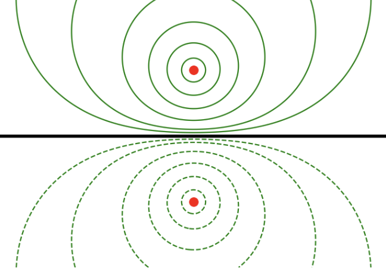

# Boundary Value Problems I

With the foundations of electrostatics in place, we will now turn our attention to more advanced methods for understanding and solving electrostatics problems. In this chapter and the next we will concern ourselves mainly with *boundary value problems*, or *BVPs*. We will show that electrostatics can be recast in terms of a single scalar partial differential equation, or *PDE*, for the scalar potential, known as *Poisson's equation*. In this chapter we will show how to solve the inhomogeneous Poisson equation using Green's functions and the related method of images. In the next chapter we will focus on solution methods for *Laplace's equation*, which is the homogeneous version of Poisson's equation. It'll turn out that many of the solution methods we introduce here will also apply beyond electrostatics, including to magnetostatics and electrodynamics.

## Boundary Value Problems

In the previous chapter we showed that in electrostatics the electric field is completely summarized by the field equations
$$
\begin{align*}
\nabla \cdot \mathbf{E} &= 4\pi\rho \ , \\
\nabla \times \mathbf{E} &= \mathbf{0} \ .
\end{align*}
$$
We'll now convert these field equations into a single PDE for the scalar potential, known as Poisson's equation, and show how to recast electrostatics problems in the form of boundary value problems.

### Poisson Equation

From the equation $\nabla \times \mathbf{E} = \mathbf{0}$ we know that in electrostatics the E-field $\mathbf{E}(\mathbf{x})$ is by definition irrotational, and hence must be the gradient of some scalar field, which we call the scalar potential $\phi(\mathbf{x})$,
$$
\mathbf{E}(\mathbf{x}) = -\nabla \phi(\mathbf{x}) \ .
$$
This means all relevant physical information about the E-field is contained in the scalar potential. To calculate the E-field for a given charge distribution it suffices to instead calculate the scalar potential and then take its gradient to recover the field. Given this is the case it makes sense to convert the field equations for the E-field in terms of a field equation for the potential.

Since $\mathbf{E} = -\nabla \phi$ already guarantees that $\nabla \times \mathbf{E} = \mathbf{0}$, we need only substitute this gradient into Gauss's law $\nabla \cdot \mathbf{E} = 4\pi\rho$ to get a field equation for the potential. Performing this substitution, we have
$$
\nabla \cdot \mathbf{E} = \nabla \cdot (-\nabla \phi) = -\nabla^2 \phi = 4\pi\rho \ .
$$
Thus, the two electrostatic field equations for the E-field are entirely contained in the single equation
$$
\boxed{
\nabla^2 \phi(\mathbf{x}) = -4\pi\rho(\mathbf{x})
} \ .
$$
A PDE of this form is known as *Poisson's equation*. It's a single scalar second order spatial PDE for the potential. Given some charge distribution, we in principle need only solve this PDE for the corresponding scalar potential and E-field. Indeed, much of the remainder of electrostatics is about finding more and more ways to solve Poisson's equation for the scalar potential.

When we're only interested in the potential in some region of space where no charges are present, $\rho = 0$ and Poisson's equation reduces to a simpler PDE known as *Laplace's equation*,
$$
\boxed{
\nabla^2 \phi(\mathbf{x}) = 0
} \ .
$$
We'll discuss solution methods to Laplace's equation in great depth in the next chapter.

### Boundary Conditions

Poisson's equation (and Laplace's equation) allows us to incorporate a new feature into our problem solving methods, namely *boundary conditions*. Boundary conditions are conditions that the potential must satisfy on some given spatial surface. These can be useful whenever we have some charged surfaces in space that will affect the value of the potential, but whose charge densities are too complicated or too inconvenient to model directly. Solving a differential equation when boundary conditions are also imposed is known as a *boundary value problem*, or *BVP*. These BVPs will be our primary focus for the next two chapters.

As an example, suppose we're interested in the potential of a point charge located some distance outside of the surface of a sphere, where we happen to know that the surface of the sphere is held at some fixed potential $\phi(\mathbf{x}) = V$. Instead of writing the charge density as the sum of the density of a point charge and the density of a sphere, we could neglect the sphere from the charge density and instead impose the boundary condition on Poisson's equation that the solution must satisfy the boundary condition $\phi(\mathbf{x}) = V$ on the surface of the sphere. This is an example of a *Dirichlet boundary condition*. Dirichlet boundary conditions are boundary conditions where the solution takes on some known fixed value on some known surface.

Poisson BVPs with only Dirichlet boundary conditions all have the general form
$$
\begin{align*}
\begin{cases}
\nabla^2 \phi(\mathbf{x}) = -4\pi\rho(\mathbf{x}) \ \text{in} \ \mathcal{V} \ , \\
\text{where} \ \phi = V(\mathbf{x}) \ \text{on} \ \mathcal{S} \ .
\end{cases}
\end{align*}
$$
In the previous example, the region $\mathcal{V}$ would be the region outside the sphere where $r > R$, and the surface $\mathcal{S}$ would be a sphere of radius $R$ centered at the origin, in which case the boundary condition might be that $\phi(\mathbf{x}) = V$ when $r = R$. This means whichever solutions we find to Poisson's equation, the only solution that will work in the end is the one whose potential is exactly $V$ on the surface of the sphere.

As another example, instead of knowing that the potential is fixed on the surface of the sphere, we might instead happen to know that the surface charge density $\sigma(\mathbf{x})$ on the surface of the sphere is constant instead. This turns out to be equivalent to the statement that the E-field itself is constant on the surface, or equivalently that the gradient of the potential is constant. This is an example of a *Neumann boundary condition*. Neumann boundary conditions are those where the *normal derivative* of the solution is a known function on some known surface.

Poisson BVPs with only Neumann boundary conditions all have the general form
$$
\begin{align*}
\begin{cases}
\nabla^2 \phi(\mathbf{x}) = -4\pi\rho(\mathbf{x}) \ \text{in} \ \mathcal{V} \ , \\
\text{where} \ \frac{\partial \phi}{\partial n} = -E(\mathbf{x}) \ \text{on} \ \mathcal{S} \ .
\end{cases}
\end{align*}
$$
Here we've introduced the *normal derivative* $\partial \phi / \partial n$, defined to be the component of the gradient normal to the surface,
$$
\frac{\partial \phi}{\partial n} \equiv \nabla \phi \cdot \mathbf{n} \ .
$$
Since $\mathbf{E} = -\nabla \phi$, the normal derivative of the potential is also $-\mathbf{E} \cdot \mathbf{n}$, or the component of the (negative) E-field normal to the surface. For instance, in the previous example, the boundary condition might be that $\mathbf{E}(\mathbf{x}) \cdot \mathbf{n} = E$ whenever $r = R$.

We could also imagine problems where the solution is known on one surface, while its normal derivative is known on some other surface. For instance, we could have two spheres where one is held at a fixed potential and the other at a fixed surface charge density. Boundary conditions of this kind are known as *mixed boundary conditions*. 

Poisson BVPs with mixed boundary conditions all have the general form
$$
\begin{align*}
\begin{cases}
\nabla^2 \phi(\mathbf{x}) = -4\pi\rho(\mathbf{x}) \ \text{in} \ \mathcal{V} \ , \\
\text{where} \ \phi(\mathbf{x}) = V(\mathbf{x}) \ \text{on} \ \mathcal{S}_D \ , \\
\text{and} \ \frac{\partial \phi}{\partial n} = -E(\mathbf{x}) \ \text{on} \ \mathcal{S}_N \ .
\end{cases}
\end{align*}
$$
In principle there could be other types of boundary conditions as well, though in practice Dirichlet, Neumann, and mixed boundary conditions are all we'll see. There's a good reason for this, for as we'll see these conditions are precisely the ones that guarantee the solution to Poisson's equation is unique, and hence that the potential obtained is physically meaningful.

### Uniqueness Theorem

As previously mentioned, the three types of BVPs mentioned above are guaranteed to have unique solutions. We want to know that the potential we solve for is the one that gives rise to the E-field and the forces we'd physically measure in the lab if we were to do experiments. It's thus good to know in what situations the solutions to Poisson's equation will be unique (at least up to an additive constant) so we don't have to worry about this issue every time we solve a given BVP. It turns out if we stick to Poisson BVPs with only Dirichlet, Neumann, or mixed boundary conditions, we can indeed be assured the solution found is indeed unique. This fact follows from the *uniqueness theorem*, which we will now prove.

To that end, suppose first that $\phi(\mathbf{x})$ and $\psi(\mathbf{x})$ are each potentially distinct solutions to a Dirichlet BVP of the form
$$
\begin{align*}
\begin{cases}
\nabla^2 \phi(\mathbf{x}) = \nabla^2 \psi(\mathbf{x}) = -4\pi\rho(\mathbf{x}) \ \ \text{in} \ \mathcal{V} \ , \\
\text{where} \ \phi(\mathbf{x}) = \psi(\mathbf{x}) = V(\mathbf{x}) \ \ \text{on} \ \mathcal{S} \ .
\end{cases}
\end{align*}
$$
Now, let $u(\mathbf{x}) = \phi(\mathbf{x}) - \psi(\mathbf{x})$. Then we have $\nabla^2 u = \nabla^2 \phi - \nabla^2 \psi = 0$, which means $u(\mathbf{x})$ must satisfy Laplace's equation inside the enclosed volume $\mathcal{V}$. Moreover, on the boundary surface $\mathcal{S}$ we have $\phi(\mathbf{x}) = \psi(\mathbf{x}) = V(\mathbf{x})$, which means $u(\mathbf{x}) = 0$ on $\mathcal{S}$. We thus obtain a new Dirichlet BVP for $u(\mathbf{x})$ of the form
$$
\begin{cases}
\nabla^2 u(\mathbf{x}) = 0 \ \text{in} \ \mathcal{V} \ , \\
\text{where} \ u(\mathbf{x}) = 0 \ \text{on} \ \mathcal{S} \ .
\end{cases}
$$
Similarly, if $\phi(\mathbf{x})$ and $\psi(\mathbf{x})$ are each potentially distinct solutions to a Neumann BVP inside the same region $\mathcal{V}$ we have
$$
\begin{cases}
\nabla^2 \phi(\mathbf{x}) = \nabla^2 \psi(\mathbf{x}) = -4\pi\rho(\mathbf{x}) \ \text{in} \ \mathcal{V} \ , \\
\text{where} \ \frac{\partial \phi}{\partial n} = \frac{\partial \psi}{\partial n} = -E(\mathbf{x}) \ \text{on} \ \mathcal{S} \ ,
\end{cases}
$$
then $u(\mathbf{x})$ again satisfies Laplace's equation inside $\mathcal{V}$, and on the boundary surface $\mathcal{S}$ we have $\partial u / \partial n = 0$, so we instead obtain a Neumann BVP for $u(\mathbf{x})$ of the form
$$
\begin{cases}
\nabla^2 u(\mathbf{x}) = 0 \ \text{in} \ \mathcal{V} \ , \\
\text{where} \ \frac{\partial u}{\partial n} = 0 \ \text{on} \ \mathcal{S} \ .
\end{cases}
$$
Now recall Green's first identity from vector calculus, which says for any two smooth scalar fields $f(\mathbf{x})$ and $g(\mathbf{x})$ we have
$$
\int_\mathcal{V} d^3 \mathbf{x} \ [\nabla f(\mathbf{x}) \cdot \nabla g(\mathbf{x}) + g(\mathbf{x}) \nabla^2 f(\mathbf{x})] = \oint_\mathcal{S} da \ g(\mathbf{x}) \frac{\partial f}{\partial n} \ .
$$
If we now set $f(\mathbf{x}) = g(\mathbf{x}) = u(\mathbf{x})$, we have
$$
\int_\mathcal{V} d^3 \mathbf{x} \ [|\nabla u(\mathbf{x})|^2 + u(\mathbf{x}) \nabla^2 u(\mathbf{x})] = \oint_\mathcal{S} da \ u(\mathbf{x}) \frac{\partial u}{\partial n} \ .
$$
But we know $\nabla^2 u(\mathbf{x}) = 0$ inside $\mathcal{V}$, and one or the other of $u(\mathbf{x})$ or $\partial u / \partial n$ is zero on $\mathcal{S}$ depending on whether the BVP is Cauchy or Neumann. For either type of BVP, we thus have
$$
\int_\mathcal{V} d^3 \mathbf{x} \ |\nabla u(\mathbf{x})|^2 = 0 \ .
$$
However, $|\nabla u|^2 \geq 0$ by definition, and the only way the integral of a non-negative function can be zero is if the function itself is also zero. That is, we must have $|\nabla u|^2 = 0$, which can only be true if $\nabla u = \mathbf{0}$ by the definition of the norm. But the only way the gradient of a function can be zero is if the function itself is constant, meaning $u(\mathbf{x})$ must be constant. We thus must have that
$$
\phi(\mathbf{x}) - \psi(\mathbf{x}) = \text{constant} \ .
$$
Thus, if both $\phi(\mathbf{x})$ and $\psi(\mathbf{x})$ are solutions to the same Dirichlet or Neumann BVP, then they must be identical up to an additive constant. This means *any* solution to a Dirichlet or Neumann BVP must be unique up to an additive constant. In fact, for a Dirichlet BVP we can be assured that this additive constant is always zero, since  $\phi(\mathbf{x})$ and $\psi(\mathbf{x})$ must agree on the boundary. In practice though it doesn't much matter, since as discussed in the previous chapter we're always free to add an arbitrary constant to the potential without changing the E-field. This is just equivalent to shifting the ground point of the potential.

In a similar manner, one can show that solutions to mixed BVPs are also unique up to an additive constant. All one needs to do is apply the proof above to the Dirichlet portion of the surface $\mathcal{S}_D$ and to the Neumann portion of the surface $\mathcal{S}_N$.

Finally, note this also implies that the solution to the Poisson equation free of any boundary conditions must be unique. To see why, notice we can cast this as a Dirichlet problem. Suppose $\nabla^2 \phi(\mathbf{x}) = -4\pi \rho(\mathbf{x})$, where $\phi(\mathbf{x}) = 0$ on some sphere of radius $R$. This is clearly a Dirichlet BVP, and its solution must thus be unique for any fixed $R$, even as $R \to \infty$. From this the claim follows.

As mentioned above, this result is known as the uniqueness theorem. Provided we can find *any* solution to a given BVP of the above types, whether by guessing or some other method, we know that must be *the* solution up to an additive constant. We'll find this theorem a powerful tool in electrostatics, most importantly when discussing the method of images. Incidentally, since Laplace's equation is just a special case of Poisson's equation the same facts we just prove also hold for Laplace BVPs.

### Linear PDEs

Poisson's equation belongs to a special class of PDEs known as *linear PDEs*, which happen to satisfy a few important properties. A linear PDE is a PDE of the form
$$
\mathcal{L} \phi(\mathbf{x}) = f(\mathbf{x}) \ ,
$$
where $\mathcal{L}$ is a linear differential operator and $f(\mathbf{x})$ is some source function. A *linear BVP* is any BVP whose PDE is linear.

For Poisson's equation, $\mathcal{L} = \nabla^2$ is the Laplacian and the source function is $f(\mathbf{x}) = -4\pi \rho(\mathbf{x})$. For Laplace's equation, $\mathcal{L} = \nabla^2$ and $f(\mathbf{x}) = 0$. When the source function is zero we say the PDE is *homogeneous*. When it's non-zero we say it's is *inhomogeneous*.

So what exactly do we mean by a linear differential operator? Suppose we apply the Laplacian operator $\mathcal{L} = \nabla^2$ to some linear superposition of scalar fields,
$$
\phi(\mathbf{x}) = c_1 \phi_1(\mathbf{x}) + c_2 \phi_2(\mathbf{x}) + \cdots \ .
$$
The Laplacian satisfies the property that when applied to $\phi(\mathbf{x})$ the operator $\mathcal{L}$ distributes over each individual $\phi_i(\mathbf{x})$,
$$
\mathcal{L} \phi(\mathbf{x}) = c_1 \mathcal{L} \phi_1(\mathbf{x}) + c_2 \mathcal{L} \phi_2(\mathbf{x}) + \cdots \ .
$$
Any operator with this special property is called a *linear operator*. 

Also, recall that the Laplacian operator is just the sum of second order partial derivatives,
$$
\nabla^2 = \nabla \cdot \nabla = \frac{\partial^2}{\partial x_i \partial x_i} = \frac{\partial^2}{\partial x^2} + \frac{\partial^2}{\partial y^2} + \frac{\partial^2}{\partial z^2} \ .
$$
Phrased differently, the Laplacian is just a linear superposition of partial derivatives. A linear operator $\mathcal{L}$ that's a linear superposition of partial derivatives
$$
\mathcal{L} = a(\mathbf{x}) + b_i(\mathbf{x}) \frac{\partial}{\partial x_i} + c_{ij}(\mathbf{x}) \frac{\partial^2}{\partial x_i \partial x_j} + \cdots
$$
is called a *linear differential operator*. Clearly an operator of this kind is also a linear operator since partial derivatives are inherently linear operators themselves.

When we say $\mathcal{L} \phi(\mathbf{x}) = f(\mathbf{x})$ is a *linear PDE*, we mean specifically that $\mathcal{L}$ is a linear differential operator. A linear PDE is special because its solutions satisfy the principle of superposition. This follows directly from the fact that $\mathcal{L}$ is a linear operator. If $\phi_1(\mathbf{x}), \phi_2(\mathbf{x}), \cdots$ are all solutions to the same linear PDE $\mathcal{L} \phi(\mathbf{x}) = f(\mathbf{x})$, then any linear superposition
$$
\phi(\mathbf{x}) = c_1 \phi_1(\mathbf{x}) + c_2 \phi_2(\mathbf{x}) + \cdots
$$
is also a solution to the same PDE for *some* choice of coefficients $c_i$. This important fact provides us with powerful ways to solve linear PDEs like Poisson's equation that only work for linear PDEs, which we'll explore in this chapter and the next.

Suppose $\phi_h(\mathbf{x})$ is the *general solution* to some homogeneous linear PDE $\mathcal{L} \phi_h(\mathbf{x}) = 0$, potentially subject to some set of boundary conditions. In saying $\phi_h(\mathbf{x})$ is a *general* solution, we mean we can't find any other solution to add to $\phi_h(\mathbf{x})$ that's a new solution to the same PDE.

Suppose further that $\phi_p(\mathbf{x})$ is some *particular solution* to an inhomogeneous PDE $\mathcal{L} \phi(\mathbf{x}) = f(\mathbf{x})$, where $\mathcal{L}$ is the same linear operator. In saying $\phi_p(\mathbf{x})$ is a *particular solution*, we mean that it's just some solution to the above PDE, not necessarily the most general one. We could find a different solution and add it to $\phi_p(\mathbf{x})$ to get a completely new solution.

By the superposition principle their sum
$$
\phi(\mathbf{x}) = \phi_h(\mathbf{x}) + \phi_p(\mathbf{x})
$$
must be another solution to the inhomogeneous PDE $\mathcal{L} \phi(\mathbf{x}) = f(\mathbf{x})$. In fact, this solution turns out to be the general solution to the inhomogeneous PDE.

This means we can solve any inhomogeneous linear BVP in two stages: First, find a particular solution to the inhomogeneous PDE free of any imposed boundary conditions. Second, find the general solution to the homogeneous BVP subject to the original boundary conditions. Finally, sum the two results to get the general solution to the inhomogeneous PDE. 

Applying this problem solving method to Poisson BVPs yields the following approach:

- Find any particular solution $\phi_p(\mathbf{x})$ that solves the Poisson equation $\nabla^2 \phi_p(\mathbf{x}) = -4\pi\rho(\mathbf{x})$ free of boundary conditions.
- Find the general solution $\phi_h(\mathbf{x})$ that solves Laplace's equation $\nabla^2 \phi_h(\mathbf{x}) = 0$ subject to the same set of boundary conditions as the original Poisson BVP.
- Obtain the general solution to the original Poisson BVP by setting $\phi(\mathbf{x}) = \phi_h(\mathbf{x}) + \phi_p(\mathbf{x})$.

We'll show how to find the particular and general solutions to Poisson's equation later in the chapter. In the next chapter we'll focus on other, more practical ways, of finding the general solution for a given BVP.

## Green's Functions

Thus far we've only showed how to reformulate electrostatics problems in terms of a Poisson BVP. We've said little about how to actually solve a BVP. In this section we'll start taking steps in that direction by introducing the *Green's function*, which provides a very efficient way to find the particular solution of a given linear PDE. We'll also discuss various ways to find Green's functions.

### Particular Solution to Poisson's Equation

It turns out we've already found the particular solution to Poisson's equation free of any boundary conditions. We did it in the previous chapter when we derived the integral formula for the potential in terms of the charge density,
$$
\phi(\mathbf{x}) = \int d^3 \mathbf{x}' \ \frac{\rho(\mathbf{x}')}{|\mathbf{x} - \mathbf{x}'|} \ .
$$
This turns out to be the particular solution $\phi_p(\mathbf{x})$ for any Poisson equation as well, and indeed the unique particular solution. We can quickly verify both of these claims. Consider again the Poisson equation
$$
\nabla^2 \phi(\mathbf{x}) = -4\pi\rho(\mathbf{x}) \ .
$$
To verify the above integral is a solution to Poisson's equation we need to show that

$$
\nabla^2 \int d^3 \mathbf{x}' \ \frac{\rho(\mathbf{x}')}{|\mathbf{x} - \mathbf{x}'|} = -4\pi\rho(\mathbf{x}) \ .
$$
This is easy enough to do. Pulling the Laplacian $\nabla^2 = \nabla \cdot \nabla$ inside the integral and using the identity $\nabla 1/r = \mathbf{x}/r^3$, we have
$$
\nabla^2 \int d^3 \mathbf{x}' \ \frac{\rho(\mathbf{x}')}{|\mathbf{x} - \mathbf{x}'|} = \int d^3 \mathbf{x}' \ \rho(\mathbf{x}') \nabla \cdot \nabla \frac{1}{|\mathbf{x} - \mathbf{x}'|} = \int d^3 \mathbf{x}' \ \rho(\mathbf{x}') \nabla \cdot \frac{\mathbf{x} - \mathbf{x}'}{|\mathbf{x} - \mathbf{x}'|^3} \ .
$$
Finally, using the related identity $\nabla \cdot \mathbf{x}/r^3 = -4\pi\delta(\mathbf{x})$ and evaluating the integral, we get
$$
\nabla^2 \int d^3 \mathbf{x}' \ \frac{\rho(\mathbf{x}')}{|\mathbf{x} - \mathbf{x}'|} = -4\pi \int d^3 \mathbf{x}' \ \rho(\mathbf{x}') \delta(\mathbf{x} - \mathbf{x}') = -4\pi\rho(\mathbf{x}) \ .
$$
We've thus found a particular solution to Poisson's equation free of boundary conditions. But why is it unique? Suppose we place a large sphere of radius $R$ around the origin and require that $\phi(\mathbf{x}) = 0$ on the surface of the sphere. This is a Dirichlet boundary condition, which means by the uniqueness theorem whatever solution satisfies this boundary condition must be unique. Of course, the particular solution doesn't satisfy this condition for any finite $R$. However, if we send $R \to \infty$ it does, since the above integral satisfies $\phi(\mathbf{x}) \to 0$ at infinity. Placing this boundary at infinity thus turns the unbounded problem above into a Dirichlet BVP, and since we already have a solution that matches the boundary condition at infinity it must be the unique solution.

### Green's Functions

Now that we already have the particular solution to Poisson's equation and we know that it's also the general solution for BVPs free of boundary conditions, we're in principle done with this case. However, it's insightful to analyze the structure of this solution a bit before moving on to BVPs with boundary conditions. 

Let's consider again the simplest non-trivial charge distribution of all, the point charge. Suppose we had a unit point charge $q=1$ located at some point $\mathbf{x}'$. We already know its potential is just $1/|\mathbf{x} - \mathbf{x}'|$. We denote this special potential by $G(\mathbf{x}, \mathbf{x}')$, and call it a *Green's function*. This Green's function is evidently the unique solution to the Poisson equation
$$
\nabla^2 G(\mathbf{x}, \mathbf{x}') = -4\pi \delta(\mathbf{x} - \mathbf{x}') \ .
$$
In physics, we call any solution to a linear PDE with a delta function source a Green's function. It turns out that Green's functions are special, in that we can use them to assemble the particular solution for any arbitrary source function on the right-hand side.

More generally, for a given linear differential operator $\mathcal{L}$, we define its associated *Green's function* $G(\mathbf{x},\mathbf{x}')$ to be the solution, if it exists, to the linear PDE
$$
\mathcal{L} G(\mathbf{x}, \mathbf{x}') = k \delta(\mathbf{x} - \mathbf{x}') \ .
$$
For regularity reasons we typically impose the extra requirement that $G(\mathbf{x}, \mathbf{x}') \to 0$ when either $\mathbf{x}$ or $\mathbf{x}'$ go to infinity. The dimensionless constant $k$ is chosen purely based on convention. For an arbitrary $\mathcal{L}$ we typically set $k=1$. When $\mathcal{L}$ is the Laplacian $\nabla^2$ in three dimensions we typically set $k = -4\pi$ so that $G(\mathbf{x}, \mathbf{x}')$ is identical to the potential of a unit point charge located at $\mathbf{x}'$. This constant doesn't really do anything other than rescale the Green's function by $1/k$, so it doesn't matter much.

Provided the linear operator satisfies certain regularity assumptions, if we know its Green's function we can use it to immediately write down the particular solution $\phi_p(\mathbf{x})$ to the analogous linear PDE
$$
\mathcal{L} \phi(\mathbf{x}) = k f(\mathbf{x}) \ .
$$
Assuming there are no boundary conditions imposed, the particular solution to this PDE can be written as an integral involving the associated Green's function $G(\mathbf{x}, \mathbf{x}')$ and the source function $f(\mathbf{x})$,
$$
\phi_p(\mathbf{x}) = \int d^3\mathbf{x}' f(\mathbf{x}') G(\mathbf{x}, \mathbf{x}') \ .
$$
Let's check this. First, it's not hard to see that the particular solution will be unique by following the same argument we did before when proving the uniqueness theorem. Thus, we need only show that the above integral satisfies the PDE and we're done. Indeed, if we plug the integral into the above PDE and pull $\mathcal{L}$ inside the integral, we get
$$
\mathcal{L} \phi_p(\mathbf{x}) = \int d^3\mathbf{x}' f(\mathbf{x}') \mathcal{L} G(\mathbf{x}, \mathbf{x}') = k \int d^3\mathbf{x}' f(\mathbf{x}') \delta(\mathbf{x} - \mathbf{x}') = k f(\mathbf{x}) \ .
$$
This result is important because the Green's function is a property only of the linear differential operator $\mathcal{L}$. This means we can use the same Green's function to solve $\mathcal{L} \phi(\mathbf{x}) = k f(\mathbf{x})$ for any given $f(\mathbf{x})$. Once we now the Green's function we only need to evaluate the integral above to find the particular solution and we're done. This provides us with a powerful tool to solve many types linear inhomogeneous PDEs.

If the operator $\mathcal{L}$ also happens to be *translation invariant*, meaning it's only a linear superposition of partial derivatives, then we can always write the Green's function as a univariate function $G(\mathbf{x},\mathbf{x}') = G(\mathbf{x} - \mathbf{x}')$. The Laplacian satisfies this property, as does the gradient, divergence, and curl. When we can do this the particular solution reduces to a simple *convolution* of the source function $f(\mathbf{x})$ with the Green's function $G(\mathbf{x}) \equiv G(\mathbf{x}, \mathbf{0})$ corresponding to a delta function at the origin,
$$
\phi_p(\mathbf{x}) = \int d^3\mathbf{x}' f(\mathbf{x}') G(\mathbf{x} - \mathbf{x}') \ .
$$
In the case of electrostatics, we're mainly interested in the Laplacian $\mathcal{L} = \nabla^2$. In that case we have
$$
\phi_p(\mathbf{x}) = \int d^3\mathbf{x}' \rho(\mathbf{x}') G(\mathbf{x} - \mathbf{x}') \ .
$$
Comparing this with the particular solution we found in the previous section it's immediately clear what the Green's function associated to the Laplacian must be,
$$
\boxed{
G(\mathbf{x} - \mathbf{x}') = \frac{1}{|\mathbf{x} - \mathbf{x}'|} 
} \ .
$$
This also matches our previous statement that the Green's function of the Laplacian is the potential of a unit point charge at $\mathbf{x}'$. Frequently we'll write this Green's function as $G(\mathbf{x}) = 1/r$, where it's understood that the general form can be obtained simply by shifting $\mathbf{x} \to \mathbf{x} - \mathbf{x}'$. Thus, we may use any of the notations $G(\mathbf{x}, \mathbf{x}')$, $G(\mathbf{x} - \mathbf{x}')$, or $G(\mathbf{x})$ to refer to the same function.

Notice that the Green's function of the Laplacian depends only on the relative distance $|\mathbf{x} - \mathbf{x}'|$. This follows from the fact that the Laplacian is also rotationally invariant, not just translationally invariant. That is, under any spatial rotation $\mathbf{R}$, the Laplacian satisfies the property that $\nabla^2 \phi(\mathbf{R} \cdot \mathbf{x}) = \nabla^2 \phi(\mathbf{x})$. We showed this in our vector calculus discussion. 

Note that not all linear differential operators will have a Green's function since the solution to $\mathcal{L} G(\mathbf{x}, \mathbf{x}') = k \delta(\mathbf{x} - \mathbf{x}')$ may in fact not exist for some linear operator, particularly when no boundary conditions are imposed. For instance, we'll see later that the the second derivative operator $\mathcal{L} = d^2/dx^2$ doesn't have a Green's function on the entire real line. 

Also, note that the operator $\mathcal{L}$ must be linear for the Green's function to have any utility. Even if we can solve for $G(\mathbf{x}, \mathbf{x}')$, only for a linear PDE can we guarantee that it's unique and that the particular solution can be obtained by the above integral. For example, the non-linear squared gradient operator $\mathcal{L} \phi = |\nabla \phi|^2$ doesn't satisfy this property. If we wanted to solve the non-linear PDE $|\nabla \phi|^2 = f(\mathbf{x})$ we'd have to do so separately for each different source function $f(\mathbf{x})$.

### Fourier Transform Methods

We were easily able to find the Green's function for the Laplacian by noting that $\nabla^2 G(\mathbf{x} - \mathbf{x}') = -4\pi \delta(\mathbf{x} - \mathbf{x}')$ was just the PDE for the potential of a unit point charge at $\mathbf{x}'$. But suppose we didn't know this and had to solve the above PDE directly to find this Green's function. How would we do that? For most linear operators this is what we'd have to do. In this section we'll show how to do this by finding the Green's function for Poisson's equation again, this time by directly solving the PDE. We'll find the methods described helpful in future chapters when need to find the Green's functions of more complicated linear operators.

The primary method for solving linear PDEs of the form $\mathcal{L} G(\mathbf{x}) = \delta(\mathbf{x})$ is through the *Fourier transform method*, which we'll describe now. Recall from the appendix that the Fourier transform $G(\mathbf{k})$ of a scalar field $G(\mathbf{x})$ is given by the integral
$$
G(\mathbf{k}) = \mathcal{F}[G(\mathbf{x})](\mathbf{k}) = \int d^3\mathbf{x} \ G(\mathbf{x}) e^{-i \mathbf{k} \cdot \mathbf{x}} \ .
$$
If $\mathbf{x}$ is a position vector, its Fourier conjugate $\mathbf{k}$ is called the *wave-vector*, which has dimensions of inverse length. Given a Fourier transformed function $G(\mathbf{k})$ we can recover the original function $G(\mathbf{x})$ by taking its *inverse Fourier transform*,
$$
G(\mathbf{x}) = \mathcal{F}^{-1}[G(\mathbf{k})](\mathbf{x}) = \int \frac{d^3\mathbf{k}}{(2\pi)^3} \ G(\mathbf{k}) e^{i \mathbf{k} \cdot \mathbf{x}} \ .
$$
The main reason Fourier transforms are useful for solving linear PDEs is that they convert linear PDEs in position space into algebraic equations in Fourier space. To see how this happens, suppose we take the Fourier transform of $\nabla^2 G(\mathbf{x})$ to get
$$
\mathcal{F}[\nabla^2 G(\mathbf{x})](\mathbf{k}) = \int d^3\mathbf{x} \ \nabla^2 G(\mathbf{x}) e^{-i \mathbf{k} \cdot \mathbf{x}} \ .
$$
By Green's second identity, equivalent to using integration by parts twice to move the Laplacian from $G(\mathbf{x})$ to $e^{-i \mathbf{k} \cdot \mathbf{x}}$, we get
$$
\mathcal{F}[\nabla^2 G(\mathbf{x})](\mathbf{k}) = \int d^3\mathbf{x} \ G(\mathbf{x}) \nabla^2 e^{-i \mathbf{k} \cdot \mathbf{x}} + \oint_\mathcal{S} da \ \bigg[e^{-i \mathbf{k} \cdot \mathbf{x}} \frac{\partial}{\partial n} G(\mathbf{x}) - G(\mathbf{x}) \frac{\partial}{\partial n} e^{-i \mathbf{k} \cdot \mathbf{x}} \bigg] \ .
$$
Since we require that $G(\mathbf{x}) \to 0$ at infinity the surface integral term vanishes. For the remaining volume integral we can use the easy to prove fact that $\nabla^2 e^{-i \mathbf{k} \cdot \mathbf{x}} = -\mathbf{k}^2 e^{-i \mathbf{k} \cdot \mathbf{x}}$ to finally get
$$
\mathcal{F}[\nabla^2 G(\mathbf{x})](\mathbf{k}) = -\mathbf{k}^2 \int d^3\mathbf{x} \ G(\mathbf{x}) e^{-i \mathbf{k} \cdot \mathbf{x}} = -\mathbf{k}^2 G(\mathbf{k}) \ .
$$
Thus, the Fourier transform converts the Laplacian in position space into an algebraic function in Fourier space,
$$
\nabla^2 G(\mathbf{x}) \to -\mathbf{k}^2 G(\mathbf{k}) \ .
$$
For a general linear differential operator something similar happens. We can easily Fourier any linear differential operator $\mathcal{L}$ to an algebraic function $\mathcal{L}(\mathbf{k})$ using the following trick: Replace any partial derivative $\partial/\partial x_i$ in the operator with $i k_i$. For instance, for the gradient we'd have $\nabla \to i \mathbf{k}$, and for the Laplacian we'd have $\nabla^2 \to (i\mathbf{k})^2 = -\mathbf{k}^2$.

To deal with the right-hand side of a linear PDE $\mathcal{L} G(\mathbf{x}) = \delta(\mathbf{x})$ we need only Fourier transform the delta function to see that
$$
\mathcal{F}[\delta(\mathbf{x})](\mathbf{k}) = \int d^3\mathbf{x} \ \delta(\mathbf{x}) e^{-i \mathbf{k} \cdot \mathbf{x}} = 1 \ .
$$
Thus, the Fourier transform of a linear PDE $\mathcal{L} G(\mathbf{x}) = \delta(\mathbf{x})$ is just an algebraic function $\mathcal{L}(\mathbf{k})G(\mathbf{k}) = 1$. This makes it very easy to solve for $G(\mathbf{k})$, since it's just $G(\mathbf{k}) = 1/\mathcal{L}(\mathbf{k})$. Now we need only take the inverse Fourier transform of $G(\mathbf{k})$ to get the original Green's function in position space,
$$
G(\mathbf{x}) = \int \frac{d^3\mathbf{k}}{(2\pi)^3} \frac{e^{i \mathbf{k} \cdot \mathbf{x}}}{ \mathcal{L}(\mathbf{k})} \ .
$$
Evaluating this integral is usually the most difficult part of this method, but providing we can do so we're finished.

Let's now apply this method to the Poisson equation and use it to again find its Green's function,
$$
\nabla^2 G(\mathbf{x}) = -4\pi \delta(\mathbf{x}) \ .
$$
Applying the Fourier transform to both sides, we get
$$
-\mathbf{k}^2 G(\mathbf{k}) = -4\pi \ .
$$
Note the Fourier transform of $-4\pi$ is just itself, since the Fourier transform of a constant is itself. Solving for $G(\mathbf{k})$, we have
$$
G(\mathbf{k}) = \frac{4\pi}{\mathbf{k}^2} \ .
$$
Next, we take the inverse transform of $G(\mathbf{k})$ to get the Green's function in position space,
$$
G(\mathbf{x}) = 4\pi \int \frac{d^3\mathbf{k}}{(2\pi)^3} \ \frac{e^{i \mathbf{k} \cdot \mathbf{x}}}{\mathbf{k}^2} \ .
$$
As our finally step we need to evaluate this volume integral in $\mathbf{k}$-space. We'll do so in spherical coordinates $(k, \theta_k, \varphi_k)$. First, notice that we can orient the axes in $\mathbf{k}$-space any way we like. It's typically most convenient to choose the axes such that the position vector $\mathbf{x}$ lies along the $k_z$-axis, so that $\mathbf{k} \cdot \mathbf{x} = kr\cos\theta_k$. If we do this then the $\varphi_k$ integral becomes trivial,
$$
G(\mathbf{x}) = \frac{4\pi}{(2\pi)^3} \int_0^\infty k^2 dk \int_0^\pi \sin\theta_k d\theta_k \int_0^{2\pi} d\varphi_k \frac{e^{i kr \cos\theta_k}}{k^2} = \frac{1}{\pi} \int_0^\infty dk \int_0^\pi d\theta_k \ \sin\theta_k \ e^{i kr \cos\theta_k} \ .
$$
To evaluate the $\theta_k$ integral we can use a useful trick. Notice if we substitute $\mu = \cos\theta_k$, then $d\mu = -\sin\theta_k$ and we get
$$
\int_0^\pi d\theta_k \ \sin\theta_k \ e^{i kr \cos\theta_k} = \int_{-1}^1 d\mu \ e^{i kr \mu} = \frac{e^{ikr} - e^{-ikr}}{ikr} = 2\frac{\sin(kr)}{kr} \ .
$$
Plugging this back into the previous integral, we have
$$
G(\mathbf{x}) = \frac{2}{\pi} \int_0^\infty dk \frac{\sin(kr)}{kr} \ .
$$
All that remains now is to evaluate this integral over $k$. We can simplify somewhat by making the substitution $u = kr$ to get
$$
G(\mathbf{x}) = \frac{2}{\pi r} \int_0^\infty du \frac{\sin u}{u} \ .
$$
Evaluating this remaining integral isn't trivial though. One approach,  which we show in the appendix, is to convert this into a complex integral and use the residue theorem. In the end, we find the integral is just $\pi/2$. We thus finally get
$$
G(\mathbf{x}) = \frac{1}{r} \ ,
$$
which of course is exactly what we found before using the point charge trick. The more general Green's function $G(\mathbf{x} - \mathbf{x}')$ is then obtained simply by sending $\mathbf{x} \to \mathbf{x} - \mathbf{x}'$ as usual. The key takeaway here though is that this Fourier transform method is a powerful way find the Green's function of any linear differential operator, especially if it's translation invariant.

### Green's Functions in $n$-Dimensions

In general, the form of the Green's function for a given operator will depend on the number of dimensions there are since the operator itself changes in different dimensions. For example, consider the Laplacian operator $\mathcal{L} = \nabla^2 = \partial_i \partial_i$. In one dimension this operator is $\nabla_1^2 = d^2/dx^2$, in two dimensions it's $\nabla_2^2 = \partial_x^2 + \partial_y^2$, and in 3 dimensions it's $\nabla_3^2 = \partial_x^2 + \partial_y^2 + \partial_z^2$. Setting each of these equal to a delta function would each result in a different PDE and hence give a different Green's function.

For a random given linear differential operator, we'd generally need to find the Green's function for that operator in different dimensions separately since each corresponding PDE will be different. However, for the special case of the Laplacian operator we can use a trick to quickly find the Green's function for any number of dimensions.

Suppose we wanted to find the Green's function corresponding to the $n$-dimensional Laplacian
$$
\nabla_n^2 = \partial_1^2 + \partial_2^2 + \cdots + \partial_n^2 \ .
$$
For this section only, we'll use the notation that $\mathbf{v} = v_i \mathbf{e}_i$ represents an $n$-dimensional real vector, $\mathcal{V}$ is an $n$-dimensional volume, and $\mathcal{S}$ is its corresponding $n-1$ dimensional closed surface.

To find the Green's function $G_n(\mathbf{x})$ corresponding to this Laplacian we need to solve a PDE of the form
$$
\nabla_n^2 G_n(\mathbf{x}) = -\Omega_n \delta(\mathbf{x}) \ .
$$
Here we insert a factor of $\Omega_n$ instead of $4\pi$ on the right-hand side. We do so because this factor is supposed to represent the surface area of an $n-1$ dimensional unit sphere. For example, the surface area of a 2-dimensional unit sphere is indeed $\Omega_3 = 4\pi$, but the "surface area" of a 1-dimensional sphere is just the circumference of a unit circle, which is $\Omega_2 = 2\pi$.

Now, the trick here is to convert the above PDE into an integral and use the divergence theorem, which turns out to hold in any number of dimensions. Suppose we take the $n$-dimensional volume integral of both sides of the above PDE. Then we have
$$
\int_\mathcal{V} d^n\mathbf{x} \ \nabla_n^2 G_n(\mathbf{x}) = - \Omega_n \int_\mathcal{V} d^n\mathbf{x} \ \delta(\mathbf{x}) \ .
$$
The integral on the right-hand side evaluates to one by definition of the delta function. To deal with the left-hand side, we'll define $\mathbf{F}_n(\mathbf{x}) \equiv \nabla_n G_n(\mathbf{x})$ to be the $n$-dimensional gradient of $G_n(\mathbf{x})$. Since $\nabla_n^2 = \nabla_n \cdot \nabla_n$, we have
$$
\int_\mathcal{V} d^n\mathbf{x} \ \nabla_n \cdot \mathbf{F}_n(\mathbf{x}) = -\Omega_n \ .
$$
We'll now apply the divergence theorem to the left-hand side to convert the volume integral into a surface integral,
$$
\oint_\mathcal{S} da \ \mathbf{F}_n(\mathbf{x}) \cdot \mathbf{n} = -\Omega_n \ .
$$
But $\mathbf{F}_n(\mathbf{x}) \cdot \mathbf{n}$ is just the the normal derivative of $G_n(\mathbf{x})$, so we have
$$
\oint_\mathcal{S} da \ \frac{\partial G_n}{\partial n} = -\Omega_n \ .
$$
We'll now make the assumption that the Green's function $G_n = G_n(r)$ is spherically symmetric. This comes from the fact that the Laplacian operator itself turns out to be rotationally invariant. Now, the above integral must be true for any choice of Gaussian surface $\mathcal{S}$. If we assume the Green's function is radial, it thus makes sense to choose $\mathcal{S}$ to be an $n$-dimensional sphere so that
$$
\frac{\partial G_n}{\partial n} = \frac{\partial G_n}{\partial r} \ .
$$
The $n$-dimensional sphere has an area element $da = r^{n-1} d\Omega_n$, where $d\Omega_n$ is the $n-1$ dimensional solid angle. Since the integrand is radial though, which means we can pull everything out of the surface integral. Integrating the surface integral thus just gives the same $n$-dimensional solid angle $\Omega_n$ mentioned above. We thus have
$$
\oint_\mathcal{S} da \ \frac{\partial G_n}{\partial n} = \int_0^\infty r^{n-1} d\Omega \ \frac{\partial G_n}{\partial r} = \Omega_n r^{n-1} \frac{\partial G_n}{\partial r} = -\Omega_n \ .
$$
Thus, to find the Green's function $G_n(\mathbf{x})$, we need only to integrate both sides of the equation
$$
\frac{\partial G_n}{\partial r} = -\frac{1}{r^{n-1}} \ .
$$
Doing so, we'll finally obtain the Green's function for the Laplacian operator in $n$ dimensions, 
$$
G_n(r) = - \int \frac{dr}{r^{n-1}} \ .
$$
In general there would be an additive constant to worry about here. If we require that $G_n \to 0$ at infinity this added constant must be zero, which means for any dimension $n \geq 3$ the Green's function is just
$$
G_n(r) = \frac{(-1)^{n+1}}{n-2} \frac{1}{r^{n-2}}  \quad \Longrightarrow \quad G_n(\mathbf{x} - \mathbf{x}') = \frac{(-1)^{n+1}}{n-2} \frac{1}{|\mathbf{x} - \mathbf{x}'|^{n-2}} \ .
$$
For example, in three dimensions we get $G_3(\mathbf{x}) = 1/r$, which is the same Green's function we found before. But in four dimensions we instead get an inverse square Green's function,
$$
G_4(r) = -\frac{1}{2 r^2} \quad \Longrightarrow \quad G_4(\mathbf{x} - \mathbf{x}') = -\frac{1}{2|\mathbf{x} - \mathbf{x}'|^2} \ .
$$
In two dimensions we instead need to integrate $-1/r$, which gives
$$
G_2(r) = -\log r \quad \Longrightarrow \quad G_2(\mathbf{x} - \mathbf{x}') = -\log|\mathbf{x} - \mathbf{x}'| \ .
$$
Notice this Green's function blows up at infinity, which means it's not a proper Green's function in the usual sense. Nevertheless we could still convolve it with the charge density to find the potential for a 2-dimensional charge distribution, though the potential we get may be a generalized function rather than an ordinary function.

A similar story occurs in one dimension, where we'd get
$$
G_1(r) = -r \quad \Longrightarrow \quad G_1(x - x') = -|x - x'| \ .
$$
Clearly this function blows up at infinity as well. Note that strictly speaking the above PDE is undefined when $n=1$ since $\Omega_0$ is just the surface area of a point, which is zero. We can easily get around this though by solving $\nabla_1^2 G(r) = -\delta(r)$ directly instead.

## Formal Solution

Now that we've obtained the particular solution to Poisson's equation we'll now discuss the general solution for a Poisson BVP. We'll first derive the general solution directly, obtaining the *formal solution*, and then show how to "mock up" the Green's function to include the boundary conditions directly.

### Formal Solution to Poisson's Equation

Thus far we've only focused on the free solution to Poisson's equation, ignoring any potential boundary conditions. We'll now add these boundary conditions back in and derive the general solution of an arbitrary Poisson BVP. We call this solution the *formal solution* to the Poisson BVP, since as we'll see it's formally correct but ill-posed, meaning the solution isn't always unique. We'll see how to recast it in a form that is unique in the next section.

The easiest way to derive the formula solution is to start by recalling Green's second identity,
$$
\int_\mathcal{V} d^3 \mathbf{x} \ [f(\mathbf{x}) \nabla^2 g(\mathbf{x}) - g(\mathbf{x}) \nabla^2 f(\mathbf{x})] = \oint_\mathcal{S} da \ \bigg[f(\mathbf{x}) \frac{\partial}{\partial n} g(\mathbf{x}) - g(\mathbf{x}) \frac{\partial}{\partial n} f(\mathbf{x}) \bigg] \ .
$$
Replacing $\mathbf{x} \to \mathbf{x}'$ and $\nabla^2 \to \nabla'^2$, and letting $f(\mathbf{x}') = \phi(\mathbf{x}')$ and $g(\mathbf{x}') = G(\mathbf{x} - \mathbf{x}')$, the above identity becomes
$$
\int_\mathcal{V} d^3 \mathbf{x}' \ [\phi(\mathbf{x}') \nabla'^2 G(\mathbf{x} - \mathbf{x}') - G(\mathbf{x} - \mathbf{x}') \nabla'^2 \phi(\mathbf{x}')] = \oint_\mathcal{S} da' \ \bigg[\phi \frac{\partial}{\partial n'} G(\mathbf{x} - \mathbf{x}') - G(\mathbf{x} - \mathbf{x}') \frac{\partial}{\partial n'} \phi(\mathbf{x}') \bigg] \ .
$$
We now interpret $\phi(\mathbf{x}')$ as the potential at $\mathbf{x}'$ and $G(\mathbf{x} - \mathbf{x}')$ as the Green's function at $\mathbf{x} - \mathbf{x}'$. If we do that, we can use Poisson's equation to write $\nabla'^2 \phi(\mathbf{x}') = -4\pi\rho(\mathbf{x}')$ and $\nabla'^2 G(\mathbf{x} - \mathbf{x}') = -4\pi\delta(\mathbf{x} - \mathbf{x}')$. Plugging these in, we have
$$
-4\pi \int_\mathcal{V} d^3 \mathbf{x}' \ [\phi(\mathbf{x}') \delta(\mathbf{x} - \mathbf{x}') - G(\mathbf{x} - \mathbf{x}') \rho(\mathbf{x}')] = \oint_\mathcal{S} da' \ \bigg[\phi(\mathbf{x}') \frac{\partial}{\partial n'} G(\mathbf{x} - \mathbf{x}') - G(\mathbf{x} - \mathbf{x}') \frac{\partial}{\partial n'} \phi(\mathbf{x}') \bigg] \ .
$$
On the left-hand side, the first term in the integral evaluates to the potential $\phi(\mathbf{x})$. Dividing both sides by $-4\pi$ and moving the second term on the left-hand side over to the right-hand side, we finally get
$$
\boxed{
\phi(\mathbf{x}) = \int_\mathcal{V} d^3 \mathbf{x}' \ \rho(\mathbf{x}') G(\mathbf{x} - \mathbf{x}') + \frac{1}{4\pi} \oint_\mathcal{S} da' \ \bigg[G(\mathbf{x} - \mathbf{x}') \frac{\partial}{\partial n'} \phi(\mathbf{x}') - \phi(\mathbf{x}') \frac{\partial}{\partial n'} G(\mathbf{x} - \mathbf{x}') \bigg]
}\ .
$$
This is the formal solution, or the general solution to Poisson's equation in integral form. We can interpret this result as follows: Suppose we wish to solve a Poisson BVP inside some region $\mathcal{V}$ with mixed boundary conditions on some surface $\mathcal{S}$. Then the volume integral term represents the particular solution $\phi_p(\mathbf{x})$ to Poisson's equation for a given charge density $\rho(\mathbf{x})$ sitting inside $\mathcal{V}$. This term vanishes if there are no charges enclosed in $\mathcal{V}$, leaving only the remaining surface integral term.

The surface integral term represents the homogeneous solution $\phi_h(\mathbf{x})$ obtained by solving Laplace's equation subject to the same mixed boundary conditions on the boundary surface $\mathcal{S}$,
$$
\phi_h(\mathbf{x}) = \frac{1}{4\pi} \oint_\mathcal{S} da' \ \bigg[G(\mathbf{x} - \mathbf{x}') \frac{\partial}{\partial n'} \phi(\mathbf{x}') - \phi(\mathbf{x}') \frac{\partial}{\partial n'} G(\mathbf{x} - \mathbf{x}') \bigg] \ .
$$
This term encodes all information about the boundary conditions in the problem, since the boundary conditions are encoded directly into the surface integral. Notice if we send $\mathcal{S}$ to infinity both terms fall off like $1/r'^3$, in which case the surface integral vanishes and we recover the free solution derived before.

The first term in the surface integral is the convolution of the Green's function with the normal derivative of $\phi(\mathbf{x})$ on the boundary surface. This term reflects any Neumann boundary conditions being imposed, where $\partial \phi / \partial n$ represents a specified value of the normal derivative of $\phi(\mathbf{x})$ on the boundary surface.

Similarly, the second term in the surface integral is the convolution of $\phi(\mathbf{x})$ with the normal derivative of the Green's function on the boundary surface. This term reflects any Dirichlet boundary conditions, where $\phi(\mathbf{x})$ itself has a specified value on the boundary surface. For mixed boundary conditions both terms will contribute on some part of the boundary surface.

Note that according to this integral outside the boundary surface the solution must vanish since both integrals vanish for field points $\mathbf{x}$ outside $\mathcal{S}$. What this really says is that when we formulate Poisson BVPs, we have no information about what's going on outside the boundary surface aside from what's being provided by the boundary conditions. If we were interested in this exterior region we'd need to solve a separate BVP to get the exterior solution and join it with the interior solution given above.

### Generalized Green's Functions

As we mentioned above, the formal solution above is *ill-posed*, meaning it isn't guaranteed to be the unique solution for a given BVP. This is due to the fact that *both* $\phi(\mathbf{x})$ and its normal derivative are specified on a boundary, while the uniqueness theorem only guarantees uniqueness when one or the other is specified on some section of the boundary surface. In order to impose uniqueness we'll thus need to modify the Green's function in a way that forces one of the surface terms vanish.

We can do this as follows. Suppose $\phi(\mathbf{x})$ satisfies a Poisson BVP inside some region $\mathcal{V}$ bounded by some boundary surface $\mathcal{S}$, where the boundary conditions on $\mathcal{S}$ are either strictly Dirichlet or Neumann. That is,
$$
\begin{cases}
\nabla^2 \phi(\mathbf{x}) = -4\pi\rho(\mathbf{x}) \ \text{in} \ \mathcal{V} \\
\text{where} \ \phi(\mathbf{x}) = V(\mathbf{x}) \ \text{on} \ \mathcal{S}
\end{cases}
\ \ , \ \ \text{or} \ \
\begin{cases}
\nabla^2 \phi(\mathbf{x}) = -4\pi\rho(\mathbf{x}) \ \text{in} \ \mathcal{V} \\
\text{where} \ \partial \phi/\partial n = -E(\mathbf{x})  \ \text{on} \ \mathcal{S}
\end{cases} \ \ .
$$
We want to define a *generalized Green's function* $\mathcal{G}(\mathbf{x},\mathbf{x}')$ which satisfies boundary conditions that can be used to cancel out one of the surface terms in the formal solution. We can do that by defining
$$
\mathcal{G}(\mathbf{x},\mathbf{x}') \equiv G(\mathbf{x} - \mathbf{x}') + F(\mathbf{x},\mathbf{x}') \ ,
$$
where $G(\mathbf{x} - \mathbf{x}') = 1/|\mathbf{x} - \mathbf{x}'|$ is the ordinary Green's function and $F(\mathbf{x},\mathbf{x}')$ is some added bivariate function related to the particular set of boundary conditions. Note that unlike the ordinary Green's function, the generalized Green's function $\mathcal{G}(\mathbf{x},\mathbf{x}')$ will not in general be translation invariant, which is why we write $\mathcal{G}(\mathbf{x},\mathbf{x}')$ instead of $\mathcal{G}(\mathbf{x} - \mathbf{x}')$. We can, however, always impose the requirement that $\mathcal{G}(\mathbf{x},\mathbf{x}')$ be symmetric in the sense that $\mathcal{G}(\mathbf{x},\mathbf{x}') = \mathcal{G}(\mathbf{x}',\mathbf{x})$.

Inside $\mathcal{V}$ we require that $\mathcal{G}(\mathbf{x},\mathbf{x}')$ satisfy the usual Green's function PDE inside $\mathcal{V}$, but with respect to the source point $\mathbf{x}'$,
$$
\nabla'^2 \mathcal{G}(\mathbf{x},\mathbf{x}') = -4\pi\delta(\mathbf{x} - \mathbf{x}') \ \ \text{in} \ \mathcal{V} \ .
$$
The only way this can be true evidently is if $F(\mathbf{x},\mathbf{x}')$ satisfies Laplace's equation $\nabla'^2 F(\mathbf{x},\mathbf{x}') = 0$ in $\mathcal{V}$ with respect to $\mathbf{x}'$.

It's not difficult to see from Green's second identity that $F(\mathbf{x},\mathbf{x}')$ must evidently satisfy the integral equation
$$
\int_\mathcal{V} d^3 \mathbf{x}' \ \rho(\mathbf{x}') F(\mathbf{x},\mathbf{x}') + \frac{1}{4\pi} \oint_\mathcal{S} da' \ \bigg[F(\mathbf{x},\mathbf{x}') \frac{\partial}{\partial n'} \phi(\mathbf{x}') - \phi(\mathbf{x}') \frac{\partial}{\partial n'} F(\mathbf{x},\mathbf{x}') \bigg] = 0 \ .
$$
Indeed, just set $f(\mathbf{x}') = \phi(\mathbf{x}')$ and $g(\mathbf{x}')$, and use the fact that $\nabla'^2 F(\mathbf{x} - \mathbf{x}') = 0$ and $\nabla'^2 \phi(\mathbf{x}') = -4\pi\rho(\mathbf{x})$ in $\mathcal{V}$. This then implies that the formal solution for $\phi(\mathbf{x})$ is the same whether we use $G(\mathbf{x} - \mathbf{x}')$ or $\mathcal{G}(\mathbf{x},\mathbf{x}')$,

$$
\phi(\mathbf{x}) = \int_\mathcal{V} d^3 \mathbf{x}' \ \rho(\mathbf{x}') \mathcal{G}(\mathbf{x},\mathbf{x}') + \frac{1}{4\pi} \oint_\mathcal{S} da' \ \bigg[\mathcal{G}(\mathbf{x},\mathbf{x}') \frac{\partial}{\partial n'} \phi(\mathbf{x}') - \phi(\mathbf{x}') \frac{\partial}{\partial n'} \mathcal{G}(\mathbf{x},\mathbf{x}') \bigg] \ .
$$
Now, recall the entire purpose of adding $F(\mathbf{x},\mathbf{x}')$ to the Green's function is to give us extra freedom to impose boundary conditions on $\mathcal{G}(\mathbf{x},\mathbf{x}')$. We'd further like the boundary conditions we impose on $\mathcal{G}(\mathbf{x},\mathbf{x}')$ to be general and not specific to the boundary surface.

For a Dirichlet BVP, it suffices to insist that its generalized Green's function, which we denote $\mathcal{G}_D(\mathbf{x},\mathbf{x}')$, vanishes on $\mathcal{S}$,
$$
\begin{cases}
\nabla^2 \mathcal{G}_D(\mathbf{x},\mathbf{x}') = -4\pi\delta(\mathbf{x} - \mathbf{x}') \ \text{in} \ \mathcal{V} \\
\text{where} \ \mathcal{G}_D(\mathbf{x},\mathbf{x}') = 0 \ \text{on} \ \mathcal{S}
\end{cases} \ .
$$
If we plug this into the formal solution we find that the first surface integral term vanishes since $\mathcal{G}_D(\mathbf{x},\mathbf{x}') = 0$, giving
$$
\boxed{
\phi(\mathbf{x}) = \int_\mathcal{V} d^3 \mathbf{x}' \ \rho(\mathbf{x}') \mathcal{G}_D(\mathbf{x},\mathbf{x}') - \frac{1}{4\pi} \oint_\mathcal{S} da' \ \phi(\mathbf{x}') \frac{\partial}{\partial n'} \mathcal{G}_D(\mathbf{x},\mathbf{x}') 
} \ .
$$
This is the *unique* formal solution to the general Dirichlet BVP. Notice that as the radius of $\mathcal{S}$ goes to infinity, the surface integral term vanishes since the integrand goes to zero faster than $1/r'^2$, thus recovering the unbounded solution from before.

As an example, suppose $\phi(\mathbf{x}') = V$ is constant on $\mathcal{S}$. Recall from our discussion of Green's functions in $n$ dimensions that the closed surface integral of the normal derivative of $G(\mathbf{x} - \mathbf{x}')$ is just $-4\pi$ in three dimensions. For the generalized Green's function $\mathcal{G}(\mathbf{x},\mathbf{x}')$ the result will be the same,
$$
\oint_\mathcal{S} da' \ \frac{\partial}{\partial n'} \mathcal{G}(\mathbf{x},\mathbf{x}') = \oint_\mathcal{S} da' \ \frac{\partial}{\partial n'} G(\mathbf{x} - \mathbf{x}') = -4\pi \ .
$$
This follows from the fact that the surface integral term over $F(\mathbf{x},\mathbf{x}')$ vanishes since $\nabla'^2 F(\mathbf{x},\mathbf{x}') = 0$ in $\mathcal{V}$. Plugging this back in, the solution to the Dirichlet BVP finally satisfies the following integral relation,
$$
\phi(\mathbf{x}) = V + \int_\mathcal{V} d^3 \mathbf{x}' \ \rho(\mathbf{x}') \mathcal{G}_D(\mathbf{x},\mathbf{x}') \ .
$$
Since $\rho(\mathbf{x})$ is only non-zero inside $\mathcal{V}$, on the boundary surface the volume integral vanishes, thus ensuring $\phi(\mathbf{x}) = V$ on $\mathcal{S}$.

Let's now consider the case of a Neumann BVP for $\phi(\mathbf{x})$. It would be tempting to insist the normal derivative of its generalized Green's function, which we'll denote as $\mathcal{G}_N(\mathbf{x},\mathbf{x}')$, vanishes on $\mathcal{S}$. But this is impossible since we already know the normal derivative of the Green's function on the boundary surface must integrate to $-4\pi$. Thus, instead we choose $F(\mathbf{x})$ such that $\partial/\partial n' \mathcal{G}_N(\mathbf{x},\mathbf{x}') = -4\pi/S$, where $S$ is the surface area of the boundary surface $\mathcal{S}$. Then we have
$$
\begin{cases}
\nabla^2 \mathcal{G}_N(\mathbf{x},\mathbf{x}') = -4\pi\delta(\mathbf{x} - \mathbf{x}') \ \text{in} \ \mathcal{V} \\
\text{where} \ \frac{\partial}{\partial n'} \mathcal{G}_N(\mathbf{x},\mathbf{x}') = -4\pi/S  \ \text{on} \ \mathcal{S}
\end{cases} \ .
$$
Plugging this back into the formal solution, the second surface integral term now reduces to a constant $\langle \phi \rangle_\mathcal{S}$ given by
$$
\langle \phi \rangle_\mathcal{S} \equiv -\frac{1}{4\pi} \oint_\mathcal{S} da' \ \phi(\mathbf{x}') \frac{\partial}{\partial n'} \mathcal{G}_N(\mathbf{x},\mathbf{x}') = \frac{1}{S} \oint_\mathcal{S} da' \ \phi(\mathbf{x}') \ .
$$
Notice the remaining integral is just the average value of $\phi(\mathbf{x})$ on the boundary surface, hence the notation. Plugging this back into the formal solution we get
$$
\boxed{
\phi(\mathbf{x}) = \langle \phi \rangle_\mathcal{S} + \int_\mathcal{V} d^3 \mathbf{x}' \ \rho(\mathbf{x}') \mathcal{G}_N(\mathbf{x},\mathbf{x}') + \frac{1}{4\pi} \oint_\mathcal{S} da' \ \mathcal{G}_N(\mathbf{x},\mathbf{x}') \frac{\partial}{\partial n'} \phi(\mathbf{x}') 
} \ .
$$
This is the *unique* formal solution to the general Neumann BVP. Notice if we send the radius of $\mathcal{S}$ to infinity the surface term will vanish since the integrand falls off faster than $1/r'^2$, again giving us the unbounded solution from before.

As an example, suppose $\partial \phi / \partial n' = -E$ is constant on $\mathcal{S}$, leaving a function in $\mathbf{x}$ of the form
$$
g(\mathbf{x}) \equiv -\frac{E}{4\pi} \oint_\mathcal{S} da' \ \mathcal{G}_N(\mathbf{x},\mathbf{x}') \ .
$$
Note that $g(\mathbf{x})$ is just $-E S/4\pi$ times the average of the Green's function on the boundary surface. We thus have
$$
\phi(\mathbf{x}) = \langle \phi \rangle_\mathcal{S} + g(\mathbf{x}) + \int_\mathcal{V} d^3 \mathbf{x}' \ \rho(\mathbf{x}') \mathcal{G}_N(\mathbf{x},\mathbf{x}') \ .
$$
Note that specifying $g(\mathbf{x})$ is essentially equivalent to specifying $F(\mathbf{x},\mathbf{x}')$, and as such we can't really reduce it further without knowing the specific boundary surface or boundary condition on that surface.

We've thus achieved our goal of reformulating the formal solution in a form that's unique for a given Dirichlet or Neumann (or indeed mixed) BVP. Note that finding the generalized Green's function to achieve this in practice can usually be quite difficult to do. Often it's just easier to calculate the solution directly from the BVP, for instance using separation of variables or complex methods, both of which we'll discuss in later chapters. However, there is one case where it's quite easy to write down the generalized Green's function, the *method of images*. We'll discuss this method toward the end of this chapter.

## Boundary Conditions in Electrostatics

The discussion so far has been fairly general. We've said almost nothing specific to electrostatics other than the fact that the scalar potential just so happens to satisfy Poisson's equation. We'll now specialize the discussion to electrostatics by deriving boundary conditions specific to electrostatics problems, in particular the boundary conditions for surfaces of charge and conductors. We'll find these very helpful for solving electrostatics problems in the next chapter especially.

### Surface Boundary Conditions

Recall in the previous chapter that we saw for the infinite sheet and hollow sphere examples that the E-field changes discontinuously by an amount $4\pi\sigma$ when crossing the surface. Meanwhile, the potential remains continuous when crossing the surface. We will now show these are general facts for any 2-dimensional surface of charge. We'll then use these facts to derive a general set of boundary conditions any potential must satisfy on a boundary surface.

To that end, suppose $\mathcal{S}$ is some smooth surface carrying a potentially non-constant surface charge density $\sigma(\mathbf{x})$. Suppose $\mathbf{x}$ is some arbitrary point on the surface at which we're interested in calculating the E-field $\mathbf{E}(\mathbf{x})$. It'll be useful to break up the E-field into two vector components, one component $\mathbf{E}_\perp(\mathbf{x})$ normal to the surface and the remaining component $\mathbf{E}_\parallel(\mathbf{x})$ tangential to it,
$$
\mathbf{E}(\mathbf{x}) = \mathbf{E}_\perp(\mathbf{x}) + \mathbf{E}_\parallel(\mathbf{x}) \ .
$$
For example, if the surface $\mathcal{S}$ were an infinite sheet in the $xy$-plane, $\mathbf{E}_\perp = E_z \mathbf{e}_z$ is the normal component to the sheet pointing along the $z$-axis, and $\mathbf{E}_\parallel = E_x \mathbf{e}_x + E_y \mathbf{e}_y$ is the tangential component in the $xy$-plane. Clearly $\mathbf{E}_\perp$ and $\mathbf{E}_\parallel$ must be orthogonal.

We'll now focus on analyzing the normal and tangential components separately using the field equations for the E-field. We'll focus first on the normal component $\mathbf{E}_\perp(\mathbf{x})$. We can do so using the integral form of Gauss's law. Suppose we zoom in on the point $\mathbf{x}$ so close that the surface $\mathcal{S}$ looks approximately flat. Suppose we place a pillbox Gaussian surface around $\mathbf{x}$ similar to the one we used for the infinite sheet in the previous chapter. Suppose the pillbox has infinitesimal areas $\delta A$ on the end-caps above and below the surface, and an infinitesimal height $\delta x$ joining the caps normal to the surface. Since $\mathbf{E}_\perp(\mathbf{x})$ is normal to the end-caps apart from second-order curvature effects we'll ignore, by Gauss's law we have
$$
\Delta E_\perp(\mathbf{x}) \delta A = 4\pi\sigma(\mathbf{x}) \delta A \ ,
$$
where $\Delta E_\perp(\mathbf{x})$ is the change in the normal field strength when crossing the surface at $\mathbf{x}$. Cancelling the $\delta A$ from both sides, we've thus shown that the normal component $\mathbf{E}_\perp(\mathbf{x})$ changes by exactly an amount
$$
\Delta E_\perp(\mathbf{x}) = 4\pi\sigma(\mathbf{x})
$$
when crossing the surface of the sheet. Thus, what we saw in the previous chapter was indeed a general fact, but only for the component of the E-field normal to the surface.

But what about the tangential component of the E-field? We never said anything about that. It turns out it's because we didn't need to. The tangential component of the field always remains continuous along the sheet. To see why, we can employ the integral form of the remaining field equation $\nabla \times \mathbf{E} = \mathbf{0}$ to the tangential component $\mathbf{E}_\parallel(\mathbf{x})$. Suppose we again zoom in on $\mathbf{x}$ and place a closed loop of infinitesimal radius around this point. Since the circulation integral always vanishes in electrostatics,
$$
\oint_\mathcal{C} \mathbf{E} \cdot d\boldsymbol{\ell} = 0 \ ,
$$
then neglecting second order curvature effects the change in the tangential field strength $\Delta E_\parallel(\mathbf{x})$ around the loop will satisfy
$$
\Delta E_\parallel(\mathbf{x}) \delta\ell = 0 \ .
$$
That is, $\Delta E_\parallel(\mathbf{x}) = 0$. This means the tangential component of the E-field remains continuous along the surface. 

We can combine both the tangential and normal results together by writing
$$
\Delta\mathbf{E}(\mathbf{x}) = 4\pi\sigma(\mathbf{x}) \mathbf{n} \ ,
$$
where $\mathbf{n}$ is the outward unit normal from the surface $\mathcal{S}$ at the point $\mathbf{x}$.

Now that we've shown how the E-field changes across a surface of charge quickly let's look at how the potential behaves. Since the potential $\phi(\mathbf{x})$ is a scalar we don't need to decompose it into pieces. Recall that the potential difference $\Delta \phi(\mathbf{x})$ between any two points $\mathbf{x}_1$ and $\mathbf{x}_2$ can be obtained from the E-field by evaluating any path integral between the two points,
$$
\Delta \phi(\mathbf{x}) = -\int_{\mathbf{x}_1}^{\mathbf{x}_2} \mathbf{E}(\mathbf{x}) \cdot d\boldsymbol{\ell} \ .
$$
We can use this to calculate the potential difference across two points arbitrarily close to our point $\mathbf{x}$ on the surface of charge. Suppose $\mathbf{x}_\pm = \mathbf{x} \pm \delta\mathbf{x}$ are any two points infinitesimally close to this point $\mathbf{x}$. Then to first order in $\delta\ell$ we have
$$
\Delta \phi(\mathbf{x}) = -\int_{\mathbf{x}_-}^{\mathbf{x}_+} \mathbf{E}(\mathbf{x}) \cdot d\boldsymbol{\ell} \approx -\Delta E(\mathbf{x}) \delta\ell \ .
$$
Since $\delta\ell$ is infinitesimal though, the right-hand side will be much smaller than the left-hand side. In the limit $\delta\mathbf{x} \to \mathbf{0}$ we then have
$$
\Delta \phi(\mathbf{x}) = 0 \ .
$$
That is, the potential remains continuous on the surface of charge, no matter which path we choose.

Let's now formulate these results as a set of boundary conditions for the potential in electrostatics, since we'll use them a good bit over the next couple of chapters. First, since the potential remains continuous across a surface of charge, the value of the potential on one side of the boundary must always match the value of the potential on the other side of the boundary. That is,
$$
\boxed{
\phi_+(\mathbf{x}) = \phi_-(\mathbf{x}) 
} \ .
$$
Here it's understood that $\phi_+(\mathbf{x})$ and $\phi_-(\mathbf{x})$ refer to any points infinitesimally above and below the surface, respectively. When we specify Dirichlet boundary conditions in electrostatics, we're thus specifying what the potential must be on the boundary surface. We're guaranteed that the potential will be the same on both sides of the surface, ensuring this specified value is unique.

Second, since the E-field changes by an amount $\Delta\mathbf{E} = 4\pi\sigma \mathbf{n}$ across any boundary surface of charge, and
$$
\frac{\partial \phi}{\partial n} = -\mathbf{E} \cdot \mathbf{n} \ ,
$$
the normal derivative of the potential must satisfy the following condition across the boundary surface,
$$
\boxed{
\frac{\partial \phi_+}{\partial n} - \frac{\partial \phi_-}{\partial n} = -4\pi\sigma(\mathbf{x}) 
} \ .
$$
Thus, Neumann boundary conditions in electrostatics are essentially equivalent to specifying the surface charge density on the boundary surface. Since the normal derivative must be proportional to the same surface charge density $\sigma(\mathbf{x})$ on both sides of the surface, we can be sure that this density uniquely specifies a Neumann boundary condition.

### Boundary Conditions on Conductors

The boundary value problem formulation of electrostatics is perhaps most useful when we wish to find the potential or E-field of a charge distribution in the presence of conducting materials. Trying to explicitly model the charge distribution of a conductor is quite difficult since free charges are allowed to move around in response to external fields. We'll now derive some important facts about conductors, and show how we can model the behavior of conductors using boundary conditions. 

When we speak of conductors in this chapter and much of classical electromagnetism, what we are really speaking about are *ideal* conductors, or conductors with an infinite supply of available free charge. Real-life conductors of course aren't exactly ideal since they contain a finite amount of free charge, but the amount of free charge they contain is so high that they can often be treated as ideal conductors anyway. For instance, a typical metal like copper might contain one or two free electrons per atom, which translates to something like $10^{28}$ free electrons per cubic centimeter.

Suppose an ideal conductor is brought into contact with some external E-field. When this happens, the free charges inside the conductor will rearrange themselves in response to the field until the following conditions are satisfied:

1. The electric field inside the conductor is exactly zero.

2. The surface of the conductor is an equipotential.

3. All free charges reside on the surface of the conductor.

This is easy enough to prove. Suppose we bring the conductor into contact with some external E-field $\mathbf{E}_\text{ext}$. When this happens, the free charges inside the conductor will move in response to the field, creating their own internal E-field $\mathbf{E}_\text{int}$ to oppose their change in momentum. Since the supply of free charge is unlimited, eventually there will reach a time when $\mathbf{E}_\text{int} = -\mathbf{E}_\text{ext}$ inside the conductor. This is known as *electrostatic equilibrium*. By the principle of superposition, the *net* E-field inside the conductor will then be the sum of the external and internal fields,
$$
\mathbf{E} = \mathbf{E}_\text{ext} + \mathbf{E}_\text{int} = \mathbf{0} \ .
$$
Thus, the net E-field inside the conductor will vanish at equilibrium. Since $\mathbf{E} = -\nabla \phi$, the potential inside the conductor must then be constant and thus an equipotential. Moreover, since the potential is continuous at the surface of the conductor, the surface must evidently be an equipotential as well, which means the net E-field lines must be normal to the surface.

To see why any free charges must reside on the surface at electrostatic equilibrium we can use the integral form of Gauss's law. For any closed Gaussian surface $\mathcal{S}$, the total amount of charge $Q_\text{enc}$ must be given by
$$
\oint_\mathcal{S} \mathbf{E}_\text{net} \cdot d\mathbf{a} = 4\pi Q_\text{enc} \ .
$$
In particular, if we choose any Gaussian surface $\mathcal{S}$ that lies completely inside the conductor then $\mathbf{E}_\text{net} = \mathbf{0}$, in which case we must have $Q_\text{enc} = 0$. Thus, at equilibrium there can be no net enclosed charge inside the conductor. Since any free charges are bound to the conductor and can't jump off, the only place left for them to go is the surface, where they will distribute themselves in such a way as to ensure that $\mathbf{E} = \mathbf{0}$ inside the conductor.

Incidentally, this also implies that at the boundary of the conductor we must have $\mathbf{E} = 4\pi\sigma \mathbf{n}$, or
$$
\frac{\partial\phi}{\partial n} = -4\pi\sigma \ ,
$$
where $\sigma(\mathbf{x})$ is the surface charge density of the free charges on the surface of the conductor. This surface charge density represents the *induced charge* on the surface of the conductor from bringing it in contact with an external E-field. The external field induces the free charges on the surface to rearrange themselves in such a way as to zero out the total net E-field inside the conductor, thus creating the surface density $\sigma(\mathbf{x})$.

### Dipole Layers

Another kind of electrostatic surface we haven't encountered yet that's worth briefly mention is the *dipole layer*. A dipole layer can be thought of as two identical surfaces of charge glued together on one side, where each surface has equal and opposite surface charge density to the other.

More formally, suppose $\mathcal{S}$ is some surface with surface charge density $\sigma(\mathbf{x})$, and $\mathcal{S}'$ is the same surface translated in the surface normal direction by some infinitesimal distance $d$, where $\mathcal{S}'$ has an equal but opposite surface charge density $-\sigma(\mathbf{x})$. We call this combination of charge surfaces a *dipole layer*.

- Discuss dipole layers (see Jackson)
- Recast the formal solution of electrostatics in terms of surface charge densities and dipole densities (see Jackson)

## Method of Images

Perhaps the most obvious way to solve a BVP in electrostatics is to simply guess the solution and check that it's correct. So long as the boundary conditions are of the right kind, we can guarantee that the solution is the unique potential satisfying the BVP. Of course, in general there's no good rule of thumb for guessing the correct solution. But there is one method for doing so that sometimes works provided the problem has the right kind of symmetry. This is known as the *method of images* technique.

### General Method

The whole idea of the method of images is to replace the given BVP with an equivalent *image problem* that just so happens to satisfy the same boundary conditions as the original BVP. Provided we can find the solution to the image problem, by the uniqueness theorem we know it must also be the solution to the original BVP as well since it satisfies exactly the same set of boundary conditions.

The method of images works best when the boundary surface is symmetric, and when the inside of the boundary surface consists only of some number of discrete point charges. Let's illustrate how this method works with a simple example.

Consider the problem of a point charge $q$ located some distance $d$ above an infinite conducting sheet. We assume the sheet is *grounded*, meaning the conducting sheet is held at a fixed potential $\phi(\mathbf{x}) = 0$. If we orient the sheet to lie in the $xy$-plane and suppose the charge $q$ lies above the plane along the $z$-axis at $\mathbf{d} = d\mathbf{e}_z$, we get a Dirichlet BVP for the potential of the form
$$
\begin{cases}
\nabla^2 \phi(\mathbf{x}) = -4\pi q\delta(\mathbf{x} - \mathbf{d}) \ \text{when} \ z > 0 \ , \\
\text{where} \ \phi(\mathbf{x}) = 0 \ \text{when} \ z = 0 \ .
\end{cases}
$$
Trying to solve this BVP directly isn't exactly trivial. But what we can do is recast the problem into a new image problem that also satisfy $\phi(\mathbf{x}) = 0$ in the $xy$-plane. The idea is to place an *image charge* $q'$ below the sheet in such a way that the potential of the two charges $q$ and $q'$ just so happen to have a vanishing potential when $z=0$. Since points below the sheet lie outside the boundary surface, we're free to do whatever we like here. What we *cannot* do is place image charges above the sheet.

Suppose we place the image charge $q'$ at some position $\mathbf{d}'$ below the $xy$-plane and ignore the conducting sheet all together. Then we're left with the potential of the two point charges $q$ and $q'$, which according to the superposition principle is just
$$
\phi(\mathbf{x}) = \frac{q}{|\mathbf{x} - \mathbf{d}|} + \frac{q'}{|\mathbf{x} - \mathbf{d}'|} \ .
$$
Now, we want to choose $q'$ and $\mathbf{d}'$ such that $\phi(\mathbf{x}) = 0$ when $z=0$. The obvious choice is to let $q' = -q$ and $\mathbf{d}' = -\mathbf{d}$. This is valid since the image charge lies below the $xy$-plane and hence outside the boundary surface. The solution is then
$$
\phi(\mathbf{x}) = \frac{q}{|\mathbf{x} - d \mathbf{e}_z|} - \frac{q}{|\mathbf{x} + d \mathbf{e}_z|} = q\bigg[\frac{1}{\sqrt{\varrho^2 + (z-d)^2}} - \frac{1}{\sqrt{\varrho^2 + (z+d)^2}}\bigg] \ .
$$
Plugging in $z=0$ it's now clear this potential vanishes in the $xy$-plane. We've thus managed to guess a solution that satisfies the given boundary condition. And by uniqueness we can be assured it's the general solution to the original Dirichlet BVP as well. 

Here's what the equipotentials look like for this problem, with the image charge equipotentials shown in dashes. Note that the potential below the sheet is *not* actually what the dashed equipotentials show. Notice how the equipotentials flatten the closer they get to the horizontal axis, which represents the infinite sheet. This is a result of the boundary conditions on the sheet.

In reality the BVP can only tell us the potential above the sheet. The potential below the sheet is completely unknown. It depends on what the charge distribution is below the sheet, which we don't assume to know anything about. For instance, if the sheet were infinitely thick the potential below the sheet would be everywhere zero, but if the sheet were infinitely thin with the same image charge as shown below it, then the equipotentials plotted would indeed be correct even below the sheet.

Let's now stare at this solution a bit and see if we can pick out the meaning of each term. The first term is clearly just the potential of the original point charge $q$. This is just the *particular solution*,
$$
\phi_p(\mathbf{x}) = \frac{q}{|\mathbf{x} - \mathbf{d}|} = \frac{q}{\sqrt{\varrho^2 + (z - d)^2}} \ .
$$
This term must be the convolution of the charge density $\rho(\mathbf{x}) = q\delta(\mathbf{x} - \mathbf{d})$ with the ordinary Green's function $G(\mathbf{x}) = 1/r$.

The remaining term in the general solution must then necessarily be the *homogeneous solution*,
$$
\phi_h(\mathbf{x}) = -\frac{q}{|\mathbf{x} + \mathbf{d}|} = -\frac{q}{\sqrt{\varrho^2 + (z + d)^2}} \ .
$$
We also know that $\phi(\mathbf{x})$ should also satisfy the formal Dirichlet solution
$$
\phi(\mathbf{x}) = \int_\mathcal{V} d^3 \mathbf{x}' \ \rho(\mathbf{x}') \mathcal{G}_D(\mathbf{x} - \mathbf{x}') - \frac{1}{4\pi} \oint_\mathcal{S} da' \ \phi(\mathbf{x}') \frac{\partial}{\partial n'} \mathcal{G}_D(\mathbf{x} - \mathbf{x}') \ ,
$$
where $\mathcal{G}_D(\mathbf{x}, \mathbf{x}')$ is the Dirichlet Green's function on the infinite sheet $\mathcal{S}$. Since $\phi(\mathbf{x}) = 0$ on $\mathcal{S}$, the surface term vanishes for this particular problem, hence we have
$$
\phi(\mathbf{x}) = \int_\mathcal{V} d^3 \mathbf{x}' \ \rho(\mathbf{x}') \mathcal{G}_D(\mathbf{x}, \mathbf{x}') \ .
$$
Matching this with the solution above and noting that $\rho(\mathbf{x}') = q\delta(\mathbf{x}' - \mathbf{d})$, the Dirichlet Green's function must be
$$
\mathcal{G}_D(\mathbf{x}, \mathbf{x}') = \frac{1}{|\mathbf{x} - \mathbf{x}'|} - \frac{1}{|\mathbf{x} - \mathbf{x}_*'|} = \frac{1}{\sqrt{(x - x')^2 + (y - y')^2 + (z - z')^2}} - \frac{1}{\sqrt{(x - x')^2 + (y - y')^2 + (z + z')^2}} \ ,
$$

where $\mathbf{x}_*' = (x', y', -z')$ is the reflection of $\mathbf{x}'$ across the $z$-axis. The first term is of course the ordinary Green's function $G(\mathbf{x} - \mathbf{x}')$, hence the second term must be $F(\mathbf{x}, \mathbf{x}')$. Notice that $\mathcal{G}_D(\mathbf{x}, \mathbf{x}')$ indeed vanishes on the boundary surface as required, since on the sheet we have $z'=0$, meaning $\mathbf{x}'_* = \mathbf{x}'$ and the two terms cancel each other out.

This in a nutshell is how the method of images works. Given a BVP, reformulate the problem as an image problem involving the original charges plus any new image charges required to give the correct boundary conditions on the boundary surface. By the uniqueness theorem, the solution found will also be the solution to the original BVP. Once we have the potential we can then easily figure out what its generalized Green's function will be as well.

### Induced Charge on Conductors

When dealing with conducting boundaries we're often interested in calculating the induced surface charge density $\sigma(\mathbf{x})$ on the surface of each conductor. We can do that using the surface boundary formula derived above on the surface of each conductor,
$$
\frac{\partial \phi}{\partial n} = -4\pi\sigma(\mathbf{x}) \ .
$$
Once we know the potential, all we need to do is calculate its normal derivative on the surface of each conductor and divide by $-4\pi$ to get $\sigma(\mathbf{x})$. If we also want the total induced charge $Q$ on the surface we need only integrate this surface density over the full boundary surface to get $Q$,
$$
Q = \oint_\mathcal{S} da \ \sigma(\mathbf{x}) \ .
$$
For the infinite sheet example we only have one conducting boundary, the infinite sheet. Its surface normal is just $\mathbf{n} = \mathbf{e}_z$, which means $\partial \phi / \partial n = \partial \phi / \partial z$. The induced surface charge density on the sheet is thus
$$
\begin{align*}
\sigma(\mathbf{x}) &= -\frac{1}{4\pi} \frac{\partial \phi}{\partial z} = -\frac{q}{4\pi} \frac{\partial}{\partial z} \bigg(\frac{1}{\sqrt{\varrho^2 + (z-d)^2}} - \frac{1}{\sqrt{\varrho^2 + (z+d)^2}}\bigg) \\
&= -\frac{q}{4\pi} \bigg(\frac{z-d}{(\varrho^2 + (z-d)^2)^{3/2}} - \frac{z+d}{(\varrho^2 + (z+d)^2)^{3/2}}\bigg) \\
&= -\frac{qd}{2\pi}\frac{1}{(\varrho^2 + d^2)^{3/2}} \ .
\end{align*}
$$
To get an idea what this induced charge distribution looks like it can be helpful to plot its 2-dimensional *heat map*, which is shown below. Notice the surface density is the strongest at the origin $\rho = 0$, which is the point on the sheet closest to the charge $q$. As we move away from the origin the distribution on the sheet quickly falls off to zero like $1/\varrho^3$. If $q$ is positive for instance, the negative free charges on the conductor are being attracted to $q$, trying to get as close as they can to this charge without leaving the surface, while the negative charges are moving out toward infinity to get away. If $q$ is negative the opposite effect occurs.

Integrating $\sigma(\mathbf{x})$ over the surface of the sheet in polar coordinates, the total induced charge on the infinite sheet must thus be
$$
Q = \oint_\mathcal{S} da \ \sigma(\mathbf{x}) = -\frac{qd}{2\pi} \int_0^{2\pi} d\varphi \int_0^\infty \varrho d\varrho \ \frac{1}{(\varrho^2 + d^2)^{3/2}} = \frac{qd}{\sqrt{\varrho^2 + d^2}} \bigg |_{\varrho=0}^\infty = -q \ .
$$
Evidently, the total induced charge on the sheet is just the net charge of image charges, $Q = q'$. This will generally be true of method of images problems involving only conducting boundaries. The total induced charge on the surface of all the conductors must be the net charge of all the image charges. Indeed, it *must* be this way, since the image charges are just a reformulation of the boundary conditions, hence the net charge in each case must be the same.

We can also ask if we like what the force the point charge $q$ feels in response to the conducting sheet. Since the image problem is equivalent to the BVP, we can do this simply by using Coulomb's law between $q$ and its image charge $q'$,
$$
\mathbf{F} = \frac{qq'}{|\mathbf{d} - \mathbf{d}'|} \mathbf{e}_z = -\frac{q^2}{2d^2} \mathbf{e}_z \ .
$$
Notice this force will always be attractive since $|\mathbf{F}| < 0$. Again, this must be the case anytime a charge is brought in the presence of some conductor. If $q$ is positive for instance, the negative charges on the conductor will move to the point on the surface as close to $q$ as they can get, while the positive charges on the conductor will move as far away from the surface as they can, resulting in a net attraction between the charge and the conductor.

### Conducting Spheres

One class of electrostatics problems where the method of images is useful is when we have one or more point charges all located inside or outside a conducting sphere. We'll work through several examples, and then use these examples to derive the Green's function for a conducting sphere, which we can use to solve even more complicated problems of this type.

The canonical example of a conducting sphere problem is the point charge located outside a grounded, conducting sphere. Suppose a point charge $q$ is located some distance $d$ outside a conducting sphere of radius $R$ which is grounded at zero potential. This means "interior" of the boundary surface is the outside of the sphere, and the "exterior" of the boundary surface is the inside of the sphere. On the surface of the sphere the potential must satisfy the boundary condition $\phi(\mathbf{x}) = 0$ when $r = R$. Formulated as a Dirichlet BVP, the problem we seek to solve is thus
$$
\begin{cases}
\nabla^2 \phi(\mathbf{x}) = -4\pi q\delta(\mathbf{x} - \mathbf{d}) \ \text{when} \ r > R \ , \\
\text{where} \ \phi(\mathbf{x}) = 0 \ \text{when} \ r = R \ ,
\end{cases}
$$
where $\mathbf{d} = d \mathbf{n}$ is the position vector of the point charge outside the sphere, with $d > R$ and $\mathbf{n}$ the outward surface normal.

To formulate this BVP as an image problem, let's forget the boundary condition for a minute and suppose instead we have a problem with two point charges, the original charge $q$ located at $\mathbf{d}$, and some other image charge $q'$ located inside the sphere at some position $\mathbf{d}' = d' \mathbf{n}'$ with $d' < R$. Since we have only two point charges for this image problem, its potential is clearly just
$$
\phi(\mathbf{x}) = \frac{q}{|\mathbf{x} - \mathbf{d}|} + \frac{q'}{|\mathbf{x} - \mathbf{d}'|} \ .
$$
We now want to choose $q'$ and $\mathbf{d}'$ in such a way that $\phi(\mathbf{x}) = 0$ when $r = R$. If we manage to do that we'll have a potential that satisfies the boundary conditions of the original problem, and hence by uniqueness must solve the original BVP as well.

On the surface of the sphere we require that the potential vanish, which means when $\mathbf{x} = R \mathbf{e}_r$ we must have that
$$
0 = \frac{q}{|R\mathbf{e}_r - d \mathbf{n}|} + \frac{q'}{|R\mathbf{e}_r - d' \mathbf{n}|} = 
\frac{q/R}{|\mathbf{e}_r - (d/R)\mathbf{n}|} + \frac{q'/d'}{|(R/d')\mathbf{e}_r - \mathbf{n}|} \ .
$$
One can check that the only non-trivial solution to this equation is when
$$
\frac{q}{R} = -\frac{q'}{d'} \quad , \quad \frac{d}{R} = \frac{R}{d'} \ .
$$
Thus, to satisfy the boundary condition $\phi(\mathbf{x}) = 0$ when $r=R$ we require that
$$
q' = -\frac{R}{d} q \quad , \quad \mathbf{d}' = \frac{R^2}{d} \mathbf{n} \ .
$$
Plugging these expressions back into the potential, we thus have
$$
\phi(\mathbf{x}) = \frac{q}{|\mathbf{x} - d \mathbf{n}|} - \frac{(R/d) q}{|\mathbf{x} - (R^2/d) \mathbf{n}|} = \frac{q}{|\mathbf{x} - d \mathbf{n}|} - \frac{q}{|(d/R)^2 \mathbf{x} - d \mathbf{n}|} \ .
$$
Since this potential satisfies the boundary conditions, by uniqueness it must thus solve the original BVP as well. Note that this is only the potential *outside* the sphere. Inside the sphere the image potential analogy breaks down. After all, inside a conducting sphere the potential must be constant, in this case with $\phi(\mathbf{x}) = 0$ since the sphere is grounded.

Note that we can write the potential outside the sphere in a more useful form by using the law of cosines identity
$$
|\mathbf{x} - \mathbf{d}| = \sqrt{(\mathbf{x} - \mathbf{d}) \cdot (\mathbf{x} - \mathbf{d})} = \sqrt{r^2 + d^2 - 2 \mathbf{x} \cdot \mathbf{d}} = \sqrt{r^2 + d^2 - 2rd\cos\alpha} \ ,
$$
where $\alpha$ is the angle between $\mathbf{x}$ and $\mathbf{d}$. The potential above can then be written as
$$
\phi(\mathbf{x}) = \frac{q}{\sqrt{r^2 + d^2 - 2rd\cos\alpha}} - \frac{q}{\sqrt{(d/R)^2 r^2 + d^2 - 2(d/R)rd\cos\alpha}} \ .
$$
Using this we can quickly sketch the equipotential surfaces. Again, notice how the equipotentials of the image problem exactly match the boundary conditions. Inside the sphere of course these equipotentials won't be correct since $\phi(\mathbf{x}) = 0$ when $r < R$.

FIGURE

From here we can immediately write down the Dirichlet Green's function. Since the potential vanishes on the boundary surface, according to the formal solution we again have that
$$
\phi(\mathbf{x}) = \int_\mathcal{V} d^3 \mathbf{x}' \ \rho(\mathbf{x}') \mathcal{G}_D(\mathbf{x}, \mathbf{x}') \ .
$$
Since $\rho(\mathbf{x}') = q \delta(\mathbf{x}' - \mathbf{d})$, we immediately see that the Dirichlet Green's function must be
$$
\mathcal{G}_D(\mathbf{x}, \mathbf{x}') = \frac{1}{|\mathbf{x} - \mathbf{x}'|} - \frac{R/r'}{|\mathbf{x} - \mathbf{x}'_\ast|} = \frac{1}{\sqrt{r^2 + r'^2 - 2rr'\cos\alpha}} - \frac{1}{\sqrt{(r'/R)^2 r^2 + r'^2 - 2(r'/R)rr'\cos\alpha}} \ ,
$$
where $\mathbf{x}_\ast' \equiv (R^2/r') \mathbf{n}$ and $r' < R < r$. The first term is clearly the unbounded Green's function $G(\mathbf{x} - \mathbf{x}')$ as it should be, which means the second term must be $F(\mathbf{x}, \mathbf{x}')$.

Incidentally, the point $\mathbf{x}_\ast'$ is called the *inversion* of $\mathbf{x}'$ through the surface of the sphere. The inversion of a point through a sphere is analogous to the reflection of a point across a plane. Notice that when $r' = R$ we have $\mathbf{x}_\ast' = \mathbf{x}'$, meaning the inversion of a point on the surface is just the point itself. Away from the surface though $|\mathbf{x}_\ast'| \sim 1/r'$, going to zero as $r' \to \infty$.

Since the surface normal is radial, the normal derivative becomes just $\partial \phi / \partial n = \partial \phi / \partial r$, which means the induced surface charge density on the sphere is given by
$$
\sigma(\mathbf{x}) = -\frac{1}{4\pi} \frac{\partial \phi}{\partial r} = -\frac{q}{4\pi R^2} \frac{R}{d} \frac{1 - (R/d)^2}{\big[1 + (R/d)^2 - 2 (R/d) \cos\alpha \big]^{3/2}} \ .
$$
In this case, $\sigma(\mathbf{x})$ will be the strongest at two points, at the point on the surface closest to $q$ where $\alpha = 0$, and also its antipodal point on the opposite side of the sphere where $\alpha = \pi$. This can be seen by solving $\partial \sigma / \partial \alpha = 0$ and showing the two critical points occur at $\alpha = 0$ and $\alpha = \pi$. One will turn out to be a maximum and the other a minimum. Assuming $q$ is positive, the maximum will occur at $\alpha = 0$, while the minimum will occur at $\alpha = \pi$. Intuitively this again reflects the fact that the negative free charges on the conductor will be attracted to $q$ while the positive charges will be repelled by $q$.

By integrating $\sigma(\mathbf{x})$ over the surface of the sphere, one can show the total induced charge $Q$ on the surface of the sphere is
$$
Q = \oint R^2 d\Omega \ \sigma(\mathbf{x}) = -\frac{R}{d} q = q' \ ,
$$
thus again demonstrating that the induced charge on the surface is the same as the net image charge, as it must be.

Similarly, the force the point charge feels in response to the conducting sphere will be given by using Coulomb's law again on the equivalent image problem, where we have
$$
\mathbf{F} = \frac{qq'}{|\mathbf{d} - \mathbf{d}'|} \mathbf{n} = -\frac{q^2 R}{d^3\big[1 - (R/d)^2\big]^2} \mathbf{n} \ .
$$
Again, this force will always be attractive since $|\mathbf{F}| < 0$ regardless of whether $q$ is positive or negative.

##### Example: Point charge inside a grounded conducting hollow sphere

Suppose instead of a point charge located outside a grounded, conducting sphere, the point charge $q$ is now located on the *inside* of a grounded, hollow, conducting sphere of the same radius $R$. This gives the same Dirichlet BVP as before except with the inequality sign flipped,

$$
\begin{cases}
\nabla^2 \phi(\mathbf{x}) = -4\pi q\delta(\mathbf{x} - \mathbf{d}) \ \text{when} \ r < R \ , \\
\text{where} \ \phi(\mathbf{x}) = 0 \ \text{when} \ r = R \ .
\end{cases}
$$
Now, we could proceed to solve this BVP from scratch with another image problem in the same manner we did above, but we don't need to. Notice that the image problem for this BVP is exactly the same as the previous problem, except with the point charge and its image charge locations swapped. And we already know which choice of image charge must satisfy the boundary condition since the boundary condition is exactly the same. If $\mathbf{d} = d \mathbf{n}$, we again must have that
$$
q' = -\frac{R}{d} q \quad , \quad \mathbf{d}' = \frac{R^2}{d} \mathbf{n} \ .
$$
This means the potential must be exactly the same as well, except now it's only valid when $r < R$,
$$
\phi(\mathbf{x}) = \frac{q}{|\mathbf{x} - d \mathbf{n}|} - \frac{q}{|(d/R)^2 \mathbf{x} - d \mathbf{n}|} = \frac{q}{\sqrt{r^2 + d^2 - 2rd\cos\alpha}} - \frac{q}{\sqrt{(d/R)^2 r^2 + d^2 - 2(d/R)rd\cos\alpha}} \ .
$$
From here it follows that the Dirichlet Green's function must be exactly the same as well, except now with $r' < R < r$. The induced surface charge density must of course be the same as well. Outside the sphere the potential must be zero since the potential is zero on the surface and the conductor shields the outside of the sphere from the charge inside.

##### Example: Point charge outside an ungrounded conducting sphere

Suppose now we have a point charge $q$ again located some distance $d$ outside a conducting sphere of radius $R$, but this time the conducting sphere is held at some non-zero potential $V$ instead of being rounded. This gives a Dirichlet BVP of the form
$$
\begin{cases}
\nabla^2 \phi(\mathbf{x}) = -4\pi q\delta(\mathbf{x} - \mathbf{d}) \ \text{when} \ r > R \ , \\
\text{where} \ \phi(\mathbf{x}) = V \ \text{when} \ r = R \ .
\end{cases}
$$
Now, we already know that the grounded potential
$$
\phi_0(\mathbf{x}) = \frac{q}{|\mathbf{x} - d \mathbf{n}|} - \frac{q}{|(d/R)^2 \mathbf{x} - d \mathbf{n}|}
$$
is zero on the surface of the sphere. All we need to do evidently is add some term to $\phi_0(\mathbf{x})$ that evaluates to $V$ when $r = R$. One's first guess might be to simply add $V$ to $\phi_0(\mathbf{x})$, but this won't work. After all, if the point charge weren't there at all, outside the sphere the potential must fall off like $Q/r$, where $Q = VR$ is the charge on the conductor due to its fixed potential. A better candidate term to add would thus be $VR/r$. Suppose then that the potential has the form
$$
\phi(\mathbf{x}) = \frac{q}{|\mathbf{x} - d \mathbf{n}|} - \frac{q}{|(d/R)^2 \mathbf{x} - d \mathbf{n}|} + \frac{VR}{r} \ .
$$
When $r = R$ the first two terms cancel, and the second term just becomes $V$. Thus, $\phi(\mathbf{x})$ satisfies the Dirichlet BVP and by the uniqueness theorem must be its unique solution.

Since the potential no longer vanishes on the boundary surface, we must now include the surface term in the formal solution,
$$
\phi(\mathbf{x}) = \int_\mathcal{V} d^3 \mathbf{x}' \ \rho(\mathbf{x}') \mathcal{G}_D(\mathbf{x} - \mathbf{x}') - \frac{1}{4\pi} \oint_\mathcal{S} da' \ \phi(\mathbf{x}') \frac{\partial}{\partial n'} \mathcal{G}_D(\mathbf{x} - \mathbf{x}') \ .
$$
The surface term just evaluates to $V$, since
$$
\oint_\mathcal{S} da' \ \phi(\mathbf{x}') \frac{\partial}{\partial n'} \mathcal{G}_D(\mathbf{x} - \mathbf{x}') = V \oint_\mathcal{S} da' \frac{\partial}{\partial n'} \mathcal{G}_D(\mathbf{x} - \mathbf{x}') = -4\pi V \ .
$$
In particular, this means the Dirichlet Green's function will be the same as the grounded problem above,
$$
\mathcal{G}_D(\mathbf{x}, \mathbf{x}') = \frac{1}{|\mathbf{x} - \mathbf{x}'|} - \frac{R/r'}{|\mathbf{x} - \mathbf{x}'_\ast|} \ .
$$
Since the total charge on the surface is both the charge required to maintain the constant potential $V$ along with the induced charge due to $q$, the total surface charge density on the sphere will be the sum these two contributions,
$$
\sigma(\mathbf{x}) = \frac{V}{4\pi R} - \frac{q}{4\pi R^2} \frac{R}{d} \frac{1 - (R/d)^2}{\big[1 + (R/d)^2 - 2 (R/d) \cos\alpha \big]^{3/2}} \ .
$$

- Continue here

One can check that the charge $Q$ on the surface of the sphere is given by $Q = q' + q'' = VR - \frac{R}{d} q$. The force between the  ungrounded sphere and the point charge is evidently given by
$$
\mathbf{F} = q\bigg(\frac{q'}{|\mathbf{d} - \mathbf{d}'|^2} + \frac{VR}{|\mathbf{d}|^2}\bigg)\mathbf{e}_r = \frac{q}{d^2} \bigg(VR - \frac{qRd^3}{\big(d^2 - R^2\big)^2}\bigg) \mathbf{e}_r \ .
$$
Now, the force includes both the dipole contribution from before, as well as a new monopole contribution due to the presence of the fixed potential $V$. This means in the far field limit $d \gg R$ the force reduces to Coulomb's Law between point charges $Q$ and $q$. 

In the opposite limit where $d \approx R$ things are somewhat more interesting. Suppose that $d = R + \delta$, where $\delta \ll r$. After working out the math, we find that very close to the surface $\mathbf{F} \sim -\frac{q^2}{4\delta^2} \mathbf{e}_r$. That is, no matter what the force becomes infinitely attractive near the surface, even if $q$ and $Q$ have the same sign.

The point where this attraction happens is usually very close to the sphere. One can show that when $Q \approx VR \gg q$, the force has an unstable equilibrium at $d \approx R\big(1 + \frac{1}{2}\sqrt{\frac{q}{VR}}\big)$. For example, an electron near the surface of a conductor with radius $R = 30 \ \text{cm}$ and $V = 1 \ \text{V}$ will experience this attraction only when $d-R \lesssim 10 \ \mu\text{m}$.

We can use this fact to interpret why charges almost never leave the surface of a conductor in the presence of an external field. If they tried to, they'd always be pulled back to the surface by this very powerful attractive force.

##### Example: Conducting sphere in a uniform electric field

We'll consider now a problem that involves no point charges at all. Suppose a uniform conducting sphere of radius $R$ lies in the presence of a uniform electric field $\mathbf{E}_0$. Though not at all obvious, we can solve this problem using the method of images as well. 

We'll suppose the sphere is centered at the origin, and that $\mathbf{E}_0 = E_0 \mathbf{e}_z$ points along the $z$-axis of the sphere. To turn this into an image problem, we can think of the electric field as being generated by two opposite charges $q_\pm = \pm q$ each located a distance $d \gg R$ from the origin with positions $\mathbf{d}_\pm = \pm R\mathbf{e}_z$. Then the electric field will be approximately constant near the sphere, with
$$
E_0 \approx \frac{2q}{d^2} \ .
$$
If we send $q, d$ to infinity in a way such that this ratio stays constant, $E_0$ will become exactly uniform at every point.

FIGURE

Now, we know how to solve the problem of point charges in the presence of a conducting sphere. Each charge $q_+$ and $q_-$ will have associated image charges inside the sphere with charges and positions given by
$$
q_\pm' = \mp q \frac{R}{d} \quad , \quad \mathbf{d}_\pm' = \frac{R^2}{d} \mathbf{e}_z \ .
$$
Then the potential near the $\phi(\mathbf{x})$ near the sphere will be given by
$$
\begin{align*}
\phi(\mathbf{x}) &= \frac{q_+}{|\mathbf{x} - \mathbf{d}_+|} + \frac{q_-}{|\mathbf{x} - \mathbf{d}_-|} + \frac{q_+'}{|\mathbf{x} - \mathbf{d}_+'|} + \frac{q_-'}{|\mathbf{x} - \mathbf{d}_-'|} \\
&= q \bigg[\frac{1}{\sqrt{r^2 + d^2 + 2rd\cos\theta}} - \frac{1}{\sqrt{r^2 + d^2 - 2rd\cos\theta}} - \frac{R/d}{\sqrt{r^2 + (R^2/d)^2 + 2r(R^2/d)\cos\theta}} \\
&\quad + \frac{R/d}{\sqrt{r^2 + (R^2/d)^2 - 2r(R^2/d)\cos\theta}}\bigg] \ .
\end{align*}
$$
Again, the term in brackets is the Green's function under Dirichlet boundary conditions.

Now, to make this exact for a uniform field we need to send $d \rightarrow \infty$. In this limit, we can assume that $r \ll d$, meaning we can factor out $d^2$ from the roots and use the binomial approximation on each term to write
$$
\phi(\mathbf{x}) = -\frac{2q}{d^2} r \cos\theta + \frac{2q}{d^2} \frac{R^3}{r^2} \cos\theta + O\bigg(\frac{r}{d}\bigg) \ .
$$
The higher-order terms will vanish as $d \rightarrow \infty$. What remains are terms proportional to the uniform electric field $E_0 = \frac{2q}{d^2}$,
$$
\phi(\mathbf{x}) = -E_0\bigg(r - \frac{R^3}{r^2}\bigg) \cos\theta \ .
$$
Notice the first term is just $-E_0 z = -E_0 r\cos\theta$, which is what we'd expect for the potential of a uniform electric field in the absence of any conductors. The second term then is evidently the potential of the induced charge density on the sphere, which is equivalent of course to the potential of the image charges. The induced charge density is given in the usual way,
$$
\sigma = -\frac{1}{4\pi} \frac{\partial \phi}{\partial r} \bigg|_{r=R} = \frac{3}{4\pi} E_0 \cos\theta \ .
$$
Evidently, the surface integral of $\sigma$ in this case will vanish, meaning no net induced charge will accumulate on the sphere,
$$
Q = \oint_\mathcal{S} da \ \sigma = \frac{3}{2} E_0 R^2 \int_0^\pi d\theta \sin\theta \cos\theta = 0 \ .
$$
This can also be seen, of course, by noticing that the image charges $q'_+$ and $q_-'$ are equal and opposite, so their sum will vanish. This doesn't mean, of course, that there's no charge on the sphere. Indeed, we'd expect that in the direction of the field, positive charges will concentrate at one pole and negative charges on the other. What this result says is the net charge will be zero.

#### Green's Function for a Sphere

Let's consider again the example of a point charge $q$ in the presence of a grounded conducting sphere of radius $R$. If we let $r'$ denote the distance of the point charge from the origin, we saw that we could write the Green's function for this problem by
$$
G_D(\mathbf{x} - \mathbf{x}') = \frac{1}{\sqrt{r^2 + r'^2 - 2rr'\cos\alpha}} - \frac{R/r'}{\sqrt{R^2 + \frac{r^2 r'^2}{R^2} - 2rr'\cos\alpha}} \ ,
$$
where $\alpha$ is the angle between the field point $\mathbf{x}$ and the source point $\mathbf{x}'$. 

We can use this Green's function as a building block to find solutions to any problem whose potential is specified on the surface of a sphere. Recall from a few sections back that we saw we could express the potential in the presence of Dirichlet boundary conditions by the formal solution
$$
\phi(\mathbf{x}) = \int_\mathcal{V} d^3 \mathbf{x}' \ \rho(\mathbf{x}') G_D(\mathbf{x} - \mathbf{x}') - \frac{1}{4\pi} \oint_\mathcal{S} da' \ \phi \frac{\partial G_D}{\partial n'} \ .
$$
Provided we can find the Green's function and we know the value of the potential on some given boundary surface, we have a unique solution of this form for the potential everywhere in space.

Now, suppose we have some charge distribution $\rho(\mathbf{x})$ located some distance away from a sphere of radius $R$ whose surface is held at some known potential $\phi_0 = \phi(R,\theta',\varphi')$. Since $\mathcal{S}$ is a sphere and the charge distribution lies outside the sphere, its surface normal $\mathbf{n}'$ will point inward toward the sphere with $\mathbf{n}' = -\mathbf{e}_{r'}$. This means the normal derivative of $G_D$ at the surface of the sphere will be
$$
\frac{\partial G_D}{\partial n'} = -\frac{\partial G_D}{\partial r'} \bigg|_{r'=R} = -\frac{(r^2 - R^2)/R}{(r^2 + R^2 - 2Rr \cos\alpha)^{3/2}} \ .
$$
Plugging this in and using the fact that the area element is $da' = R^2 d\Omega'$ on the surface of the sphere, we can express the potential for *any* charge distribution $\rho(\mathbf{x})$ outside a sphere of known potential by the integral
$$
\begin{align*}
\phi(\mathbf{x}) = &\int_\mathcal{V} d^3 \mathbf{x}' \ \rho(\mathbf{x}') \bigg[\frac{1}{\sqrt{r^2 + r'^2 - 2rr'\cos\alpha}} - \frac{R/r'}{\sqrt{R^2 + \frac{r^2 r'^2}{R^2} - 2rr'\cos\alpha}}\bigg] \\
&+ \frac{1}{4\pi} \oint_\mathcal{S} d\Omega' \ \phi(R,\theta',\varphi') \frac{R(r^2 - R^2)}{(r^2 + R^2 - 2Rr \cos\alpha)^{3/2}} \ ,
\end{align*}
$$
where $\cos\alpha$ can be expressed in terms of the trig relation
$$
\cos\alpha = \cos\theta \cos\theta' + \sin\theta \sin\theta' \cos(\varphi-\varphi') \ .
$$
This is an imposing set of integrals to solve though, so it's perhaps worth looking at a simplifying scenario. Suppose there are no other charges present other than the sphere. Then we can neglect the volume integral and express the potential by
$$
\phi(\mathbf{x}) = \frac{1}{4\pi} \oint_\mathcal{S} d\Omega' \ \phi(R,\theta',\varphi') \frac{R(r^2 - R^2)}{(r^2 + R^2 - 2Rr \cos\alpha)^{3/2}} \ .
$$
Note that we can easily write down the potential inside the sphere as well. All we need to do is flip the sign on the normal derivative, which is equivalent to replacing $r^2 - R^2 \rightarrow R^2 - r^2$ in the integral above. Everything else is the same.

##### Example: Conducting sphere with hemispheres of opposite potentials

Suppose we have a hollow sphere of radius $R$ consisting of two hemispheres held at opposite fixed potentials $\pm V$ that are separated by a thin insulating ring at the equator. We want to find the potential that matches these boundary conditions on the surface of the sphere.

FIGURE

Since there are no other source charges present, we can express the potential in terms of the integral given above,
$$
\phi(\mathbf{x}) = \frac{1}{4\pi} \oint_\mathcal{S} d\Omega' \ \phi(R,\theta',\varphi') \frac{R(r^2 - R^2)}{(r^2 + R^2 - 2Rr \cos\alpha)^{3/2}} \ .
$$
We require that $\phi(R,\theta',\varphi') = +V$ when $0 \leq \theta' < \frac{\pi}{2}$ and $\phi(R,\theta',\varphi') = -V$ when $\frac{\pi}{2} < \theta' \leq \pi$. Plugging this in, we get
$$
\phi(\mathbf{x}) = \frac{VR(r^2 - R^2)}{4\pi} \int_0^{2\pi} d\varphi' \bigg[\int_0^{\pi/2} \sin\theta' d\theta' - \int_{\pi/2}^\pi \sin\theta' d\theta'\bigg] \frac{1}{(r^2 + R^2 - 2Rr \cos\alpha)^{3/2}} \ .
$$
We can simplify this expression somewhat by making the change of variables $\theta' \rightarrow \pi - \theta', \varphi' \rightarrow \pi + \varphi'$ on the second $\theta'$ integral, combining terms, and making a change of variable $\mu' = \cos\theta'$ to write
$$
\phi(\mathbf{x}) = \frac{VR(r^2 - R^2)}{4\pi} \int_0^{2\pi} d\varphi' \int_0^1 d\mu' \bigg[\frac{1}{(r^2 + R^2 - 2Rr \cos\alpha)^{3/2}} - \frac{1}{(r^2 + R^2 + 2Rr \cos\alpha)^{3/2}}\bigg] \ .
$$
Unfortunately though, the presence of the term $\cos\alpha = \cos\theta \cos\theta' + \sin\theta \sin\theta' \cos(\varphi-\varphi')$ still makes this integral impossible to easily solve. But we can solve it in one simplifying case, when the field point is located on the positive $z$-axis, so $r=z$. In that case, we can simply write $\cos\alpha = \cos\theta' = \mu'$. Then the $\varphi'$ integral becomes trivial, and we have
$$
\phi(z\mathbf{e}_z) = \frac{VR(z^2 - R^2)}{2} \int_0^1 d\mu' \bigg[\frac{1}{(z^2 + R^2 - 2Rz \mu')^{3/2}} - \frac{1}{(z^2 + R^2 + 2Rz \mu')^{3/2}}\bigg] \ .
$$
Both integrals can be easily solved using substitutions of the form $u = r^2 + R^2 \mp 2Rr \mu'$. We finally get
$$
\phi(z\mathbf{e}_z) = V \bigg[1 - \frac{(z^2 - R^2)/z}{\sqrt{z^2 + R^2}}\bigg] \ .
$$
Let's check that this solution makes sense. When $z=R$ we get $\phi = V$, which is what we expect when $z > 0$, which we assumed. When $z \gg R$ we get $\phi \sim \frac{3VR^2}{2z^2}$, which means the potential falls off *faster* than it would for a point charge. In fact, it falls off like a *dipole*. This should make sense, given that we have two identical hemispheres held at opposite potentials, which means they have a net charge of zero and effectively act as a sort of dipole.

While we can't evaluate the general integral for this potential for arbitrary $\mathbf{x}$, we can at least get a series solution. The idea here is to suppose we're far away from the sphere, so that $r \gg R$, and define $\varepsilon \equiv (R/r)^2$. If we expand the integrand in powers of $\varepsilon$ and integrate term by term, it's possible to show that the potential we end up with has the form
$$
\phi(\mathbf{x}) = \frac{3VR^2}{2r^2} \bigg(P_1(\cos\theta) - \frac{7R^2}{12r^2} P_3(\cos\theta) + \cdots\bigg) \ .
$$
Here each term $P_\ell(\cos\theta)$ is the *Legendre polynomial* of degree $\ell$. Details on the Legendre polynomials can be found in the appendix. Evidently, the potential given only includes the odd degree polynomials. The even degree terms vanish due to the polar symmetry in the problem. The first two odd Legendre polynomials are given by
$$
P_1(\cos\theta) = \cos\theta \quad , \quad P_3(\cos\theta) = \frac{1}{2} (5\cos^3\theta - 3\cos\theta) \ .
$$
The further we are from the sphere, the better we can approximate this series solution by keeping only the first few terms. In fact, this is the entire idea behind the multipole expansion, something we'll cover in great detail in a future chapter.

### Conducting Corners

Another class of problems where the method of images is quite useful is in studying the behavior of fields near the corner of conducting surfaces.

##### Example: Point charge near two grounded conducting perpendicular sheets

Suppose we have a point charge $q$ located at point $\mathbf{d} = (a,b)$ above two perpendicular grounded conducting sheets in the $xy$-plane. It's not too hard to see that using a single image charge for this problem won't work, no matter what its charge or position is. We'll need multiple. But how many? It turns out we'll need 3 image charges.

Consider an equivalent problem where we have 3 image charges $q',q'',q'''$ located at positions $\mathbf{d}'$, $\mathbf{d}''$, and $\mathbf{d}'''$ respectively. The potential of this configuration is evidently given by
$$
\phi(\mathbf{x}) = \frac{q}{|\mathbf{x}-\mathbf{d}|} + \frac{q'}{|\mathbf{x}-\mathbf{d}'|} + \frac{q''}{|\mathbf{x}-\mathbf{d}''|} + \frac{q'''}{|\mathbf{x}-\mathbf{d}'''|} \ .
$$
To arrange these image charges in a way that satisfies the boundary condition $\phi(0,y)=\phi(x,0)=0$, we'll choose
$$
\begin{align*}
q' = -q \quad &, \quad \mathbf{d}' = (-a,b) \ , \\
q'' = -q \quad &, \quad \mathbf{d}'' = (a,-b) \ , \\
q''' = q \quad &, \quad \mathbf{d}''' = (-a,-b) \ . \\
\end{align*}
$$
This configuration of charges is called the *simple quadrupole*, a concept we'll return to in more generality later.

Now, observe if we plug these values back into the potential we get
$$
\phi(\mathbf{x}) = \frac{q}{\sqrt{(x-a)^2+(y-b)^2}} - \frac{q}{\sqrt{(x+a)^2+(y-b)^2}} - \frac{q}{\sqrt{(x-a)^2+(y+b)^2}} + \frac{q}{\sqrt{(x+a)^2+(y+b)^2}} \ .
$$
Observe now that if we set $\mathbf{x}=(x,0)$ or $\mathbf{x}=(0,y)$ the potential vanishes, meaning this potential satisfies the boundary conditions, and hence by uniqueness must also be the correct potential for the original BVP. Dividing by $q$ will again give us the Green's function as usual.

The force between the point charge and the two sheets is given in the usual way. We end up with
$$
\mathbf{F} = q^2 \bigg(\frac{a}{(a^2+b^2)^{3/2}} - \frac{1}{a^2}\bigg)\mathbf{e}_x + q^2 \bigg(\frac{b}{(a^2+b^2)^{3/2}} - \frac{1}{b^2}\bigg)\mathbf{e}_y \ .
$$
Interestingly, this exact same problem can attempt to be carried out for two conducting sheets separated by an angle $\theta$. One can be convinced that in this general case, the method of images will only work for angles $\theta = \frac{\pi}{4}, \frac{\pi}{3}, \frac{\pi}{2}, \pi$. The lower the angle, the more image charges will be needed to match the problem configuration. If any other angles are tried, one is forced to place image charges inside the boundary surface, which of course is not allowed for the method of images are work.

---

Harmonic Functions

Any function $\phi(\mathbf{x})$ satisfying Laplace's equation $\nabla^2 \phi(\mathbf{x}) = 0$ is called a *harmonic function*. We can think of harmonic functions as a kind of higher-dimensional generalization of affine functions $f(x) = a x + b$. In one dimension, the Laplacian $\nabla^2$ reduces to the ordinary second derivative $d^2/dx^2$, and only affine functions satisfy Laplace's equation $d^2 /dx^2 f(x) = 0$ in one dimension.

Notice that affine functions $f(x) = a x + b$ trivially satisfy the following properties:

- Maximum Principle: The maximum (and minimum) of $f(x)$ on any closed interval $x_1 \leq x \leq x_2$ must occur at the endpoints $x_1$ or $x_2$. This is obvious, since a line is always either strictly increasing, strictly decreasing, or horizontal. In the degenerate case where $f(x)$ is constant, i.e. $a=0$, the maximum and minimum will both trivially occur at every point on the interval.

- Mean Value Property: At any point $x$, the value of $f(x)$ is equal to the average of the value of the function evaluated at the endpoints of any closed interval centered at the point $x$. That is, for any symmetric interval $x - d \leq x \leq x + d$ we have
  $$
  f(x) = \frac{f(x - d) + f(x + d)}{2} \ .
  $$

- Liouville's Property: The only *bounded* affine function on the real line is the constant function $f(x) = b$. If $a \neq 0$, an affine function will always be unbounded, with $|f(x)| \to \infty$ as $|x| \to \infty$.

All of these properties turn out to hold for higher-dimensional harmonic functions as well. We'll focus on three dimensions here. In three dimensions we state the above properties as follows:

- Maximum Principle: Inside any closed region, the maximum (and minimum) value of any harmonic function $\phi(\mathbf{x})$ will always occur along the boundary of that region.

- Mean Value Property: At any point $\mathbf{x}$, the value of a harmonic function $\phi(\mathbf{x})$ at that point is equal to the average value of $\phi(\mathbf{x})$ on any sphere centered at that point. That is, for any sphere of radius $R$ centered at $\mathbf{x}$ we have
  $$
  \phi(\mathbf{x}) = \frac{1}{4\pi} \oint d\Omega' \ \phi(\mathbf{x}') \ .
  $$

- Liouville's Property: The only bounded harmonic function in 3-dimensional space is a constant function. That is, either $|\phi(\mathbf{x})| \to \infty$ as $r \to \infty$ or $\phi(\mathbf{x})$ is constant.

Let's quickly prove these. Suppose $\phi(\mathbf{x})$ is harmonic inside some region $\mathcal{V}$ bounded by a surface $\mathcal{S}$, so $\nabla^2 \phi(\mathbf{x}) = 0$ in $\mathcal{V}$.

- Prove: The "soap film" fact about harmonic functions: A harmonic function that's constant on a boundary curve is the surface of minimum surface area connecting the curve.

- Prove: Given two points, choose two balls with the given points as centers and of equal radius. If the radius is large enough, the two balls will coincide except for an arbitrarily small proportion of their volume. Since *f* is bounded, the averages of it over the two balls are arbitrarily close, and so *f* assumes the same value at any two points.
- The descriptor "harmonic" in the name "harmonic function" originates from a point on a taut string which is undergoing [harmonic motion](https://en.wikipedia.org/wiki/Simple_harmonic_motion). The solution to the differential equation for this type of motion can be written in terms of sines and cosines, functions which are thus referred to as "harmonics." [Fourier analysis](https://en.wikipedia.org/wiki/Fourier_analysis) involves expanding functions on the unit circle in terms of a series of these harmonics. Considering higher dimensional analogues of the harmonics on the unit [*n*-sphere](https://en.wikipedia.org/wiki/N-sphere), one arrives at the [spherical harmonics](https://en.wikipedia.org/wiki/Spherical_harmonics). These functions satisfy Laplace's equation and, over time, "harmonic" was [used to refer to all](https://en.wikipedia.org/wiki/Synecdoche) functions satisfying Laplace's equation.
- You may need to abandon this or move it, since some of the proofs assume things we haven't yet covered (multipole expansion or Green's third identity, i.e. the "surface term" of the formal solution).

