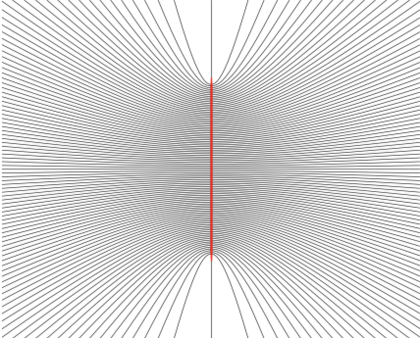

# Electrostatics

As is custom, we'll begin our study of electromagnetism with *electrostatics*. Electrostatics is the study of stationary charges and the forces they exert on each other. From this simple setup we'll see that many of the important concepts of electromagnetism arise, including fields, potentials, and eventually Maxwell's equations. In this and future chapters, we'll define the electric field and use an increasingly intricate set of mathematical tools to solve increasingly complex problems.

We can approach the subject in several ways, for instance by stating Maxwell's equations as fact and studying their implications, or by starting from special relativity and the principle of least action. Instead we'll bow to historical convention and build the theory empirically, starting from some experimental facts about electrical charges and the forces between them.

## Coulomb's Law

Electrostatic phenomena have been known about for millennia. In Ancient Greek times, it was known that when an amber stone was polished that small objects tended to cling to it via what we now commonly call static electricity or electrostatic attraction. Indeed, the Ancient Greek word for amber is *elektron*, from which we've derive the words *electricity* and even *electron*.

Little else was known about electricity until the 17th century when scientists such as Priestly, Franklin, and Coulomb started to rigorously investigate the properties of charged objects. Within a few decades, the laws of electrostatics were largely worked out, though it took many more decades before they were recast into their modern form.

### Electric Charge

Electrostatics rests on two important facts about nature: the existence of electric charge, and Coulomb's law. First, we postulate that aside from mass, every physical body has associated to it another scalar quantity known as *electric charge*. Electric charge is observed to come in two varieties, which we call *positive* and *negative*. If two charges are of the same sign they repel each other, and if two charges are of the opposite sign they attract each other.

The total charge inside any given region of space is just the sum total of all charges within. If a given region contains some amount of charge $q_1, q_2, \cdots, q_n$, then the total charge $Q$ inside that region is just the sum of each charge,
$$
Q = q_1 + q_2 + \cdots q_n \ .
$$
Since each charge can be positive, negative, or even zero, the total charge can also be positive, negative, or zero.

A fundamental fact about charge is that it's *conserved*. Charge in the universe can't be created or destroyed. If the universe contains a total amount of charge now, it must have had the same charge in the past, and will have the same charge in the future. This is known as *global charge conservation*. Charge isn't just conserved globally however, but also *locally*. That is, in any given region of space no matter how small, the only way the total charge in that region can change is if it flows into or out of that region via an *electric current*. This is known as *local charge conservation*, which we'll discuss in greater detail in later chapters.

Today, we know more about the properties of charge than was known at the time of Coulomb. This is largely due to the gradual discovery of atomic theory in the 19th and early 20th centuries. The idea that objects were composed of atoms is very old, going all the way back to Democritus in the 5th century BC. However, this idea wasn't taken seriously by the scientific community until Dalton postulated the idea again around the start of the 19th century. Indeed, Dalton is the one who coined the term *atom* from the Ancient Greek word *atomos*, meaning *indivisible*. As the 19th century progressed, more and more evidence grew to support the atomic hypothesis, eventually culminating in the discoveries of the electron by Thompson and the nucleus by Rutherford in the early 20th century. From these discoveries, quantum theory was introduced to explain the behavior of atoms, which ultimately culminated in the laws of quantum mechanics and eventually the Standard Model of particle physics we have today.

While it wasn't known at the time the laws of electrostatics were first written down, nowadays we know that charge is *quantized* in units of a fundamental unit of charge, usually denoted $e$, where
$$
e \approx 4.8 \cdot 10^{-10} \ \text{esu} \approx 1.6 \cdot 10^{-19} \ \text{C} \ .
$$
This means every charge we observe in nature, apart from one minor exception, is some integer multiple of $e$. We'll discuss the units of charge in more detail below.

Any macroscopic material we observe in nature is made of *atoms*. Each atom contains some number of negatively-charged *electrons* that orbit a *nucleus* containing some number of positively-charged *protons* and charge-neutral *neutrons* held together by a force much stronger than electric forces, known as the *strong force*. All electrons and protons in nature have exactly the same absolute value of charge, namely the fundamental charge $e$. The proton has charge $+e$, while the electron has charge $-e$.

In most cases, a given atom will contain the same number of electrons as protons, making that atom charge neutral. This means when we observe a charged material in nature it's because of one or two reasons. First, each atom could gain or lose one or more electrons through *ionization*. When this happens, the lost electron could attach to another atom, or in the case of metals or plasmas remain unattached and flow freely through the material. Second, the electron orbits could become *polarized* in response to some external field, causing each atom to have a slight charge pointing in some particular direction.

In the vast majority of everyday cases, the materials we observe are either charge neutral or very close to it. This explains why we don't tend to see objects flying around through space attracting or repelling each other at high speeds, and also why gravity tends to dominate electrical forces at macroscopic scales. When we do observe a charged material it's usually because some of the surface atoms have become ionized via friction, creating a slight but measurable amounts of charge.

Charge is a universal property of nature. It doesn't just apply to materials made of atoms, but all particles observed in nature. According to the Standard Model of particle physics, all particles must be either one of the following fundamental particles or some composition of them.

In this figure, all of the known fundamental particles of nature are shown along with their masses, charge, and spin, with the charge shown in units of $e$. For example, the electron, muon, and tau particle are all fundamental particles with charge $-e$. The photon, or *light*, is charge neutral, and so is the gluon and Higgs boson. Notice that the *quarks* don't have integer units of charge like we said they should. The reason for this is that protons and neutrons aren't fundamental particles. Each is composed of exactly three quarks, and those quarks *must* satisfy the condition that their total charge is an integer multiple of $e$. This isn't a problem however, since as far as we know quarks are always *confined* inside their respective proton or neutron, meaning we can never in practice directly measure the charge of a single quark, only infer it.

### Coulomb's Law

Next, we postulate that the force between charged objects is given by *Coulomb's Law*. Fundamentally, this law says that charges of like sign *repel* each other and charges of opposite sign *attract* each other, and this force of attraction or repulsion obeys an inverse square law analogous to that of Newton's law of gravitation between masses.

More formally, we deduce the following facts as given from experiment:

- The force between the two stationary charges depends linearly on the magnitude of each charge. The larger the magnitude, the stronger the force between them.
- The force obeys an inverse square law nature similar to gravity. That is, the strength of the force between the two charges varies with the inverse square of the distance between them.
- As with gravity, the force is directed along the line of force joining the two charges.
- The force is *attractive* if the two bodies have charges of *opposite* sign, and *repulsive* if the two bodies have charges of the *same* sign. If either body has zero charge, then there is no force between them.

Let's now formulate this as a mathematical law. Suppose two stationary charges $q_1$ and $q_2$ are located at fixed positions in space $\mathbf{x}_1$ and $\mathbf{x}_2$ respectively. Then the force $\mathbf{F}_{12}$ charge $q_1$ experiences due to charge $q_2$ is given by
$$
\mathbf{F}_{12} = k_e \frac{q_1 q_2}{r_{12}^2} \mathbf{e}_{12} \ ,
$$
where $r_{12} \equiv |\mathbf{x}_1 - \mathbf{x}_2|$ is the distance between the charges and $\mathbf{e}_{12}$ is the unit vector in the $\mathbf{x}_1 - \mathbf{x}_2$ direction,
$$
\mathbf{e}_{12} \equiv \frac{\mathbf{x}_1 - \mathbf{x}_2}{|\mathbf{x}_1 - \mathbf{x}_2|} \ .
$$
This formula captures all of the observations made by Coulomb. Since $\mathbf{F}_{12} \propto q_1$ and $\mathbf{F}_{12} \propto q_2$, the force depends linearly on each individual charge. Since $\mathbf{F}_{12} \propto 1/r_{12}^2$, the force is inversely proportional to the squared distance between the charges. Since $\mathbf{F}_{12} \propto \mathbf{e}_{12}$, the force is directed along the line joining the two charges. If $q_1 q_2 > 0$ then the force between them is positive, meaning charges with like sign repel each other, and if $q_1 q_2 < 0$ then the force between them is negative, meaning charges of opposite sign attract each other. Last, if either $q_1$ or $q_2$ is zero then there is no electrostatic force between the two charges.

From Coulomb's law and the general properties of forces we can immediately deduce a few important facts:

- The Coulomb force is *conservative* since $\mathbf{F}_{12}$ depends only on the positions of the charges, not their velocities. In particular, this means we can define a potential energy $U$ such that $\mathbf{F}_{12} = -\nabla_1 U$, where $U$ is given by
  $$
  U(\mathbf{x}_1, \mathbf{x}_2) = k_e \frac{q_1 q_2}{r_{12}} \ .
  $$

- The Coulomb force is a *central force*, since $\mathbf{F}_{12}$ depends only on the relative distance $r_{12}$. . This means $U = U(r_{12})$.

- The force of charge $q_1$ on charge $q_2$ is equal and opposite to the force of $q_2$ on $q_1$, with $\mathbf{F}_{21} = -\mathbf{F}_{12}$.

- Since Coulomb's law is a statement about forces, and forces are vectors, it obeys the *principle of superposition*. This means the net Coulomb force on any one charge due to any set of other charges is just the vector sum of the Coulomb force on that charge due to each other individual charge. For example, the total force on charge $q_1$ due to $n$ other charges $q_2, q_3, \cdots, q_n$ is given by the vector sum of each individual force $\mathbf{F}_{1i}$ on $q_1$ due to each other charge $q_i$,

$$
\mathbf{F}_{1} = \mathbf{F}_{12} + \mathbf{F}_{13} + \cdots + \mathbf{F}_{1n} \ .
$$

Note that strictly speaking Coulomb's Law as stated only holds between *point charges*. That is, we implicitly have assumed that the charge of each object brought into contact can each be localized at a single point. They can't be diffused over the object in some non-uniform way. This of course is an abstraction. For simple electrostatic bodies this is a decent assumption to make, but for more complicated bodies it is not. We'll see how to modify Coulomb's law to deal with extended distributions of charge soon.

Also note that the requirement that the charges be stationary with respect to each other is important. That is, Coulomb's law requires that the difference $\Delta \mathbf{v}$ in velocities between the two charges is zero. If it's not the law will fail for a couple of reasons. First, moving charges also have magnetic forces acting on them that we're not accounting for. Second, due to relativistic effects there are correction terms in powers of $\Delta \mathbf{v}$ that we're ignoring. We'll discuss the forces on moving charges in electrodynamics.

### Units

We haven't yet said anything about the units of charge. In mechanics one can assign units to every mechanical quantity using only units of mass, distance, and time. In electromagnetism however, we now have the freedom to choose the dimensions of charge by fixing the dimensions of the proportionality constant $k_e$ in Coulomb's law. Notice that the product $k_e q_1 q_2$ must necessarily have dimensions of force times area for the law to be dimensionally consistent, or
$$
[k_e] [q]^2 = [F] [L]^2 \ .
$$
Thus, assigning dimensions to $k_e$ is essentially equivalent to specifying what the dimensions of charge should be. As we described in the previous chapter, there are different conventions for doing this, each corresponding to a different system of units. 

In Gaussian units, which are the units we will use in this course, we choose $k_e$ to be dimensionless by setting $k_e \equiv 1$. From the dimensional relation above, this implies that charge must then have dimensions of $[q] = [L] [F]^{1/2}$. In these units, we call the base unit of charge the *electrostatic unit* or *esu*, where evidently $1 \ \text{esu} \equiv \sqrt{\text{dyne} \cdot \text{cm}^2}$. That is, one esu of charge is defined as the amount of charge such that when two charges of one esu are placed a distance of one centimeter apart the force on them is exactly one dyne. In these units, Coulomb's law takes the especially simple form
$$
\mathbf{F}_{12} = \frac{q_1 q_2}{r_{12}^2} \mathbf{e}_{12} \ ,
$$
where it's necessarily understood that charge is measured in esu, distances in centimeters, and forces in dynes.

While Gaussian units are very convenient to study the theory of electromagnetism, they are unfortunately not the units usually used in the lab, largely for historical reasons. In the lab one generally uses SI units. In these units the dimension of charge isn't tied to mechanical units at all, but instead becomes a standalone unit. One defines a new constant $\varepsilon_0$, which is anachronistically called the *permittivity of free space*, where $\varepsilon_0 \approx 8.854 \cdot 10^{-12} \ \text{N}/\text{A}^2$, and sets
$$
k_e \equiv \frac{1}{4\pi\varepsilon_0} \approx 8.987 \cdot 10^9 \ \frac{\text{A}^2}{N} \ .
$$
The unit $A$ is defined to be a new fundamental unit known as the *Ampere*, often abbreviate *amp*. The Ampere is the SI unit of electric current, or charge per unit time. From the Ampere, one then defines the base unit of charge to be the *Coulomb*, where $1 \ \text{C} \equiv 1 \ \text{A} \cdot \text{s}$. In these units, Coulomb's law then takes on the somewhat cumbersome form
$$
\mathbf{F}_{12} = \frac{1}{4\pi\varepsilon_0} \frac{q_1 q_2}{r_{12}^2} \mathbf{e}_{12} \ ,
$$
where it's necessarily understood that charge is measured in Coulomb, distances in meters, and forces in Newtons. Since the dimensions are incompatible, one can't strictly speaking convert charges between the two unit systems. Apart from their dimensions though their numerical values can still be compared. In this sense we can say that $1 \ \text{esu} \approx 3.3 \cdot 10^{-10} \ \text{C}$. When converting between Gaussian and SI units we'll frequently show unit conversions for some quantity in this manner, even though it should always be understood that a given quantity may have different dimensions in the two systems of units.

To get a feel for the scale of everyday charges, the static electricity between two large objects rubbed together may produce a charge of a few $\mu \text{C}$, or $\sim 10^4 \ \text{esu}$. The amount of charge in a bolt of lightning may be as high as $15-350 \ \text{C}$, or $\sim 10^{5}-10^{6} \ \text{esu}$. A modern smartphone battery can hold a huge charge of $10 \ \text{kC}$, or $\sim 10^{8} \ \text{esu}$. Indeed, charge in everyday settings can range from very small to very large, making it difficult for any chosen unit of charge to seem natural.

Coulomb's law has been used to establish the limits on the validity of classical electromagnetism. Experiments and observations have well established that Coulomb's law is highly accurate for distance scales at all orders of magnitude, with the loan exception being very small distances much smaller than the atom. When distance scales get down to around $10^{-13} \ \text{cm}$, the laws of classical electromagnetism finally break down and a quantum description is needed. Classical electromagnetism is thus an extremely precise description of nature for any distance scale larger than this, even on scales as large as the distance of the universe.

### Conductors and Insulators

Even though all macroscopic objects are composed of atoms, they don't all behave the same. In electromagnetism, we find it useful to separate macroscopic materials into two broad categories that encapsulate much of how they interact with electromagnetic forces, known as *conductors* and *insulators*. Conductors are strong conductors of electric current. Insulators are the polar opposite of conductors, weak conductors of electric current.

At an atomic level, the difference between conductors and insulators lies in whether they have *free electrons*, or electrons not attached to any given atom that are allowed to move freely throughout the material. Conductors typically have many free electrons while insulators have few if any. The canonical examples of conductors are *metals* like iron, copper, or gold. The canonical examples of insulators are non-metallic materials glass, quartz, or rubber. 

There are also materials that act as conductors in some settings but insulators in others. These are known as *semiconductors*. The canonical example of a semiconductor is silicon, which is the material used to build most modern computer chips. While semiconductors are very important, particularly in chip design, we won't spend much time talking about them in this course, since understanding when they conduct and when they don't requires physics well beyond the scope of electromagnetism.

### Comparison with Gravity

It's worth taking a minute to ask how the electrostatic and gravitational forces between two objects compare to each other. After all, in typical lab settings it seems like gravity is much more powerful than electrostatic forces. We could thus be led to the conclusion that gravity is a much stronger force than the electrostatic force, but it turns out this isn't the case.

We'll first restate Coulomb's law. If two charges $q_1$ and $q_2$ are separated by some distance $r_{12}$, the electrostatic force strength $F_e$ between them is given (in Gaussian units) by
$$
F_e = \frac{q_1 q_2}{r_{12}^2} \ .
$$
However, these charges will also have mass, meaning there will be a gravitational attraction between them as well given by Newton's law of gravitation. If the first charge has a mass $m_1$ and the second charge has a mass $m_2$, the gravitational force strength $F_g$ between them will be
$$
F_g = G \frac{m_1 m_2}{r_{12}^2} \ ,
$$
where $G \approx 6.7 \cdot 10^{-8} \ \text{dyne} \cdot \text{cm}^2 / \text{g}^2$ is Newton's gravitational constant.

Notice that Coulomb's law and Newton's law of gravitation have exactly the same form except with $q_1 q_2 \leftrightarrow G m_1 m_2$. This means if we look at the strength ratio $F_e / F_g$ between the two forces the $1/r_{12}^2$ dependence cancels, and we have
$$
\frac{F_e}{F_g} = \frac{q_1 q_2}{G m_1 m_2} \ .
$$
To get a feel for this ratio, let's consider two specific examples. First, let's consider the case of two interacting electrons. Since each electron has a of charge $-e \approx -4.8 \cdot 10^{-10} \ \text{esu}$ and a mass $m_e \approx 9.1 \cdot 10^{-28} \ \text{g}$, we have
$$
\frac{F_e}{F_g} = \frac{(-4.8 \cdot 10^{-10})^2}{(6.7 \cdot 10^{-8}) (9.1 \cdot 10^{-28})^2} \approx 4 \cdot 10^{42} \ .
$$
Thus, for two interacting electrons, the electrostatic force is 42 orders of magnitude greater than their gravitational force. For all practical purposes, when dealing with electrons the electrostatic force is the only force that matters. We can pretty much neglect their gravitational force completely.

This may seem counterintuitive. It's not what we see in everyday experience. To that end let's consider the completely different case of two orbiting planets. We'll assume they both have the properties of the Earth. Roughly speaking, the Earth (when including its atmosphere) is slightly negatively charged, with a charge of about $-10^5 \ \text{esu}$. Since the mass of the Earth is about $6 \cdot 10^{27} \ \text{g}$, for two interacting Earth-like planets we have
$$
\frac{F_e}{F_g} = \frac{(-10^5)^2}{(6.7 \cdot 10^{-8}) (6 \cdot 10^{27})^2} \approx 2.5 \cdot 10^{-34} \ .
$$
Thus, for two orbiting planets, the gravitational force is about 34 orders of magnitude greater than their electrostatic force. For all practical purposes, when dealing with planets the gravitational force is the only one that matters, and we can neglect the electrostatic force completely. This explains why at the atomic level we can usually ignore gravity and focus only on electrostatic forces, and why at the astronomical level we can usually ignore electrostatics and focus only on gravitational forces. 

Evidently, the point where gravitational forces start to overcome electrostatic forces occurs when $|q_1 q_2| \sim G m_1 m_2$. For comparably sized masses and charges, this transition point occurs when
$$
|q|/m \sim \sqrt{G} \approx 3863 \ \text{esu}/\text{g} \ ,
$$
where $|q|/m$ is known as the *charge to mass ratio*. It occurs quite often in whenever electromagnetism and mechanics interact. When $|q|/m$ is large the electrostatic forces dominate, and when $|q|/m$ is small gravitational forces dominate. For example, the charge to mass ratio of the electron is $e/m_e \approx 5 \cdot 10^{17} \ \text{esu}/\text{g}$, which is clearly much larger than $\sqrt{G}$.

## Electric Field

In some sense our understanding of electrostatics is already finished. All of electrostatics is already incapsulated in Coulomb's law. However, we'll find it convenient and insightful to recast Coulomb's law in terms of other quantities that turn out to be much more useful to work with than forces. Indeed, much of the rest of electrostatics is just recasting Coulomb's law in other forms that each illuminate different aspects of the theory. First, we'll recast the law in terms of electric fields.

### Definition

If $q$ and $q'$ are two point charges located at positions $\mathbf{x}$ and $\mathbf{x}'$ respectively, the force $\mathbf{F}$ on $q$ due to $q'$ is given by Coulomb's law,
$$
\mathbf{F} = qq' \frac{\mathbf{x} - \mathbf{x}'}{|\mathbf{x} - \mathbf{x}'|^3} \ .
$$
Notice if we divide both sides by $q$ we get a vector field $\mathbf{E} = \mathbf{E}(\mathbf{x})$ that depends only on $q'$,
$$
\mathbf{E}(\mathbf{x}) \equiv \frac{\mathbf{F}}{q} = q' \frac{\mathbf{x} - \mathbf{x}'}{|\mathbf{x} - \mathbf{x}'|^3} \ .
$$
This vector field we call the *electric field* or *E-field* generated by $q'$. Since $\mathbf{E}$ doesn't depend on $q$, we can think of it as a vector field, taking on a value at each $\mathbf{x}$ in space. By convention, we call $\mathbf{x}$ the *field point* and $\mathbf{x}'$ the *source point*. Notice the source point will always be fixed in space in electrostatics since the location of $q'$ is assumed to be stationary, while the field point is free to move around in space depending on which specific point we're interested in measuring the value of the E-field.

By definition, the electric field has dimensions of force per unit charge, or units of $\text{dyne}/\text{esu}$ in Gaussian units. By convention though, we state the units of electric field in terms of $\text{statvolt}/\text{cm}$ in Gaussian units, where a *statvolt* is defined as one erg per esu. Of course, one statvolt per centimeter is exactly one dyne per esu. It's just a convention. Similarly, in SI units, the units of electric field are conventionally given in $\text{V}/\text{m}$, where $\text{V}$ is the *volt*, defined as one Joule per Coulomb. The conversion factor between volts and statvolts is $1 \ \text{statvolt} \approx 300 \ \text{V}$, so $1 \ \text{statvolt}/\text{cm} \approx 3 \cdot 10^4 \ \text{V}/\text{m}$.

Since forces obey the principle of superposition and E-fields are just forces per unit charge, E-fields must also obey the principle of superposition. That is, if $q_1', q_2', \cdots, q_n'$ are $n$ point charges located at positions $\mathbf{x}_1', \mathbf{x}_2', \cdots, \mathbf{x}_n'$ respectively, then total E-field due to the combined set of charges is given by the vector sum
$$
\mathbf{E} = \mathbf{E}_1 + \mathbf{E}_2 + \cdots \mathbf{E}_n \ ,
$$
where each $\mathbf{E}_i$ is what the E-field due to each individual charge $q_i'$ would be in the absence of any other charges, i.e.
$$
\mathbf{E}_i(\mathbf{x}) = q_i' \frac{\mathbf{x} - \mathbf{x}_i'}{|\mathbf{x} - \mathbf{x}_i'|^3} \ .
$$
The total E-field of the combined set of charges is evidently then
$$
\mathbf{E}(\mathbf{x}) = \sum_{i=1}^n q_i' \frac{\mathbf{x} - \mathbf{x}_i'}{|\mathbf{x} - \mathbf{x}_i'|^3} \ .
$$
When another charge $q$ is brought in and placed at some field point $\mathbf{x}$, it will feel a force due to the E-field given by
$$
\boxed{
\mathbf{F} = q \mathbf{E}
} \ .
$$
Notice that this is completely equivalent to Coulomb's law. In this sense, the physics is exactly the same. So why would we bother to introduce a new field if the physics is the same? The reason is that it allows us to assign a different *interpretation* to Coulomb's law. Instead of saying that two charges interact at a distance to produce a force, we think of one charge as producing an E-field at all points in space, and the other charge interacts with the *field* to produce a force instead of with the other charge directly.  The benefit of this *field interpretation* is it allows us to think of Coulomb's law as being *local*. That is, the force felt by a charge is due to its interaction with something nearby, the E-field, rather some far away charge via a so-called "action at a distance".

Indeed, pretty much all of modern physics is cast in terms of local *field theories* like this. Nowadays, we think of these fields as being fundamental physical objects, not just mathematical conveniences. A major benefit of such a local theory is that it allows us to recast many physical laws in terms of differential equations, which makes solving more complicated problems much easier.

As a brief aside, notice that Newton's law of gravitation looks almost identical to Coulomb's law. This means we can define a field interpretation for gravity in an almost identical manner to electrostatics, except with charges replaced by masses. In this setting, the analogue of the E-field is the *gravitational field* $\mathbf{g}$. If a mass $m$ is brought into the presence of a gravitational field, it feels a force $\mathbf{F} = m\mathbf{g}$. Indeed, much of the theory of electrostatics that we'll develop in the next few chapters can be mapped almost one-to-one onto the theory of Newtonian gravity as well.

##### Example: Physical Dipole

Suppose two stationary charges of opposite sign $\pm q$ are separated by a distance $d$ along some axis. A charge configuration of this form is known as a *physical dipole*. We'll let $\mathbf{x}_+$ denote the position of the $+q$ charge and $\mathbf{x}_-$ the position of the $-q$ charge. 

By Coulomb's law, the E-field $\mathbf{E}_+$ created by the positive charge $+q$ alone is given by
$$
\mathbf{E}_+(\mathbf{x}) = q \frac{\mathbf{x} - \mathbf{x}_+}{|\mathbf{x} - \mathbf{x}_+|^3} \ .
$$
Similarly, the E-field $\mathbf{E}_-$ created by the negative charge $-q$ alone is given by
$$
\mathbf{E}_-(\mathbf{x}) = -q \frac{\mathbf{x} - \mathbf{x}_-}{|\mathbf{x} - \mathbf{x}_-|^3} \ .
$$
By the superposition principle then, the combined E-field of the physical dipole is given by their vector sum,
$$
\mathbf{E}(\mathbf{x}) = \mathbf{E}_+(\mathbf{x}) + \mathbf{E}_-(\mathbf{x}) = q \left[\frac{\mathbf{x} - \mathbf{x}_+}{|\mathbf{x} - \mathbf{x}_+|^3} + \frac{\mathbf{x} - \mathbf{x}_-}{|\mathbf{x} - \mathbf{x}_-|^3}\right] \ .
$$
In this general form it's hard to understand what's going on. To that end, let's make the specific assumption that the charges both lie along the $z$-axis, with $+q$ located at position $\mathbf{x}_+ = (d/2) \mathbf{e}_z$ and $-q$ located at position $\mathbf{x}_- = -(d/2) \mathbf{e}_z$. Suppose further that we're interested only in field points $\mathbf{x}$ that lie directly along the $z$-axis, so that $\mathbf{x} = z\mathbf{e}_z$. Then we have
$$
\mathbf{x} - \mathbf{x}_+ = \left(z - \frac{d}{2}\right) \mathbf{e}_z \quad , \quad \mathbf{x} - \mathbf{x}_- = \left(z + \frac{d}{2}\right) \mathbf{e}_z \ .
$$
The distances between the $\mathbf{x}$ and each source point $\mathbf{x}_\pm$ are then just
$$
|\mathbf{x} - \mathbf{x}_+| = \left|z - \frac{d}{2}\right| \quad , \quad |\mathbf{x} - \mathbf{x}_-| = \left|z + \frac{d}{2}\right| \ .
$$
Plugging all of this back into the E-field and simplifying, along the $z$-axis we have
$$
\mathbf{E}(z) = q \left[\frac{z - d/2}{|z - d/2|^3} - \frac{z + d/2}{|z + d/2|^3}\right] \mathbf{e}_z = q \left[\frac{\text{sgn}(z - d/2)}{(z - d/2)^2} - \frac{\text{sgn}(z + d/2)}{(z + d/2)^2}\right] \mathbf{e}_z \ .
$$
For convenience we've introduced the *sign function* $\text{sgn}(x)$, defined by $\text{sgn}(x) = 1$ if $x > 0$ and $\text{sgn}(x) = -1$ if $x < 0$. 

Notice that for field points along the $z$-axis the E-field vectors will also point along the $z$-axis. Since the E-field is a vector it'll have both a magnitude and direction. The direction of the E-field at each $z$ depends on the signs of $z - d/2$ and $z + d/2$. 

If $z > d/2$ the E-field vector will point *upward* since $\text{sgn}(z - d/2) = \text{sgn}(z + d/2) = 1$ and
$$
\frac{1}{(z - d/2)^2} > \frac{1}{(z + d/2)^2} \ .
$$
If $z < -d/2$ the E-field vector will also point *upward* since $\text{sgn}(z - d/2) = \text{sgn}(z + d/2) = -1$ and
$$
\frac{-1}{(z - d/2)^2} > \frac{-1}{(z + d/2)^2} \ .
$$
In both cases, the magnitude of the E-field vector $E(z) = |\mathbf{E}(z)|$, called the *field strength*, will be given by the absolute value
$$
E(z) = q \left|\frac{1}{(z - d/2)^2} - \frac{1}{(z + d/2)^2}\right| \ .
$$
Meanwhile, if $-d/2 < z < d/2$ the E-field vector will point *downward* since $\text{sgn}(z - d/2) = -1$, $\text{sgn}(z + d/2) = 1$, and
$$
\frac{-1}{(z - d/2)^2} < \frac{1}{(z + d/2)^2} \ .
$$
In this case, the field strength will instead be given by
$$
E(z) = q \left|\frac{1}{(z - d/2)^2} + \frac{1}{(z + d/2)^2}\right| \ .
$$
For example, at the origin $z=0$ we'd have $E(z) = 8q/d^2$, with a downward-pointing E-field vector
$$
\mathbf{E}(0) = -\frac{8q}{d^2} \mathbf{e}_z \ .
$$
Notice that we can think of the E-field as pointing *away* from the positive charge and *into* the negative charge. This is a general fact, which we'll say more about in the next section.

Finally, let's look at what happens in the *far field limit*, when $r = |z| \gg d$. What should we expect to happen in this limit? Intuitively, one might expect that if we're far away from the source charges we can treat them both as a single point charge and use Coulomb's law to conclude that $E(z) \sim 1/r^2$. But this isn't the case for the dipole. To see why, let's do a binomial expansion of the field strength $E(z)$ in the case that $r > d/2$. We have
$$
\begin{align*}
E(z) &= q \left|\frac{1}{(z - d/2)^2} - \frac{1}{(z + d/2)^2}\right| = \frac{q}{z^2} \left|\frac{1}{(1 - d/2z)^2} - \frac{1}{(1 + d/2z)^2}\right| \\
&\approx \frac{q}{z^2} \left|(1 + d/z) - (1 - d/z) \right| \approx \frac{qd}{2r^3} \ .
\end{align*}
$$
Evidently, in the far field limit the E-field falls off like $1/r^3$, not like $1/r^2$. But why did this happen? The reason is because if we did indeed treat both charges as a single point charge then we have to use their *net charge*, and their net charge is $q - q = 0$. Said differently, the E-field of a dipole has no $1/r^2$ dependence because this term vanishes when we expand the E-field in powers of $d/r$. We thus have to go to the next term, which falls off like $1/r^3$. This behavior is characteristic of a dipole. In future chapters we'll show a systematic way to do an expansion of this kind and show that any field that falls off like $1/r^3$ *must* be that of a dipole.

### Field Lines

As with any vector field, it's best to visualize the behavior of electric fields using field lines. The field lines represent the direction of the E-field at each point in space. This means if an infinitesimal test charge $q$ were placed at rest at some point $\mathbf{x}$ in an external E-field, we'd expect it to feel a force $\mathbf{F} = q\mathbf{E}(\mathbf{x})$, causing the charge to move along the field line passing through the point $\mathbf{x}$.

Unlike with general vector fields, sketching the field lines for electric fields is usually fairly simple, especially when dealing with point charges. To see why, suppose $q$ is a point charge located at the origin, so that $\mathbf{x}' = \mathbf{0}$. Then its E-field would just be
$$
\mathbf{E}(\mathbf{x}) = q \frac{\mathbf{x}}{|\mathbf{x}|^3} = \frac{q}{r^2} \mathbf{e}_r \ .
$$
Evidently, the direction of $\mathbf{E}(\mathbf{x})$ will always be radial from the origin, meaning its field lines will be radial from the origin. If we sketched these field lines in two dimensions, we'd get a field line plot like the one shown below.

Whether the field lines point in or out of the origin depends on the sign of the charge $q$, with the field lines flowing *outward* from the charge if $q$ is *positive*, and flowing *inward* toward the charge if $q$ is *negative*. This will also be true for any point charge located at some arbitrary point $\mathbf{x}'$, except now the field lines will point radially outward or inward from the point $\mathbf{x}'$ instead of the origin.

As with any vector field, the *density* of field lines will represent the strength of the field at any given point. This provides us with an intuitive interpretation of what the E-field represents. It's the number of field lines per unit area around a given point. In 3-dimensional space, it would be the number of field lines per unit volume, or *flux density*, around a given point.

Since the strength of the field at any fixed point is proportional to the charge, the field lines emanating from a given charge $q$ should be proportional to the size of $q$. For example, if we choose to draw $k$ field lines outward from a charge of size $q = +1$, then we should draw $2k$ field lines outward from a charge of size $q = +2$.

Now suppose we have $n$ distinct point charges instead of just one. As mentioned above, the E-field of this combined set of charges will be given by the vector sum of each individual E-field $\mathbf{E}_i(\mathbf{x})$,
$$
\mathbf{E}(\mathbf{x}) = \sum_{i=1}^n q_i \frac{\mathbf{x} - \mathbf{x}_i}{|\mathbf{x} - \mathbf{x}_i|^3} \ .
$$
Provided we're close to any one of these charges, say $q_j$. Since each $\mathbf{E}_i(\mathbf{x})$ falls off rapidly like $1/|\mathbf{x} - \mathbf{x}_i|^2$, when $\mathbf{x} \approx \mathbf{x}_j$ the combined E-field $\mathbf{E}(\mathbf{x})$ will be approximately that of $\mathbf{E}_j(\mathbf{x})$,
$$
\mathbf{E}(\mathbf{x}) \approx \mathbf{E}_j(\mathbf{x}) = q_j \frac{\mathbf{x} - \mathbf{x}_j}{|\mathbf{x} - \mathbf{x}_j|^3} \ .
$$
From this we can conclude that the field lines around each source point $\mathbf{x}_i$ will also be radial very close to $q_i$.

Finally, since $\mathbf{E}(\mathbf{x})$ is continuous for each $\mathbf{x} \neq \mathbf{x}_i$, we must conclude that the field lines will also be continuous at any point away from the point charges. Moreover, the field lines can never cross each other since at each $\mathbf{x}$ we can have only one E-field vector.

We can thus summarize the behavior of electric field lines for discrete point charges with the following rules:

- A small test charge placed at rest in the presence of an electric field will follow the direction of the field line at that point.
- Around each point charge the field lines will point radially inward or outward from the location of the point charge.
- The density of field lines emanating from a given point charge should be proportional to the size of the charge.
- The field lines will always start at positive charges and terminate either at negative charges or infinity.
- The field lines must be continuous at every point in space except right at the point charges.
- The field lines can never cross each other except where they meet at a point charge.

Using these rules we can quickly sketch the field lines of arbitrarily complicated configurations of point charges, and hence get a quick intuitive idea of how the field for that configuration behaves even without doing any math. For example, the field lines of the physical dipole example above would look something like the plot below. The $+q$ charge is represented in red and the $-q$ charge is represented in black.

If the charges in this example were instead the same sign, for example both positive, we'd instead get a field like the one below. Notice that now the field lines from one charge never flow into another since they're both the same sign. This is just a reflection of the statement that like charges repel and opposite charges attract.

If the charges were of opposite sign but one was larger than the other, for example if $q_+ = +4$ and $q_- = -1$, we'd get a much more different looking field with field lines something like this. In fact, this field will fall off like $1/r^2$ instead of like $1/r^3$ like the ordinary physical dipole does, since the total net charge is now $q = +3$ instead of zero.

If we had four charges of the same size but alternating signs arranged in an a square we'd get field lines that look something like shown below. This sort of charge configuration is known as a *physical quadrupole*.

Hopefully by now we get the idea. Field lines are quite easy to draw for an arbitrary charge configuration, at least approximately. From now on, when working out the E-field of some distribution of charges, it's a good idea to first sketch the field lines to get an idea of how the field should intuitively behave. We can then calculate the field and make sure that it behaves as expected. If the calculated field doesn't have the same field line behavior, we probably made a mistake in the calculation.

### Charge Distributions

In classical electromagnetism we find ourselves more often dealing not with a small number of discrete charges, but with macroscopic objects made up of a huge number of charges, for example conducting spheres or long wires of charge. When this is the case it's convenient to model such a *charge distribution* as a continuum of charge. This is an abstraction of course. After all, all macroscopic objects are made of atoms, each with some discrete amount of charge. However, provided we're interested in the behavior of fields at distances much larger than the atomic scale, which is typically the case, modeling the charges as a continuum is a valid approximation.

To that end, suppose a charged, stationary, macroscopic object takes up some volume $\mathcal{V}$ in space. Inside $\mathcal{V}$, each infinitesimal volume $d^3 \mathbf{x}'$ will have some infinitesimal amount of charge $dq'$. We can relate the two by defining a *charge density* $\rho(\mathbf{x}')$ by
$$
dq' = d^3 \mathbf{x}' \ \rho(\mathbf{x}') \ .
$$
Note that the terms *charge density* and *charge distribution* are frequently used interchangeably to refer to this same function.

Loosely speaking, we can think of the charge density $\rho = \rho(\mathbf{x}')$ as the differential charge per unit volume, or
$$
\rho = \frac{dq}{dV} \ .
$$
This means the units of charge density would be $\text{esu}/\text{cm}^3$ in Gaussian units. Note that $\rho$ isn't a "proper" density function in the mathematical sense since it's not non-negative. Since $q$ can be positive or negative, $\rho$ can take on any real value.

The total amount of net charge $q$ contained inside the macroscopic object will then be given by the volume integral
$$
q = \int_\mathcal{V} d^3\mathbf{x}' \ \rho(\mathbf{x}') \ .
$$
By convention, we typically extend the charge density function to cover all space by defining $\rho(\mathbf{x}') = 0$ for any $\mathbf{x}'$ not in $\mathcal{V}$. This means we can and will often omit the $\mathcal{V}$ from integrals and implicitly it's non-zero only when $\mathbf{x}'$ is in $\mathcal{V}$.

Now, for a continuous charge distribution each $dq'$ will give rise to an infinitesimal E-field $d\mathbf{E}(\mathbf{x})$ given by
$$
d\mathbf{E}(\mathbf{x}) = dq' \frac{\mathbf{x}-\mathbf{x}'}{|\mathbf{x}-\mathbf{x}'|^3} \ .
$$
By the principle of superposition then, the total E-field overall space will then be given by integrating over each $dq'$. In terms of the charge density this means we have
$$
\boxed{
\mathbf{E}(\mathbf{x}) = \int d^3 \mathbf{x}' \ \rho(\mathbf{x}') \frac{\mathbf{x}-\mathbf{x}'}{|\mathbf{x}-\mathbf{x}'|^3} 
}\ .
$$
We've thus managed to recast Coulomb's law into a form that also works for continuous distributions of charge. When a *test charge* $q$ is placed in the presence of some charge distribution, it will feel a force $\mathbf{F} = q\mathbf{E}$, where $\mathbf{E}$ is given by the integral above.

It turns out we can express the E-field for a point charge in terms of this integral as well by using the Dirac delta function. To see why this is the case, suppose a point charge $q$ is placed at position $\mathbf{x}_0$. We can then define a charge density for $q$ by
$$
\rho(\mathbf{x}') = q \delta(\mathbf{x}' - \mathbf{x}_0) \ .
$$
If we plug this into the integral above, the delta function will pick out the point $\mathbf{x}_0$ from the integral and give
$$
\mathbf{E}(\mathbf{x}) = \int d^3 \mathbf{x}' \ q \delta(\mathbf{x}' - \mathbf{x}_0) \frac{\mathbf{x}-\mathbf{x}'}{|\mathbf{x}-\mathbf{x}'|^3} = q \frac{\mathbf{x}-\mathbf{x}_0}{|\mathbf{x}-\mathbf{x}_0|^3} \ ,
$$
which is the same E-field for a point charge given before. In this way, we can use the delta function to easily convert integrals into sums or vice versa, and thus avoid the need to state the formulas for discrete and continuous charge distributions separately.

### Line and Surface Charge Distributions

In defining the charge density above, we implicitly assumed that the charges were spread across 3-dimensional space. Sometimes we'll find it convenient to assume the charges are all concentrated along some 1-dimensional *curve* in space, for instance when modeling a wire of charge where the wire has a negligible thickness compared to its length. Other times we'll find it convenient to assume the charges are all concentrated along some 2-dimensional *surface* in space, for instance when modeling a flat sheet of charge where the length and width of the sheet are much larger than its height. In these situations it's thus often much more convenient to define charge distributions in one or two dimensions.

Suppose we have a distribution of charges concentrated along some 1-dimensional curve $\mathcal{C}$ in space. Along each infinitesimal segment $d\ell'$ of the curve there will be some amount of charge $dq'$. We then define the *line charge density* function $\lambda(\mathbf{x}')$ by
$$
dq' = d\ell' \lambda(\mathbf{x}') \ .
$$
To find the total net charge $q$ contained on the curve we need only integrate over each $dq'$ along the curve to get
$$
q = \int_\mathcal{C} d\ell' \lambda(\mathbf{x}') \ .
$$
By Coulomb's law, each charge $dq'$ along the curve will give rise to some E-field $d\mathbf{E}(\mathbf{x})$, where
$$
d\mathbf{E}(\mathbf{x}) = dq' \frac{\mathbf{x}-\mathbf{x}'}{|\mathbf{x}-\mathbf{x}'|^3} \ .
$$
By the principle of superposition, the E-field generated by the entire line charge distribution can be found by integrating along the entire length of the curve to get
$$
\boxed{
\mathbf{E}(\mathbf{x}) = \int_\mathcal{C} d\ell' \ \lambda(\mathbf{x}') \frac{\mathbf{x}-\mathbf{x}'}{|\mathbf{x}-\mathbf{x}'|^3} 
} \ .
$$
The dimensions of line charge density must evidently be charge per unit *length*, or units of of $\text{esu}/\text{cm}$ in Gaussian units.

In an analogous manner, suppose now that we have a distribution of charges concentrated along some 2-dimensional surface $\mathcal{S}$ in space. Along this surface, each infinitesimal patch of area $da'$ will have some amount of charge $dq'$. We then define the *surface charge density* $\sigma(\mathbf{x}')$ by
$$
dq' = da' \sigma(\mathbf{x}') \ .
$$
To find the total net charge $q$ contained on the surface we need only integrate over all $dq'$ along the surface to get
$$
q = \int_\mathcal{S} da' \sigma(\mathbf{x}') \ .
$$
Each charge $dq'$ along the surface will give rise to some E-field $d\mathbf{E}(\mathbf{x})$ according to Coulomb's law. By the principle of superposition, we can thus find the E-field due to the entire surface charge distribution by integrating over the surface to get
$$
\boxed{
\mathbf{E}(\mathbf{x}) = \int_\mathcal{S} da' \ \sigma(\mathbf{x}') \frac{\mathbf{x}-\mathbf{x}'}{|\mathbf{x}-\mathbf{x}'|^3} 
} \ .
$$
The dimensions of surface charge density must evidently be charge per unit *area*, or units of $\text{esu}/\text{cm}^2$ in Gaussian units.

In this course we'll find ourselves frequently needing to go back and forth between densities of different dimension depending on the given problem at hand. For charge densities, the easiest way to do so is to remember the following equivalence,
$$
\int_\mathcal{C} d\ell' \ \lambda(\mathbf{x}') \leftrightarrow \int_\mathcal{S} da' \ \sigma(\mathbf{x}') \leftrightarrow \int_\mathcal{V} d^3\mathbf{x}' \ \rho(\mathbf{x}') \ .
$$
With charge densities now defined in different dimensions we're now finally in a position to work a few problems. Unfortunately, calculating the E-field directly from this integral is usually quite cumbersome, in part due to the fact that we have to solve an for each of the three components of $\mathbf{E}$. In some cases we can do so, particularly if the charge distribution is highly symmetric in some system of coordinates. 

### Examples

We'll now show a few examples of how to calculate the electric field of a continuous charge distribution directly from the integrals given above. We'll focus in particular on three well-known and illustrative examples, the infinite wire of uniform charge, the infinite sheet of uniform charge, and the sphere of uniform charge. We'll see that calculating the E-field directly from the integral is in fact quite cumbersome, since to do so we usually need to rely on the charges having a high degree of symmetry. In later sections and chapters, we'll focus on finding much easier ways to calculate electric fields for more complicated distributions.

##### Example: Infinite wire of uniform charge

Suppose we have a very long, straight conducting wire on which we place a uniform charge per unit length $\lambda$. We'll assume the wire is so long that we can approximate its length as infinite, and that the wire is so thin that we can assume it's a one dimensional line of charge with a constant line charge density $\lambda$. 

To calculate the E-field of this wire, we need to evaluate the line integral
$$
\mathbf{E}(\mathbf{x}) = \int d\ell' \ \lambda(\mathbf{x}') \frac{\mathbf{x}-\mathbf{x}'}{|\mathbf{x}-\mathbf{x}'|^3} \ .
$$
Now, the most important observation we need to get started on this problem is to observe this charge distribution has a cylindrical symmetry to it. Suppose the wire is oriented along the $z$-axis. Since the wire is 1-dimensional, its corresponding E-field must necessarily be azimuthally symmetric, meaning $\mathbf{E}(\mathbf{x}) = \mathbf{E}(\varrho, z)$ in cylindrical coordinates. Next, since $\lambda$ is constant along the wire and the wire is infinitely long, the wire must also be cylindrically symmetric, meaning $\mathbf{E}(\mathbf{x}) = \mathbf{E}(\varrho)$. That is, the E-field can only depend on the field point's radial distance from the wire. Moreover, the E-field must always point in the $\varrho$-direction for this exact same reason, since the $z$-component of any $d\mathbf{E}$ at some point the wire will cancel with the $z$-component of another $d\mathbf{E}$ at some other point on the wire, leaving only the $\varrho$-component to contribute, as shown in the figure below. 

FIGURE

We can thus argue by symmetry alone that we must have
$$
\mathbf{E}(\mathbf{x}) = E(\varrho) \mathbf{e}_\varrho \ .
$$
This means to find $\mathbf{E}(\mathbf{x})$ we only need to evaluate the $\varrho$ component of the integral above, or
$$
E(\varrho) = \mathbf{E}(\mathbf{x}) \cdot \mathbf{e}_\varrho = \int d\ell' \ \lambda(\mathbf{x}') \frac{(\mathbf{x}-\mathbf{x}') \cdot \mathbf{e}_\varrho}{|\mathbf{x}-\mathbf{x}'|^3} \ .
$$
We now need to figure out what the separation vector $\mathbf{x}-\mathbf{x}'$ is. Since all the charges lie on the $z$-axis, we can write each source point $\mathbf{x}'$ as $\mathbf{x}' = z' \mathbf{e}_z$, where $z'$ is the $z$-coordinate of the source point on the wire. Since the field point $\mathbf{x}$ could in principle be any point in space, when written out in cylindrical coordinates we'd in general have
$$
\mathbf{x} = \varrho \mathbf{e}_\varrho + z \mathbf{e}_z \ .
$$
However, we can simplify this a little. Since the wire is infinitely long and the E-field is independent of $z$, it suffices to calculate the E-field in the $xy$-plane since this will be the same E-field for all $z$. We can thus assume without loss of generality that $z = 0$, and write $\mathbf{x} = \varrho \mathbf{e}_\varrho$. This means the separation vector becomes
$$
\mathbf{x}-\mathbf{x}' = \varrho \mathbf{e}_\varrho - z' \mathbf{e}_z \ ,
$$
and hence $(\mathbf{x}-\mathbf{x}') \cdot \mathbf{e}_\varrho = \varrho$. The separation distance $|\mathbf{x}-\mathbf{x}'|$ is then simply
$$
|\mathbf{x}-\mathbf{x}'| = \sqrt{\varrho^2 + z'^2} \ .
$$
Since the wire runs along the $z$-axis and $\lambda$ is constant, we can write $d\ell' \ \lambda(\mathbf{x}') = \lambda dz'$. We thus finally end up with the integral
$$
E(\varrho) = \lambda \int_{-\infty}^\infty dz' \ \frac{\varrho}{(\varrho^2 + z'^2)^{3/2}} \ .
$$
This integral can easily be evaluated via substitution. If we let $u = z'/\varrho$, then $du = dz'/\varrho$, and so we have
$$
\begin{align*}
E(\varrho) &= \lambda \int_{-\infty}^\infty dz' \ \frac{\varrho}{(\varrho^2 + z'^2)^{3/2}} = \frac{\lambda}{\varrho^2} \int_{-\infty}^\infty \frac{dz'}{\left(1 + (z'/\varrho)^2\right)^{3/2}} \\
&= \frac{\lambda}{\varrho} \int_{-\infty}^\infty \frac{du}{(1 + u^2)^{3/2}} = \frac{\lambda}{\varrho} \frac{u}{\sqrt{1 + u^2}} \bigg|_{u=-\infty}^{u=\infty} = \frac{2\lambda}{\varrho}
\ .
\end{align*}
$$
Note that the $u$-integral can be evaluated either by looking it up in a table of integrals, or by substituting $u = \tan\theta$ and reducing the integral to $\int \cos\theta d\theta$. Thus, the E-field of an infinitely long wire of with a uniform charge per unit length $\lambda$ is just
$$
\mathbf{E}(\mathbf{x}) = \frac{2\lambda}{\varrho} \mathbf{e}_\varrho \ .
$$
As expected, the E-field depends only on the radial distance from the wire. If the wire is positively charged, then $\lambda > 0$, which means the field lines will point radially *outward* from the wire. If it's negatively charged, then $\lambda < 0$, which means the field lines will point radially *inward* toward the wire.  Along any radial cross section the field lines will look something like this when $\lambda > 0$.

Perhaps unexpectedly, the field falls off like $1/\varrho$ and not like $1/\varrho^2$ as we might expect from Coulomb's law. Why is this the case? The reason is because we assumed the wire was infinitely long. This means the wire will always appear infinitely long no matter how far we are away from the wire. That is, it'll never look like a point charge no matter how far we are away from it, and only point charges obey Coulomb's law. 

If the wire were finite, which is of course always the case in reality, eventually we would be able to move far enough from the wire that it would behave as a point charge. Here's what its field line plot might look like for some radial cross section. Notice that in the middle of the wire the field is still radial, but near the ends of the wire it changes, leading to so-called *fringe field* behavior.

In this more realistic case the field would indeed fall off like $1/\varrho^2$ far away, in accordance with Coulomb's law. However, near the wire the field would still fall off like $1/\varrho$ at the center of the wire.

##### Example: Infinite sheet of uniform charge

Suppose we have a very large square conducting sheet on which we place a uniform charge per unit area $\sigma$. We'll assume that the sheet is so large that its area is infinite, and that the sheet is so thin that we can neglect its depth and model the sheet as having a 2-dimensional charge distribution with a constant surface density $\sigma$.

FIGURE

To calculate the E-field of this infinite sheet, we thus need to evaluate the surface integral
$$
\mathbf{E}(\mathbf{x}) = \int da' \ \sigma(\mathbf{x}') \frac{\mathbf{x}-\mathbf{x}'}{|\mathbf{x}-\mathbf{x}'|^3} \ .
$$
Now, observe that this sheet also has a symmetry, this time a *planar symmetry*. Since the charge per unit area is uniform across the sheet, the E-field must be the same for any points the same distance above or below the sheet. That is, the E-field at any given point must only depend on the point's distance from the sheet. If we suppose the sheet lies in the $xy$-plane, this means we must have that $\mathbf{E}(\mathbf{x}) = \mathbf{E}(z)$.

What about the direction of the E-field at each $z$ though? It's easy to see that the field must always point in the $z$-direction, since the planar components of the field vector at any $(x',y')$ on the sheet must cancel with the planar components of some other field vector at some other point, leaving only their vector sum in the $z$-direction to contribute. Also, since $\sigma$ is constant, the field lines must always point either away from or into the sheet, with the field lines pointing *outward* if $\sigma > 0$ and *inward* if $\sigma < 0$. Thus, the E-field vectors above the sheet will always point in the opposite direction to the E-field vectors below the sheet.

Mathematically, we can express these arguments by saying by symmetry the E-field must satisfy
$$
\mathbf{E}(\mathbf{x}) = \text{sgn}(z) E(z) \mathbf{e}_z \ ,
$$
where we use $\text{sgn}(z)$ to indicate that the direction of the field below the $xy$-plane is opposite the direction of the field above. 

It thus suffices to compute $E(z)$ for some $z > 0$ above the sheet and we're basically done,
$$
E(z) = \mathbf{E}(\mathbf{x}) \cdot \mathbf{e}_z = \int da' \ \sigma(\mathbf{x}') \frac{(\mathbf{x}-\mathbf{x}') \cdot \mathbf{e}_z}{|\mathbf{x}-\mathbf{x}'|^3} \ .
$$
Now, since the sheet is infinite, it suffices to compute $E(z)$ at the point $(0,0,z)$, since by symmetry $E(z)$ will be the same for any other point $(x,y,z)$ at the same height. This means we can without loss of generality set $\mathbf{x} = z \mathbf{e}_z$. Since the source points $\mathbf{x}'$ are in the $xy$-plane at some arbitrary point $(x',y',0)$, we have
$$
\mathbf{x}' = x' \mathbf{e}_x + y' \mathbf{e}_y \ .
$$
However, we'll see it's more convenient for the integration to write $\mathbf{x}'$ in cylindrical coordinates as $\mathbf{x}' = \varrho' \mathbf{e}_\varrho$. This means the separation vector is then just
$$
\mathbf{x} - \mathbf{x}' = z \mathbf{e}_z - \varrho' \mathbf{e}_\varrho \ ,
$$
which means $(\mathbf{x} - \mathbf{x}') \cdot \mathbf{e}_z = z$, and
$$
|\mathbf{x} - \mathbf{x}'| = \sqrt{z^2 + \varrho'^2} \ .
$$
Since the sheet is flat and $\sigma$ is constant, in cylindrical coordinates we have $da' \ \sigma(\mathbf{x}') = \sigma \varrho' d\varrho' d\varphi'$. Plugging all of this back into the integral above, we're left to evaluate the double integral
$$
E(z) = \sigma \int_0^\infty \varrho' d\varrho' \int_0^{2\pi} d\varphi' \ \frac{z}{(z^2 + \varrho'^2)^{3/2}} \ .
$$
Notice the integrand doesn't depend on the angle $\varphi'$, which means we can immediately evaluate the $\varphi'$-integral to get
$$
E(z) = 2\pi\sigma \int_0^\infty d\varrho' \frac{z\varrho'}{(z^2 + \varrho'^2)^{3/2}} \ .
$$
We can now evaluate the remaining integral by substituting $u = \varrho'/z$ and $du = d\varrho'/z$ to get
$$
\begin{align*}
E(z) &= 2\pi\sigma \int_0^\infty d\varrho' \frac{z\varrho'}{(z^2 + \varrho'^2)^{3/2}} = \frac{2\pi\sigma}{z^2} \int_0^\infty d\varrho' \ \frac{\varrho'}{\left(1 + (\varrho'/z)^2\right)^{3/2}} \\
&= 2\pi\sigma \int_0^\infty du \ \frac{u}{(1 + u^2)^{3/2}} = 2\pi\sigma \frac{-1}{\sqrt{1 + u^2}} \bigg|_{u=0}^{u=\infty} = 2\pi\sigma
\ .
\end{align*}
$$
Thus, the E-field of an infinite sheet of uniform charge per unit area is given by
$$
\mathbf{E}(\mathbf{x}) = \begin{cases}
2\pi\sigma \mathbf{e}_z \ , & z > 0 \\
-2\pi\sigma \mathbf{e}_z \ , & z < 0
\end{cases} \ .
$$
Perhaps surprisingly, the E-field doesn't seem to depend on $z$ at all. The field strength is a constant $2\pi\sigma$ for all $z$, no matter how far we are away from the sheet. Just as in the previous example, the reason for this lies in the assumption that the sheet is infinite in size. If the sheet had a finite size, then far away from the sheet it would behave as a point charge and fall off like $1/z^2$ in accordance with Coulomb's law. However, close to the sheet the E-field will *still* approximately be constant even for a finite sheet.

The field lines of the infinite sheet thus must point uniformly upward or downward since the E-field is constant along the $z$-direction. If $\sigma > 0$ the field lines will point away from the sheet, upward when $z < 0$ and downward when $z < 0$. If $\sigma < 0$ the field lines will reverse direction and instead point inward toward the sheet. The field line plot looks something like this when $\sigma > 0$. Here we're looking at the sheet from the side, with the direction of the field lines assumed to be *outward* from the sheet.

If the sheet were not infinite in extent but finite, the field lines near the center of the sheet would look the same, but the field lines near the edge of the sheet would look different due to fringe field behavior. Here's what that might look like.

Evidently, the E-field seems to change discontinuously when crossing the sheet, since the direction of the field suddenly flips when crossing the $xy$-plane. Indeed, if $\mathbf{x}_+$ is any point above the sheet and $\mathbf{x}_-$ is any point below the sheet, we have
$$
\mathbf{E}(\mathbf{x}_+) - \mathbf{E}(\mathbf{x}_-) = 2\pi\sigma \mathbf{e}_z + 2\pi\sigma \mathbf{e}_z = 4\pi\sigma \mathbf{e}_z \ .
$$
The reason for this sudden discontinuity in the field is because we made the assumption that the sheet was infinitely thin, so that we could treat the sheet as 2-dimensional. If we allowed it to have some thickness this issue would disappear. Inside the sheet, the field would in fact linearly increase from $-2\pi\sigma \mathbf{e}_z$ at the bottom of the sheet to $+2\pi\sigma \mathbf{e}_z$ at the top of the sheet. We'll see later that this discontinuity issue is in fact universal, and always arises when dealing with 2-dimensional surfaces of charge.

##### Example: Hollow sphere of uniform charge

Suppose now we have a hollow conducting sphere of some radius $R$, upon which we've placed a constant amount of charge per unit area $\sigma$, and we wish to calculate its E-field both inside and outside the hollow sphere. It will be natural for this problem to work in spherical coordinates, with the sphere centered at the origin. We'll assume the sphere is of negligible thickness so that we can model the charge distribution as being 2-dimensional.

FIGURE

Notice first that the sphere has a high degree of symmetry. Since the sphere is uniformly charged, the E-field can only be a function of the field point's radial distance, meaning $\mathbf{E}(\mathbf{x}) = \mathbf{E}(r)$. Moreover, the field lines must be radial as well both inside and outside the sphere. To see why this is the case, notice that for each field point we choose, there will always be some other field point of the same radius that will cancel out their combined fields in all but their radial direction. Thus, we must have
$$
\mathbf{E}(\mathbf{x}) = E(r) \mathbf{e}_r \ ,
$$
where $E(r) = \mathbf{E}(\mathbf{x}) \cdot \mathbf{e}_r$ will be given by the integral
$$
E(r) = \int da' \ \sigma(\mathbf{x}') \frac{(\mathbf{x}-\mathbf{x}') \cdot \mathbf{e}_r}{|\mathbf{x}-\mathbf{x}'|^3} \ .
$$
First let's address the easy part. Since the surface is a sphere and $\sigma$ is constant, we have $da' = R^2 \sin\theta' d\theta' d\varphi'$, and so
$$
\int da' \ \sigma(\mathbf{x}') = \sigma R^2 \int_0^\pi \sin\theta' d\theta' \int_0^{2\pi} d\varphi' \ .
$$
Now we need to figure out how to deal with the separation vector $\mathbf{x}-\mathbf{x}'$. This will be the most difficult part. Let's first address the field point $\mathbf{x}$. Since $E(r)$ depends only on $r$, it will be the same for any field point $\mathbf{x}$ of the same radius. This means we can without loss of generality fix $\mathbf{x}$ to lie on some particular axis for convenience. Since we want to work in spherical coordinates, the most natural choice is to place $\mathbf{x}$ on the $z$-axis, so that $\mathbf{x} = r \mathbf{e}_z$ and $\mathbf{e}_r = \mathbf{e}_z$. 

Now we need to deal with the source point $\mathbf{x}'$. All we know is that $\mathbf{x}'$ is constrained to the surface of the sphere. This means the most we can say is $\mathbf{x}' = R \mathbf{e}_{r'}$, where $\mathbf{e}_{r'}$ is the unit vector in the $r'$-direction. Note that it would be a mistake to set $\mathbf{e}_{r'} = \mathbf{e}_r$ here since these are different unit vectors pointing in different directions. However, to calculate the integral for $E(r)$ we'll still need to convert $\mathbf{e}_{r'}$ into a vector in terms of the field coordinates $(r,\theta,\varphi)$. It's possible to show that in this special case we have
$$
\mathbf{e}_{r'} = \cos\theta' \mathbf{e}_r - \sin\theta' \mathbf{e}_\theta \ .
$$
Plugging these in then, the separation vector $\mathbf{x} - \mathbf{x}'$ is
$$
\mathbf{x} - \mathbf{x}' = (r - R\cos\theta') \mathbf{e}_r - R\sin\theta' \mathbf{e}_\theta \ ,
$$
which means $(\mathbf{x} - \mathbf{x}') \cdot \mathbf{e}_r = r - R\cos\theta'$ and
$$
|\mathbf{x} - \mathbf{x}'| = \sqrt{(r - R\cos\theta')^2 + (R\sin\theta')^2} = \sqrt{R^2 + r^2 - 2Rr\sin\theta'} \ .
$$
Note we could've also obtained these same results by using the law of cosines. See the figure above to understand why. At any rate, the integral we're left to evaluate is thus
$$
E(r) = \sigma R^2 \int_0^{\pi} \sin\theta' d\theta' \int_0^{2\pi} d\varphi' \frac{r - R\cos\theta'}{(r^2 + R^2 - 2Rr \cos\theta')^{3/2}} \ .
$$
Now, notice the integrand doesn't depend on $\varphi'$, which means the $\varphi'$-integral just gives a factor of $2\pi$. Next, notice that we can simplify the remaining $\theta'$-integral by using the substitution $\mu = \cos\theta'$  and $d\mu = -\sin\theta d\theta$. We thus have
$$
E(r) = 2\pi\sigma R^2 \int_{-1}^1 d\mu \frac{r - R\mu}{(r^2 + R^2 - 2Rr \mu')^{3/2}} \ .
$$
This integral can be evaluated by splitting up the numerator and doing another substitution. In the end, we get
$$
E(r) = \frac{2\pi R^2 \sigma}{r^2} \left[\frac{r\mu - R}{\sqrt{r^2 + R^2 - 2R\mu}} \right]_{\mu=-1}^1 = \frac{2\pi R^2 \sigma}{r^2} \left[\text{sgn}(r-R) + 1 \right] \ .
$$
We thus have two separate cases to consider depending on whether we're inside the sphere where $r < R$, or we're outside the sphere where $r \geq R$. When we're inside the sphere $\text{sgn}(r-R) = -1$, which means the term in brackets vanishes and we're left with the surprising result that $E(r) = 0$ inside the sphere. We'll come back to the physics behind this in a second.

When we're outside the sphere however, we have $\text{sgn}(r-R) = +1$, which means we instead have
$$
E(r) = \frac{4\pi\sigma R^2}{r^2} \quad , \quad r \geq R \ .
$$
This result also says something interesting that we'll come back to in a second. At any rate, the E-field of a uniformly hollow sphere is thus given by
$$
\mathbf{E}(\mathbf{x}) = \begin{cases}
\mathbf{0} \ , & r < R \\
4\pi\sigma (R/r)^2 \mathbf{e}_r \ , & r \geq R
\end{cases} \ .
$$
Each 2-dimensional field line plot of this E-field will thus look something like this, with no E-field inside the hollow sphere and a radial field that falls off like $1/r^2$ outside the sphere.

Let's now look deeper at this result, since it says something very interesting about the physics of uniform spheres. First, is it true that the electric field inside the hollow sphere exactly zero? It all comes down to the superposition principle. If $\mathbf{x}$ is some point inside the sphere, its field $\mathbf{E}(\mathbf{x})$ will be the vector sum of each $d\mathbf{E}$ due to each source point on the sphere, and by symmetry these $d\mathbf{E}$ must conspire in such a way that when they're all added together over the whole sphere we end up with $\mathbf{E}(\mathbf{x}) = \mathbf{0}$.

An interesting physical consequence of this fact is that any particle inside a uniformly charged hollow sphere will be *electrically shielded*, meaning no amount of charge outside the sphere can exert a force on the particle inside the sphere. It's as if the particle were sitting in empty space with no other charges around it at all. In fact, as we'll see, not only do hollow spheres have this property, but so does any hollow conducting object of any shape. These are known as *Faraday cages*. If one wanted to shield himself from electromagnetic effects, he need only place himself inside a conducting cage to be fully shielded.

In fact, a similar argument applies to gravity. Since the gravitational field has the same functional form as the electric field, if we did the exact same calculation but instead with a hollow spherical planet whose mass was uniformly distributed on the surface of the planet, we'd find there to be zero gravitational field inside the hollow planet. Interestingly, Newton was able to prove this fact about gravity many years before vector calculus was even invented and the laws of electrostatics written down.

We also showed that the field strength outside the sphere is non-zero, with $E(r) = 4\pi\sigma (R/r)^2$. What does this tell us? Here it'll be helpful here to rewrite the surface charge density $\sigma$ in terms of the total charge on the sphere. Since the sphere is uniformly charged, the total charge $Q$ on the sphere is just $\sigma$ times the surface area of the sphere, or
$$
Q = \sigma A = 4\pi R^2 \sigma \ .
$$
If we plug this back into $E(r)$, we'd find that
$$
E(r) = \frac{Q}{r^2} \ .
$$
But this is exactly the field strength of a point charge $Q$ centered at the origin! Thus, outside the sphere it behaves as if it were a point charge. This justifies why Coulomb's law is so useful, and why it was discovered as early as it was. Even if we can't realize a point particle in the lab, we can observe the exact same behavior by placing charge on a conducting sphere and observing the forces it exerts on small charged objects.

This behavior outside the sphere also has an interesting analogue to gravity. If we were outside a hollow planet (or even a solid planet as we'll see in the next example), we'd find that the gravitational field created by the planet acts as if it were a point particle with all its mass concentrated at the center of the sphere, i.e. its center of mass. This fact is what enabled us to solve the two-body problem in classical mechanics and show that the stable planetary orbits must be ellipses, thus obeying Kepler's laws.

Last, notice that we again have a discontinuity in the E-field when crossing the surface of the sphere, but this time it's more transparent. The field is zero all the way up to the surface of the sphere before immediately changing by an amount $4\pi\sigma$ when crossing the surface of the sphere. Yet again we see the same factor $4\pi\sigma$ associated with a surface discontinuity in the field.

##### Example: Solid sphere of uniform charge

As our final example, let's consider now the case of a *solid* conducting sphere of radius $R$ and a uniform volume charge density $\rho$. Fortunately, in this case we don't have to work the problem from scratch. We can use the previous result for the hollow sphere to more quickly find the E-field of the solid sphere.

By the same argument as in the previous problem, the E-field of the solid sphere will be radial, with
$$
\mathbf{E}(\mathbf{x}) = E(r) \mathbf{e}_r \ .
$$
In the previous problem, we found

where $E(r) = \mathbf{E}(\mathbf{x}) \cdot \mathbf{e}_r$ will be given by the integral
$$
E(r) = \int d^3\mathbf{x}' \ \rho(\mathbf{x}') \frac{(\mathbf{x}-\mathbf{x}') \cdot \mathbf{e}_r}{|\mathbf{x}-\mathbf{x}'|^3} \ .
$$
Now, the separation vector portion is exactly the same as in the previous problem except with $R$ replaced by $r'$ and $\sigma da'$ replaced by its 3-dimensional equivalent in spherical coordinates,
$$
\rho d^3\mathbf{x}' = \rho r'^2 \sin\theta' dr d\theta' d\varphi' \ .
$$
Now we need to integrate not just over the angular variables $\theta'$ and $\varphi'$ but also over $r'$. However, this new integration will also depend on whether $r < R$ or $r \geq R$ since the upper integration limit needs to be the minimum of the two, $r_{\min} \equiv \min(r, R)$, so
$$
E(r) = \rho \int_0^{r_{\min}} r'^2 dr' \int_0^{\pi} \sin\theta' d\theta' \int_0^{2\pi} d\varphi' \frac{r - r'\cos\theta'}{(r^2 + r'^2 - 2r'r \cos\theta')^{3/2}} \ .
$$
The two angular integrals evaluate in exactly the same way as the previous problem. Since we necessarily must have $r > r'$ in this integration, $\text{sgn}(r-r')$ will always be $+1$. We thus have
$$
E(r) = \frac{4\pi\rho}{r^2}\int_0^{r_{\min}} dr' \ r'^2 = \frac{4\pi\rho}{3} \frac{r_{\min}^3}{r^2} \ .
$$
Notice that now the E-field is never zero except at the origin, since $r_\text{min} = 0$ only if $r = 0$ or $R = 0$. However, we still have two different cases to consider since $r_\text{min} = r$ when $r < R$ and $r_\text{min} = R$ when $r \geq R$. When $r < R$ we have
$$
E(r) = \frac{4\pi\rho}{3} r \ ,
$$
and when $r \geq R$ we have
$$
E(r) = \frac{4\pi\rho R^3}{3r^2} \ .
$$
Since the charge on the sphere is uniform, the total charge on the sphere is just its charge density times its volume, or
$$
Q = \rho V = \frac{4}{3} R^3 \rho \ .
$$
In terms of the total charge, the E-field of the solid sphere of uniform charge is thus given by
$$
\mathbf{E}(\mathbf{x}) = \begin{cases}
Qr / R^3 \ \mathbf{e}_r \ , & r < R \\
Q / r^2 \ \mathbf{e}_r \ , & r \geq R
\end{cases} \ .
$$
Outside the sphere the E-field looks exactly the same as that of the hollow sphere, falling off like $1/r^2$ in accordance with Coulomb's law. However, inside the sphere the E-field is now *linear* in $r$. In fact, in the field strength in either case is just  $E(r) = Q_\text{enc}(r)/r^2$, where $Q_\text{enc}(r)$ is the total *enclosed charge* contained inside the sphere of radius $r$,
$$
Q_{\text{enc}}(r) \equiv \frac{4\pi}{3} r_{\min}^3 \rho \ .
$$
Notice that when $r=R$ the two limits agree since $Q_{\text{enc}}(R) = Q$. This means the E-field of the solid sphere is now continuous at the surface of the sphere instead of discontinuous as it was with the hollow sphere. We can compare the two cases by looking at their field strengths $E(r)$ as a function of $r$, shown below.

FIGURE

Notice both plots look exactly the same in the case that $r \geq R$. It's only when $r < R$ that we see the difference.

## Gauss's Law

Coulomb's law was the first way in which the laws of electrostatics were written down. While it's perhaps the most intuitive way to state these laws, it's not the most insightful or the most useful in most cases. We'll find it much more insightful and useful to reformulate the laws of electrostatics in the form of *field equations*, which express the relationship between the E-field and the source charges in a nice differential form. This will enable us to much better understand the structure of electrostatics, and will later help us bridge the gap between electrostatics and electrodynamics.

From the previous chapter, we know that any well-behaved vector field can be fully specified by knowing both its divergence and its curl. This means we can fully characterize the behavior of the E-field simply by examining its divergence and its curl. This will lead us to Gauss's law and the scalar potential, both of which we'll find incredibly useful and insightful to the theory.

### Differential Form

Let's first examine the divergence of the electric field. Consider again the integral expression derived above for the E-field of some arbitrary charge distribution in space,
$$
\mathbf{E}(\mathbf{x}) = \int d^3 \mathbf{x}' \ \rho(\mathbf{x}') \frac{\mathbf{x}-\mathbf{x}'}{|\mathbf{x}-\mathbf{x}'|^3} \ .
$$
We now want to take the divergence of both sides of this integral with respect to the *field point* $\mathbf{x}$. Since the volume integral depends on the source points $\mathbf{x}'$ rather than $\mathbf{x}$, we can pull the divergence inside the integral to write
$$
\nabla \cdot \mathbf{E} = \int d^3 \mathbf{x}' \ \rho(\mathbf{x}') \ \nabla \cdot \left(\frac{\mathbf{x} - \mathbf{x}'}{|\mathbf{x} - \mathbf{x}'|^3}\right) \ .
$$
All we need to do now is evaluate the divergence inside the integrand. We actually calculated what this is in the previous chapter. The answer we found was
$$
\nabla \cdot \left(\frac{\mathbf{x} - \mathbf{x}'}{|\mathbf{x} - \mathbf{x}'|^3}\right) = 4\pi \delta(\mathbf{x} - \mathbf{x}') \ ,
$$
where $\delta(\mathbf{x} - \mathbf{x}')$ is the delta function centered at $\mathbf{x}'$. Plugging this back into the integral and using the definition of the delta function, the integral just picks out the charge density at $\mathbf{x}$, giving
$$
\int d^3 \mathbf{x}' \ \rho(\mathbf{x}') \nabla \cdot \frac{\mathbf{x}-\mathbf{x}'}{|\mathbf{x}-\mathbf{x}'|^3} = 4\pi \int d^3 \mathbf{x}' \ \rho(\mathbf{x}') \delta(\mathbf{x} - \mathbf{x}') = 4\pi\rho(\mathbf{x}) \ .
$$
We've thus derived the divergence of the E-field. It's simply
$$
\boxed{
\nabla \cdot \mathbf{E} = 4\pi\rho
} \ .
$$
This field equation for the E-field is known as *Gauss's Law*, strictly speaking its *differential form*. Essentially, this equation just says that the only place that electric field lines can converge or diverge is at the position of a charge. This can be seen by looking at the special case of a point charge centered at the origin, where $\rho(\mathbf{x}) = q \delta(\mathbf{x})$ and we have
$$
\nabla \cdot \mathbf{E} = 4\pi q \delta(\mathbf{x}) \ .
$$
If $q > 0$ the E-field will diverge *outward* from the origin, and if $q < 0$ the E-field will converge *inward* toward the origin. This of course is exactly one of the rules we mentioned earlier for drawing electric field lines.

### Integral Form

We can get an equivalent but also useful statement of Gauss's law by integrating both sides over some closed volume of space. Suppose then that $\mathcal{V}$ is some arbitrary closed volume of space. By the differential form of Gauss's law above, we have
$$
\int_\mathcal{V} d^3\mathbf{x} \ \nabla \cdot \mathbf{E}(\mathbf{x}) = 4\pi \int_\mathcal{V} d^3\mathbf{x} \ \rho(\mathbf{x}) \ .
$$
The integral on the right-hand side is of course just the total amount of enclosed net charge $Q_\text{enc}$ inside the volume $\mathcal{V}$,
$$
Q_\text{enc} \equiv \int_\mathcal{V} d^3\mathbf{x} \ \rho(\mathbf{x}) \ .
$$
On the left-hand side we have the volume integral of a divergence. Recall the divergence theorem from the previous chapter, which says that the volume integral of the divergence of a vector field over some closed volume $\mathcal{V}$ is equal to the total *flux* of the vector field passing through the closed surface $\mathcal{S}$ bounding that volume,
$$
\oint_\mathcal{S} da \ \mathbf{E} \cdot \mathbf{n} = \int_\mathcal{V} d^3\mathbf{x} \ \nabla \cdot \mathbf{E} \ .
$$
The surface integral on the left-hand side is called the *electric flux* passing through $\mathcal{S}$, which we'll usually denote $\Phi_E$. Since $\mathbf{E} \cdot \mathbf{n}$ is just the normal component of the E-field at a given point on the surface, the electric flux evidently represents the total amount of electric field passing *normal* through the surface $\mathcal{S}$ at any instance of time.

Informally, we can think of the electric flux as the total number of *signed* field lines passing through some specified surface of interest. By signed, we mean that the field lines passing through the positively oriented side of the surface contribute positive flux, while those passing through the negatively oriented side of the surface contribute negative flux. This means that flux itself will be a signed quantity indicating the net tendency of a field to flow into or out of a given surface. In particular, this means if the same field line passes in and out of the same surface it contributes nothing to the flux.

We've thus derived the *integral form* of Gauss's law,
$$
\boxed{
\Phi_E = 4\pi Q_{\text{enc}}
} \ .
$$
In words, the integral form of Gauss's law just says that the electric flux through any closed surface is proportional to the total amount of enclosed charge bounded by that surface. The electric flux will be positive only if its field lines are flowing outward, which can only happen if the enclosed charge is positive. The flux will be negative only if its field lines are flowing inward, which can only happen if the enclosed charge is negative.

Notice in the above discussion we've said nothing about which volume we should choose, or equivalently which closed surface we should choose. It's completely arbitrary. No matter which closed surface we choose Gauss's law must hold. This means if we're interested in calculating the electric flux of some charge distribution that we can choose *any* closed surface we like, so long as the closed surface contains the entire charge distribution. In particular, we can often choose a closed surface that makes calculating the flux especially simple. We call these arbitrary closed surfaces *Gaussian surfaces*.

As an illustrative example, suppose we wished to calculate the electric flux of a single point charge $q$ centered at the origin. We know that the E-field of such a point charge is given by Coulomb's law,
$$
\mathbf{E}(\mathbf{x}) = \frac{q}{r^2} \mathbf{e}_r \ .
$$
Now, we could choose any Gaussian surface we like, so we might as well choose one that makes calculating $\mathbf{E} \cdot d\mathbf{a}$ especially easy. Since $\mathbf{E}(\mathbf{x})$ is radial for this example, we might as well choose as our Gaussian surface any sphere of radius $r$ centered at $q$. If we do that, then $\mathbf{E} \cdot \mathbf{n} = q/r^2$ and $da = r^2 d\Omega$, and we need only integrate over the sphere to get
$$
\oint_\mathcal{S} da \ \mathbf{E} \cdot \mathbf{n} = \int r^2 d\Omega \frac{q}{r^2} = \int d\Omega = 4\pi q \ .
$$
This is of course just Gauss's law for a single point charge, $\Phi_E = 4\pi q$. In fact, one could derive Gauss's law by starting with a point charge in this manner, then using the principle of superposition to derive the general integral form, and finally using the divergence theorem in reverse to derive the differential form from the integral form.

What happens if there is no net charge enclosed inside a Gaussian surface? Well, then we'd have $Q_\text{enc} = 0$, which means $\Phi_E = 0$. That is, if there's no enclosed net charge inside some closed surface there's no electric flux either. Any field line passing into the Gaussian surface must also pass out of the surface at some other point. There are no sources or sinks inside to create flux.

The integral form of Gauss's law can sometimes provide a quick way to calculate the E-field of some charge distribution provided the distribution has a high level of symmetry to the problem. If we can identify from symmetry what the surfaces of constant E-field strength look like, then we can choose those as our Gaussian surface and factor out the field from the integral,
$$
\oint_\mathcal{S} \mathbf{E} \cdot d\mathbf{a} = |\mathbf{E}(\mathbf{x})| \oint_\mathcal{S} da = |\mathbf{E}(\mathbf{x})| a \ ,
$$
where $a$ is the total surface area of $\mathcal{S}$. Assuming we can do this, the field strength will then be given simply by
$$
|\mathbf{E}(\mathbf{x})| = \frac{4\pi}{a} Q_{\text{enc}} \ .
$$
The direction of the E-field can then be inserted using the same symmetry argument used to choose the Gaussian surface. 

Three classic examples where this can be easily done are exactly the ones we solved the hard way in the previous section, namely the infinite wire of uniform charge, the infinite sheet of uniform charge, and the sphere of uniform charge.

##### Example: Infinite wire of uniform charge

Consider again the infinitely long conducting wire of infinitesimal thickness with a uniform line charge density $\lambda$. We now want to calculate this E-field directly from Gauss's law without relying on the integral we worked out last time.

We argued before from symmetry that, if oriented along the $z$-axis, the infinite uniform wire must have an E-field of the form
$$
\mathbf{E}(\mathbf{x}) = E(\varrho) \mathbf{e}_\varrho \ ,
$$
where $E(\varrho)$ is the field strength. Now, the hard part of using Gauss's law is always choosing the right Gaussian surface. We always want to choose a surface where the field strength is constant along the surface so we can factor it out of the flux integral. Since this E-field is constant along surfaces of constant $\varrho$ and points in the $\mathbf{e}_\varrho$ direction, the natural choice of Gaussian surface for this problem is a *cylinder* of radius $\varrho$. Of course, we can't choose an infinitely long cylinder or we'd get infinite area. What we'll do instead is to suppose the cylinder has some arbitrary length $L$ and hope this extra surface contribution cancels in the end.

FIGURE

Since $\mathbf{E} \propto \mathbf{e}_\varrho$ we must have $\mathbf{E} \cdot \mathbf{n} = 0$ for any normal on the caps of the cylinder. This means only the walls of the cylinder contribute anything to the flux like we wanted. Along the walls of the cylinder we have $\mathbf{E} \cdot \mathbf{n} = E(\varrho)$, which is constant along the surface. We can thus factor out the field strength from the flux integral to get
$$
\begin{align*}
\Phi_E &= \int_\mathcal{S} da \ \mathbf{E} \cdot \mathbf{n} = \int_\text{caps} da \ \mathbf{E} \cdot \mathbf{n} + \int_\text{sides} da \ \mathbf{E} \cdot \mathbf{n} \\
&= \int_\text{walls} da \ \mathbf{E} \cdot \mathbf{n} = E(\varrho) \int_\text{walls} da \ .
\end{align*}
$$
Since the surface area of the walls of the cylinder is just $a = 2\pi\varrho L$, we get
$$
\Phi_E = 2\pi \varrho L E(\varrho) \ .
$$
Finally, we need to calculate the enclosed charge inside the cylinder. But this is just $Q_\text{enc} = \lambda L$. If we now plug these into Gauss's law, we see that the $L$ cancels from both sides, leaving us with simply
$$
E(\varrho) = \frac{2\lambda}{\varrho} \ .
$$
The E-field for the infinite wire of uniform charge is thus just
$$
\mathbf{E}(\mathbf{x}) = \frac{2\lambda}{\varrho} \mathbf{e}_\varrho \ .
$$
One can easily check that this is exactly the same answer we got the hard way before.

##### Example: Infinite sheet of uniform charge

Let's now consider again the infinite conducting sheet with an infinitesimal thickness and uniform surface charge density $\sigma$. We argued before from symmetry that, assuming the sheet is in the $xy$-plane, we must have
$$
\mathbf{E}(\mathbf{x}) = \text{sgn}(z) E(z) \mathbf{e}_z \ ,
$$
where $E(z)$ is the field strength. This means the E-field must be constant along surfaces of constant $z$, and hence the natural choice of Gaussian surface is some closed surface whose only contribution to the flux comes from these surfaces. We can achieve this by supposing the Gaussian surface $\mathcal{S}$ has the shape of a *pillbox* as shown below.

FIGURE

Suppose the top and bottom of the pillbox each have some arbitrary area $A$, and the height of the pillbox is $z$. Since $\mathbf{E} \propto \mathbf{e}_z$, along the sides of the pillbox we must have $\mathbf{E} \cdot \mathbf{n} = 0$, which means only the caps of the pillbox contribute anything to the flux. Along these caps we have $\mathbf{E} \cdot \mathbf{n} = E(z)$, which is constant on each cap and can hence be pulled outside the flux integral. The electric flux through the pillbox must then be
$$
\Phi_E = E(z) \left[\int_\text{top} da + \int_\text{bottom} da\right] = 2A E(z) \ .
$$
The enclosed charge inside the pillbox is just $Q_\text{enc} = \sigma A$. Setting these equal by Gauss's law, we see the $A$ cancels from both sides, giving $E(z) = 4\pi\sigma$. The E-field for the infinite sheet of uniform charge is thus just
$$
\mathbf{E}(\mathbf{x}) = 4\pi\sigma \text{sgn}(z) \mathbf{e}_z \ ,
$$
which again is exactly what we calculated the hard way before.

##### Example: Hollow sphere of uniform charge

As our final example using Gauss's law we consider again the hollow sphere of radius $R$ with a uniform charge surface charge density $\sigma$, meaning its total charge is $Q = 4\pi \sigma R^2$. By symmetry we argued that, assuming the sphere is centered at the origin, we must have that
$$
\mathbf{E}(\mathbf{x}) = E(r) \mathbf{e}_r \ ,
$$
where $E(r)$ is the field strength. Since $\mathbf{E} \propto \mathbf{e}_r$, the natural choice of Gaussian surface here is a sphere of radius $r$. This will ensure that $\mathbf{E} \cdot \mathbf{n} = E(r)$, which is constant along the sphere of radius $r$. Since all the charge on the sphere is at a radius $R$ we'll need to calculate the flux in two cases, one when $r < R$ and another when $r \geq R$.

FIGURE

Since the area of the Gaussian surface is just the surface area of a sphere of radius $r$, we have $a = 4\pi r^2$. The electric flux is thus
$$
\Phi_E = 4\pi r^2 E(r) \ .
$$
Now, the amount of enclosed charge inside the Gaussian surface depends on whether $r < R$ or $r \geq R$. When $r < R$ there is no enclosed charge inside the surface, which means $Q_\text{enc} = 0$ when $r < R$. When $r \geq R$ the enclosed charge is clearly just the total charge of the sphere, $Q_\text{enc} = Q = 4\pi\sigma R^2$. Plugging these into Gauss's law, we thus have
$$
E(r) = \begin{cases}
0 \ , & r < R \\
Q/r^2\ , & r \geq R
\end{cases} \ .
$$
The E-field of the uniformly charged hollow sphere is thus just
$$
\mathbf{E}(\mathbf{x}) = \begin{cases}
\mathbf{0} & r < R \\
Q/r^2 \ \mathbf{e}_r & r \geq R
\end{cases} \ ,
$$
which is again exactly what we calculated the hard way before.

In a similar manner one can solve for the E-field of the *solid sphere* of uniform charge as well. The only thing that changes is this time the enclosed charge when $r < R$ will now be nonzero, with $Q_\text{enc} = (r/R)^2 Q$. The old result then immediately follows.

## Scalar Potential

Now that we've calculated the field equation for the divergence of the electric field, namely Gauss's law, we'll now turn our attention to finding the curl of the electric field. This will then enable us to define the scalar potential. As we'll see, the scalar potential will provide us with a way to define energy in electrostatics, along with a much more useful way to solve increasingly sophisticated types of electrostatics problems.

### Differential Form

Consider again the integral formula for the electric field,
$$
\mathbf{E}(\mathbf{x}) = \int d^3 \mathbf{x}' \ \rho(\mathbf{x}') \frac{\mathbf{x}-\mathbf{x}'}{|\mathbf{x}-\mathbf{x}'|^3} \ .
$$
We will now take the *curl* of both sides with respect to the field point $\mathbf{x}$. Pulling the curl inside the integral, we have
$$
\nabla \times \mathbf{E}(\mathbf{x}) = \int d^3 \mathbf{x}' \ \rho(\mathbf{x}') \ \nabla \times \left(\frac{\mathbf{x} - \mathbf{x}'}{|\mathbf{x} - \mathbf{x}'|^3}\right) \ .
$$
Now, the remaining curl inside the integrand is zero. We showed this in the previous chapter. This means the entire integral must be zero, which means the curl of the E-field is simply zero in electrostatics,
$$
\boxed{
\nabla \times \mathbf{E} = \mathbf{0}
} \ .
$$
Thus, in electrostatics the E-field is always *irrotational*. That is, the field lines will never rotate around any point in space. They can only converge or diverge from source charges. While perhaps not obvious, this is a fact we already knew. We mentioned earlier in the chapter that the electrostatic force $\mathbf{F} = q\mathbf{E}$ is conservative, which means $\nabla \times \mathbf{F} = \mathbf{0}$ and hence $\nabla \times \mathbf{E} = \mathbf{0}$. Thus, the statement that $\mathbf{E}$ has vanishing curl is just an equivalent way of saying that $\mathbf{F} = q\mathbf{E}$ is conservative.

### Scalar Potential

From the Helmholtz theorem, we know that any irrotational vector field must be the gradient of some scalar field. This means in electrostatics we can always define a *scalar potential* $\phi(\mathbf{x})$ satisfying
$$
\boxed{
\mathbf{E} = -\nabla \phi
} \ .
$$
This means all three components of the E-field of electrostatics are completely determined by a single scalar function, the scalar potential. This turns out to be a very useful simplification of the laws electrostatics. Instead of having to calculate each component of the E-field, we need only calculate the scalar potential and take its gradient to get the E-field. Indeed, much of the rest of the theory of electrostatics is just about finding more and more clever ways to calculate the scalar potential.

Since the electrostatic force is conservative, it must be the gradient of some electrostatic potential energy $U(\mathbf{x})$, with
$$
\mathbf{F} = -\nabla U \ .
$$
By comparison, this means that for a point charge $q$ the potential energy is related to the scalar potential by
$$
U(\mathbf{x}) = q\phi(\mathbf{x}) \ .
$$
We can thus assign a physical meaning to the electrostatic scalar potential by thinking of it as the potential energy per unit charge. That is, the scalar potential can be thought of as the work per unit charge required to move a charge $q$ from a point with zero potential energy to the point $\mathbf{x}$ in the presence of an external E-field $\mathbf{E}(\mathbf{x})$.

From dimensional analysis, we see that the scalar potential must have dimensions of energy per unit charge. This is true in each system of units. In Gaussian units this means the scalar potential has units of $\text{erg}/\text{esu}$, which we call the *statvolt*. In SI units the scalar potential has units of *volts*, where $1 \ \text{V} \equiv 1 \ \text{J}/\text{C}$. Their numerical conversion factor is $1 \ \text{statvolt} \approx 300 \ \text{V}$, though again keep in mind their dimensions differ due to the different ways the dimension of charge is determined in the two systems.

Since E-fields obey the principle of superposition and the scalar potential is just the gradient of the E-field, the scalar potential must obey the superposition principle as well. This means if we have $n$ charge distributions $\rho_i(\mathbf{x})$ each giving rise to their own individual E-fields $\mathbf{E}_i = -\nabla \phi_i$, then the potential $\phi(\mathbf{x})$ of the total E-field is just the sum of each individual potential,
$$
\phi(\mathbf{x}) = \phi_1(\mathbf{x}) + \phi_2(\mathbf{x}) + \cdots \phi_n(\mathbf{x}) \ .
$$
Visualizing potentials is done in a similar manner to visualizing E-fields using field lines. Recall from vector calculus that the gradient of any scalar field is always perpendicular to the surfaces where the scalar field is constant. When that scalar field is the scalar potential, we call these constant surfaces *equipotentials*. Since the E-field points along the direction of the field lines, the equipotentials must always be perpendicular to the field lines. This makes them fairly easy to plot. For example, here's the field line plot of a positive point charge again, this time with the equipotentials shown in green.

Notice that the equipotentials are all circular, or really spherical when viewed in 3-dimensional space. Moreover, the equipotentials spread farther apart away from the point charge. In fact they fall off like $1/r$, which we'll show shortly.

Here's the field line plot for the physical dipole again except with the equipotentials shown. In this case the equipotentials still spread out far away from the charges, except their curves are no longer circular except when close to the point charges. The equipotentials for the negative point charge are shown using dashed instead of solid lines, indicating those equipotentials are negative instead of positive.

We'll see a lot more examples of equipotential plots like these throughout the course.

### Integral Form

The integral form of $\nabla \times \mathbf{E} = \mathbf{0}$ can be obtained by integrating both sides over some open surface $\mathcal{S}$ to get
$$
\int_\mathcal{S} (\nabla \times \mathbf{E}) \cdot d\mathbf{a} = 0 \ .
$$
We can now apply Stokes' theorem to the left-hand side. If $\mathcal{C}$ is the closed loop bounding the open surface $\mathcal{S}$, we have
$$
\oint_\mathcal{C} \mathbf{E} \cdot d\boldsymbol{\ell} =  \int_\mathcal{S} (\nabla \times \mathbf{E}) \cdot d\mathbf{a} \ .
$$
Plugging this in, the integral form of $\nabla \times \mathbf{E} = \mathbf{0}$ is thus
$$
\oint_\mathcal{C} \mathbf{E} \cdot d\boldsymbol{\ell} = 0 \ .
$$
That is, the *circulation* of the E-field around *any* closed loop in space is zero in electrostatics. Recall that any circulation integral satisfying this property is *path-independent*. This means the circulation integral is a *state function*, and thus must be the antiderivative of some scalar field $\phi(\mathbf{x})$, which is of course just the scalar potential defined above. We can thus write
$$
\phi(\mathbf{x}) \equiv -\int_{\mathbf{g}}^{\mathbf{x}} \mathbf{E} \cdot d\boldsymbol{\ell} \ ,
$$
where $\mathbf{g}$ is some arbitrary *ground point* where we define $\phi(\mathbf{g}) = 0$. Equivalently, this says that we can define the scalar potential only up to an additive constant, which we can specify by fixing a ground point somewhere. Since the real physical information is contained in the forces, the electrostatic force is proportional to the E-field, and the E-field is the gradient of the potential, we can add any constant to the potential without changing the E-field and hence the forces. Indeed, this is completely analogous to the fact that we can always add a constant to the energy of a system without changing the underlying physics.

We can thus set the ground point $\mathbf{g}$ to be whatever we wish for convenience. By convention, in electromagnetism we'll almost always choose $\mathbf{g}$ to be a point at infinity, so that the potential takes the form
$$
\phi(\mathbf{x}) = \int_{\mathbf{x}}^{\infty} \mathbf{E} \cdot d\boldsymbol{\ell} \ .
$$
Using this convention, the electrostatic potential physically represents the potential energy required to move a unit point charge from infinity and place it at the point $\mathbf{x}$ in the presence of some external E-field $\mathbf{E}(\mathbf{x})$.

Sometimes we'll find it more convenient to choose a different ground point, particularly when calculating the potential for an infinite charge distribution. We'll see some examples of how to do this below.

The difference $V = \Delta \phi$ in potential between any two points $\mathbf{x}_1$ and $\mathbf{x}_2$ is evidently just the path integral from $\mathbf{x}_1$ to $\mathbf{x}_2$,
$$
V \equiv \phi(\mathbf{x}_2) - \phi(\mathbf{x}_1) = -\int_{\mathbf{x}_1}^{\mathbf{x}_2} \mathbf{E} \cdot d\boldsymbol{\ell} \ .
$$
By path independence, this integral must be the same for *any* path chosen to go from  $\mathbf{x}_1$ to $\mathbf{x}_2$, which means $V$ will always be unique for any chosen ground point. We call the difference in potential between two points the *potential difference* or *voltage* between those points. When we measure the voltage across a battery for instance, what we're really measuring is this difference in potential between the two terminals of the battery, not the absolute potential of the battery.

Provided we already have an expression for the E-field of some charge distribution, calculating the scalar potential is particularly easy. We need only choose a ground point and evaluate the integral above. For example, we already know that the E-field for a point charge located at the origin is given by
$$
\mathbf{E}(\mathbf{x}) = \frac{q}{r^2} \mathbf{e}_r \ .
$$
We'll take the ground point at infinity and choose a radial integration path from infinity to $\mathbf{x}$, which we're free to do by path independence. Then $d\boldsymbol{\ell} = \mathbf{e}_r dr$, and we have
$$
\phi(\mathbf{x}) = \int_r^{\infty} dr' \ \frac{q}{r'^2} = \frac{q}{r} .
$$
Let's now look at a few other examples.

##### Example: Sphere of uniform charge

Let's consider again the uniformly charged hollow sphere with radius $R$ and total charge $Q = 4\pi R^2 \sigma$. We've calculated the E-field of this charge distribution multiple times now, showing that
$$
\mathbf{E}(\mathbf{x}) = 
\begin{cases}
\mathbf{0} \ , & r < R \ , \\
Q/r^2 \ \mathbf{e}_r \ , & r \geq R \ . \\
\end{cases}
$$
Just as we did the point charge, we can calculate the scalar potential for this distribution by choosing the ground point at infinity and taking a radial path from infinity to $\mathbf{x}$ so that $d\boldsymbol{\ell} = \mathbf{e}_r dr$, so that
$$
\phi(\mathbf{x}) = \int_{r}^{\infty} dr' \ E(r') \ ,
$$
where $E(r) = |\mathbf{E}(\mathbf{x})|$. Just as we did when calculating the E-field, we need to consider two cases. When $r \geq R$ we have
$$
\phi(\mathbf{x}) = \int_{r}^{\infty} dr' \ \frac{Q}{r'^2} = \frac{Q}{r} \ ,
$$
which is exactly what we'd expect since the hollow sphere acts as a point charge when $r \geq R$. 

Since we're integrating to infinity, when $r < R$ we have to split the integral into the regions $r < R$ and $r \geq R$. We thus have
$$
\phi(\mathbf{x}) = \int_{r}^R dr' \ 0 + \int_{R}^\infty dr' \ \frac{Q}{r'^2} = \frac{Q}{R} \ .
$$
Evidently the potential inside the hollow sphere is now nonzero but constant. In fact, the potential inside the sphere is exactly the same as the potential on the surface of the sphere, which from the first integral we see is just $Q/R$. This means the potential is continuous at the surface even though the E-field is discontinuous.

Something similar holds for the uniformly charged solid sphere where $Q = 4/3 \pi R^3 \rho$. In that case, the potential outside the sphere is still $\phi(\mathbf{x}) = Q/R$, but inside the sphere we instead need to use $E(r) = Qr / R^3$. Inside the sphere we then get
$$
\phi(\mathbf{x}) = \int_{r}^R dr' \frac{Qr}{R^3} + \int_{R}^\infty dr' \frac{Q}{r'^2} = \frac{Q}{2R} \left[3 - \frac{r^2}{R^2} \right] \ .
$$
Thus, the potential of the solid sphere is now a quadratic function of $r$, decreasing from $\phi(0) = 3Q/2R^3$ at the origin down to $\phi(R) = Q/R$ at the surface of the sphere, thus agreeing with the value of $\phi(R)$ outside the sphere and ensuring the potential remains continuous at the boundary.

##### Example: Infinite sheet of uniform charge

As an example of how to deal with infinite charge distributions, let's now consider again the infinite sheet with a uniform surface charge density $\sigma$. We've shown multiple times that the E-field of this distribution is
$$
\mathbf{E}(\mathbf{x}) = \begin{cases}
2\pi\sigma \mathbf{e}_z \ , & z > 0 \\
-2\pi\sigma \mathbf{e}_z \ , & z < 0
\end{cases} \ .
$$
Now, if we tried to choose infinity as the ground point here we'd have a problem. For instance, suppose we choose the ground point at $z = +\infty$ and integrated along the $z$-direction so that $d\boldsymbol{\ell} = \mathbf{e}_z dz$. Then when $z > 0$ we'd have
$$
\phi(\mathbf{x}) = \int_z^\infty dz' \ 2\pi\sigma = \infty \ .
$$
Thus, we'd get an infinite potential if we tried to use infinity as the ground point here. The reason for this is that the sheet is infinite, and hence its E-field doesn't fall off like $1/r^2$ and so the integral diverges. 

We thus need to choose a different ground point. The next best choice is the origin. If we set $\mathbf{g} = \mathbf{0}$, when $z > 0$ we now get
$$
\phi(\mathbf{x}) = -\int_0^z dz' \ 2\pi\sigma = -2\pi\sigma z \ ,
$$
which is clearly finite. It's easy to see we get the same answer when $z < 0$. Thus, for all $z$ the potential for the uniformly charged infinite sheet, when the ground point is the origin, is simply
$$
\phi(\mathbf{x}) = -2\pi\sigma z \ .
$$
Notice again that the potential is continuous near the surface of the sheet since $\phi \to 0$ as $z \to 0$ from either direction, despite the fact that the E-field is clearly discontinuous at $z=0$. Also notice that unlike the sphere, the potential for the infinite sheet doesn't go to zero at infinity, but instead diverges. Clearly this is non-physical, and due entirely to the infinite size assumption. If the sheet were of some finite size, the potential would indeed go to zero in accordance with Coulomb's law.

##### Example: Infinite wire of uniform charge

As our final example we'll consider again the infinite wire with uniform line charge density $\lambda$. We already showed that
$$
\mathbf{E}(\mathbf{x}) = \frac{2\lambda}{\varrho} \mathbf{e}_\varrho \ .
$$
Again, since this distribution is infinite we can't choose the ground point at infinity. However, we can't choose the origin either. To see why, suppose we fix the ground point at some $\mathbf{g} = \varrho_0 \mathbf{e}_\varrho$ and integrate along a radial path $d\boldsymbol{\ell} = \mathbf{e}_\varrho d\varrho$. Then we have
$$
\phi(\mathbf{x}) = -\int_{\varrho_0}^\varrho d\varrho' \frac{2\lambda}{\varrho'} = -2\lambda \log\frac{\varrho}{\varrho_0} \ .
$$
Notice if we tried to choose $\varrho_0 = 0$ the log would diverge, again giving an infinite potential. We can set $\varrho_0$ to be any other finite value though and we'd be fine. The simplest choice is evidently $\varrho_0 = 1$, in which case we have
$$
\phi(\mathbf{x}) = -2\lambda \log\varrho \ .
$$
Since $\log\varrho \to \infty$ as $\varrho \to \infty$, this potential doesn't go to zero at infinity but instead diverges. Clearly this is non-physical, and due entirely to the infinite length assumption. The potential of a finite length wire would indeed go to zero, which we'll see shortly.

### Coulomb's Law for Potentials

In practice it's not terribly useful to calculate the potential from a known E-field, since the E-field and hence the force is usually what we're trying to find to begin with. We'd instead like a way to calculate the potential directly from the charge distribution. Once we have the potential we can then easily calculate the E-field by taking its gradient.

To seek such an expression let's consider again the integral formula for the E-field of a localized charge distribution,
$$
\mathbf{E}(\mathbf{x}) = \int d^3 \mathbf{x}' \ \rho(\mathbf{x}') \frac{\mathbf{x}-\mathbf{x}'}{|\mathbf{x}-\mathbf{x}'|^3} \ .
$$
Now, recall again from the previous chapter that we showed
$$
\frac{\mathbf{x} - \mathbf{x}'}{|\mathbf{x} - \mathbf{x}'|^3} = -\nabla \frac{1}{|\mathbf{x} - \mathbf{x}'|} \ .
$$
Inserting this expression into the integral and pulling the gradient out of the integral, we thus have
$$
\mathbf{E}(\mathbf{x}) = - \nabla \int d^3 \mathbf{x}' \ \frac{\rho(\mathbf{x}')}{|\mathbf{x} - \mathbf{x}'|} \ .
$$
We've thus been able to write the E-field in terms of the gradient of some scalar field, which must clearly be the potential,
$$
\boxed{
\phi(\mathbf{x}) = \int d^3 \mathbf{x}' \ \frac{\rho(\mathbf{x}')}{|\mathbf{x}-\mathbf{x}'|} 
}\ .
$$
We now have an integral expression for the potential directly in terms of the charge distribution, which is what we were seeking to find. If the charge distribution is one or two dimensional we make the appropriate substitutions described before. Note that since this integral is derived from Coulomb's law it only holds for *localized* charge distributions. It doesn't work for infinite charge distributions, in which case we'd have to calculate the potential some other way.

That the potential should have this form should be intuitive. After all, we showed the potential of a point charge $q'$ at the origin is just $q'/r$. If we were to translate the charge away from the origin to some other point $\mathbf{x}'$, we'd instead have
$$
\phi(\mathbf{x}) = \frac{q'}{|\mathbf{x}-\mathbf{x}'|} \ .
$$
By the principle of superposition, the potential of a set of $n$ point charges $q_i'$ located at positions $\mathbf{x}_i'$ would then be
$$
\phi(\mathbf{x}) = \sum_{i=0}^n \frac{q_i'}{|\mathbf{x}-\mathbf{x}_i'|} \ .
$$
In the continuum limit we'd replace this sum over each $q_i'$ with an integral over $dq' = \rho(\mathbf{x}') d^3\mathbf{x}'$, recovering the integral above.

We'll study this formula a lot in the next several chapters. For now, the primary utility of this formula is that we can use it to calculate the scalar potential of more complicated charge distributions where it would've been impossible to calculate the E-field directly from its own integral formula. Let's work a quick example.

##### Example: Finite wire of uniform charge

Suppose again we have a wire with some uniform line charge density $\lambda$, except instead of assuming the wire is infinitely long we'll make the more realistic assumption that the wire has some finite length $L$. Since this charge distribution is now localized we can use the integral formula above, replacing $\rho(\mathbf{x}') d^3\mathbf{x}'$ with $\lambda(\mathbf{x}') d\ell'$ to write
$$
\phi(\mathbf{x}) = \int d\ell' \ \frac{\lambda(\mathbf{x}')}{|\mathbf{x} - \mathbf{x}'|} \ .
$$
Since the charge density is constant we can immediately pull it out of the integral. If we assume again the wire is oriented along the $z$-axis we can again set $d\ell' = dz'$. To calculate $|\mathbf{x} - \mathbf{x}'|$ we again use cylindrical coordinates with $\mathbf{x} = \varrho \mathbf{e}_\varrho + z \mathbf{e}_z$ and $\mathbf{x}' = z' \mathbf{e}_z$. Then
$$
|\mathbf{x} - \mathbf{x}'| = \sqrt{\varrho^2 + (z - z')^2} \ .
$$
Assuming the wire is centered at the origin, the integral we now need to calculate is thus
$$
\phi(\mathbf{x}) = \lambda \int_{-L/2}^{L/2} \frac{dz'}{\sqrt{\varrho^2 + (z - z')^2}} \ .
$$
We can evaluate this integral by making the substitution $u = \frac{z - z'}{\varrho}$ and $du = -\frac{z'}{\varrho}$ to get
$$
\phi(\mathbf{x}) = -\lambda \int_{\frac{z+L/2}{\varrho}}^{\frac{z-L/2}{\varrho}} \frac{du}{\sqrt{1 + u^2}} = -\lambda \log(\sqrt{1 + u^2} + u) \bigg |_{u=(z+L/2)/\varrho}^{(z-L/2)/\varrho} \ .
$$
Evaluating the endpoints and simplifying a bit, we finally end up the following scalar potential
$$
\phi(\mathbf{x}) = \lambda \log\left[\frac{\sqrt{\varrho^2 + (z + L/2)^2} - (z - L/2)}{\sqrt{\varrho^2 + (z - L/2)^2} - (z + L/2)}\right] \ .
$$
This is a complicated expression as is, and it's not easy to see what the equipotentials look like. Intuitively though, we expect that the equipotentials should have an equipotential shape around the wire as shown below.

FIGURE

Given this intuition, it makes sense to do a change of coordinates to *elliptical coordinates*. Define
$$
\begin{align*}
u &\equiv \frac{1}{2} \left( \sqrt{\varrho^2 + (z + L/2)^2} + \sqrt{\varrho^2 + (z - L/2)^2}\right)  \ , \\
v &\equiv \frac{1}{2} \left( \sqrt{\varrho^2 + (z + L/2)^2} - \sqrt{\varrho^2 + (z - L/2)^2}\right) \ . \\
\end{align*}
$$
In this coordinate system, curves of constant $u$ turn out to be ellipses in the $\varrho z$-plane of the form
$$
\frac{\varrho^2}{u^2 - (L/2)^2} + \frac{z^2}{u^2} = 1 \ ,
$$
and curves of constant $v$ turn out to be hyperbolas in the $\varrho z$-plane of the form
$$
\frac{\varrho^2}{u^2 - (L/2)^2} - \frac{z^2}{u^2} = 1 \ .
$$
Under this change of coordinates, after a bit of algebra we get the following expression for the potential in terms of $u$ and $v$,
$$
\phi(\mathbf{x}) = \lambda \log\left[\frac{u + L/2}{u - L/2}\right] \ .
$$
Notice the potential depends only on $u$ and not at all on $v$. Since $\phi(\mathbf{x})$ is constant whenever $u$ is constant, the equipotentials must be curves where $u$ is constant. That is, the equipotentials are indeed ellipses as we intuitively expected. These ellipses are all centered at the origin, with the semi-major axes oriented along the $z$-axis and the semi-minor axes oriented along the $\varrho$-axis.

In these coordinates we can also easily inspect the near and far field limits. When $u \gg L/2$, we have
$$
u = \frac{1}{2} \left( \sqrt{\varrho^2 + (z + L/2)^2} + \sqrt{\varrho^2 + (z - L/2)^2}\right) \approx \sqrt{\varrho^2 + z^2} = r \ ,
$$
which means in the far field limit we have
$$
\phi(\mathbf{x}) \approx \lambda \log\left[\frac{r + L/2}{r - L/2}\right] \approx \lambda \log\left[1 + \frac{L}{2r}\right] - \lambda \log\left[1 - \frac{L}{2r}\right] \approx \frac{\lambda L}{r} \ .
$$
Here we used the usual Taylor series approximation $\log(1 + x) \approx x$ when $|x| \ll 1$. Notice that $Q = \lambda L$ is just the total charge of the wire since it's uniformly charged. Unlike the infinite wire, the potential of the wire indeed goes like $Q/r$ in the far field limit as we'd expect according to Coulomb's law, thus resolving the strange paradox we encountered earlier.

To analyze the near field limit let's suppose that $z=0$. When $u \ll L/2$ we can then use the binomial approximation to approximate $u$ as
$$
u = \sqrt{\varrho^2 + \frac{L^2}{4}} \approx \frac{L}{2} + \frac{\varrho^2}{L} \ .
$$
Then the potential in the near field limit becomes
$$
\phi(\mathbf{x}) \approx \lambda \log\left[\frac{(L/2 + \varrho^2/L) + L/2}{(L/2 + \varrho^2/L) - L/2}\right] \approx \lambda \log\left[\frac{L/2 + L/2}{\varrho^2/L}\right] \approx -2\lambda \log \frac{2\varrho}{L} \ .
$$
We recognize this near field approximation as the potential of the infinite wire with a ground point $\varrho_0 = L/2$. Thus, in the near field limit we recover the potential of the infinite wire, at least when $z=0$. Indeed, this justifies why the infinite wire assumption is often a valid approximation. As long as we're only interested in field points close to the wire, we can assume it's infinite.

## Potential Energy

When dealing with fields of any kind we have to think about two different types of potential energy. First is the potential energy of a particle moving in an external field. Second, and perhaps more subtle, is the potential energy stored in the field itself, which is equivalent to the total potential energy required to create the field from nothing. As we'll see, the formulas for the two notions of potential energy are different even in electrostatics.

### Energy of a Charge Distribution in an External Field

The first and most intuitive type of potential energy in electrostatics is the potential energy experienced by a charged particle due to an external field. Recall that a charge $q$ in the presence of an external E-field $\mathbf{E}(\mathbf{x})$ has a potential energy $U$ given by
$$
U = q \phi(\mathbf{x}) \ ,
$$
where $\phi(\mathbf{x})$ is the scalar potential of the external E-field. Assuming we fix the ground point at infinity, the potential energy is assumed to be zero at infinity.

By the superposition principle, the total potential energy of $n$ charges $q_i$ each located at position $\mathbf{x}_i$ is just the sum of the potential energy due to each individual charge,
$$
U = \sum_{i=1}^n q_i \phi_i(\mathbf{x}_i) \ .
$$
Similarly, in the continuous limit the potential energy of a continuous charge distribution $\rho(\mathbf{x})$ in the presence of an external E-field is given by the volume integral
$$
\boxed{
U = \int d^3 \mathbf{x} \ \rho(\mathbf{x}) \phi(\mathbf{x})
} \ .
$$

The integrand $\rho(\mathbf{x}) \phi(\mathbf{x})$ can be thought of as an *energy density*, with dimensions of energy per unit volume. In Gaussian units, the potential energy is measured in *ergs*, and the energy density in $\text{erg}/\text{cm}^3$. In SI units, the potential energy is measured in  *Joules*, and the energy density in $\text{J}/\text{m}^3$. Since energy is a mechanical unit, the *dimensions* in the two systems must be the same.

### Energy Stored in the Electric Field

We'll now analyze the second notion of potential energy in electrostatics, namely the potential energy required to generate a given E-field. In electrostatics, E-fields are always generated from charges. This means analyzing the potential energy required to generate a given E-field is equivalent to analyzing the potential energy required to assemble the charges that create the E-field.

To answer this question we'll assume that the E-field is created by $n$ discrete charges. For a continuous charge distribution we thus make the approximation that the total charge that generates the field is just the sum of a large number of charges,
$$
\int d^3 \mathbf{x} \ \rho(\mathbf{x}) \approx q_1 + q_2 + \cdots + q_n \ .
$$
Now, suppose initially that all $n$ charges are at infinity and separated from each other by an infinite distance. Assuming we fix the ground point at infinity, this means the potential energy due to each individually charge is zero initially. Now, what we'll do is bring in each charge $q_i$ in from infinity one-by-one, place that charge at its position $\mathbf{x}_i$ in space, and calculate the work done to move this charge to this position assuming the first $i-1$ charges are already in place.

Without loss of generality, suppose we first bring in the first charge $q_1$ and place it at position $\mathbf{x}_1$. Since there is no field initially present, there won't be a force on this charge when moving it from infinity to $\mathbf{x}_1$, and hence no work will be done when moving this charge to its position. That is, $W_1 = 0$.

Next, with $q_1$ already in place at $\mathbf{x}_1$, suppose we now bring in the second charge $q_2$ and place it at position $\mathbf{x}_2$. Since the first charge is already in place, there will now be a field present due to this first charge. This means the second charge will now feel a force when moving it from infinity to $\mathbf{x}_2$. The work $W_2$ to move $q_2$ to its position will be the work done to move a charge in the presence of the other point charge $q_1$, namely
$$
W_2 = q_2 \phi_1(\mathbf{x}_1) = q_2 \frac{q_1}{|\mathbf{x}_2 - \mathbf{x}_1|} \ .
$$
Next, with $q_1$ in place at $\mathbf{x}_1$ and with $q_2$ already in place at $\mathbf{x}_2$, suppose we now bring in the third charge $q_3$ and place it at position $\mathbf{x}_3$. The work $W_3$ done to move $q_3$ to its position will now depend on the fields generated by both $q_1$ and $q_2$,
$$
W_3 = q_3 \phi_1(\mathbf{x}_3) + q_3 \phi_2(\mathbf{x}_3) = q_3 \left(\frac{q_1}{|\mathbf{x}_3 - \mathbf{x}_1|} + \frac{q_2}{|\mathbf{x}_3 - \mathbf{x}_1|}\right) \ .
$$
By now the pattern should hopefully be clear. Suppose now that the first $i-1$ charges $q_1, q_2, \cdots, q_{i-1}$ are already in place, and we then bring in the next charge $q_i$ from infinity and place it at position $\mathbf{x}_i$. The work $W_i$ required to place $q_i$ at its position with the first $i-1$ charges already in place will thus be
$$
W_i = q_i \sum_{j<i} \phi_j(\mathbf{x}_i) = q_i \sum_{j=1}^{i-1} \frac{q_j}{|\mathbf{x}_i - \mathbf{x}_j|} \ .
$$
Here the sum over $j < i$ means to sum from $j=1$ to $j=i-1$. This is to make sure we're only summing over the charges already in place, not the remaining charges still at infinity.

Now, what we're really interested in is the *total* potential energy $\mathcal{U}$ required to bring in all $n$ charges from infinity and place them at their respective positions. This will just be the sum of each amount of work $W_i$ done above to move all $n$ charges one-by-one,
$$
\mathcal{U} = \sum_{i=1}^n W_i = \sum_{i=1}^n q_i \sum_{j<i} \phi_j(\mathbf{x}_i) \ .
$$
We now want to convert this awkward triangular sum into a regular double sum, since our ultimate goal is to pass to the continuous limit and convert the sum into an integral. To that end, observe that
$$
q_i \phi_j(\mathbf{x}_i) = \frac{q_i q_j}{|\mathbf{x}_i - \mathbf{x}_j|} = q_j \phi_i(\mathbf{x}_j) \ .
$$
That is, the product $q_i \phi_j(\mathbf{x}_i)$ is symmetric under the interchange $i \leftrightarrow j$. This means the triangular sum above must be *half* the double sum over both $i$ and $j$, except that we can't have $j = i$ since a charge shouldn't be allowed to experience a force due to its own presence. We can thus write
$$
\mathcal{U} = \frac{1}{2} \sum_{i=1}^n q_i \left(\sum_{\substack{j=1 \\ j \neq i}}^n \phi_j(\mathbf{x}_i)\right) \ .
$$
Now, observe that the interior sum is just the total scalar potential $\phi(\mathbf{x}_i)$ exerted on $q_i$ due to all the other charges, which we now assume have all been brought in from infinity already and put in place at their respective positions,
$$
\phi(\mathbf{x}_i) = \sum_{\substack{j=1 \\ j \neq i}}^n \phi_j(\mathbf{x}_i) = \phi_1(\mathbf{x}_i) + \cdots + \phi_{i-1}(\mathbf{x}_i) + \phi_{i+1}(\mathbf{x}_i) + \cdots + \phi_n(\mathbf{x}_i) \ .
$$
Thus, the total potential energy required to assemble the $n$ charges in their respective positions is given by
$$
\mathcal{U} = \frac{1}{2} \sum_{i=1}^n q_i \phi(\mathbf{x}_i) \ .
$$
Since by assumption these are the charges assumed to generate the field $\mathbf{E}(\mathbf{x})$ we can think of $\mathcal{U}$ as the potential energy required to generate the E-field. Equivalently, we can think of $\mathcal{U}$  as being the potential energy *stored* in the E-field itself, since the E-field is essentially one-to-one equivalent to the charges that generate the field.

In the continuum limit where the $n$ discrete charges becomes a charge distribution $\rho(\mathbf{x})$, we make the usual substitution to get
$$
\boxed{
\mathcal{U} = \frac{1}{2} \int d^3 \mathbf{x} \ \rho(\mathbf{x}) \phi(\mathbf{x})
}\ .
$$
Notice how similar this expression looks to the potential energy $U$ of a charge distribution in an external E-field. The only difference we see in the two formulas is the curious factor of $1/2$. However, the interpretations are very different. In the first case, $\rho(\mathbf{x})$ refers to the charge distribution brought into contact with an external field potential $\phi(\mathbf{x})$. In the second case, $\rho(\mathbf{x})$ refers to the *source* charge distribution that *generates* the field potential $\phi(\mathbf{x})$. Keep this distinction in mind.

While this is a perfectly good and correct expression, if we want to think of $\mathcal{U}$ as being the energy stored in the E-field, we'd like to express $\mathcal{U}$ in terms of the E-field $\mathbf{E}(\mathbf{x})$ directly. To achieve this we can make use of Gauss's law to express $\rho(\mathbf{x})$ in terms of $\mathbf{E}(\mathbf{x})$. Since $\nabla \cdot \mathbf{E} = 4\pi\rho$, we have
$$
\mathcal{U} = \frac{1}{2} \int d^3 \mathbf{x} \ \left(\frac{1}{4\pi} \nabla \cdot \mathbf{E}(\mathbf{x})\right) \phi(\mathbf{x}) = \frac{1}{8\pi} \int d^3\mathbf{x} \ \phi(\mathbf{x}) \nabla \cdot \mathbf{E}(\mathbf{x}) \ .
$$
We still need to eliminate the potential from the integrand. To do this we can use integration by parts to write
$$
\mathcal{U} = \frac{1}{8\pi}\left[\oint_\mathcal{S} \phi(\mathbf{x}) \mathbf{E}(\mathbf{x}) \cdot d\mathbf{a} - \int d^3\mathbf{x} \ \nabla \phi(\mathbf{x}) \cdot \mathbf{E}(\mathbf{x})\right] \ .
$$
Since $\mathbf{E} = -\nabla \phi$ the second integrand is just the square of the E-field, or $\mathbf{E}^2 = \mathbf{E} \cdot \mathbf{E}$. Assuming the surface integral term vanishes, which we'll justify shortly, the potential energy stored in the E-field can thus be written in the simple form
$$
\boxed{
\mathcal{U} = \frac{1}{8\pi} \int d^3\mathbf{x} \ \mathbf{E}^2(\mathbf{x})
}\ .
$$

Let's briefly discuss why we can drop the surface integral term. We're typically interested in the volume integral over all space. This means we can treat the boundary surface $\mathcal{S}$ as a sphere whose radius goes to infinity. For the surface integral to converge at infinity we need the integrand $\phi \mathbf{E}$ to fall off faster than $1/r^2$. So long as the charge distribution is localized and not extending off to infinity though, by Coulomb's law we have $\phi \sim 1/r$ and $\mathbf{E} \sim 1/r^2$, which means $\phi \mathbf{E} \sim 1/r^3$. Thus, we can be assured that for a localized charge distribution the surface integral will indeed vanish. If, however, the charge distribution turns out to be infinite, then we'd have to be more careful when dealing with the surface term.

The integrand $u(\mathbf{x})$ evidently represents the *energy density* of the potential energy stored in the E-field,
$$
\boxed{
u(\mathbf{x}) = \frac{1}{2} \rho(\mathbf{x}) \phi(\mathbf{x}) = \frac{1}{8\pi} \mathbf{E}^2(\mathbf{x}) 
} \ .
$$
This is a nice and aesthetically pleasing result. The potential energy stored in an E-field is proportional to the square of the field. Indeed, this is a common fact about many other fields in physics. For instance, we'll see later on that the potential energy stored in a magnetic field is also proportional to the square of the field, and the potential energy stored in an electromagnetic field is proportional to the sum of the squares of the electric and magnetic fields.

Note that since the field potential energy depends on the *square* of the field, it doesn't obey the principle of superposition in the sense that the potential energy stored in two added fields is just the sum of the potential energy stored in each individual field. Indeed, if we had two fields $\mathbf{E}(\mathbf{x})$ and $\mathbf{E}'(\mathbf{x})$, the total field would be $\mathbf{E}(\mathbf{x}) + \mathbf{E}'(\mathbf{x})$, but the total energy density would be
$$
\frac{1}{8\pi} [\mathbf{E}(\mathbf{x}) + \mathbf{E}'(\mathbf{x})]^2 = \frac{1}{8\pi} [\mathbf{E}^2(\mathbf{x}) + \mathbf{E}'^2(\mathbf{x})] + \frac{1}{8\pi}\mathbf{E}(\mathbf{x}) \cdot \mathbf{E}'(\mathbf{x}) \neq \frac{1}{8\pi} [\mathbf{E}^2(\mathbf{x}) + \mathbf{E}'^2(\mathbf{x})] \ .
$$

Finally, we'll mention a subtle point to be aware of that arises primarily when dealing with the potential energy of point charges, namely the issue of *self energy*. As an example, suppose we were interested in calculating the potential energy stored in the E-field of a point charge $q$ centered at the origin. We have two ways to calculate this energy though.

Since $\rho(\mathbf{x}) = q \delta(\mathbf{x})$ is the charge density and $\phi(\mathbf{x}) = q/r$ is the potential for this example, we should have
$$
\mathcal{U} = \frac{1}{2} \int d^3\mathbf{x} \ \rho(\mathbf{x}) \phi(\mathbf{x}) = \frac{1}{2} \int_0^\infty 4\pi r^2 dr \ q \delta(\mathbf{x}) \frac{q}{r} = 0 \ .
$$
However, we also know that $\mathbf{E}(\mathbf{x}) = q/r^2 \ \mathbf{e}_r$, which means we should also have that
$$
\mathcal{U} = \int d^3\mathbf{x} \ \frac{1}{8\pi} |\mathbf{E}(\mathbf{x})|^2 = \int_0^\infty 4\pi r^2 dr \ \frac{1}{8\pi} \left(\frac{q}{r^2}\right)^2 = \infty \ .
$$
Puzzlingly, the two results for the potential energy don't agree. The first result suggests there is no potential energy stored in the field, and the second result claims there's an infinite amount of potential energy stored in the field. Which is correct? In fact both are. It's just that each integral is giving us different versions of what we mean by the potential energy stored in the field.

On one hand, as we've defined it, the first integral is correct. Suppose we brought in the charge $q$ from infinity and placed it at the origin. Since there are no other charges present, no work is done to move the charge, and hence there's no potential energy.

On the other hand, when bringing the charges in from infinity one-by-one and assembling them we neglected one important fact. How did the charges get created to begin with? We just assumed they always existed and we brought them in from infinity. We could thus ask a different question. What is the energy required to *first* create the charges from nothing and *then* bring them in and assemble them one-by-one. The energy required to create a charge from nothing is known as *self energy*. It turns out this self energy effect is entirely responsible for the difference in the two answers. 

To see how this happened, recall that when deriving the first formula we were only allowed to sum over charges where $i \neq j$. When calculating the energy density using $\rho \phi$ this distinction is maintained since for a discrete point charge $q$ located at $\mathbf{x}'$ we have $\rho \sim \delta(\mathbf{x} - \mathbf{x}')$, which cancels out the effect of $\phi$ blowing up at $\mathbf{x}'$. But when calculating the energy density using $\mathbf{E}^2$ this canceling effect disappears since $\mathbf{E}^2$ is now allowed to blow up at $\mathbf{x}'$. Of course, this only happens for discrete point charges. For continuous charge distributions the answers will indeed be the same, as the following example shows.

##### Example: Potential energy of a hollow sphere

Consider again the uniformly charged hollow sphere of radius $R$. We've now seen multiple times that the E-field of the hollow sphere is $\mathbf{E}(\mathbf{x}) = \mathbf{0}$ when $r < R$, and
$$
\mathbf{E}(\mathbf{x}) = \frac{Q}{r^2} \ \mathbf{e}_r \
$$
when $r \geq R$, where $Q = 4\pi R^2 \sigma$ is the total charge on the surface of the sphere. We've also seen the potential is a constant $\phi(\mathbf{x}) = Q/R$ inside the sphere, and $\phi(\mathbf{x}) = Q/r$ when $r > R$. 

Let's now calculate the potential energy stored in the sphere using both approaches. Using the first approach in terms of the density and potential and replacing $\rho \phi$ with $\sigma \phi$, we have
$$
\mathcal{U} = \frac{1}{2} \int \sigma(\mathbf{x}) \phi(\mathbf{x}) \ da = \frac{1}{2} \int \sigma \frac{Q}{R} \ da = \frac{Q}{2R} 4\pi R^2 \sigma = \frac{Q^2}{2R} \ .
$$
Using the second approach in terms of the square of the E-field, we have
$$
\mathcal{U} = \frac{1}{8\pi}\int d^3\mathbf{x} \ |\mathbf{E}(\mathbf{x})|^2 = \frac{1}{8\pi}\int_R^\infty 4\pi r^2 dr \ \left(\frac{Q}{r^2}\right)^2 = \frac{Q^2}{2R} \ .
$$
As expected, the two approaches give the same potential energy $\mathcal{U} = Q^2 / 2R$.

### Capacitance

We'll now briefly mention the concept of *capacitance*. In electrical circuits one of the most common way to store charge and potential energy in a circuit is through the use of *capacitors*. A capacitor is typically made up of two conductors separated by some distance either by vacuum, air, or some kind of insulating material. Each conductor is hooked up to a voltage source, for example a battery, with one conductor connected to the *positive terminal* and the other to the *negative terminal*. When the voltage source is turned on, some amount of positive charge will build up on the conductor hooked up to the positive terminal until a limiting amount of charge is reached. At the same time, some amount of negative charge will build up on the opposite conductor until it also reaches a limiting amount of charge. At equilibrium the two conductors will thus have equal but opposite charge.

FIGURE

The canonical example of a capacitor is the parallel plate capacitor. Suppose two conducting parallel sheets each of area $A$ and separated by some distance $d$ are hooked up to a voltage source as described above. At equilibrium, the positive sheet will have some amount of positive charge $Q = \sigma A$ and the negative sheet will have an opposite charge $-Q = -\sigma A$. 

We can ask what the E-field of this parallel plate capacitor is, assuming we can neglect any stray fields arising from the rest of the circuit. Assuming the sheets are much larger than the distance between them, which is typically the case, we have $d \ll \sqrt{A}$, which means we can approximate each sheet as an infinite sheet with a constant surface charge density. 

We've already shown that the E-field strength of a single infinite sheet lying in the $xy$-plane is given by
$$
E(z) = \begin{cases}
2\pi\sigma \ , & z > 0 \ , \\
-2\pi\sigma \ , & z < 0 \ .
\end{cases}
$$
From this we can immediately conclude what the E-fields of the positive and negative sheets are, and then use the principle of superposition to get the E-field for the capacitor. Assuming the positive sheet lies on the $z=d$ plane, its E-field strength $E_+(z)$ will then be
$$
E_+(z) = \begin{cases}
2\pi\sigma \ , & z > d \ , \\
-2\pi\sigma \ , & z < d \ .
\end{cases}
$$
This means sheet must lie in the $z = 0$ plane, and its E-field strength $E_-(z)$ will be
$$
E_-(z) = \begin{cases}
2\pi\sigma \ , & z > 0 \ , \\
-2\pi\sigma \ , & z < 0 \ .
\end{cases}
$$
This means the total E-field strength $E(z)$ of the capacitor will just be the sum of the two. When added together, the fields when $|z| > d$ cancel each other, and the fields when $0 < z < d$ add together, giving
$$
E(z) = E_+(z) + E_-(z) = \begin{cases}
4\pi\sigma \ , & 0 < z < d \ , \\
0 \ , & |z| > d \ .
\end{cases}
$$
That is, the field *inside* the capacitor will be uniform with $E(z) = 4\pi \sigma$, and *outside* the capacitor the field will vanish. Remember, we're ignoring fringe effects here. In reality there will typically be small fringe fields near the edges of each sheet, but inside the sheets the field will very much be uniform.

The voltage $V$ across the capacitor will just be the potential difference between the two sheets. Since the field is uniform inside the capacitor, the potential between the plates is just $\phi(z) = E(z) \cdot z$, which means the voltage across the capacitor is just
$$
V = 4\pi\sigma d \ .
$$
But since the total charge on each sheet, up to a sign, is $Q = \sigma A$, we have $V = 4\pi d Q/A$, or
$$
Q = \frac{A}{4\pi d} V \ .
$$
Thus, the voltage across the parallel plate capacitor is directly proportional to the charge on each sheet. The proportionality constant $C \equiv A/4\pi d$ evidently depends only on the geometry of the sheets and not at all on their electrical properties. We call this proportionality constant the *capacitance*. We've thus derived the important capacitor relationship
$$
\boxed{
Q = CV
} \ .
$$
In fact, this relationship holds for any general capacitor even whose conductors have arbitrary geometries. The only thing that changes is the relationship between the capacitance and the geometric constants involved. Indeed, we can argue that this must be the case with a simple argument. Since the E-field of a charge object will always be proportional to its charge by Coulomb's law, so too will the potential, and hence the potential difference. Thus, $Q \propto V$. Moreover, the proportionality constant $C$ between them can only depend on the distance between the conductors and their shapes. Thus, $Q = CV$.

The capacitance evidently represents the ability of a capacitor to store charge when a given potential difference is applied across it. Indeed, it's just the total charge on the capacitor when a unit voltage is applied across it. The dimensions of capacitance must be charge per unit potential. This is true in both Gaussian and SI units. In Gaussian units the dimensions of charge per unit potential are just distance, which means capacitance is just measured in *centimeters*. In SI units this relationship isn't so simple, as charge per unit potential can't be easily reduced to other dimensions. Thus, in SI units the capacitance carries units of Coulombs per Volt, which is called a *Farad*. That is, $1 \ \text{F} \equiv 1 \ \text{C}/\text{V}$, where $1 \ \text{F} \approx 9 \cdot 10^{11} \ \text{cm}$. 

In typical lab settings, most capacitors are built to run at fixed capacitances, though one can have capacitors with variable capacitances as well. In a classical capacitor design, two thin conducting films separated by some kind of insulating material are rolled up tightly into a packaged cylinder. When the capacitor becomes charged, each film will acquire opposite charges with $Q = CV$, where $C$ is determined by the rating of the capacitor and $V$ by the applied voltage. Even with these rolled up capacitors it's still a good approximation to treat them as parallel plate conductors with $C \approx \varepsilon A/4\pi d$, where $A$ is the surface area of each film (typically many meters), $d$ is the distance between the films (typically on the order of microns), and $\varepsilon$ is the *dielectric constant* of the insulating material separating the two films. We'll discuss the electromagnetic properties of insulating materials in a later chapter. A typical capacitor used in a circuit might have capacitances in the range of $10^{-12}$ to $10^{-6}$ Farads.

Since capacitors can be used to store charge, they can also be used to store potential energy. Indeed, since $Q = CV$ and $\mathcal{U} \sim Q V$, intuitively we should expect that the potential energy stored in a capacitor goes like $\mathcal{U} \sim CV^2$. In fact this is almost the exact answer apart from a missing factor of $1/2$. To see where this factor comes from, suppose we apply a voltage $V$ across a capacitor and let it charge up from an initial charge $q=0$ to a final charge $q=Q$. Each infinitesimal charge increase $dq$ on the capacitor will increase the potential energy of the capacitor by an amount
$$
d\mathcal{U} = V dq = \frac{q}{C} dq \ .
$$
The total potential energy stored in the capacitor will then be
$$
\mathcal{U} = \int_0^Q dq \ \frac{q}{C} = \frac{1}{2} \frac{Q^2}{C} = \frac{1}{2} QV = \frac{1}{2} CV^2 \ .
$$
Thus, the total potential energy stored in the capacitor is exactly
$$
\boxed{
\mathcal{U} = \frac{1}{2} C V^2
} \ .
$$
One immediate implication of this relationship is that to double the amount of potential energy stored in a capacitor, we'd need to quadrupole the voltage applied across it.

Note that since the potential energy depends on the voltage, a capacitor is only able to store energy while a voltage is maintained across it. If the source of the voltage, for instance a battery, is turned off,  the capacitor discharges and the energy quickly dissipates. Capacitors can thus only be used to store energy in a running circuit. They can't store energy in isolation like a battery.
