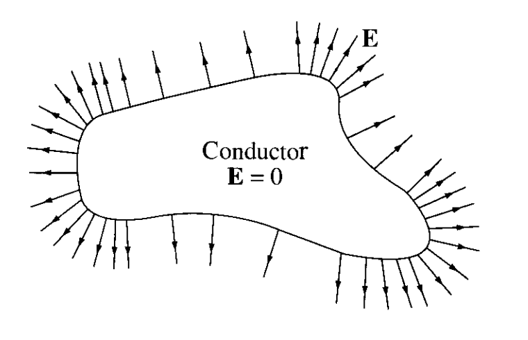

# Electrostatics

As is custom, we'll begin our study of electromagnetism with *electrostatics*. Electrostatics is the study of stationary charges and the forces they exert on each other. From this simple setup we'll see that many of the important concepts of electromagnetism arise, including fields, potentials, and eventually Maxwell's equations. In this and future chapters, we'll define the electric field and use an increasingly intricate set of mathematical tools to solve increasingly complex problems.

We can approach the subject in several ways, for instance by stating Maxwell's equations as fact and studying their implications, or by starting from special relativity and the principle of least action. Instead we'll bow to historical convention and build the theory empirically, starting from some experimental facts about electrical charges and the forces between them.

## Coulomb's Law

Electrostatic phenomena have been known about for millennia. In Ancient Greek times, it was known that when an amber stone was polished that small objects tended to cling to it via what we now commonly call static electricity or electrostatic attraction. Indeed, the Ancient Greek word for amber is *elektron*, from which we've derive the words *electricity* and even *electron*.

Little else was known about electricity until the 17th century when scientists such as Priestly, Franklin, and Coulomb started to rigorously investigate the properties of charged objects. Within a few decades, the laws of electrostatics were largely worked out, though it took many more decades before they were recast into their modern form.

### Coulomb's Law

Electrostatics rests on two important facts about nature: the existence of and the conservation of charge, and Coulomb's law. We postulate that aside from mass, every physical body has associated to it another scalar quantity known as *electric charge*. Electric charge is observed to come in two varieties, which we call *positive* and *negative*. By historical convention, positive charge turns out to be the charge of the proton, and negative charge turns out to be the charge of the electron. We also postulate that in any closed system charge is *conserved*. It cannot be created or destroyed, only transferred within the closed system.

Next, we postulate that the force between charged objects is given by *Coulomb's Law*. Through a series of experiments, Coulomb was able to deduce the following facts about the forces between charged objects:

- The force between the two charges depends linearly on the magnitude of each charge. The larger the magnitude, the stronger the force between them.
- The force obeys an inverse square law nature similar to gravity. That is, the strength of the force between the two charges varies with the inverse square of the distance between them.
- As with gravity, the force is directed along the line of force joining the two charges.
- The force is *attractive* if the two bodies have charges of *opposite* sign, and *repulsive* if the two bodies have charges of the *same* sign. If either body has zero charge, then there is no force between them.

Let's now formulate this as a mathematical law. Suppose two charged objects with charges $q_1$ and $q_2$ are located at fixed positions in space $\mathbf{x}_1$ and $\mathbf{x}_2$ respectively. Then the force $\mathbf{F}_{12}$ charge $q_1$ experiences due to charge $q_2$ is given by
$$
\mathbf{F}_{12} = k_e \frac{q_1 q_2}{r_{12}^2} \mathbf{e}_{12} \ ,
$$
where $r_{12} \equiv |\mathbf{x}_1 - \mathbf{x}_2|$ is the distance between the charges and $\mathbf{e}_{12}$ is the unit vector in the $\mathbf{x}_1 - \mathbf{x}_2$ direction,
$$
\mathbf{e}_{12} \equiv \frac{\mathbf{x}_1 - \mathbf{x}_2}{|\mathbf{x}_1 - \mathbf{x}_2|} \ .
$$
This formula captures all of the observations made by Coulomb. Since $\mathbf{F}_{12} \propto q_1$ and $\mathbf{F}_{12} \propto q_2$, the force depends linearly on each individual charge. Since $\mathbf{F}_{12} \propto 1/r_{12}^2$, the force is inversely proportional to the squared distance between the charges. Since $\mathbf{F}_{12} \propto \mathbf{e}_{12}$, the force is directed along the line joining the two charges. If $q_1 q_2 > 0$ then the force between them is positive, meaning charges with like sign repel each other, and if $q_1 q_2 < 0$ then the force between them is negative, meaning charges of opposite sign attract each other. Last, if either $q_1$ or $q_2$ is zero then there is no electrostatic force between the two charges.

From Coulomb's law and the general properties of forces we can immediately deduce a few important facts:

- The Coulomb force is *conservative* since $\mathbf{F}_{12}$ doesn't depend explicitly on time. In particular, this means we can define a potential energy $U$ such that $\mathbf{F}_{12} = -\nabla_1 U$, where $U$ is given by
  $$
  U(\mathbf{x}_1, \mathbf{x}_2) = k_e \frac{q_1 q_2}{r_{12}} \ .
  $$

- The Coulomb force is a *central force*, meaning $\mathbf{F}_{12}$ depends only on the relative distance $r_{12}$ between the two charges and not their absolute positions in space. This also means $U = U(r_{12})$, which can be seen above.

- The force of charge $q_1$ on charge $q_2$ is equal and opposite to the force of $q_2$ on $q_1$, with $\mathbf{F}_{21} = -\mathbf{F}_{12}$.

- Since Coulomb's law is a statement about forces, it obeys the *principle of superposition*, meaning the net Coulomb force on any one charge due to any set of other charges is just the vector sum of the Coulomb force on that charge due to each other individual charge. For example, the total force on charge $q_1$ due to $n$ other charges $q_2, q_3, \cdots, q_n$ is given by the vector sum of each individual force $\mathbf{F}_{1i}$ on $q_1$ due to each other charge $q_i$,

$$
\mathbf{F}_{1} = \mathbf{F}_{12} + \mathbf{F}_{13} + \cdots + \mathbf{F}_{1n} \ .
$$

Note that strictly speaking Coulomb's Law as stated only holds between *point charges*. That is, we implicitly have assumed that the charge of each object brought into contact can each be localized at a single point. They can't be diffused over the object in some non-uniform way. This of course is an abstraction. For simple electrostatic bodies this is a decent assumption to make, but for more complicated bodies it is not. We'll see how to modify Coulomb's law to deal with extended distributions of charge soon.

### Units

We haven't yet said anything about the dimensions or units of charge. In mechanics one can assign units to every mechanical quantity using only units of mass, distance, and time. In electromagnetism however, we now have the freedom to choose the dimensions of charge by fixing the dimensions of the proportionality constant $k_e$ in Coulomb's law. Notice that the product $k_e q_1 q_2$ must necessarily have dimensions of force times area for the law to be dimensionally consistent, or
$$
[k_e] [q]^2 = [F] [L]^2 \ .
$$
Thus, assigning dimensions to $k_e$ is essentially equivalent to specifying what the dimensions of charge should be. As we described in the previous chapter, there are different conventions for doing this, each corresponding to a different system of units. 

In Gaussian units, which are the units we will use in this course, we choose $k_e$ to be dimensionless by setting $k_e \equiv 1$. From the dimensional relation above, this implies that charge must then have dimensions of $[q] = [L] [F]^{1/2}$. In these units, we call the base unit of charge the *electrostatic unit* or *esu*, where evidently $1 \ \text{esu} \equiv \sqrt{\text{dyne} \cdot \text{cm}^2}$. That is, one esu of charge is defined as the amount of charge such that when two charges of one esu are placed a distance of one centimeter apart the force on them is exactly one dyne. In these units, Coulomb's law takes the especially simple form
$$
\mathbf{F}_{12} = \frac{q_1 q_2}{r_{12}^2} \mathbf{e}_{12} \ ,
$$
where it's necessarily understood that charge is measured in esu, distances in centimeters, and forces in dynes.

While Gaussian units are very convenient to study the theory of electromagnetism, they are unfortunately not the units usually used in the lab, largely for historical reasons. In the lab one generally uses SI units. In these units the dimension of charge isn't tied to mechanical units at all, but instead becomes a standalone unit. One defines a new constant $\varepsilon_0$, which is anachronistically called the *permittivity of free space*, where $\varepsilon_0 \approx 8.854 \cdot 10^{-12} \ \text{N}/\text{A}^2$, and sets
$$
k_e \equiv \frac{1}{4\pi\varepsilon_0} \approx 8.987 \cdot 10^9 \ \frac{\text{A}^2}{N} \ .
$$
The unit $A$ is defined to be a new fundamental unit known as the *Ampere*, often abbreviate *amp*. The Ampere is the SI unit of electric current, or charge per unit time. From the Ampere, one then defines the base unit of charge to be the *Coulomb*, where $1 \ \text{C} \equiv 1 \ \text{A} \cdot \text{s}$. In these units, Coulomb's law then takes on the somewhat cumbersome form
$$
\mathbf{F}_{12} = \frac{1}{4\pi\varepsilon_0} \frac{q_1 q_2}{r_{12}^2} \mathbf{e}_{12} \ ,
$$
where it's necessarily understood that charge is measured in Coulomb, distances in meters, and forces in Newtons. Since the dimensions are incompatible, one can't strictly speaking convert charges between the two unit systems. Apart from their dimensions though their numerical values can still be compared. In this sense we can say that $1 \ \text{esu} \approx 3.3 \cdot 10^{-10} \ \text{C}$. When converting between Gaussian and SI units we'll frequently show unit conversions for some quantity in this manner, even though it should always be understood that a given quantity may have different dimensions in the two systems of units.

To get a feel for the scale of everyday charges, the static electricity between two large objects rubbed together may produce a charge of a few $\mu \text{C}$, or $\sim 10^4 \ \text{esu}$. The amount of charge in a bolt of lightning may be as high as $15-350 \ \text{C}$, or $\sim 10^{5}-10^{6} \ \text{esu}$. A modern smartphone battery can hold a huge charge of $10 \ \text{kC}$, or $\sim 10^{8} \ \text{esu}$. Indeed, charge in everyday settings can range from very small to very large, making it difficult for any chosen unit of charge to seem natural.

Coulomb's law has been used to establish the limits on the validity of classical electromagnetism. Experiments and observations have well established that Coulomb's law is highly accurate for distance scales at all orders of magnitude, with the loan exception being very small distances much smaller than the atom. When distance scales get down to around $10^{-13} \ \text{cm}$, the laws of classical electromagnetism finally break down and a quantum description is needed. Classical electromagnetism is thus an extremely precise description of nature for any distance scale larger than this, even on scales as large as the distance of the universe.

### Charge Quantization

Today, we know more about the properties of charge than was known at the time of Coulomb. This is largely due to the gradual discovery of atomic theory in the 19th and early 20th centuries. The idea that objects were composed of atoms is very old, going all the way back to Democritus in the 5th century BC. However, this idea wasn't taken seriously by the scientific community until Dalton postulated the idea again around the start of the 19th century. Indeed, Dalton is the one who coined the term *atom* from the Ancient Greek word *atomos*, meaning *indivisible*. As the 19th century progressed, more and more evidence grew to support the atomic hypothesis, eventually culminating in the discoveries of the electron by Thompson and the nucleus by Rutherford in the early 20th century. From these discoveries, quantum theory was introduced to explain the behavior of atoms, which ultimately culminated in the laws of quantum mechanics and eventually the Standard Model of particle physics we have today.

- Redo this section starting here.
- Maybe rename the section something more encompassing. Atoms or something like that.
- First describe the state of today's knowledge. All materials are made of atoms. Each atom contains some number of protons, neutrons, and electrons. Charge is quantized in units of $e$. Most atoms are electrically neutral.
- Consider using the fact that Coulomb's law is a central force to model the electron orbiting a nucleus, mentioning that this model breaks down since moving charges radiate, causing electrons to spiral into the nucleus in a fraction of a second.

We know today that charge is *quantized* in integer units of the charge $e$ of the proton,
$$
e \approx 4.8 \cdot 10^{-10} \ \text{esu} \approx 1.6 \cdot 10^{-19} \ \text{C} \ .
$$
All charges we measure in nature are integer units of $e$. The only known exception to this fact are the fundamental particles that make up the proton and the neutron, known as *quarks*. Each proton and neutron is composed of three quarks, where each quark has a charge of $\pm e/3$. Due to a nuclear process known as *confinement*, these quarks are bound to the inside of their proton or neutron, meaning it's impossible to isolate them or measure their charges directly in the lab.

Fundamentally, physical objects are composed of atoms bound together by electrical forces. Each atom is composed of some number of protons and neutrons bound tightly inside a nucleus by a nuclear or *strong interaction*, and some number of electrons orbiting the nucleus according to the laws of quantum mechanics. Each proton has a charge of exactly $e$, each neutron has exactly zero charge, and each electron has a charge of exactly $-e$.

In most cases an atom has the same number of protons and electrons, in which case its net charge is zero, or *charge neutral*. Since protons can't be removed from a nucleus unless very high energies are applied to overcome the nuclear forces, the only way atoms will typically become charged is by exchanging electrons with other neighboring atoms through *ionization*. Due to charge conservation, these electrons don't spontaneously appear or disappear. They can only move between atoms.

This also explains why the charge we observe on macroscopic objects is very tiny. Almost all atoms or molecules inside the object are charge neutral and hence contribute nothing to the object's charge. When we do measure a charge, what it usually means is that some of the surface atoms have become ionized, either exchanging electrons with the air or with a neighboring object via friction. Indeed, a typical charged object might have a net charge of only $\sim 10^4 \ \text{esu}$. Since charge is quantized, this means
$$
n \sim \frac{10^4 \ \text{esu}}{4.8 \cdot 10^{-10} \ \text{esu}} \sim 10^{14}
$$
of its atoms have become charged. While this might seem like a lot, a typical macroscopic object will contain something like $N \sim 10^{23}$ total atoms. This means only $n/N \sim 10^{-9}$, or one part in a billion, of the atoms making up the object have been charged and thus contributing anything to the total net charge.

It's in precisely this sense that charge is conserved at the atomic level, and fundamentally it's why charge is also conserved at the macroscopic level as well. In fact, charge conservation is a universal law of nature, even holding for subatomic particles. In that case, charge conservation comes down to the properties of particles and antiparticles, a topic we won't go into in this course.

### Conductors and Insulators

Even though all macroscopic objects are composed of atoms, they don't all behave the same. In electromagnetism, we find it useful to separate macroscopic materials into two broad categories that encapsulate much of how they interact with electromagnetic forces, known as *conductors* and *insulators*. Conductors are strong conductors of electric current. Insulators are the polar opposite of conductors, weak conductors of electric current.

At an atomic level, the difference between conductors and insulators lies in whether they have *free electrons*, or electrons not attached to any given atom that are allowed to move freely throughout the material. Conductors typically have many free electrons while insulators have few if any. The canonical examples of conductors are *metals* like iron, copper, or gold. The canonical examples of insulators are non-metallic materials glass, quartz, or rubber. 

There are also materials that act as conductors in some settings but insulators in others. These are known as *semiconductors*. The canonical example of a semiconductor is silicon, which is the material used to build most modern computer chips. While semiconductors are very important, particularly in chip design, we won't spend much time talking about them in this course, since understanding when they conduct and when they don't requires physics well beyond the scope of electromagnetism.

### Comparison with Gravity

It's worth taking a minute to ask how the electrostatic and gravitational forces between two objects compare to each other. After all, in typical lab settings it seems like gravity is much more powerful than electrostatic forces. We could thus be led to the conclusion that gravity is a much stronger force than the electrostatic force, but it turns out this isn't the case.

We'll first restate Coulomb's law. If two charges $q_1$ and $q_2$ are separated by some distance $r_{12}$, the electrostatic force strength $F_e$ between them is given (in Gaussian units) by
$$
F_e = \frac{q_1 q_2}{r_{12}^2} \ .
$$
However, these charges will also have mass, meaning there will be a gravitational attraction between them as well given by Newton's law of gravitation. If the first charge has a mass $m_1$ and the second charge has a mass $m_2$, the gravitational force strength $F_g$ between them will be
$$
F_g = G \frac{m_1 m_2}{r_{12}^2} \ ,
$$
where $G \approx 6.7 \cdot 10^{-8} \ \text{dyne} \cdot \text{cm}^2 / \text{g}^2$ is Newton's gravitational constant.

Notice that Coulomb's law and Newton's law of gravitation have exactly the same form except with $q_1 q_2 \leftrightarrow G m_1 m_2$. This means if we look at the strength ratio $F_e / F_g$ between the two forces the $1/r_{12}^2$ dependence cancels, and we have
$$
\frac{F_e}{F_g} = \frac{q_1 q_2}{G m_1 m_2} \ .
$$
To get a feel for this ratio, let's consider two specific examples. First, let's consider the case of two interacting electrons. Since each electron has a of charge $-e \approx -4.8 \cdot 10^{-10} \ \text{esu}$ and a mass $m_e \approx 9.1 \cdot 10^{-28} \ \text{g}$, we have
$$
\frac{F_e}{F_g} = \frac{(-4.8 \cdot 10^{-10})^2}{(6.7 \cdot 10^{-8}) (9.1 \cdot 10^{-28})^2} \approx 4 \cdot 10^{42} \ .
$$
Thus, for two interacting electrons, the electrostatic force is 42 orders of magnitude greater than their gravitational force. For all practical purposes, when dealing with electrons the electrostatic force is the only force that matters. We can pretty much neglect their gravitational force completely.

This may seem counterintuitive. It's not what we see in everyday experience. To that end let's consider the completely different case of two orbiting planets. We'll assume they both have the properties of the Earth. Roughly speaking, the Earth (when including its atmosphere) is slightly negatively charged, with a charge of about $-10^5 \ \text{esu}$. Since the mass of the Earth is about $6 \cdot 10^{27} \ \text{g}$, for two interacting Earth-like planets we have
$$
\frac{F_e}{F_g} = \frac{(-10^5)^2}{(6.7 \cdot 10^{-8}) (6 \cdot 10^{27})^2} \approx 2.5 \cdot 10^{-34} \ .
$$
Thus, for two orbiting planets, the gravitational force is about 34 orders of magnitude greater than their electrostatic force. For all practical purposes, when dealing with planets the gravitational force is the only one that matters, and we can neglect the electrostatic force completely. This explains why at the atomic level we can usually ignore gravity and focus only on electrostatic forces, and why at the astronomical level we can usually ignore electrostatics and focus only on gravitational forces. 

Evidently, the point where gravitational forces start to overcome electrostatic forces occurs when $|q_1 q_2| \sim G m_1 m_2$. For comparably sized masses and charges, this transition point occurs when
$$
|q|/m \sim \sqrt{G} \approx 3863 \ \text{esu}/\text{g} \ ,
$$
where $|q|/m$ is known as the *charge to mass ratio*. It occurs quite often in whenever electromagnetism and mechanics interact. When $|q|/m$ is large the electrostatic forces dominate, and when $|q|/m$ is small gravitational forces dominate. For example, the charge to mass ratio of the electron is $e/m_e \approx 5 \cdot 10^{17} \ \text{esu}/\text{g}$, which is clearly much larger than $\sqrt{G}$.

## Electric Field

In some sense our understanding of electrostatics is already finished. All of electrostatics is already incapsulated in Coulomb's law. However, we'll find it convenient and insightful to recast Coulomb's law in terms of other quantities that turn out to be much more useful to work with than forces. Indeed, much of the rest of electrostatics is just recasting Coulomb's law in other forms that each illuminate different aspects of the theory. First, we'll recast the law in terms of electric fields.

### Definition

If $q$ and $q'$ are two point charges located at positions $\mathbf{x}$ and $\mathbf{x}'$ respectively, the force $\mathbf{F}$ on $q$ due to $q'$ is given by Coulomb's law,
$$
\mathbf{F} = qq' \frac{\mathbf{x} - \mathbf{x}'}{|\mathbf{x} - \mathbf{x}'|^3} \ .
$$
Notice if we divide both sides by $q$ we get a vector field $\mathbf{E} = \mathbf{E}(\mathbf{x})$ that depends only on $q'$,
$$
\mathbf{E}(\mathbf{x}) \equiv \frac{\mathbf{F}}{q} = q' \frac{\mathbf{x} - \mathbf{x}'}{|\mathbf{x} - \mathbf{x}'|^3} \ .
$$
This vector field we call the *electric field* or *E-field* generated by $q'$. Since $\mathbf{E}$ doesn't depend on $q$, we can think of it as a vector field, taking on a value at each $\mathbf{x}$ in space. By convention, we call $\mathbf{x}$ the *field point* and $\mathbf{x}'$ the *source point*. Notice the source point will always be fixed in space in electrostatics since the location of $q'$ is assumed to be stationary, while the field point is free to move around in space depending on which specific point we're interested in measuring the value of the E-field.

By definition, the electric field has dimensions of force per unit charge, or units of $\text{dyne}/\text{esu}$ in Gaussian units. By convention though, we state the units of electric field in terms of $\text{statvolt}/\text{cm}$ in Gaussian units, where a *statvolt* is defined as one erg per esu. Of course, one statvolt per centimeter is exactly one dyne per esu. It's just a convention. Similarly, in SI units, the units of electric field are conventionally given in $\text{V}/\text{m}$, where $\text{V}$ is the *volt*, defined as one Joule per Coulomb. The conversion factor between volts and statvolts is $1 \ \text{statvolt} \approx 300 \ \text{V}$, so $1 \ \text{statvolt}/\text{cm} \approx 3 \cdot 10^4 \ \text{V}/\text{m}$.

Since forces obey the principle of superposition and E-fields are just forces per unit charge, E-fields must also obey the principle of superposition. That is, if $q_1', q_2', \cdots, q_n'$ are $n$ point charges located at positions $\mathbf{x}_1', \mathbf{x}_2', \cdots, \mathbf{x}_n'$ respectively, then total E-field due to the combined set of charges is given by the vector sum
$$
\mathbf{E} = \mathbf{E}_1 + \mathbf{E}_2 + \cdots \mathbf{E}_n \ ,
$$
where each $\mathbf{E}_i$ is what the E-field due to each individual charge $q_i'$ would be in the absence of any other charges, i.e.
$$
\mathbf{E}_i(\mathbf{x}) = q_i' \frac{\mathbf{x} - \mathbf{x}_i'}{|\mathbf{x} - \mathbf{x}_i'|^3} \ .
$$
The total E-field of the combined set of charges is evidently then
$$
\mathbf{E}(\mathbf{x}) = \sum_{i=1}^n q_i' \frac{\mathbf{x} - \mathbf{x}_i'}{|\mathbf{x} - \mathbf{x}_i'|^3} \ .
$$
When another charge $q$ is brought in and placed at some field point $\mathbf{x}$, it will feel a force due to the E-field given by
$$
\boxed{
\mathbf{F} = q \mathbf{E}
} \ .
$$
Notice that this is completely equivalent to Coulomb's law. In this sense, the physics is exactly the same. So why would we bother to introduce a new field if the physics is the same? The reason is that it allows us to assign a different *interpretation* to Coulomb's law. Instead of saying that two charges interact at a distance to produce a force, we think of one charge as producing an E-field at all points in space, and the other charge interacts with the *field* to produce a force instead of with the other charge directly.  The benefit of this *field interpretation* is it allows us to think of Coulomb's law as being *local*. That is, the force felt by a charge is due to its interaction with something nearby, the E-field, rather some far away charge via a so-called "action at a distance".

Indeed, pretty much all of modern physics is cast in terms of local *field theories* like this. Nowadays, we think of these fields as being fundamental physical objects, not just mathematical conveniences. A major benefit of such a local theory is that it allows us to recast many physical laws in terms of differential equations, which makes solving more complicated problems much easier.

As a brief aside, notice that Newton's law of gravitation looks almost identical to Coulomb's law. This means we can define a field interpretation for gravity in an almost identical manner to electrostatics, except with charges replaced by masses. In this setting, the analogue of the E-field is the *gravitational field* $\mathbf{g}$. If a mass $m$ is brought into the presence of a gravitational field, it feels a force $\mathbf{F} = m\mathbf{g}$. Indeed, much of the theory of electrostatics that we'll develop in the next few chapters can be mapped almost one-to-one onto the theory of Newtonian gravity as well.

##### Example: Physical Dipole

Suppose two stationary charges of opposite sign $\pm q$ are separated by a distance $d$ along some axis. A charge configuration of this form is known as a *physical dipole*. We'll let $\mathbf{x}_+$ denote the position of the $+q$ charge and $\mathbf{x}_-$ the position of the $-q$ charge. 

By Coulomb's law, the E-field $\mathbf{E}_+$ created by the positive charge $+q$ alone is given by
$$
\mathbf{E}_+(\mathbf{x}) = q \frac{\mathbf{x} - \mathbf{x}_+}{|\mathbf{x} - \mathbf{x}_+|^3} \ .
$$
Similarly, the E-field $\mathbf{E}_-$ created by the negative charge $-q$ alone is given by
$$
\mathbf{E}_-(\mathbf{x}) = -q \frac{\mathbf{x} - \mathbf{x}_-}{|\mathbf{x} - \mathbf{x}_-|^3} \ .
$$
By the superposition principle then, the combined E-field of the physical dipole is given by their vector sum,
$$
\mathbf{E}(\mathbf{x}) = \mathbf{E}_+(\mathbf{x}) + \mathbf{E}_-(\mathbf{x}) = q \bigg[\frac{\mathbf{x} - \mathbf{x}_+}{|\mathbf{x} - \mathbf{x}_+|^3} + \frac{\mathbf{x} - \mathbf{x}_-}{|\mathbf{x} - \mathbf{x}_-|^3}\bigg] \ .
$$
In this general form it's hard to understand what's going on. To that end, let's make the specific assumption that the charges both lie along the $z$-axis, with $+q$ located at position $\mathbf{x}_+ = (d/2) \mathbf{e}_z$ and $-q$ located at position $\mathbf{x}_- = -(d/2) \mathbf{e}_z$. Suppose further that we're interested only in field points $\mathbf{x}$ that lie directly along the $z$-axis, so that $\mathbf{x} = z\mathbf{e}_z$. Then we have
$$
\mathbf{x} - \mathbf{x}_+ = \bigg(z - \frac{d}{2}\bigg) \mathbf{e}_z \quad , \quad \mathbf{x} - \mathbf{x}_- = \bigg(z + \frac{d}{2}\bigg) \mathbf{e}_z \ .
$$
The distances between the $\mathbf{x}$ and each source point $\mathbf{x}_\pm$ are then just
$$
|\mathbf{x} - \mathbf{x}_+| = \bigg|z - \frac{d}{2}\bigg| \quad , \quad |\mathbf{x} - \mathbf{x}_-| = \bigg|z + \frac{d}{2}\bigg| \ .
$$
Plugging all of this back into the E-field and simplifying, along the $z$-axis we have
$$
\mathbf{E}(z) = q \bigg[\frac{z - d/2}{|z - d/2|^3} - \frac{z + d/2}{|z + d/2|^3}\bigg] \mathbf{e}_z = q \bigg[\frac{\text{sgn}(z - d/2)}{(z - d/2)^2} - \frac{\text{sgn}(z + d/2)}{(z + d/2)^2}\bigg] \mathbf{e}_z \ .
$$
For convenience we've introduced the *sign function* $\text{sgn}(x)$, defined by $\text{sgn}(x) = 1$ if $x > 0$ and $\text{sgn}(x) = -1$ if $x < 0$. 

Notice that for field points along the $z$-axis the E-field vectors will also point along the $z$-axis. Since the E-field is a vector it'll have both a magnitude and direction. The direction of the E-field at each $z$ depends on the signs of $z - d/2$ and $z + d/2$. 

If $z > d/2$ the E-field vector will point *upward* since $\text{sgn}(z - d/2) = \text{sgn}(z + d/2) = 1$ and
$$
\frac{1}{(z - d/2)^2} > \frac{1}{(z + d/2)^2} \ .
$$
If $z < -d/2$ the E-field vector will also point *upward* since $\text{sgn}(z - d/2) = \text{sgn}(z + d/2) = -1$ and
$$
\frac{-1}{(z - d/2)^2} > \frac{-1}{(z + d/2)^2} \ .
$$
In both cases, the magnitude of the E-field vector $E(z) = |\mathbf{E}(z)|$, called the *field strength*, will be given by the absolute value
$$
E(z) = q \bigg|\frac{1}{(z - d/2)^2} - \frac{1}{(z + d/2)^2}\bigg| \ .
$$
Meanwhile, if $-d/2 < z < d/2$ the E-field vector will point *downward* since $\text{sgn}(z - d/2) = -1$, $\text{sgn}(z + d/2) = 1$, and
$$
\frac{-1}{(z - d/2)^2} < \frac{1}{(z + d/2)^2} \ .
$$
In this case, the field strength will instead be given by
$$
E(z) = q \bigg|\frac{1}{(z - d/2)^2} + \frac{1}{(z + d/2)^2}\bigg| \ .
$$
For example, at the origin $z=0$ we'd have $E(z) = 8q/d^2$, with a downward-pointing E-field vector
$$
\mathbf{E}(0) = -\frac{8q}{d^2} \mathbf{e}_z \ .
$$
Notice that we can think of the E-field as pointing *away* from the positive charge and *into* the negative charge. This is a general fact, which we'll say more about in the next section.

Finally, let's look at what happens in the *far field limit*, when $r = |z| \gg d$. What should we expect to happen in this limit? Intuitively, one might expect that if we're far away from the source charges we can treat them both as a single point charge and use Coulomb's law to conclude that $E(z) \sim 1/r^2$. But this isn't the case for the dipole. To see why, let's do a binomial expansion of the field strength $E(z)$ in the case that $r > d/2$. We have
$$
\begin{align*}
E(z) &= q \bigg|\frac{1}{(z - d/2)^2} - \frac{1}{(z + d/2)^2}\bigg| \\
&= \frac{q}{z^2} \bigg|\frac{1}{(1 - d/2z)^2} - \frac{1}{(1 + d/2z)^2}\bigg| \\
&\approx \frac{q}{z^2} \big|(1 + d/z) - (1 - d/z) \big| \\
&\approx \frac{qd}{2r^3} \ .
\end{align*}
$$
Evidently, in the far field limit the E-field falls off like $1/r^3$, not like $1/r^2$. But why did this happen? The reason is because if we did indeed treat both charges as a single point charge then we have to use their *net charge*, and their net charge is $q - q = 0$. Said differently, the E-field of a dipole has no $1/r^2$ dependence because this term vanishes when we expand the E-field in powers of $d/r$. We thus have to go to the next term, which falls off like $1/r^3$. This behavior is characteristic of a dipole. In future chapters we'll show a systematic way to do an expansion of this kind and show that any field that falls off like $1/r^3$ *must* be that of a dipole.

### Field Lines

As with any vector field, it's best to visualize the behavior of electric fields using field lines. The field lines represent the direction of the E-field at each point in space. This means if an infinitesimal test charge $q$ were placed at rest at some point $\mathbf{x}$ in an external E-field, we'd expect it to feel a force $\mathbf{F} = q\mathbf{E}(\mathbf{x})$, causing the charge to move along the field line passing through the point $\mathbf{x}$.

Unlike with general vector fields, sketching the field lines for electric fields is usually fairly simple, especially when dealing with point charges. To see why, suppose $q$ is a point charge located at the origin, meaning $\mathbf{x}' = \mathbf{0}$. Then its E-field would just be
$$
\mathbf{E}(\mathbf{x}) = q' \frac{\mathbf{x}}{|\mathbf{x}|^3} = \frac{q'}{r^2} \mathbf{e}_r \ .
$$
Thus, the direction of $\mathbf{E}(\mathbf{x})$ will always be radial. That is, its field lines will always be directed radially inward or outward from the origin. If we sketched these field lines in two dimensions, we'd get a field line plot like the one shown below.

Whether the field lines point in or out of the origin depends on the sign of the charge $q'$, with the field lines flowing *outward* from the charge if $q'$ is *positive*, and flowing *inward* toward the charge if $q'$ is *negative*. This will also be true for any point charge located at some arbitrary point $\mathbf{x}'$, except now the field lines will point radially outward or inward from the point $\mathbf{x}'$ instead of the origin.

As with any vector field, the *density* of field lines will represent the strength of the field at any given point. This provides us with an intuitive interpretation of what the E-field represents. It's the number of field lines per unit area around a given point. In 3-dimensional space, it would be the number of field lines per unit volume, or *flux density*, around a given point.

Since the strength of the field at any fixed point is proportional to the charge, the field lines emanating from a given charge $q'$ should be proportional to the size of $q'$. For example, if we choose to draw $k$ field lines outward from a charge of size $q = +1$, then we should draw $2k$ field lines outward from a charge of size $q = +2$.

Now suppose we have $n$ distinct point charges instead of just one. As mentioned above, the E-field of this combined set of charges will be given by the vector sum of each individual E-field $\mathbf{E}_i(\mathbf{x})$,
$$
\mathbf{E}(\mathbf{x}) = \sum_{i=1}^n q_i' \frac{\mathbf{x} - \mathbf{x}_i'}{|\mathbf{x} - \mathbf{x}_i'|^3} \ .
$$
Provided we're close to any one of these charges, say $q_j'$. Since each $\mathbf{E}_i(\mathbf{x})$ falls off rapidly like $1/|\mathbf{x} - \mathbf{x}_i'|^2$, when $\mathbf{x} \approx \mathbf{x}_j'$ the combined E-field $\mathbf{E}(\mathbf{x})$ will be approximately that of $\mathbf{E}_j(\mathbf{x})$,
$$
\mathbf{E}(\mathbf{x}) \approx \mathbf{E}_j(\mathbf{x}) = q_j' \frac{\mathbf{x} - \mathbf{x}_j'}{|\mathbf{x} - \mathbf{x}_j'|^3} \ .
$$
From this we can conclude that the field lines around each source point $\mathbf{x}_i'$ will also be radial very close to $q_i'$.

Finally, since $\mathbf{E}(\mathbf{x})$ is continuous for each $\mathbf{x} \neq \mathbf{x}_i'$, we must conclude that the field lines will also be continuous at any point away from the point charges. Moreover, the field lines can never cross each other since at each $\mathbf{x}$ we can have only one E-field vector.

We can thus summarize the behavior of electric field lines for discrete point charges with the following rules:

- A small test charge placed at rest in the presence of an electric field will follow the direction of the field line at that point.
- Around each point charge the field lines will point radially inward or outward from the location of the point charge.
- The density of field lines emanating from a given point charge should be proportional to the size of the charge.
- The field lines will always start at positive charges and terminate either at negative charges or infinity.
- The field lines must be continuous at every point in space except right at the point charges.
- The field lines can never cross each other except where they meet at a point charge.

Using these rules we can quickly sketch the field lines of arbitrarily complicated configurations of point charges, and hence get a quick intuitive idea of how the field for that configuration behaves even without doing any math. For example, the field lines of the physical dipole example above would look something like the plot below. The $+q$ charge is represented in red and the $-q$ charge is represented in black.

If the charges in this example were instead the same sign, for example both positive, we'd instead get a field like the one below. Notice that now the field lines from one charge never flow into another since they're both the same sign. This is just a reflection of the statement that like charges repel and opposite charges attract.

If the charges were of opposite sign but one was larger than the other, for example if $q_+ = +4$ and $q_- = -1$, we'd get a much more different looking field with field lines something like this. In fact, this field will fall off like $1/r^2$ instead of like $1/r^3$ like the ordinary physical dipole does, since the total net charge is now $q = +3$ instead of zero.

If we had four charges of the same size but alternating signs arranged in an a square we'd get field lines that look something like shown below. This sort of charge configuration is known as a *physical quadrupole*.

Hopefully by now we get the idea. Field lines are quite easy to draw for an arbitrary charge configuration, at least approximately. From now on, when working out the E-field of some distribution of charges, it's a good idea to first sketch the field lines to get an idea of how the field should intuitively behave. We can then calculate the field and make sure that it behaves as expected. If the calculated field doesn't have the same field line behavior, we probably made a mistake in the calculation.

### Charge Distributions

In classical electromagnetism we find ourselves more often dealing not with a small number of discrete charges, but with macroscopic objects made up of a huge number of charges, for example conducting spheres or long wires of charge. When this is the case it's convenient to model such a *charge distribution* as a continuum of charge. This is an abstraction of course. After all, all macroscopic objects are made of atoms, each with some discrete amount of charge. However, provided we're interested in the behavior of fields at distances much larger than the atomic scale, which is typically the case, modeling the charges as a continuum is a valid approximation.

To that end, suppose a charged, stationary, macroscopic object takes up some volume $\mathcal{V}$ in space. Inside $\mathcal{V}$, each infinitesimal volume $d^3 \mathbf{x}'$ will have some infinitesimal amount of charge $dq'$. We can relate the two by defining a *charge density* $\rho(\mathbf{x}')$ by
$$
dq' = d^3 \mathbf{x}' \ \rho(\mathbf{x}') \ .
$$
Note that the terms *charge density* and *charge distribution* are frequently used interchangeably to refer to this same function.

Loosely speaking, we can think of the charge density $\rho = \rho(\mathbf{x}')$ as the differential charge per unit volume, or
$$
\rho = \frac{dq}{dV} \ .
$$
This means the units of charge density would be $\text{esu}/\text{cm}^3$ in Gaussian units. Note that $\rho$ isn't a "proper" density function in the mathematical sense since it's not non-negative. Since $q$ can be positive or negative, $\rho$ can take on any real value.

The total amount of net charge $Q$ contained inside the macroscopic object will then be given by the volume integral
$$
Q = \int_\mathcal{V} d^3\mathbf{x}' \ \rho(\mathbf{x}') \ .
$$
By convention, we typically extend the charge density function to cover all space by defining $\rho(\mathbf{x}') = 0$ for any $\mathbf{x}'$ not in $\mathcal{V}$. This means we can and will often omit the $\mathcal{V}$ from integrals and implicitly it's non-zero only when $\mathbf{x}'$ is in $\mathcal{V}$.

Now, for a continuous charge distribution each $dq'$ will give rise to an infinitesimal E-field $d\mathbf{E}(\mathbf{x})$ given by
$$
d\mathbf{E}(\mathbf{x}) = dq' \frac{\mathbf{x}-\mathbf{x}'}{|\mathbf{x}-\mathbf{x}'|^3} \ .
$$
By the principle of superposition then, the total E-field overall space will then be given by integrating over each $dq'$. In terms of the charge density this means we have
$$
\boxed{
\mathbf{E}(\mathbf{x}) = \int d^3 \mathbf{x}' \ \rho(\mathbf{x}') \frac{\mathbf{x}-\mathbf{x}'}{|\mathbf{x}-\mathbf{x}'|^3} 
}\ .
$$
We've thus managed to recast Coulomb's law into a form that also works for continuous distributions of charge. When a *test charge* $q$ is placed in the presence of some charge distribution, it will feel a force $\mathbf{F} = q\mathbf{E}$, where $\mathbf{E}$ is given by the integral above.

It turns out we can express the E-field for a point charge in terms of this integral as well by using the Dirac delta function. To see why this is the case, suppose a point charge $q_0'$ is placed at position $\mathbf{x}_0'$. We can then define a charge density for $q_0'$ by
$$
\rho(\mathbf{x}') = q_0' \delta(\mathbf{x}_0' - \mathbf{x}') \ .
$$
If we plug this into the integral above, the delta function will pick out the point $\mathbf{x}_0'$ from the integral and give
$$
\mathbf{E}(\mathbf{x}) = \int d^3 \mathbf{x}' \ q_0' \delta(\mathbf{x}_0' - \mathbf{x}') \frac{\mathbf{x}-\mathbf{x}'}{|\mathbf{x}-\mathbf{x}'|^3} = q_0' \frac{\mathbf{x}-\mathbf{x}_0'}{|\mathbf{x}-\mathbf{x}_0'|^3} \ ,
$$
which is the same E-field for a point charge given before. In this way, we can use the delta function to easily convert integrals into sums or vice versa, and thus avoid the need to state the formulas for discrete and continuous charge distributions separately.

### Line and Surface Charge Distributions

In defining the charge density above, we implicitly assumed that the charges were spread across 3-dimensional space. Sometimes we'll find it convenient to assume the charges are all concentrated along some 1-dimensional *curve* in space, for instance when modeling a wire of charge where the wire has a negligible thickness compared to its length. Other times we'll find it convenient to assume the charges are all concentrated along some 2-dimensional *surface* in space, for instance when modeling a flat sheet of charge where the length and width of the sheet are much larger than its height. In these situations it's thus often much more convenient to define charge distributions in one or two dimensions.

Suppose we have a distribution of charges concentrated along some 1-dimensional curve $\mathcal{C}$ in space. Along each infinitesimal segment $d\ell'$ of the curve there will be some amount of charge $dq'$. We then define the *line charge density* function $\lambda(\mathbf{x}')$ by
$$
dq' = d\ell' \lambda(\mathbf{x}') \ .
$$
To find the total net charge $Q$ contained on the curve we need only integrate over each $dq'$ along the curve to get
$$
Q = \int_\mathcal{C} d\ell' \lambda(\mathbf{x}') \ .
$$
By Coulomb's law, each charge $dq'$ along the curve will give rise to some E-field $d\mathbf{E}(\mathbf{x})$, where
$$
d\mathbf{E}(\mathbf{x}) = dq' \frac{\mathbf{x}-\mathbf{x}'}{|\mathbf{x}-\mathbf{x}'|^3} \ .
$$
By the principle of superposition, the E-field generated by the entire line charge distribution can be found by integrating along the entire length of the curve to get
$$
\boxed{
\mathbf{E}(\mathbf{x}) = \int_\mathcal{C} d\ell' \ \lambda(\mathbf{x}') \frac{\mathbf{x}-\mathbf{x}'}{|\mathbf{x}-\mathbf{x}'|^3} 
} \ .
$$
The dimensions of line charge density must evidently be charge per unit *length*, or units of of $\text{esu}/\text{cm}$ in Gaussian units.

In an analogous manner, suppose now that we have a distribution of charges concentrated along some 2-dimensional surface $\mathcal{S}$ in space. Along this surface, each infinitesimal patch of area $da'$ will have some amount of charge $dq'$. We then define the *surface charge density* $\sigma(\mathbf{x}')$ by
$$
dq' = da' \sigma(\mathbf{x}') \ .
$$
To find the total net charge $Q$ contained on the surface we need only integrate over all $dq'$ along the surface to get
$$
Q = \int_\mathcal{S} da' \sigma(\mathbf{x}') \ .
$$
Each charge $dq'$ along the surface will give rise to some E-field $d\mathbf{E}(\mathbf{x})$ according to Coulomb's law. By the principle of superposition, we can thus find the E-field due to the entire surface charge distribution by integrating over the surface to get
$$
\boxed{
\mathbf{E}(\mathbf{x}) = \int_\mathcal{S} da' \ \sigma(\mathbf{x}') \frac{\mathbf{x}-\mathbf{x}'}{|\mathbf{x}-\mathbf{x}'|^3} 
} \ .
$$
The dimensions of surface charge density must evidently be charge per unit *area*, or units of $\text{esu}/\text{cm}^2$ in Gaussian units.

In this course we'll find ourselves frequently needing to go back and forth between densities of different dimension depending on the given problem at hand. For charge densities, the easiest way to do so is to remember the following equivalence,
$$
\int_\mathcal{C} d\ell' \lambda(\mathbf{x}') \leftrightarrow \int_\mathcal{S} da' \sigma(\mathbf{x}') \leftrightarrow \int_\mathcal{V} d^3\mathbf{x}' \rho(\mathbf{x}') \ .
$$
With charge densities now defined in different dimensions we're now finally in a position to work a few problems. Unfortunately, calculating the E-field directly from this integral is usually quite cumbersome, in part due to the fact that we have to solve an for each of the three components of $\mathbf{E}$. In some cases we can do so, particularly if the charge distribution is highly symmetric in some system of coordinates. 

### Examples

We'll now show a few examples of how to calculate the electric field of a continuous charge distribution directly from the integrals given above. We'll focus in particular on three well-known and illustrative examples, the infinite wire of uniform charge, the infinite sheet of uniform charge, and the sphere of uniform charge. We'll see that calculating the E-field directly from the integral is in fact quite cumbersome, since to do so we usually need to rely on the charges having a high degree of symmetry. In later sections and chapters, we'll focus on finding much easier ways to calculate electric fields for more complicated distributions.

##### Example: Infinite wire of uniform charge

Suppose we have a very long, straight conducting wire on which we place a uniform charge per unit length $\lambda$. We'll assume the wire is so long that we can approximate its length as infinite, and that the wire is so thin that we can assume it's a one dimensional line of charge with a constant line charge density $\lambda$. 

To calculate the E-field of this wire, we need to evaluate the line integral
$$
\mathbf{E}(\mathbf{x}) = \int d\ell' \ \lambda(\mathbf{x}') \frac{\mathbf{x}-\mathbf{x}'}{|\mathbf{x}-\mathbf{x}'|^3} \ .
$$
Now, the most important observation we need to get started on this problem is to observe this charge distribution has a cylindrical symmetry to it. Suppose the wire is oriented along the $z$-axis. Since the wire is 1-dimensional, its corresponding E-field must necessarily be azimuthally symmetric, meaning $\mathbf{E}(\mathbf{x}) = \mathbf{E}(\varrho, z)$ in cylindrical coordinates. Next, since $\lambda$ is constant along the wire and the wire is infinitely long, the wire must also be cylindrically symmetric, meaning $\mathbf{E}(\mathbf{x}) = \mathbf{E}(\varrho)$. That is, the E-field can only depend on the field point's radial distance from the wire. Moreover, the E-field must always point in the $\varrho$-direction for this exact same reason, since the $z$-component of any $d\mathbf{E}$ at some point the wire will cancel with the $z$-component of another $d\mathbf{E}$ at some other point on the wire, leaving only the $\varrho$-component to contribute, as shown in the figure below. 

FIGURE

We can thus argue by symmetry alone that we must have
$$
\mathbf{E}(\mathbf{x}) = E(\varrho) \mathbf{e}_\varrho \ .
$$
This means to find $\mathbf{E}(\mathbf{x})$ we only need to evaluate the $\varrho$ component of the integral above, or
$$
E(\varrho) = \mathbf{E}(\mathbf{x}) \cdot \mathbf{e}_\varrho = \int d\ell' \ \lambda(\mathbf{x}') \frac{(\mathbf{x}-\mathbf{x}') \cdot \mathbf{e}_\varrho}{|\mathbf{x}-\mathbf{x}'|^3} \ .
$$
We now need to figure out what the separation vector $\mathbf{x}-\mathbf{x}'$ is. Since all the charges lie on the $z$-axis, we can write each source point $\mathbf{x}'$ as $\mathbf{x}' = z' \mathbf{e}_z$, where $z'$ is the $z$-coordinate of the source point on the wire. Since the field point $\mathbf{x}$ could in principle be any point in space, when written out in cylindrical coordinates we'd in general have
$$
\mathbf{x} = \varrho \mathbf{e}_\varrho + z \mathbf{e}_z \ .
$$
However, we can simplify this a little. Since the wire is infinitely long and the E-field is independent of $z$, it suffices to calculate the E-field in the $xy$-plane since this will be the same E-field for all $z$. We can thus assume without loss of generality that $z = 0$, and write $\mathbf{x} = \varrho \mathbf{e}_\varrho$. This means the separation vector becomes
$$
\mathbf{x}-\mathbf{x}' = \varrho \mathbf{e}_\varrho - z' \mathbf{e}_z \ ,
$$
and hence $(\mathbf{x}-\mathbf{x}') \cdot \mathbf{e}_\varrho = \varrho$. The separation distance $|\mathbf{x}-\mathbf{x}'|$ is then simply
$$
|\mathbf{x}-\mathbf{x}'| = \sqrt{\varrho^2 + z'^2} \ .
$$
Since the wire runs along the $z$-axis and $\lambda$ is constant, we can write $d\ell' \ \lambda(\mathbf{x}') = \lambda dz'$. We thus finally end up with the integral
$$
E(\varrho) = \lambda \int_{-\infty}^\infty dz' \ \frac{\varrho}{(\varrho^2 + z'^2)^{3/2}} \ .
$$
This integral can easily be evaluated via substitution. If we let $u = z'/\varrho$, then $du = dz'/\varrho$, and so we have
$$
\begin{align*}
E(\varrho) &= \lambda \int_{-\infty}^\infty dz' \ \frac{\varrho}{(\varrho^2 + z'^2)^{3/2}} \\
&= \frac{\lambda}{\varrho^2} \int_{-\infty}^\infty \frac{dz'}{\big(1 + (z'/\varrho)^2\big)^{3/2}} \\
&= \frac{\lambda}{\varrho} \int_{-\infty}^\infty \frac{du}{(1 + u^2)^{3/2}} \\
&= \frac{\lambda}{\varrho} \frac{u}{\sqrt{1 + u^2}} \bigg|_{u=-\infty}^{u=\infty} \\
&= \frac{2\lambda}{\varrho}
\ .
\end{align*}
$$
Note that the $u$-integral can be evaluated either by looking it up in a table of integrals, or by substituting $u = \tan\theta$ and reducing the integral to $\int \cos\theta d\theta$. Thus, the E-field of an infinitely long wire of with a uniform charge per unit length $\lambda$ is just
$$
\mathbf{E}(\mathbf{x}) = \frac{2\lambda}{\varrho} \mathbf{e}_\varrho \ .
$$
As expected, the E-field depends only on the radial distance from the wire. If the wire is positively charged, then $\lambda > 0$, which means the field lines will point radially *outward* from the wire. If it's negatively charged, then $\lambda < 0$, which means the field lines will point radially *inward* toward the wire.  Along any radial cross section the field lines will look something like this when $\lambda > 0$.

Perhaps unexpectedly, the field falls off like $1/\varrho$ and not like $1/\varrho^2$ as we might expect from Coulomb's law. Why is this the case? The reason is because we assumed the wire was infinitely long. This means the wire will always appear infinitely long no matter how far we are away from the wire. That is, it'll never look like a point charge no matter how far we are away from it, and only point charges obey Coulomb's law. 

If the wire were finite, which is of course always the case in reality, eventually we would be able to move far enough from the wire that it would behave as a point charge. Here's what its field line plot might look like for some radial cross section. Notice that in the middle of the wire the field is still radial, but near the ends of the wire it changes, leading to so-called *fringe field* behavior.

In this more realistic case the field would indeed fall off like $1/\varrho^2$ far away, in accordance with Coulomb's law. However, near the wire the field would still fall off like $1/\varrho$ at the center of the wire.

##### Example: Infinite sheet of uniform charge

Suppose we have a very large square conducting sheet on which we place a uniform charge per unit area $\sigma$. We'll assume that the sheet is so large that its area is infinite, and that the sheet is so thin that we can neglect its depth and model the sheet as having a 2-dimensional charge distribution with a constant surface density $\sigma$.

FIGURE

To calculate the E-field of this infinite sheet, we thus need to evaluate the surface integral
$$
\mathbf{E}(\mathbf{x}) = \int da' \ \sigma(\mathbf{x}') \frac{\mathbf{x}-\mathbf{x}'}{|\mathbf{x}-\mathbf{x}'|^3} \ .
$$
Now, observe that this sheet also has a symmetry, this time a *planar symmetry*. Since the charge per unit area is uniform across the sheet, the E-field must be the same for any points the same distance above or below the sheet. That is, the E-field at any given point must only depend on the point's distance from the sheet. If we suppose the sheet lies in the $xy$-plane, this means we must have that $\mathbf{E}(\mathbf{x}) = \mathbf{E}(z)$.

What about the direction of the E-field at each $z$ though? It's easy to see that the field must always point in the $z$-direction, since the planar components of the field vector at any $(x',y')$ on the sheet must cancel with the planar components of some other field vector at some other point, leaving only their vector sum in the $z$-direction to contribute. Also, since $\sigma$ is constant, the field lines must always point either away from or into the sheet, with the field lines pointing *outward* if $\sigma > 0$ and *inward* if $\sigma < 0$. Thus, the E-field vectors above the sheet will always point in the opposite direction to the E-field vectors below the sheet.

Mathematically, we can express these arguments by saying by symmetry the E-field must satisfy
$$
\mathbf{E}(\mathbf{x}) = \text{sgn}(z) E(z) \mathbf{e}_z \ ,
$$
where we use $\text{sgn}(z)$ to indicate that the direction of the field below the $xy$-plane is opposite the direction of the field above. 

It thus suffices to compute $E(z)$ for some $z > 0$ above the sheet and we're basically done,
$$
E(z) = \mathbf{E}(\mathbf{x}) \cdot \mathbf{e}_z = \int da' \ \sigma(\mathbf{x}') \frac{(\mathbf{x}-\mathbf{x}') \cdot \mathbf{e}_z}{|\mathbf{x}-\mathbf{x}'|^3} \ .
$$
Now, since the sheet is infinite, it suffices to compute $E(z)$ at the point $(0,0,z)$, since by symmetry $E(z)$ will be the same for any other point $(x,y,z)$ at the same height. This means we can without loss of generality set $\mathbf{x} = z \mathbf{e}_z$. Since the source points $\mathbf{x}'$ are in the $xy$-plane at some arbitrary point $(x',y',0)$, we have
$$
\mathbf{x}' = x' \mathbf{e}_x + y' \mathbf{e}_y \ .
$$
However, we'll see it's more convenient for the integration to write $\mathbf{x}'$ in cylindrical coordinates as $\mathbf{x}' = \varrho' \mathbf{e}_\varrho$. This means the separation vector is then just
$$
\mathbf{x} - \mathbf{x}' = z \mathbf{e}_z - \varrho' \mathbf{e}_\varrho \ ,
$$
which means $(\mathbf{x} - \mathbf{x}') \cdot \mathbf{e}_z = z$, and
$$
|\mathbf{x} - \mathbf{x}'| = \sqrt{z^2 + \varrho'^2} \ .
$$
Since the sheet is flat and $\sigma$ is constant, in cylindrical coordinates we have $da' \ \sigma(\mathbf{x}') = \sigma \varrho' d\varrho' d\varphi'$. Plugging all of this back into the integral above, we're left to evaluate the double integral
$$
E(z) = \sigma \int_0^\infty \varrho' d\varrho' \int_0^{2\pi} d\varphi' \ \frac{z}{(z^2 + \varrho'^2)^{3/2}} \ .
$$
Notice the integrand doesn't depend on the angle $\varphi'$, which means we can immediately evaluate the $\varphi'$-integral to get
$$
E(z) = 2\pi\sigma \int_0^\infty d\varrho' \frac{z\varrho'}{(z^2 + \varrho'^2)^{3/2}} \ .
$$
We can now evaluate the remaining integral by substituting $u = \varrho'/z$ and $du = d\varrho'/z$ to get
$$
\begin{align*}
E(z) &= 2\pi\sigma \int_0^\infty d\varrho' \frac{z\varrho'}{(z^2 + \varrho'^2)^{3/2}} \\
&= \frac{2\pi\sigma}{z^2} \int_0^\infty d\varrho' \ \frac{\varrho'}{\big(1 + (\varrho'/z)^2\big)^{3/2}} \\
&= 2\pi\sigma \int_0^\infty du \ \frac{u}{(1 + u^2)^{3/2}} \\
&= 2\pi\sigma \frac{-1}{\sqrt{1 + u^2}} \bigg|_{u=0}^{u=\infty} \\
&= 2\pi\sigma
\ .
\end{align*}
$$
Thus, the E-field of an infinite sheet of uniform charge per unit area is given by
$$
\mathbf{E}(\mathbf{x}) = \begin{cases}
2\pi\sigma \mathbf{e}_z \ , & z > 0 \\
-2\pi\sigma \mathbf{e}_z \ , & z < 0
\end{cases} \ .
$$
Perhaps surprisingly, the E-field doesn't seem to depend on $z$ at all. The field strength is a constant $2\pi\sigma$ for all $z$, no matter how far we are away from the sheet. Just as in the previous example, the reason for this lies in the assumption that the sheet is infinite in size. If the sheet had a finite size, then far away from the sheet it would behave as a point charge and fall off like $1/z^2$ in accordance with Coulomb's law. However, close to the sheet the E-field will *still* approximately be constant even for a finite sheet.

The field lines of the infinite sheet thus must point uniformly upward or downward since the E-field is constant along the $z$-direction. If $\sigma > 0$ the field lines will point away from the sheet, upward when $z < 0$ and downward when $z < 0$. If $\sigma < 0$ the field lines will reverse direction and instead point inward toward the sheet. The field line plot looks something like this when $\sigma > 0$. Here we're looking at the sheet from the side, with the direction of the field lines assumed to be *outward* from the sheet.

If the sheet were not infinite in extent but finite, the field lines near the center of the sheet would look the same, but the field lines near the edge of the sheet would look different due to fringe field behavior. Here's what that might look like.

Evidently, the E-field seems to change discontinuously when crossing the sheet, since the direction of the field suddenly flips when crossing the $xy$-plane. Indeed, if $\mathbf{x}_+$ is any point above the sheet and $\mathbf{x}_-$ is any point below the sheet, we have
$$
\mathbf{E}(\mathbf{x}_+) - \mathbf{E}(\mathbf{x}_-) = 2\pi\sigma \mathbf{e}_z + 2\pi\sigma \mathbf{e}_z = 4\pi\sigma \mathbf{e}_z \ .
$$
The reason for this sudden discontinuity in the field is because we made the assumption that the sheet was infinitely thin, so that we could treat the sheet as 2-dimensional. If we allowed it to have some thickness this issue would disappear. Inside the sheet, the field would in fact linearly increase from $-2\pi\sigma \mathbf{e}_z$ at the bottom of the sheet to $+2\pi\sigma \mathbf{e}_z$ at the top of the sheet. We'll see later that this discontinuity issue is in fact universal, and always arises when dealing with 2-dimensional surfaces of charge.

##### Example: Hollow sphere of uniform charge

Suppose now we have a hollow conducting sphere of some radius $R$, upon which we've placed a constant amount of charge per unit area $\sigma$, and we wish to calculate its E-field both inside and outside the hollow sphere. It will be natural for this problem to work in spherical coordinates, with the sphere centered at the origin. We'll assume the sphere is of negligible thickness so that we can model the charge distribution as being 2-dimensional.

FIGURE

Notice first that the sphere has a high degree of symmetry. Since the sphere is uniformly charged, the E-field can only be a function of the field point's radial distance, meaning $\mathbf{E}(\mathbf{x}) = \mathbf{E}(r)$. Moreover, the field lines must be radial as well both inside and outside the sphere. To see why this is the case, notice that for each field point we choose, there will always be some other field point of the same radius that will cancel out their combined fields in all but their radial direction. Thus, we must have
$$
\mathbf{E}(\mathbf{x}) = E(r) \mathbf{e}_r \ ,
$$
where $E(r) = \mathbf{E}(\mathbf{x}) \cdot \mathbf{e}_r$ will be given by the integral
$$
E(r) = \int da' \ \sigma(\mathbf{x}') \frac{(\mathbf{x}-\mathbf{x}') \cdot \mathbf{e}_r}{|\mathbf{x}-\mathbf{x}'|^3} \ .
$$
First let's address the easy part. Since the surface is a sphere and $\sigma$ is constant, we have $da' = R^2 \sin\theta' d\theta' d\varphi'$, and so
$$
\int da' \ \sigma(\mathbf{x}') = \sigma R^2 \int_0^\pi \sin\theta' d\theta' \int_0^{2\pi} d\varphi' \ .
$$
Now we need to figure out how to deal with the separation vector $\mathbf{x}-\mathbf{x}'$. This will be the most difficult part. Let's first address the field point $\mathbf{x}$. Since $E(r)$ depends only on $r$, it will be the same for any field point $\mathbf{x}$ of the same radius. This means we can without loss of generality fix $\mathbf{x}$ to lie on some particular axis for convenience. Since we want to work in spherical coordinates, the most natural choice is to place $\mathbf{x}$ on the $z$-axis, so that $\mathbf{x} = r \mathbf{e}_z$ and $\mathbf{e}_r = \mathbf{e}_z$. 

Now we need to deal with the source point $\mathbf{x}'$. All we know is that $\mathbf{x}'$ is constrained to the surface of the sphere. This means the most we can say is $\mathbf{x}' = R \mathbf{e}_{r'}$, where $\mathbf{e}_{r'}$ is the unit vector in the $r'$-direction. Note that it would be a mistake to set $\mathbf{e}_{r'} = \mathbf{e}_r$ here since these are different unit vectors pointing in different directions. However, to calculate the integral for $E(r)$ we'll still need to convert $\mathbf{e}_{r'}$ into a vector in terms of the field coordinates $(r,\theta,\varphi)$. It's possible to show that in this special case we have
$$
\mathbf{e}_{r'} = \cos\theta' \mathbf{e}_r - \sin\theta' \mathbf{e}_\theta \ .
$$
Plugging these in then, the separation vector $\mathbf{x} - \mathbf{x}'$ is
$$
\mathbf{x} - \mathbf{x}' = (r - R\cos\theta') \mathbf{e}_r - R\sin\theta' \mathbf{e}_\theta \ ,
$$
which means $(\mathbf{x} - \mathbf{x}') \cdot \mathbf{e}_r = r - R\cos\theta'$ and
$$
|\mathbf{x} - \mathbf{x}'| = \sqrt{(r - R\cos\theta')^2 + (R\sin\theta')^2} = \sqrt{R^2 + r^2 - 2Rr\sin\theta'} \ .
$$
Note we could've also obtained these same results by using the law of cosines. See the figure above to understand why. At any rate, the integral we're left to evaluate is thus
$$
E(r) = \sigma R^2 \int_0^{\pi} \sin\theta' d\theta' \int_0^{2\pi} d\varphi' \frac{r - R\cos\theta'}{(r^2 + R^2 - 2Rr \cos\theta')^{3/2}} \ .
$$
Now, notice the integrand doesn't depend on $\varphi'$, which means the $\varphi'$-integral just gives a factor of $2\pi$. Next, notice that we can simplify the remaining $\theta'$-integral by using the substitution $\mu = \cos\theta'$  and $d\mu = -\sin\theta d\theta$. We thus have
$$
E(r) = 2\pi\sigma R^2 \int_{-1}^1 d\mu \frac{r - R\mu}{(r^2 + R^2 - 2Rr \mu')^{3/2}} \ .
$$
This integral can be evaluated by splitting up the numerator and doing another substitution. In the end, we get
$$
E(r) = \frac{2\pi R^2 \sigma}{r^2} \bigg[\frac{r\mu - R}{\sqrt{r^2 + R^2 - 2R\mu}} \bigg]_{\mu=-1}^1 = \frac{2\pi R^2 \sigma}{r^2} \big[\text{sgn}(r-R) + 1 \big] \ .
$$
We thus have two separate cases to consider depending on whether we're inside the sphere where $r < R$, or we're outside the sphere where $r \geq R$. When we're inside the sphere $\text{sgn}(r-R) = -1$, which means the term in brackets vanishes and we're left with the surprising result that $E(r) = 0$ inside the sphere. We'll come back to the physics behind this in a second.

When we're outside the sphere however, we have $\text{sgn}(r-R) = +1$, which means we instead have
$$
E(r) = \frac{4\pi\sigma R^2}{r^2} \quad , \quad r \geq R \ .
$$
This result also says something interesting that we'll come back to in a second. At any rate, the E-field of a uniformly hollow sphere is thus given by
$$
\mathbf{E}(\mathbf{x}) = \begin{cases}
\mathbf{0} \ , & r < R \\
4\pi\sigma (R/r)^2 \mathbf{e}_r \ , & r \geq R
\end{cases} \ .
$$
Each 2-dimensional field line plot of this E-field will thus look something like this, with no E-field inside the hollow sphere and a radial field that falls off like $1/r^2$ outside the sphere.

Let's now look deeper at this result, since it says something very interesting about the physics of uniform spheres. First, is it true that the electric field inside the hollow sphere exactly zero? It all comes down to the superposition principle. If $\mathbf{x}$ is some point inside the sphere, its field $\mathbf{E}(\mathbf{x})$ will be the vector sum of each $d\mathbf{E}$ due to each source point on the sphere, and by symmetry these $d\mathbf{E}$ must conspire in such a way that when they're all added together over the whole sphere we end up with $\mathbf{E}(\mathbf{x}) = \mathbf{0}$.

An interesting physical consequence of this fact is that any particle inside a uniformly charged hollow sphere will be *electrically shielded*, meaning no amount of charge outside the sphere can exert a force on the particle inside the sphere. It's as if the particle were sitting in empty space with no other charges around it at all. In fact, as we'll see, not only do hollow spheres have this property, but so does any hollow conducting object of any shape. These are known as *Faraday cages*. If one wanted to shield himself from electromagnetic effects, he need only place himself inside a conducting cage to be fully shielded.

In fact, a similar argument applies to gravity. Since the gravitational field has the same functional form as the electric field, if we did the exact same calculation but instead with a hollow spherical planet whose mass was uniformly distributed on the surface of the planet, we'd find there to be zero gravitational field inside the hollow planet. Interestingly, Newton was able to prove this fact about gravity many years before vector calculus was even invented and the laws of electrostatics written down.

We also showed that the field strength outside the sphere is non-zero, with $E(r) = 4\pi\sigma (R/r)^2$. What does this tell us? Here it'll be helpful here to rewrite the surface charge density $\sigma$ in terms of the total charge on the sphere. Since the sphere is uniformly charged, the total charge $Q$ on the sphere is just $\sigma$ times the surface area of the sphere, or
$$
Q = \sigma A = 4\pi R^2 \sigma \ .
$$
If we plug this back into $E(r)$, we'd find that
$$
E(r) = \frac{Q}{r^2} \ .
$$
But this is exactly the field strength of a point charge $Q$ centered at the origin! Thus, outside the sphere it behaves as if it were a point charge. This justifies why Coulomb's law is so useful, and why it was discovered as early as it was. Even if we can't realize a point particle in the lab, we can observe the exact same behavior by placing charge on a conducting sphere and observing the forces it exerts on small charged objects.

This behavior outside the sphere also has an interesting analogue to gravity. If we were outside a hollow planet (or even a solid planet as we'll see in the next example), we'd find that the gravitational field created by the planet acts as if it were a point particle with all its mass concentrated at the center of the sphere, i.e. its center of mass. This fact is what enabled us to solve the two-body problem in classical mechanics and show that the stable planetary orbits must be ellipses, thus obeying Kepler's laws.

Last, notice that we again have a discontinuity in the E-field when crossing the surface of the sphere, but this time it's more transparent. The field is zero all the way up to the surface of the sphere before immediately changing by an amount $4\pi\sigma$ when crossing the surface of the sphere. Yet again we see the same factor $4\pi\sigma$ associated with a surface discontinuity in the field.

##### Example: Solid sphere of uniform charge

As our final example, let's consider now the case of a *solid* conducting sphere of radius $R$ and a uniform volume charge density $\rho$. Fortunately, in this case we don't have to work the problem from scratch. We can use the previous result for the hollow sphere to more quickly find the E-field of the solid sphere.

By the same argument as in the previous problem, the E-field of the solid sphere will be radial, with
$$
\mathbf{E}(\mathbf{x}) = E(r) \mathbf{e}_r \ .
$$
In the previous problem, we found

where $E(r) = \mathbf{E}(\mathbf{x}) \cdot \mathbf{e}_r$ will be given by the integral
$$
E(r) = \int d^3\mathbf{x}' \ \rho(\mathbf{x}') \frac{(\mathbf{x}-\mathbf{x}') \cdot \mathbf{e}_r}{|\mathbf{x}-\mathbf{x}'|^3} \ .
$$
Now, the separation vector portion is exactly the same as in the previous problem except with $R$ replaced by $r'$ and $\sigma da'$ replaced by its 3-dimensional equivalent in spherical coordinates,
$$
\rho d^3\mathbf{x}' = \rho r'^2 \sin\theta' dr d\theta' d\varphi' \ .
$$
Now we need to integrate not just over the angular variables $\theta'$ and $\varphi'$ but also over $r'$. However, this new integration will also depend on whether $r < R$ or $r \geq R$ since the upper integration limit needs to be the minimum of the two, $r_{\min} \equiv \min(r, R)$, so
$$
E(r) = \rho \int_0^{r_{\min}} r'^2 dr' \int_0^{\pi} \sin\theta' d\theta' \int_0^{2\pi} d\varphi' \frac{r - r'\cos\theta'}{(r^2 + r'^2 - 2r'r \cos\theta')^{3/2}} \ .
$$
The two angular integrals evaluate in exactly the same way as the previous problem. Since we necessarily must have $r > r'$ in this integration, $\text{sgn}(r-r')$ will always be $+1$. We thus have
$$
E(r) = \frac{4\pi\rho}{r^2}\int_0^{r_{\min}} dr' \ r'^2 = \frac{4\pi\rho}{3} \frac{r_{\min}^3}{r^2} \ .
$$
Notice that now the E-field is never zero except at the origin, since $r_\text{min} = 0$ only if $r = 0$ or $R = 0$. However, we still have two different cases to consider since $r_\text{min} = r$ when $r < R$ and $r_\text{min} = R$ when $r \geq R$. When $r < R$ we have
$$
E(r) = \frac{4\pi\rho}{3} r \ ,
$$
and when $r \geq R$ we have
$$
E(r) = \frac{4\pi\rho R^3}{3r^2} \ .
$$
Since the charge on the sphere is uniform, the total charge on the sphere is just its charge density times its volume, or
$$
Q = \rho V = \frac{4}{3} R^3 \rho \ .
$$
In terms of the total charge, the E-field of the solid sphere of uniform charge is thus given by
$$
\mathbf{E}(\mathbf{x}) = \begin{cases}
Qr / R^3 \ \mathbf{e}_r \ , & r < R \\
Q / r^2 \ \mathbf{e}_r \ , & r \geq R
\end{cases} \ .
$$
Outside the sphere the E-field looks exactly the same as that of the hollow sphere, falling off like $1/r^2$ in accordance with Coulomb's law. However, inside the sphere the E-field is now *linear* in $r$. In fact, in the field strength in either case is just  $E(r) = Q_\text{enc}(r)/r^2$, where $Q_\text{enc}(r)$ is the total *enclosed charge* contained inside the sphere of radius $r$,
$$
Q_{\text{enc}}(r) \equiv \frac{4\pi}{3} r_{\min}^3 \rho \ .
$$
Notice that when $r=R$ the two limits agree since $Q_{\text{enc}}(R) = Q$. This means the E-field of the solid sphere is now continuous at the surface of the sphere instead of discontinuous as it was with the hollow sphere. We can compare the two cases by looking at their field strengths $E(r)$ as a function of $r$, shown below.

FIGURE

Notice both plots look exactly the same in the case that $r \geq R$. It's only when $r < R$ that we see the difference.

## Gauss's Law

Coulomb's law was the first way in which the laws of electrostatics were written down. While it's perhaps the most intuitive way to state these laws, it's not the most insightful or the most useful in most cases. We'll find it much more insightful and useful to reformulate the laws of electrostatics in the form of *field equations*, which express the relationship between the E-field and the source charges in a nice differential form. This will enable us to much better understand the structure of electrostatics, and will later help us bridge the gap between electrostatics and electrodynamics.

From the previous chapter, we know that any well-behaved vector field can be fully specified by knowing both its divergence and its curl. This means we can fully characterize the behavior of the E-field simply by examining its divergence and its curl. This will lead us to Gauss's law and the scalar potential, both of which we'll find incredibly useful and insightful to the theory.

### Differential Form

Let's first examine the divergence of the electric field. Consider again the integral expression derived above for the E-field of some arbitrary charge distribution in space,
$$
\mathbf{E}(\mathbf{x}) = \int d^3 \mathbf{x}' \ \rho(\mathbf{x}') \frac{\mathbf{x}-\mathbf{x}'}{|\mathbf{x}-\mathbf{x}'|^3} \ .
$$
We now want to take the divergence of both sides of this integral with respect to the *field point* $\mathbf{x}$. Since the volume integral depends on the source points $\mathbf{x}'$ rather than $\mathbf{x}$, we can pull the divergence inside the integral to write
$$
\nabla \cdot \mathbf{E} = \int d^3 \mathbf{x}' \ \rho(\mathbf{x}') \ \nabla \cdot \bigg(\frac{\mathbf{x} - \mathbf{x}'}{|\mathbf{x} - \mathbf{x}'|^3}\bigg) \ .
$$
All we need to do now is evaluate the divergence inside the integrand. We actually calculated what this is in the previous chapter. The answer we found was
$$
\nabla \cdot \bigg(\frac{\mathbf{x} - \mathbf{x}'}{|\mathbf{x} - \mathbf{x}'|^3}\bigg) = 4\pi \delta(\mathbf{x} - \mathbf{x}') \ ,
$$
where $\delta(\mathbf{x} - \mathbf{x}')$ is the delta function centered at $\mathbf{x}'$. Plugging this back into the integral and using the definition of the delta function, the integral just picks out the charge density at $\mathbf{x}$, giving
$$
\int d^3 \mathbf{x}' \ \rho(\mathbf{x}') \nabla \cdot \frac{\mathbf{x}-\mathbf{x}'}{|\mathbf{x}-\mathbf{x}'|^3} = 4\pi \int d^3 \mathbf{x}' \ \rho(\mathbf{x}') \delta(\mathbf{x} - \mathbf{x}') = 4\pi\rho(\mathbf{x}) \ .
$$
We've thus derived the divergence of the E-field. It's simply
$$
\boxed{
\nabla \cdot \mathbf{E} = 4\pi\rho
} \ .
$$
This field equation for the E-field is known as *Gauss's Law*, strictly speaking its *differential form*. Essentially, this equation just says that the only place that electric field lines can converge or diverge is at the position of a charge. This can be seen by looking at the special case of a point charge centered at the origin, where $\rho(\mathbf{x}) = q \delta(\mathbf{x})$ and we have
$$
\nabla \cdot \mathbf{E} = 4\pi q \delta(\mathbf{x}) \ .
$$
If $q > 0$ the E-field will diverge *outward* from the origin, and if $q < 0$ the E-field will converge *inward* toward the origin. This of course is exactly one of the rules we mentioned earlier for drawing electric field lines.

### Integral Form

We can get an equivalent but also useful statement of Gauss's law by integrating both sides over some closed volume of space. Suppose then that $\mathcal{V}$ is some arbitrary closed volume of space. By the differential form of Gauss's law above, we have
$$
\int_\mathcal{V} d^3\mathbf{x} \ \nabla \cdot \mathbf{E}(\mathbf{x}) = 4\pi \int_\mathcal{V} d^3\mathbf{x} \ \rho(\mathbf{x}) \ .
$$
The integral on the right-hand side is of course just the total amount of enclosed net charge $Q_\text{enc}$ inside the volume $\mathcal{V}$,
$$
Q_\text{enc} \equiv \int_\mathcal{V} d^3\mathbf{x} \ \rho(\mathbf{x}) \ .
$$
On the left-hand side we have the volume integral of a divergence. Recall the divergence theorem from the previous chapter, which says that the volume integral of the divergence of a vector field over some closed volume $\mathcal{V}$ is equal to the total *flux* of the vector field passing through the closed surface $\mathcal{S}$ bounding that volume,
$$
\oint_\mathcal{S} da \ \mathbf{E} \cdot \mathbf{n} = \int_\mathcal{V} d^3\mathbf{x} \ \nabla \cdot \mathbf{E} \ .
$$
The surface integral on the left-hand side is called the *electric flux* passing through $\mathcal{S}$, which we'll usually denote $\Phi_E$. Since $\mathbf{E} \cdot \mathbf{n}$ is just the normal component of the E-field at a given point on the surface, the electric flux evidently represents the total amount of electric field passing *normal* through the surface $\mathcal{S}$ at any instance of time.

Informally, we can think of the electric flux as the total number of *signed* field lines passing through some specified surface of interest. By signed, we mean that the field lines passing through the positively oriented side of the surface contribute positive flux, while those passing through the negatively oriented side of the surface contribute negative flux. This means that flux itself will be a signed quantity indicating the net tendency of a field to flow into or out of a given surface. In particular, this means if the same field line passes in and out of the same surface it contributes nothing to the flux.

We've thus derived the *integral form* of Gauss's law,
$$
\boxed{
\Phi_E = 4\pi Q_{\text{enc}}
} \ .
$$
In words, the integral form of Gauss's law just says that the electric flux through any closed surface is proportional to the total amount of enclosed charge bounded by that surface. The electric flux will be positive only if its field lines are flowing outward, which can only happen if the enclosed charge is positive. The flux will be negative only if its field lines are flowing inward, which can only happen if the enclosed charge is negative.

Notice in the above discussion we've said nothing about which volume we should choose, or equivalently which closed surface we should choose. It's completely arbitrary. No matter which closed surface we choose Gauss's law must hold. This means if we're interested in calculating the electric flux of some charge distribution that we can choose *any* closed surface we like, so long as the closed surface contains the entire charge distribution. In particular, we can often choose a closed surface that makes calculating the flux especially simple. We call these arbitrary closed surfaces *Gaussian surfaces*.

As an illustrative example, suppose we wished to calculate the electric flux of a single point charge $q$ centered at the origin. We know that the E-field of such a point charge is given by Coulomb's law,
$$
\mathbf{E}(\mathbf{x}) = \frac{q}{r^2} \mathbf{e}_r \ .
$$
Now, we could choose any Gaussian surface we like, so we might as well choose one that makes calculating $\mathbf{E} \cdot d\mathbf{a}$ especially easy. Since $\mathbf{E}(\mathbf{x})$ is radial for this example, we might as well choose as our Gaussian surface any sphere of radius $r$ centered at $q$. If we do that, then $\mathbf{E} \cdot \mathbf{n} = q/r^2$ and $da = r^2 d\Omega$, and we need only integrate over the sphere to get
$$
\oint_\mathcal{S} da \ \mathbf{E} \cdot \mathbf{n} = \int r^2 d\Omega \frac{q}{r^2} = \int d\Omega = 4\pi q \ .
$$
This is of course just Gauss's law for a single point charge, $\Phi_E = 4\pi q$. In fact, one could derive Gauss's law by starting with a point charge in this manner, then using the principle of superposition to derive the general integral form, and finally using the divergence theorem in reverse to derive the differential form from the integral form.

What happens if there is no net charge enclosed inside a Gaussian surface? Well, then we'd have $Q_\text{enc} = 0$, which means $\Phi_E = 0$. That is, if there's no enclosed net charge inside some closed surface there's no electric flux either. Any field line passing into the Gaussian surface must also pass out of the surface at some other point. There are no sources or sinks inside to create flux.

The integral form of Gauss's law can sometimes provide a quick way to calculate the E-field of some charge distribution provided the distribution has a high level of symmetry to the problem. If we can identify from symmetry what the surfaces of constant E-field strength look like, then we can choose those as our Gaussian surface and factor out the field from the integral,
$$
\oint_\mathcal{S} \mathbf{E} \cdot d\mathbf{a} = |\mathbf{E}(\mathbf{x})| \oint_\mathcal{S} da = |\mathbf{E}(\mathbf{x})| a \ ,
$$
where $a$ is the total surface area of $\mathcal{S}$. Assuming we can do this, the field strength will then be given simply by
$$
|\mathbf{E}(\mathbf{x})| = \frac{4\pi}{a} Q_{\text{enc}} \ .
$$
The direction of the E-field can then be inserted using the same symmetry argument used to choose the Gaussian surface. 

Three classic examples where this can be easily done are exactly the ones we solved the hard way in the previous section, namely the infinite wire of uniform charge, the infinite sheet of uniform charge, and the sphere of uniform charge.

##### Example: Infinite wire of uniform charge

Consider again the infinitely long conducting wire of infinitesimal thickness with a uniform line charge density $\lambda$. We now want to calculate this E-field directly from Gauss's law without relying on the integral we worked out last time.

We argued before from symmetry that, if oriented along the $z$-axis, the infinite uniform wire must have an E-field of the form
$$
\mathbf{E}(\mathbf{x}) = E(\varrho) \mathbf{e}_\varrho \ ,
$$
where $E(\varrho)$ is the field strength. Now, the hard part of using Gauss's law is always choosing the right Gaussian surface. We always want to choose a surface where the field strength is constant along the surface so we can factor it out of the flux integral. Since this E-field is constant along surfaces of constant $\varrho$ and points in the $\mathbf{e}_\varrho$ direction, the natural choice of Gaussian surface for this problem is a *cylinder* of radius $\varrho$. Of course, we can't choose an infinitely long cylinder or we'd get infinite area. What we'll do instead is to suppose the cylinder has some arbitrary length $L$ and hope this extra surface contribution cancels in the end.

FIGURE

Since $\mathbf{E} \propto \mathbf{e}_\varrho$ we must have $\mathbf{E} \cdot \mathbf{n} = 0$ for any normal on the caps of the cylinder. This means only the walls of the cylinder contribute anything to the flux like we wanted. Along the walls of the cylinder we have $\mathbf{E} \cdot \mathbf{n} = E(\varrho)$, which is constant along the surface. We can thus factor out the field strength from the flux integral to get
$$
\begin{align*}
\Phi_E &= \int_\mathcal{S} da \ \mathbf{E} \cdot \mathbf{n} \\
&= \int_\text{caps} da \ \mathbf{E} \cdot \mathbf{n} + \int_\text{sides} da \ \mathbf{E} \cdot \mathbf{n} \\
&= \int_\text{walls} da \ \mathbf{E} \cdot \mathbf{n} \\
&= E(\varrho) \int_\text{walls} da \ .
\end{align*}
$$
Since the surface area of the walls of the cylinder is just $a = 2\pi\varrho L$, we get
$$
\Phi_E = 2\pi \varrho L E(\varrho) \ .
$$
Finally, we need to calculate the enclosed charge inside the cylinder. But this is just $Q_\text{enc} = \lambda L$. If we now plug these into Gauss's law, we see that the $L$ cancels from both sides, leaving us with simply
$$
E(\varrho) = \frac{2\lambda}{\varrho} \ .
$$
The E-field for the infinite wire of uniform charge is thus just
$$
\mathbf{E}(\mathbf{x}) = \frac{2\lambda}{\varrho} \mathbf{e}_\varrho \ .
$$
One can easily check that this is exactly the same answer we got the hard way before.

##### Example: Infinite sheet of uniform charge

Let's now consider again the infinite conducting sheet with an infinitesimal thickness and uniform surface charge density $\sigma$. We argued before from symmetry that, assuming the sheet is in the $xy$-plane, we must have
$$
\mathbf{E}(\mathbf{x}) = \text{sgn}(z) E(z) \mathbf{e}_z \ ,
$$
where $E(z)$ is the field strength. This means the E-field must be constant along surfaces of constant $z$, and hence the natural choice of Gaussian surface is some closed surface whose only contribution to the flux comes from these surfaces. We can achieve this by supposing the Gaussian surface $\mathcal{S}$ has the shape of a *pillbox* as shown below.

FIGURE

Suppose the top and bottom of the pillbox each have some arbitrary area $A$, and the height of the pillbox is $z$. Since $\mathbf{E} \propto \mathbf{e}_z$, along the sides of the pillbox we must have $\mathbf{E} \cdot \mathbf{n} = 0$, which means only the caps of the pillbox contribute anything to the flux. Along these caps we have $\mathbf{E} \cdot \mathbf{n} = E(z)$, which is constant on each cap and can hence be pulled outside the flux integral. The electric flux through the pillbox must then be
$$
\Phi_E = E(z) \bigg[\int_\text{top} da + \int_\text{bottom} da\bigg] = 2A E(z) \ .
$$
The enclosed charge inside the pillbox is just $Q_\text{enc} = \sigma A$. Setting these equal by Gauss's law, we see the $A$ cancels from both sides, giving $E(z) = 4\pi\sigma$. The E-field for the infinite sheet of uniform charge is thus just
$$
\mathbf{E}(\mathbf{x}) = 4\pi\sigma \text{sgn}(z) \mathbf{e}_z \ ,
$$
which again is exactly what we calculated the hard way before.

##### Example: Hollow sphere of uniform charge

As our final example using Gauss's law we consider again the hollow sphere of radius $R$ with a uniform charge surface charge density $\sigma$, meaning its total charge is $Q = 4\pi \sigma R^2$. By symmetry we argued that, assuming the sphere is centered at the origin, we must have that
$$
\mathbf{E}(\mathbf{x}) = E(r) \mathbf{e}_r \ ,
$$
where $E(r)$ is the field strength. Since $\mathbf{E} \propto \mathbf{e}_r$, the natural choice of Gaussian surface here is a sphere of radius $r$. This will ensure that $\mathbf{E} \cdot \mathbf{n} = E(r)$, which is constant along the sphere of radius $r$. Since all the charge on the sphere is at a radius $R$ we'll need to calculate the flux in two cases, one when $r < R$ and another when $r \geq R$.

FIGURE

Since the area of the Gaussian surface is just the surface area of a sphere of radius $r$, we have $a = 4\pi r^2$. The electric flux is thus
$$
\Phi_E = 4\pi r^2 E(r) \ .
$$
Now, the amount of enclosed charge inside the Gaussian surface depends on whether $r < R$ or $r \geq R$. When $r < R$ there is no enclosed charge inside the surface, which means $Q_\text{enc} = 0$ when $r < R$. When $r \geq R$ the enclosed charge is clearly just the total charge of the sphere, $Q_\text{enc} = Q = 4\pi\sigma R^2$. Plugging these into Gauss's law, we thus have
$$
E(r) = \begin{cases}
0 \ , & r < R \\
Q/r^2\ , & r \geq R
\end{cases} \ .
$$
The E-field of the uniformly charged hollow sphere is thus just
$$
\mathbf{E}(\mathbf{x}) = \begin{cases}
\mathbf{0} & r < R \\
Q/r^2 \ \mathbf{e}_r & r \geq R
\end{cases} \ ,
$$
which is again exactly what we calculated the hard way before.

In a similar manner one can solve for the E-field of the *solid sphere* of uniform charge as well. The only thing that changes is this time the enclosed charge when $r < R$ will now be nonzero, with $Q_\text{enc} = (r/R)^2 Q$. The old result then immediately follows.

## Scalar Potential

Now that we've calculated the field equation for the divergence of the electric field, namely Gauss's law, we'll now turn our attention to finding the curl of the electric field. This will then enable us to define the scalar potential. As we'll see, the scalar potential will provide us with a way to define energy in electrostatics, along with a much more useful way to solve increasingly sophisticated types of electrostatics problems.

### Differential Form

Consider again the integral formula for the electric field,
$$
\mathbf{E}(\mathbf{x}) = \int d^3 \mathbf{x}' \ \rho(\mathbf{x}') \frac{\mathbf{x}-\mathbf{x}'}{|\mathbf{x}-\mathbf{x}'|^3} \ .
$$
We will now take the *curl* of both sides with respect to the field point $\mathbf{x}$. Pulling the curl inside the integral, we have
$$
\nabla \times \mathbf{E}(\mathbf{x}) = \int d^3 \mathbf{x}' \ \rho(\mathbf{x}') \ \nabla \times \bigg(\frac{\mathbf{x} - \mathbf{x}'}{|\mathbf{x} - \mathbf{x}'|^3}\bigg) \ .
$$
Now, the remaining curl inside the integrand is zero. We showed this in the previous chapter. This means the entire integral must be zero, which means the curl of the E-field is simply zero in electrostatics,
$$
\boxed{
\nabla \times \mathbf{E} = \mathbf{0}
} \ .
$$
Thus, in electrostatics the E-field is always *irrotational*. That is, the field lines will never rotate around any point in space. They can only converge or diverge from source charges. While perhaps not obvious, this is a fact we already knew. We mentioned earlier in the chapter that the electrostatic force $\mathbf{F} = q\mathbf{E}$ is conservative, which means $\nabla \times \mathbf{F} = \mathbf{0}$ and hence $\nabla \times \mathbf{E} = \mathbf{0}$. Thus, the statement that $\mathbf{E}$ has vanishing curl is just an equivalent way of saying that $\mathbf{F} = q\mathbf{E}$ is conservative.

From the Helmholtz theorem, we know that any irrotational vector field must be the gradient of some scalar field. This means in electrostatics we can always define a *scalar potential* $\phi(\mathbf{x})$ satisfying
$$
\boxed{
\mathbf{E} = -\nabla \phi
} \ .
$$
This means all three components of the E-field of electrostatics are completely determined by a single scalar function, the scalar potential. This turns out to be a very useful simplification of the laws electrostatics. Instead of having to calculate each component of the E-field, we need only calculate the scalar potential and take its gradient to get the E-field. Indeed, much of the rest of the theory of electrostatics is just about finding more and more clever ways to calculate the scalar potential.

Since the electrostatic force is conservative, it must be the gradient of some electrostatic potential energy $U(\mathbf{x})$, with
$$
\mathbf{F} = -\nabla U \ .
$$
By comparison, this means that for a point charge $q$ the potential energy is related to the scalar potential by
$$
U(\mathbf{x}) = q\phi(\mathbf{x}) \ .
$$
We can thus assign a physical meaning to the electrostatic scalar potential by thinking of it as the potential energy per unit charge. That is, the scalar potential can be thought of as the work per unit charge required to move a charge $q$ from a point with zero potential energy to the point $\mathbf{x}$ in the presence of an external E-field $\mathbf{E}(\mathbf{x})$.

From dimensional analysis, we see that the scalar potential must have dimensions of energy per unit charge. This is true in each system of units. In Gaussian units this means the scalar potential has units of $\text{erg}/\text{esu}$, which we call the *statvolt*. In SI units the scalar potential has units of *volts*, where $1 \ \text{V} \equiv 1 \ \text{J}/\text{C}$. Their numerical conversion factor is $1 \ \text{statvolt} \approx 300 \ \text{V}$, though again keep in mind their dimensions differ due to the different ways the dimension of charge is determined in the two systems.

### Integral Form

The integral form of $\nabla \times \mathbf{E} = \mathbf{0}$ can be obtained by integrating both sides over some open surface $\mathcal{S}$ to get
$$
\int_\mathcal{S} (\nabla \times \mathbf{E}) \cdot d\mathbf{a} = 0 \ .
$$
We can now apply Stokes' theorem to the left-hand side. If $\mathcal{C}$ is the closed loop bounding the open surface $\mathcal{S}$, we have
$$
\oint_\mathcal{C} \mathbf{E} \cdot d\boldsymbol{\ell} =  \int_\mathcal{S} (\nabla \times \mathbf{E}) \cdot d\mathbf{a} \ .
$$
Plugging this in, the integral form of $\nabla \times \mathbf{E} = \mathbf{0}$ is thus
$$
\oint_\mathcal{C} \mathbf{E} \cdot d\boldsymbol{\ell} = 0 \ .
$$
That is, the *circulation* of the E-field around *any* closed loop in space is zero in electrostatics. Recall that any circulation integral satisfying this property is *path-independent*. That is, between any two points $\mathbf{x}_1$ and $\mathbf{x}_2$ the value of the integral
$$
-\int_{\mathbf{x}_1}^{\mathbf{x}_2} \mathbf{E} \cdot d\boldsymbol{\ell}
$$
is independent of the integration path chosen to go from $\mathbf{x}_1$ to $\mathbf{x}_2$. This means the integral is a *state function*, and hence must be the antiderivative of some scalar field $\phi(\mathbf{x})$, where
$$
\phi(\mathbf{x}_2) - \phi(\mathbf{x}_1) = -\int_{\mathbf{x}_1}^{\mathbf{x}_2} \mathbf{E} \cdot d\boldsymbol{\ell} \ .
$$
Of course, $\phi(\mathbf{x})$ is exactly just the scalar potential defined before, which can easily be seen by substituting $\mathbf{E} = -\nabla \phi$ into the integral above and using the fundamental theorem of calculus. The difference
$$
V \equiv \phi(\mathbf{x}_2) - \phi(\mathbf{x}_1)
$$
is usually called the *potential difference* or *voltage* between $\mathbf{x}_1$ and $\mathbf{x}_2$. The potential difference or voltage between any two points is thus just the difference in electrostatic potential energy per unit charge between those two points.

Since the scalar potential is only defined in terms of differences, we can always add a global constant to the potential without changing the value of $\mathbf{E}$, and hence of the force $\mathbf{F}$. This means we're always free to choose a *ground point* $\mathbf{g}$ where $\phi(\mathbf{g}) \equiv 0$. By convention we usually choose this ground point to be some point at infinity, so that
$$
\phi(\mathbf{x}) \equiv \int_{\mathbf{x}}^{\infty} \mathbf{E} \cdot d\boldsymbol{\ell} \ .
$$
In this convention, the scalar potentially physically represents the electrostatic potential energy per unit charge required to move that charge from infinity and place it at a given point $\mathbf{x}$ in the presence of $\mathbf{E}$. Choosing the ground point at infinity can be done whenever the charge distribution giving rise to the E-field doesn't itself extend to infinity, which is always the case in practice. Nevertheless it can sometimes be useful to choose the ground point to be something else. For example, when dealing with electronics equipment it's common to define the negative terminal, or *ground*, to have zero voltage.

Provided we already have an expression for the E-field of some distribution, calculating the scalar potential is particularly easy. We need only choose a ground point (usually infinity) and evaluate the integral above. For example, we already know that the E-field for a point charge located at the origin is given by
$$
\mathbf{E}(\mathbf{x}) = \frac{q}{r^2} \mathbf{e}_r \ .
$$
If we choose a radial integration path from infinity to $\mathbf{x}$, which we're free to do since the integral is path independent, we get
$$
\phi(\mathbf{x}) = \int_{\mathbf{x}}^{\infty} \frac{q}{r'^2} \mathbf{e}_r \cdot d\boldsymbol{\ell} = \int_{r}^{\infty} \frac{q}{r'^2} = -\frac{q}{r'} \bigg|_r^\infty \ .
$$
Choosing $\phi \equiv 0$ at infinity, which we're also always free to do, the scalar potential for a point charge at the origin becomes
$$
\phi(\mathbf{x}) = \frac{q}{r} \ .
$$

- This section is awful, probably error ridden, and disorganized. Redo most of it.

- Conclude first that the curl of E is zero since Coulomb's law is conservative, then prove it again the usual way.
- Have an early section (after the potential is defined) discussing the potential energy of a charge distribution. This will be easy to deduce from the fact that $\mathbf{F} = -\nabla U$ and $\mathbf{E} = -\nabla \phi$. Maybe calculate the potential energy of an easy problem.
- Then proceed to derive the integral formula, Poisson's equation, and the associated boundary conditions
- Move conductor section up to this one since it follows immediately from Gauss's law and the boundary conditions.

Notice that the integral formula for the scalar potential looks an awful lot like the formula for work in terms of force. Recall that the work done in moving a particle from a point $\mathbf{a}$ to a point $\mathbf{b}$ via an exerted force $\mathbf{F}_{\text{ex}}$ is given by
$$
W = \int_\mathbf{a}^\mathbf{b} \mathbf{F}_{\text{ex}} \cdot d\boldsymbol{\ell} \ .
$$
Since the force one must exert to move against the field is just minus the force generated by the field itself, we must evidently have $\mathbf{F}_{\text{ex}} = -q\mathbf{E}$. Plugging this in and factoring out the charge from both sides, we can see that the work done is proportional to the potential difference between the two points,
$$
W = -q \int_\mathbf{a}^\mathbf{b} \mathbf{E} \cdot d\boldsymbol{\ell} = q \big[\phi(\mathbf{b}) - \phi(\mathbf{a})\big] \ .
$$
This means we can think of the scalar potential as the work done in moving a unit charge from infinity to its current location in the presence of an external electric field $\mathbf{E}$. Indeed, this is why we include the minus sign in the definition of the scalar potential as $\mathbf{E} = - \nabla \phi$, to ensure that the potential has the same sign as the work done on the charge.

Provided we set the ground point at infinity, the work done in moving the charge from infinity to some location $\mathbf{x}$ must evidently be $W = q\phi(\mathbf{x})$. This is of course just the potential energy $U$, provided we define $U(\infty)\equiv 0$. Thus, for a point charge moving in the presence of an external field, its potential energy is just $U = q\phi$. For a general charge distribution we need only use the superposition principle to replace the charge $q$ by a volume integral over the charge density $\rho(\mathbf{x})$, in which case we have
$$
\boxed{
U = \int d^3 \mathbf{x} \ \rho(\mathbf{x}) \phi(\mathbf{x})
} \ .
$$
Remember, this is only true for charges moving in the presence of an external electric field. This is *not* true for the charges used to assemble the distribution giving rise to the field itself. We'll see what that potential energy must be momentarily.

#### Example: Hollow sphere with uniform charge

Let's now try to calculate the scalar potential for the uniformly charged hollow sphere. Since we already know what the electric field should be, all we need to do is calculate the line integral. Recall the electric field for a uniformly charged hollow sphere of radius $R$ and charge $Q$ centered at the origin is given by
$$
\mathbf{E}(\mathbf{x}) = 
\begin{cases}
\mathbf{0} \ , & r < R \ , \\
\frac{Q}{r^2} \mathbf{e}_r \ , & r \geq R \ . \\
\end{cases}
$$
To find the potential at a given field point $\mathbf{x}$ we need to integrate from $\mathbf{x}$ to infinity. Since the field is radially symmetric, we can write $\mathbf{E} \cdot d\boldsymbol{\ell} = E(r) dr$. When the field point lies outside the sphere $r \geq R$, and we get
$$
\begin{align*}
\phi(\mathbf{x}) &= \int_\mathbf{x}^\infty \mathbf{E} \cdot d\boldsymbol{\ell} \\
&= Q \int_r^\infty \frac{dr}{r^2} \\
&= \frac{Q}{r} \ .
\end{align*}
$$
For field points inside the sphere we have to integrate the field inside the sphere as well. When $r > R$ we get
$$
\begin{align*}
\phi(\mathbf{x}) &= \int_\mathbf{x}^\infty \mathbf{E} \cdot d\boldsymbol{\ell} \\
&= \int_r^R dr \ 0 + Q \int_R^\infty \frac{dr}{r^2} \\
&= \frac{Q}{R} \ .
\end{align*}
$$
Thus, the potential for a solid sphere is evidently given by
$$
\phi(\mathbf{x}) = 
\begin{cases}
\frac{Q}{R} \ , & r < R \ , \\
\frac{Q}{r} \ , & r \geq R \ . \\
\end{cases}
$$
We can verify we got the correct answer if we wish by taking the gradient to recover the field. For example, outside the sphere we have
$$
\mathbf{E}(\mathbf{x}) = -\nabla \phi(\mathbf{x}) = - \frac{d}{dr} \frac{Q}{r} \mathbf{e}_r = \frac{Q}{r^2} \mathbf{e}_r \ .
$$
Notice that while the electric field is zero inside the sphere, the potential is not. It's a constant value throughout. Also notice that the two sides match at $r=R$, meaning the potential is continuous even though the field is not at $r=R$.

##### Example: Solid sphere with uniform charge

We can also calculate the potential of the solid sphere if we wish. Outside the sphere the result is the same. Inside the sphere we have to use the fact that the field is no longer zero, but linear in $r$, with $\mathbf{E}(\mathbf{x}) = \frac{Qr}{R^3} \mathbf{e}_r$. When $r < R$ we thus have
$$
\begin{align*}
\phi(\mathbf{x}) &= \int_\mathbf{x}^\infty \mathbf{E} \cdot d\boldsymbol{\ell} \\
&= \frac{Q}{R^3} \int_r^R dr \ r + Q \int_R^\infty \frac{dr}{r^2} \\
&=  \frac{Q}{R^3} \bigg(\frac{R^2}{2} - \frac{r^2}{2}\bigg) + \frac{Q}{R} \\
&= \frac{Q}{2R} \bigg(3 - \frac{r^2}{R^2}\bigg) \ .
\end{align*}
$$
Thus, for a solid sphere the potential is evidently given by
$$
\phi(\mathbf{x}) = 
\begin{cases}
\frac{Q}{2R}\bigg(3 - \frac{r^2}{R^2}\bigg) \ &, & r < R \ , \\
\frac{Q}{r} \ &, & r \geq R \ . \\
\end{cases}
$$
Again, the potential is continuous at $r=R$. In fact so is its gradient since the field is also continuous at $r=R$.

##### Example: Infinite sheet with uniform charge

Let's briefly work an example involving an infinite charge distribution. We'll choose the uniformly charged infinite sheet. In this case we can no longer take infinity as the ground point. Instead we'll choose $\mathbf{g} = \mathbf{0}$ as the ground point. Recall for the infinite sheet the electric field for $z \geq 0$ is given by $\mathbf{E}(\mathbf{x}) = 2\pi\sigma \mathbf{e}_z$. This means $\mathbf{E} \cdot d\boldsymbol{\ell} = E(z) dz$, and so we have
$$
\phi(\mathbf{x}) = -\int_\mathbf{0}^\mathbf{x} \mathbf{E} \cdot d\boldsymbol{\ell} = -2\pi\sigma \int_0^z dz = -2\pi\sigma z \ 
$$
One can quickly check that we'd get the same result when $z < 0$. Thus, the potential for the infinite sheet is just
$$
\phi(\mathbf{x}) = -2\pi\sigma z \ ,
$$
which is what we'd expect since its gradient must be constant.

### Integral Formula

We'll now see what Coulomb's Law looks like in terms of the scalar potential. In the previous chapter we proved the identity
$$
\nabla \frac{1}{|\mathbf{x} - \mathbf{x}'|} = -\frac{\mathbf{x} - \mathbf{x}'}{|\mathbf{x} - \mathbf{x}'|^3} \ .
$$
Multiplying both sides by the charge density $-\rho(\mathbf{x}')$ and integrating over $\mathbf{x}'$, we have
$$
-\nabla \int d^3 \mathbf{x}' \ \frac{\rho(\mathbf{x}')}{|\mathbf{x} - \mathbf{x}'|} = \int d^3 \mathbf{x}' \ \rho(\mathbf{x}') \frac{\mathbf{x} - \mathbf{x}'}{|\mathbf{x} - \mathbf{x}'|^3} \ .
$$
Recognizing that the righthand side is just the electric field and matching with the formula $\mathbf{E} = - \nabla \phi$, we thus have
$$
\boxed{
\phi(\mathbf{x}) = \int d^3 \mathbf{x}' \ \frac{\rho(\mathbf{x}')}{|\mathbf{x}-\mathbf{x}'|} 
}\ .
$$
This is the generalized form of Coulomb's Law expressed for the scalar potential. Note by replacing $d^3 \mathbf{x}' \ \rho(\mathbf{x}')$ with $da \ \sigma(\mathbf{x}')$ or $d\ell \ \lambda(\mathbf{x}')$ we can get the equivalent integrals for the potential of surface or line charge distributions. Do be advised, however, that these formulas *only* hold for *localized* charge distributions. For charge distributions that extend to infinity we may need to modify these equations, for example by choosing a different ground point than infinity for our calculations.

We can use this formula to calculate the potential directly from the charge density itself rather than having to first calculate the electric field. Indeed this is extremely useful. Recall for the electric field we needed to calculate *three* integrals, one for each component. Since the potential is a scalar we only need to calculate a single integral without needing to worry about the vector $\mathbf{x} - \mathbf{x}'$ at all. Once we have the potential, we can easily calculate the electric field.

Before working a few examples, let's try to get a visual understanding of what the potential of a charge distribution looks like. We already have an idea how to visualize the electric field of a distribution using field lines. Since the field is just the gradient of the potential, we know from vector calculus that the field must always point perpendicular to surfaces of constant potential. These constant potential surfaces are called *equipotentials*. Indeed, it's just as easy to draw equipotentials as it is to draw field lines. For example, the equipotential surfaces of a point charge are shown in the figure below.

FIGURE

Let's now work some examples to show how much nicer this integral formula is to use than the one for the electric field.

##### Example: Finite wire with uniform charge

Let's find the potential of a uniformly charged wire of finite length. Suppose a wire of length $L$ has a uniform charge $Q = \lambda L$. We'll assume that it is oriented along the $z$-axis with its center at the origin.

Assuming the wire has negligible thickness we can use the $1$-dimensional version of the integral formula for the potential,
$$
\phi(\mathbf{x}) = \int d\ell' \ \frac{\lambda(\mathbf{x}')}{|\mathbf{x} - \mathbf{x}'|} \ .
$$
Since $\lambda$ is constant along the wire and the wire is centered on the $z$-axis we can set $d\ell' = dz'$ and write the integral as
$$
\phi(\mathbf{x}) = \lambda \int_{-L/2}^{L/2} \frac{dz'}{|\mathbf{x} - \mathbf{x}'|} \ .
$$
All that remains now is to find $\xi = |\mathbf{x} - \mathbf{x}'|$. We'll work in cylindrical coordinates. Since each source point is along the $z$-axis we can write $\mathbf{x}' = z' \mathbf{e}_z$. For the field point we'll write $\mathbf{x} = \varrho \mathbf{e}_\varrho + z \mathbf{e}_z$, where $r$ is the radial cylindrical coordinate. This means we have
$$
\xi^2 = \varrho^2 + (z - z')^2 \ .
$$
Plugging this into the integral for the potential, we're left to evaluate the following integral,
$$
\phi(\mathbf{x}) = \lambda \int_{-L/2}^{L/2} \frac{dz}{\sqrt{\varrho^2 + (z - z')^2}} \ .
$$
We can evaluate this integral by making the substitution $x = \frac{z - z'}{\varrho}$ and $dx = -\frac{z'}{\varrho}$ to get
$$
\phi(\mathbf{x}) = -\lambda \int_{\frac{z+L/2}{\varrho}}^{\frac{z-L/2}{\varrho}} \frac{dx}{\sqrt{1 + x^2}} = -\lambda \log(\sqrt{1 + x^2} + x) \bigg |_{x=\frac{z+L/2}{\varrho}}^{\frac{z-L/2}{\varrho}} \ .
$$
Evaluating the endpoints and simplifying a bit, we get
$$
\phi(\mathbf{x}) = \lambda \log\bigg[\frac{\sqrt{\varrho^2 + (z + L/2)^2} - (z - L/2)}{\sqrt{\varrho^2 + (z - L/2)^2} - (z + L/2)}\bigg] \ .
$$
This is the full potential in terms of a general field point $\mathbf{x}$ in cylindrical coordinates. We still don't easily have an idea what this potential looks like. Let's try to find its equipotentials. To do that we'll need to introduce *elliptical coordinates*. Define
$$
\begin{align*}
u &= \frac{1}{2} \bigg( \sqrt{\varrho^2 + (z + L/2)^2} + \sqrt{\varrho^2 + (z - L/2)^2}\bigg)  \ , \\
v &= \frac{1}{2} \bigg( \sqrt{\varrho^2 + (z + L/2)^2} - \sqrt{\varrho^2 + (z - L/2)^2}\bigg) \ .\\
\end{align*}
$$
If we plug these new coordinates into the potential and simplify, a little tedious algebra will show that the potential is given by
$$
\phi(\mathbf{x}) = \lambda \log\bigg[\frac{u + L/2}{u - L/2}\bigg] \ .
$$
Now, we can immediately see from this result that the equipotentials will be the curves such that $u$ is constant. Though perhaps not obvious, the constant surfaces of $u$ are ellipsoids of revolution about the $z$-axis. This means that the equipotentials are just ellipsoids. This should be intuitively obvious. Since the wire has a uniform charge, its equipotentials should be surfaces of constant distance from the wire, which would be ellipsoids. These equipotentials are shown in the figure below.

FIGURE

We can further verify the correctness of this result by considering two limits: the infinite wire limit where $|\mathbf{x}| \ll L$, and the far field limit where $|\mathbf{x}| \gg L$. In the infinite wire limit we have $\varrho, z \ll L$. In that limit we can neglect $z$ and use the binomial approximation then to write
$$
\phi(\mathbf{x}) \approx \lambda \log\bigg[\frac{\sqrt{\varrho^2 + (L/2)^2} + L/2}{\sqrt{\varrho^2 + (L/2)^2} - L/2}\bigg] \approx \lambda \log\bigg[\frac{L/2 + L/2}{L/2 - L/2 + 2\varrho^2/L}\bigg] \approx \lambda \log \frac{L^2}{2\varrho^2} \ .
$$
Simplifying this expression a bit, we get
$$
\phi(\mathbf{x}) \approx -2\lambda \log \frac{\varrho}{L} - \lambda \log 2 \ .
$$
To verify whether this is correct we can take its gradient to recover the electric field, in which case we get
$$
\mathbf{E}(\mathbf{x}) \approx - \frac{\partial \phi}{\partial \varrho} \mathbf{e}_r \approx \frac{2\lambda}{\varrho} \mathbf{e}_\varrho \ .
$$
This is of course exactly what we should expect for an infinite wire of uniform charge, as we've derived before.

In the far field limit we have $r, z \gg L$. For convenience let's suppose $z=0$. In that case, we can neglect the $L/2$ terms inside the roots and use the Taylor series approximation $\log(1+x) \approx x$ when $x$ is small to write
$$
\phi(\mathbf{x}) \approx \lambda \log\bigg[\frac{\sqrt{\varrho^2 + (L/2)^2} + L/2}{\sqrt{\varrho^2 + (L/2)^2} - L/2}\bigg] \approx \lambda \log\bigg[\frac{\varrho + L/2}{\varrho - L/2}\bigg] \approx \lambda \log\bigg[1 + \frac{L}{\varrho}\bigg] \approx \frac{\lambda L}{r} \ .
$$
Since $Q = \lambda L$ is just the total charge of the wire, we get the Coulomb potential $\phi(\mathbf{x}) = \frac{Q}{r}$ in the far field limit, as we'd expect.

### Poisson's Equation

We've now found the following two field equations for the electric field of electrostatics,
$$
\begin{align*}
\nabla \cdot \mathbf{E} &= 4\pi\rho \ , \\
\nabla \times \mathbf{E} &= \mathbf{0} \ .
\end{align*}
$$
We can use the scalar potential to combine these two first-order field equations into a single second-order equation for the scalar potential. We've already shown the curl equation is equivalent to the formula $\mathbf{E} = -\nabla \phi$. Plugging this into Gauss's Law, we get
$$
\nabla \cdot \mathbf{E} = \nabla \cdot (-\nabla \phi) = 4\pi\rho \ .
$$
Recognizing that this is just the Laplacian of the scalar potential, we thus have
$$
\boxed{
\nabla^2 \phi = -4\pi\rho
} \ .
$$
This second-order differential equation is called *Poisson's Equation*. It's fully equivalent to the two field equations we derived before. This means that instead of solving two vector first order differential equations to find the electric field, we need only solve Poisson's equation subject to any boundary conditions and then take the gradient to get the electric field. Indeed, for this reason Poisson's equation is perhaps the most important equation in electrostatics. It's the most generally useful way to find the electric field of a charge distribution. We'll  spend considerable time analyzing and solving this equation in the next chapter.

For now, just observe that Coulomb's Law is indeed a solution of Poisson's equation. If we express Coulomb's law as
$$
\mathbf{E}(\mathbf{x}) = \int d^3 \mathbf{x}' \ \rho(\mathbf{x}') \frac{\mathbf{x} - \mathbf{x}'}{|\mathbf{x} - \mathbf{x}'|^3} \ ,
$$
then the Laplacian of the potential is given by
$$
\begin{align*}
\nabla^2 \phi(\mathbf{x}) &= -\nabla \cdot \mathbf{E}(\mathbf{x}) \\
&= -\nabla \cdot \int d^3 \mathbf{x}' \ \rho(\mathbf{x}') \frac{\mathbf{x} - \mathbf{x}'}{|\mathbf{x} - \mathbf{x}'|^3} \\
&= -\int d^3 \mathbf{x}' \ \rho(\mathbf{x}') \nabla \cdot \frac{\mathbf{x} - \mathbf{x}'}{|\mathbf{x} - \mathbf{x}'|^3} \\
&= -\int d^3 \mathbf{x}' \ \rho(\mathbf{x}') 4\pi \delta(\mathbf{x} - \mathbf{x}') \\
&= -4\pi \rho(\mathbf{x}) \ .
\end{align*}
$$
We've thus shown that Coulomb's law satisfies Poisson's equation, as we'd expect. In fact, if the charge distribution is localized and there are no boundary conditions present, like say a set of background conductors, then Coulomb's law is the only valid solution. If boundary conditions are present we have to modify things slightly. We'll see more on this in the next few chapters.

### Surface Boundary Conditions

Recall from earlier the infinite sheet of charge example. Specifically, we saw that the electric field across the sheet of charge changes discontinuously across the surface by an amount $4\pi\sigma$. In fact this is generally true for E-fields across surfaces of charge. Specifically, when crossing a surface of charge, the normal part of the E-field changes discontinuously, while the tangential part of the E-field changes continuously.

FIGURE (show surface of charge with normal and tangential E-fields)

To see why this is the case, suppose $\mathcal{S}$ is some smooth surface carrying a surface charge density $\sigma(\mathbf{x})$. Suppose $\mathbf{x}$ is some point on this surface. The E-field $\mathbf{E}(\mathbf{x})$ at this point can then be decomposed into two parts, one vector $\mathbf{E}^\perp(\mathbf{x})$ normal to the surface at this point, and another vector $\mathbf{E}^\parallel(\mathbf{x})$ tangential to the surface at this point,
$$
\mathbf{E}(\mathbf{x}) = \mathbf{E}^\perp(\mathbf{x}) + \mathbf{E}^\parallel(\mathbf{x}) \ .
$$
To deal with the normal vector, what we can do is apply Gauss's Law just like we did with the infinite sheet. We'll choose an infinitesimally high and very thin pillbox with top and bottom areas $\delta A$ as the Gaussian surface, where $\delta A$ is so small that any deviations in the curvature of the surface $\mathcal{S}$ are negligible inside the Gaussian surface. If $E_+$ is the value of the E-field above the surface and $E_-$ is the value of the E-field below the surface, by Gauss's Law we must have
$$
(E_+^\perp - E_-^\perp) \delta A \approx \int \mathbf{E} \cdot d\mathbf{a} = 4\pi\sigma \delta A \ .
$$
That is, the normal part of the E-field changes discontinuously across the surface by an amount
$$
E_+^\perp(\mathbf{x}) - E_-^\perp(\mathbf{x}) = 4\pi\sigma(\mathbf{x}) \ .
$$
What about the parallel part? To handle this case, we can place an infinitesimally small closed loop of size $\delta\ell$ on the surface centered at the point $\mathbf{x}$. Since the circulation integral of the E-field is zero, we must have
$$
(E_+^\parallel - E_-^\parallel) \delta\ell = \oint_\mathcal{C} \mathbf{E} \cdot d\boldsymbol{\ell} = 0 \ .
$$
Assuming $\delta\ell$ is infinitesimal, we have $E_+^\parallel(\mathbf{x}) = E_-^\parallel(\mathbf{x})$. That is, the tangential part of the E-field remains continuous when crossing the surface of charge.

We can put these two results together by using the (upward) normal vector $\mathbf{n}$ to write
$$
\mathbf{E}_+(\mathbf{x}) - \mathbf{E}_-(\mathbf{x}) = 4\pi\sigma(\mathbf{x}) \mathbf{n} \ .
$$
What about the scalar potential? In fact the potential *is* continuous across the surface of charge. To see why, suppose $\mathbf{x}_-$ is some point infinitesimally below the surface and $\mathbf{x}_+$ some other point infinitesimally above the surface. If the two points are separated by a small distance $\delta\ell$, the potential difference between these two points must be given by
$$
\phi_+ - \phi_- = -\int_{\mathbf{x}_-}^{\mathbf{x}_+} \mathbf{E} \cdot d\boldsymbol{\ell} \approx -(E_+  + E_-) \delta\ell \ .
$$
Assuming $\delta\ell$ infinitesimal, the right-hand side will be much much smaller than the left-hand side. In this limit, we thus have
$$
\phi_+(\mathbf{x}) = \phi_-(\mathbf{x}) \ .
$$
Since need them to solve boundary value problems in the next few chapters, let's go ahead and formulate these surface conditions as a set of boundary conditions for the potential. For that purpose it'll be convenient to express the condition for the electric field as a normal derivative of the potential. The *normal derivative* of a scalar field on a surface is defined as the component of the scalar field's gradient in the normal direction,
$$
\frac{\partial \phi}{\partial n} \equiv \nabla \phi \cdot \mathbf{n} \ .
$$
We can thus write the two boundary conditions for the potential across a surface of charge as
$$
\begin{align*}
\phi_+(\mathbf{x}) - \phi_-(\mathbf{x}) &= 0 \ , \\
\frac{\partial}{\partial n} \phi_+(\mathbf{x}) - \frac{\partial}{\partial n} \phi_-(\mathbf{x}) &= -4\pi\sigma(\mathbf{x}) \ .
\end{align*}
$$
Here it's of course understood that $\phi_+(\mathbf{x})$ and $\phi_-(\mathbf{x})$ refer to points infinitesimally above and below the surface, respectively.

## Field Energy

- Fold capacitance into this section and simplify / streamline that discussion to bare essentials

We've already discussed the idea of potential energy in electrostatics. In particular, for a point charge $q$ moving in the presence of an external electric field $\mathbf{E}$ that's generated by some charge distribution $\rho$, its potential energy $U$ is given by
$$
U = \int d^3 \mathbf{x} \ \rho(\mathbf{x}) \phi(\mathbf{x}) \ .
$$
This is not the only form of potential energy we can ask about however when it comes to a field. We can also ask a slightly different question: What is the work done required to assemble the source charge distribution to begin with, or equivalently, what is the potential energy stored in the source charge distribution?

To make a start at answering this question we'll suppose the charge distribution is discrete, so that the total charge $Q$ is just a sum of $N$ point charges,
$$
Q = \int d^3 \mathbf{x} \ \rho(\mathbf{x}) \approx q_1 + q_2 + \cdots + q_N \ .
$$
We'll suppose that initially all point charges are at infinity, separated from each other by an infinite distance. This means that initially there is no potential present in space. What we'll now do is bring the point charges in from infinity one at a time and place them at their respective locations in space and calculate the work done, hence the potential energy, to assemble each charge in the presence of the charges already in place.

First, suppose we bring in charge $q_1$ from infinity and place it at its source point $\mathbf{x}_1$. Since there is no potential present initially, the work done to move this charge to $\mathbf{x}_1$ must evidently be zero. The work done is evidently thus $U_1 = 0$.

Now, with $q_1$ in position we'll bring in $q_2$. Suppose we bring in $q_2$ from infinity and place it at $\mathbf{x}_2$. This time, however, there is a potential generated by the presence of $q_1$,
$$
\phi_1(\mathbf{x}_2) = \frac{q_1}{|\mathbf{x}_2 - \mathbf{x}_1|} \ .
$$
This means the work done to bring in charge $q_2$ in the presence of $q_1$ is
$$
U_2 = q_2 \phi_1(\mathbf{x}_2) = q_2 \frac{q_1}{|\mathbf{x}_2 - \mathbf{x}_1|} \ .
$$
With $q_1$ and $q_2$ in place we'll now bring in $q_3$ and place it at $\mathbf{x}_3$. This time there are now two potentials we need to deal with, the potentials of both $q_1$ and $q_2$. By superposition, the work done to bring in charge $q_3$ must be
$$
U_3 = q_3 \phi_1(\mathbf{x}_3) + q_3 \phi_2(\mathbf{x}_3) = q_3 \bigg(\frac{q_1}{|\mathbf{x}_3 - \mathbf{x}_1|} + \frac{q_2}{|\mathbf{x}_3 - \mathbf{x}_1|}\bigg) \ .
$$
Hopefully by now we can spot the pattern. If the first $i-1$ charges $q_1, q_2, \cdots, q_{i-1}$ are already in place and we then bring in charge $q_i$ from infinity and place it at position $\mathbf{x}_i$, the work done must be
$$
U_i = q_i \sum_{j<i} \phi_j(\mathbf{x}_i) = q_i \sum_{j=1}^{i-1} \frac{q_j}{|\mathbf{x}_i - \mathbf{x}_j|} \ .
$$
Here the sum over $j < i$ means to sum from $j=1$ to $j=i-1$. This is to make sure we only sum over the point charges already in place, not the ones we haven't brought in yet. 

Now, the *total* potential energy $\mathcal{U}$ to assemble *all* of these charges into place is just the sum of each of these contributions,
$$
\mathcal{U} = \sum_{i=1}^N U_i = \sum_{i=1}^N q_i \sum_{j<i} \phi_j(\mathbf{x}_i) \ .
$$
It'll be useful to rewrite the sum over all $j < i$ in a slightly different way by observing that the potential is symmetric in $i$ and $j$, so that $\phi_j(\mathbf{x}_i) = \phi_i(\mathbf{x}_j)$. This means we can write the same sum by summing over all $j \neq i$ and dividing by two to avoid double counting,
$$
\mathcal{U} = \frac{1}{2} \sum_{i=1}^N q_i \bigg(\sum_{\substack{j=1 \\ j \neq i}}^{N} \phi_j(\mathbf{x}_i)\bigg) \ .
$$
Observe next that the interior sum is just the *total* potential exerted on charge $q_i$ due to all other charges $q_j$. Call this potential $\phi(\mathbf{x}_i)$. We can now transition back to the continuum by making the replacement $\sum q_i \rightarrow \int d^3 \mathbf{x} \ \rho(\mathbf{x})$ to get
$$
\boxed{
\mathcal{U} = \frac{1}{2} \int d^3 \mathbf{x} \ \rho(\mathbf{x}) \phi(\mathbf{x})
}\ .
$$
This is the potential energy stored in the entire charge distribution. Notice how similar it looks to the potential energy we derived before for a charge distribution in the presence of an external electric field, $U = \int d^3 \mathbf{x} \ \rho(\mathbf{x}) \phi(\mathbf{x})$. On the surface, the only difference between the two evidently is the factor of $\frac{1}{2}$. However, we must keep in mind that the $\rho$ used to find $\mathcal{U}$ is the *source* charge distribution, not an external charge distribution like the one used to find $U$.

We can think of $\mathcal{U}$ as the potential energy stored in the source charge distribution, but we can also think of it equivalently as the potential energy stored in the electric field itself. To see why it's helpful to rewrite the integral in a slightly different way. From Gauss's Law, we know that $\nabla \cdot \mathbf{E} = 4\pi \rho$. Plugging this into the formula for $\mathcal{U}$ we have
$$
\mathcal{U} = \frac{1}{8\pi} \int d^3\mathbf{x} \ \phi \nabla \cdot \mathbf{E} \ .
$$
As a brief aside, let's recall the following vector calculus identity between a scalar field $f$ and a vector field $\mathbf{F}$,
$$
\nabla (f \mathbf{F}) = \nabla f \cdot \mathbf{F} + f \nabla \cdot \mathbf{F} \ .
$$
Rearranging terms and integrating over some volume $\mathcal{V}$, we have
$$
\begin{align*}
\int_\mathcal{V} d^3\mathbf{x} \ f \nabla \cdot \mathbf{F} &= \int_\mathcal{V} d^3\mathbf{x} \ \nabla (f \mathbf{F}) - \int_\mathcal{V} d^3\mathbf{x} \ \nabla f \cdot \mathbf{F} \\
&= \oint_\mathcal{S} f \mathbf{F} \cdot d\mathbf{a} - \int_\mathcal{V} d^3\mathbf{x} \ \nabla f \cdot \mathbf{F} \ .
\end{align*}
$$
In the last line we used the fundamental theorem of vector calculus to rewrite the volume integral over $\nabla (f \mathbf{F})$ as an integral over $f \mathbf{F}$ evaluated at the volume's surface $\mathcal{S}$. Now, if we send the volume to infinity, we can neglect the surface term so long as $f\mathbf{F}$ vanishes at infinity faster than $\frac{1}{r^2}$. This means if integrating over all space we'd simply have
$$
\int d^3\mathbf{x} \ f \nabla \cdot \mathbf{F} = - \int d^3\mathbf{x} \ \nabla f \cdot \mathbf{F} \ .
$$
Let's now apply this result to our integral expression for the field potential energy $\mathcal{U}$. Since $\mathbf{E} = -\nabla\phi$, we have
$$
\mathcal{U} = - \frac{1}{8\pi} \int d^3\mathbf{x} \ \nabla \phi \cdot \mathbf{E} = \frac{1}{8\pi} \int d^3\mathbf{x} \ \mathbf{E} \cdot \mathbf{E} \ .
$$
Note that this will only be true if the boundary term vanishes. We can be sure this is true so long as the charge distribution is localized, since in that case we expect $\phi \mathbf{E} \sim \frac{1}{r^3}$. It may *not* be true, however, for charge distributions that extend to infinity, in which case we'd have to be more careful with ignoring boundary term. Of course, such cases aren't *really* physical anyway.

At any rate, we've derived the following interesting result, which says the potential energy stored in the source charge distribution depends only on the square of the electric field,
$$
\boxed{
\mathcal{U} = \frac{1}{8\pi} \int d^3\mathbf{x} \ |\mathbf{E}|^2
}\ .
$$
This is why we can think of the potential energy $\mathcal{U}$ as the energy stored in the field. That's all it depends on. It'll be useful to give the integrand a name. It's called the *energy density* $u(\mathbf{x})$. It's the potential energy per unit volume stored in the electric field,
$$
u(\mathbf{x}) \equiv \frac{1}{8\pi} |\mathbf{E}(\mathbf{x})|^2 \ .
$$
We'll find the idea of energy density perhaps most useful in electrodynamics, where we'll need to modify the above result to also account for magnetic field effects as well.

Note that neither the field energy nor the energy density satisfy the principle of superposition since they're quadratic in the field, not linear. For example, the energy density due to two fields $\mathbf{E}$ and $\mathbf{E}'$ would be given by
$$
u = \frac{1}{8\pi} |\mathbf{E} + \mathbf{E}'|^2 = \frac{1}{8\pi}|\mathbf{E}|^2 + \frac{1}{8\pi}|\mathbf{E}'|^2 + \frac{1}{8\pi}\mathbf{E} \cdot \mathbf{E}' \ .
$$
Last, it's worth pointing out a very important but subtle issue that arises in going from
$$
\mathcal{U} = \frac{1}{2} \int d^3 \mathbf{x} \ \rho(\mathbf{x}) \phi(\mathbf{x}) \ \rightarrow \ \frac{1}{8\pi} \int d^3\mathbf{x} \ |\mathbf{E}|^2 \ .
$$
The problem is that of *self energy*. According to Coulomb's Law, a charge does not exert a force on itself. It only exerts a force on other charges. However, the second formula includes forces that a charge exerts on itself. To see why, consider the example of a point charge $q$ centered at the origin. According to the second formula, we have
$$
\mathcal{U} = \int d^3\mathbf{x} \ \frac{1}{8\pi} |\mathbf{E}(\mathbf{x})|^2 = \int_0^\infty 4\pi r^2 dr \ \frac{1}{8\pi} \bigg(\frac{q}{r^2}\bigg)^2 = \infty \ .
$$
However, if we use the first formula we get
$$
\mathcal{U} = \frac{1}{2} \int d^3\mathbf{x} \ \rho(\mathbf{x}) \phi(\mathbf{x}) = \frac{1}{2} \int_0^\infty 4\pi r^2 dr \ q \delta(\mathbf{x}) \frac{q}{r} = 0 \ .
$$
As we've defined the potential energy it's the latter that should be correct. There's no potential energy stored in a single point charge since no work was required to bring it in from infinity and place it at the origin. So what's going on?

We made a subtle error of sorts when we transitioned from a sum over discrete charges to an integral over a charge distribution. Recall that in the sum version we used $j \neq i$ to enforce the requirement that a charge couldn't affect itself. When we moved to the integral form though this distinction got lost. It turns out that this issue only affects the second formula though. In fact, it only affects distributions of *point charges*. For continuous distributions the formulas will generally agree.

This doesn't necessarily mean, however, that the second formula is not *correct*. It's just counting something that the first formula isn't. Namely, it's also counting the energy required to *create* the charges, not just assemble them in place. The first formula only counts the energy to assemble the charges, not create them. In this sense they're both correct, they just mean slightly different things. Indeed, the second formula ties in with the question of whether empty space has energy, the so-called *vacuum energy*. This topic is a major issue in quantum electrodynamics. In classical dynamics we ignore this distinction, but we do occasionally have to be careful when subtleties like this arise.

##### Example: Field energy of a hollow sphere

Recall that the uniformly charged hollow sphere with radius $R$ has an electric field given by
$$
\mathbf{E}(\mathbf{x}) = \frac{Q}{r^2} \ \mathbf{e}_r \ ,
$$
where $Q = 4\pi R^2 \sigma$ when $r \geq R$ and zero otherwise. Thus, according to the second formula for the field energy we have
$$
\mathcal{U} = \frac{1}{8\pi}\int d^3\mathbf{x} \ |\mathbf{E}(\mathbf{x})|^2 = \frac{1}{8\pi}\int_R^\infty 4\pi r^2 dr \ \bigg(\frac{Q}{r^2}\bigg)^2 = \frac{Q^2}{2R} \ .
$$
Since this isn't a point charge, we should expect to get the same result with the first formula as well. Since this is a 2-dimensional distribution we need to replace $\int d^3\mathbf{x} \ \rho(\mathbf{x})$ with $\int \sigma(\mathbf{x}) \ da$. At the surface of the sphere we have 
$$
\phi(\mathbf{x}) = \frac{Q}{R} \ .
$$
Thus, integrating over the surface of the sphere we have
$$
\mathcal{U} = \frac{1}{2} \int \sigma(\mathbf{x}) \phi(\mathbf{x}) \ da = \frac{1}{2} \int \sigma \frac{Q}{R} \ da = \frac{Q}{2R} 4\pi R^2 \sigma = \frac{Q^2}{2R} \ .
$$
As we can see, the two results agree as expected.

## Conductors and Capacitance

Electromagnetic materials can often be thought of one of two types: *conductors* and *insulators*. Both are just materials composed of almost all neutral atoms, and hence charge neutral. They differ in one subtle way. Unlike insulators, conductors have a small fraction of *unbound electrons* that are unbound to their nuclei and free to move around the material, causing the material to *conduct* in the presence of an external field by moving its unbound electrons around. Insulators don't have these unbound electrons. The only way an insulator can respond to an external field is by distorting its electron clouds. We'll talk more about insulators in a future chapter. For now we'll just focus on conductors, which are a bit easier to understand macroscopically.

### Conductors

Suppose we have a conductor with some given charge distribution. We place that conductor in the presence of an external electric field and wait for the system to come to electrostatic equilibrium. Once this happens, the electric field becomes time independent, and hence electrostatic. When this happens, the unbound electrons will move in the direction of the external field, creating an internal field inside the conductor of the same strength as the external field, but in opposite direction. The net result is that once the conductor is in electrostatic equilibrium, the net electric field will vanish. Thus, conductors will have the property that the electric field is zero inside the conductor.

In fact, if there is no electric field inside the conductor it must be the case that all the unbound electrons will reside on the surface of the conductor. Indeed, this follows immediately from Gauss's Law. If there is no internal electric field in the conductor, then any Gaussian surface chosen inside the conductor must have $\rho = 0$. Thus, the only place left for the charge to go is on the surface, where it will distribute itself such that the internal field vanishes.

This also implies that the surface of a conductor must be an *equipotential surface*. Since the internal field is zero, we must have
$$
\phi(\mathbf{b}) - \phi(\mathbf{a}) = -\int_\mathbf{a}^\mathbf{b} \mathbf{E} \cdot d\boldsymbol{\ell} = 0
$$
for any two points $\mathbf{a}$ and $\mathbf{b}$ on the surface of the conductor, meaning $\phi(\mathbf{a}) = \phi(\mathbf{b})$ is constant on the surface. Since the surface of the conductor is an equipotential, this also means that the field lines at the surface must be perpendicular to the surface, since $\mathbf{E} = -\nabla \phi$ and we know that gradients are perpendicular to their equipotential surfaces.

We'll find it convenient to express these results as a set of boundary conditions for conductors. Surface boundary conditions require that $\mathbf{E}_+ - \mathbf{E}_- = 4\pi\sigma \mathbf{n}$. Since the field inside the conductor is zero, $\mathbf{E}_- = \mathbf{0}$. Thus, just outside the surface we must have
$$
\mathbf{E}_+ = 4\pi\sigma \mathbf{n} \ ,
$$
or, in terms of the normal derivative of the potential, we must have
$$
\frac{\partial\phi}{\partial n} = -4\pi\sigma \ .
$$
This gives us a way to find the surface charge on a conductor if we know the potential, something we'll find useful later on.

### Capacitance

When discussing conductors it's typical to also discuss their *capacitance*, or ability to store charge. A conductor with this property is often called a *capacitor*. Suppose we have some conductor with charge $Q$ and potential $V$ relative to some ground point. Since its electric field must be proportional to $Q$, so must the potential. This means we can write
$$
\boxed{
Q = CV
} \ ,
$$
where $C$ is some proportionality constant, called the *capacitance* or *self capacitance*. This means we can also think of the capacitance as the amount of charge stored in a conductor held at unit potential.

The capacitance incapsulates all the geometric information encoded in the conductor needed to relate its charge to its potential. In Gaussian units this is obvious, since by dimensional analysis the capacitance must evidently carry dimensions of *length*. In SI units, capacitance has units of Volts per Coulomb, called the *Farad*, with $1 \ \text{F} \approx 9 \cdot 10^{11} \ \text{cm}$. An implication of this is that a Farad is a very large unit of capacitance. In laboratory settings, most capacitors have capacitances in the range of $10^{-12}$ to $10^{-6}$ Farads.

As a quick example, let's consider a conducting sphere of radius $R$ and total charge $Q$. Since the potential inside the sphere is $\frac{Q}{R}$, we can easily see that $C = R$, meaning the capacitance of a conducting sphere is just its radius.

In practice, it's more common to talk about the capacitance between multiple conductors, usually two conductors. The combined set of conductors becomes the capacitor in this case. Suppose we have two conductors of opposite charge $Q$ and $-Q$ with a potential difference $V$ between them. We again define the capacitance, or *mutual capacitance*, by the formula $Q = CV$.

The classic example of a capacitor involving two conductors is two parallel conducting plates with area $A$ and opposite charges $Q$ and $-Q$ separated by a distance $d$. If we neglect the boundary of the plates by assuming $A \gg d^2$, their electric field strengths are approximately $|\mathbf{E}| \approx 2\pi\sigma$. By superposition, the combined field will have a strength of $|\mathbf{E}| = 4\pi\sigma$ between the plates and zero outside the plates. This means the potential difference between the plates must be $V = 4\pi\sigma d$. 

FIGURE

Since the charges themselves must relate to $\sigma$ via the formula $Q = \sigma A$, we must have
$$
Q = \sigma A = 4\pi\sigma d C = CV \ ,
$$
which means the capacitance between the two plates is given by
$$
C = \frac{A}{4\pi d} \ .
$$
Notice how the capacitance again captures the geometric properties of the conductors, namely the area of the sheets and the distance between them.

Capacitors like the previous example are popular ways to store charge inside of electric circuits. The higher the capacitance, the more charge we say a capacitor can store at a given voltage. The capacitors used in practice usually aren't parallel plates, but more complex designs like overlapping cylinders, but the same idea holds.

We can also derive a formula for the energy stored in a capacitor. We'll focus on a single conductor, though the same results easily carry over to multiple conductors as well. Consider again a single conductor with total charge $Q$ and potential $V$. We've already shown that the energy stored in this conductor must be $\mathcal{U} = \frac{1}{2} QV$. Using the fact that $Q = CV$, we get
$$
\boxed{
\mathcal{U} = \frac{1}{2} C V^2
}\ .
$$
Thus, the energy stored in a capacitor is proportional to the capacitance and the square of the potential. A capacitor that can store more charge also stores more energy. Unlike, say batteries, however, capacitors can only store energy while they're actively charged. If the capacitor discharges, for example by turning off its voltage source, it almost instantly dissipates all its energy.

##### Example: Capacitance between two charged cylinders

Suppose we have oppositely charged cylinders, one inside the other. The inner cylinder has a radius $a$ and a charge $-Q$, while the outer cylinder has a radius $b$ and a charge $Q$.

- Finish this example. See Griffiths or Greiner.

### Mutual Capacitance

Though less common, we can define the mutual capacitance between any number of conductors, not just two. Suppose we have $n$ conductors with charges $Q_i$ and potentials $V_i$ relative to some ground. We can then write
$$
Q_i = \sum_{i=1}^n C_{i j} V_j \ .
$$
Here each coefficient $C_{ij}$ is called the *mutual capacitance* between conductor $i$ and conductor $j$.

We can relate the mutual capacitance between two oppositely charged conductors with the previous definition of capacitance by setting $Q_1 = Q$,  $Q_2 = -Q$, and $V = V_2 - V_1$. It's not hard to see that we get
$$
C = \frac{C_{11} V_1 + C_{12} V_2}{V_2 - V_1} = -\frac{C_{12} V_1 + C_{22} V_2}{V_2 - V_1} \ .
$$
We don't tend to use mutual capacitance as much in practice, nor will we see it again in this course.

$$
\text{Know:} \ \nabla \times \mathbf{F}(\mathbf{x}) = \mathbf{0} \\
\text{Claim:} \ \nabla \times \mathbf{F}(\mathbf{x} - \mathbf{a}) = \mathbf{0} \\
\text{Proof:} \ (\nabla \times \mathbf{F}')_i = \varepsilon_{ijk} \partial_j F_k' = \varepsilon_{ijk} \partial_\ell' F_k' \partial_j (x_\ell - a_\ell) = \varepsilon_{ijk} \partial_\ell' F_k' \delta_{j\ell} = \varepsilon_{ijk} \partial_j' F_k' = (\nabla' \times \mathbf{F}')_i = 0 \quad \square
$$
