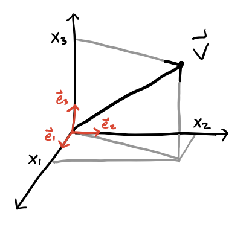

# Preliminaries

In this course we'll study the physical phenomena known as *electromagnetism*. At one level, electromagnetism can be thought of as the study of two types of closely-related forces, the *electrical force*, and the *magnetic force*. Originally, the electrical force was proposed to explain the fact that objects have a property known as *electric charge* which causes certain objects to repel each other and other objects to attract each other according to a particular force law, *Coulomb's Law*. 

The magnetic force arose from two different phenomena that later had to be unified. The first was the study of *ferromagnetic materials*, which were materials that tended to point in a particular direction, for example the needle of a compass which tends to point northward. The second was the behavior of *currents*, or charges moving through wires. Michael Faraday observed that a current moving through two wires causes them to attract or repel each other depending on the directions of the currents. This led to another force law, known as the *Biot-Savart Law*. It was later found that ferromagnets can also be thought of as tiny currents inside a material, thus unifying the two types of magnetism. 

The fact that magnetism arises from moving electric charges also provided a way to unify the dynamics of electricity and magnetism. A few years later it was discovered that electromagnetism explains a completely different phenomenon as well, *light*. Light was found to be a form of electromagnetic radiation at a particular range of frequencies.  The unification of these three phenomena (electricity, magnetism, and optics) into one theory was finally done by Maxwell with his well-known field equations. These equations are believed to fully describe all electromagnetic phenomena at the macroscopic level. 

It was eventually realized with the advent of quantum mechanics that even Maxwell's Equations needed to be modified at the microscopic level to account for quantum effects, like the discoveries that light is in fact made of photons and most materials are made of other fundamental particles like electrons and quarks. This more advanced topic is known as *quantum electrodynamics*.

In this course we'll study the theory of *classical electrodynamics*. We will conver the subject at the graduate level, meaning we will go give a more advanced treatment to many subjects in the field than is perhaps typical in most electrodynamics texts.

## Units

We'll start by saying a word about *units*. Typically in physics we need not think much about units. Abstractly the formulas look the same, whether the quantities involved are measured in meters, feet, or lightyears. However, electromagnetism has the unusual quirk that different unit systems lead to slightly different looking formulas. The reasons for this are largely historical, and very little if any physics is involved in the way these formulas look in different systems of units. An important implication of this frustrating quirk is that we have to be much more careful at the outset to specify which units we're using since it will affect the formulas involved in derivations and calculations. To start, we'll very briefly look at several different systems of units before committing to one for the rest of the course.

The foundation of systems of units in electromagnetism are forces on and due to the presence of charges and currents. It was found early on that there are two types of electric charge, positive and negative. Two like charges repel, while two opposite charges attract. The force between those charges also depends on the distance between them in a specific way. Suppose two charges $q_1$ and $q_2$ are separated from each other by a distance $r$. The magnitude of the force felt by the two charges is given by an inverse square law known as *Coulomb's Law*,
$$
F = k_e \frac{q_1 q_2}{r^2} \ .
$$
The proportionality constant $k_e$ is known as the *electric constant* whose dimension and value depends on choice of units. The quantity $k_e q_1 q_2$ can be measured in the lab by measuring the strength of the force and the distance between the two charges.

A little while later people figured out how to run moving charges, or *currents*, through wires. In studying the behavior of current flowing through two nearby parallel wires, it was found that the wires repel each other when the currents move in the same direction, and repel each other when the currents move in the opposite direction. The force also seemed to depend on the distance between the wires. Suppose two parallel wires a distance $r$ apart are carrying currents $I_1$ and $I_2$. Suppose each wire has the same fixed length $\ell$. Then the force experienced by the two wires due to the currents is given by *Ampere's Force Law*,

$$
\frac{dF}{d\ell} = 2k_m \frac{I_1 I_2}{r} \ .
$$
The proportionality constant $k_m$ is yet another constant that depends on units. The quantity $k_m I_1 I_2$ can be measured in the lab by measuring the strength of the force per unit length and the distance of separation between the two wires.

It was further realized later that these two phenomena can be generalized using the notion of *fields*. The force felt by a charge due to other charges can also be thought of as a force on a charge felt by an *electric field* $\mathbf{E}(\mathbf{x},t)$ that sums of the effects of all the other background charges. The force felt on a charge $q$ is evidently proportional to this electric field, $\mathbf{F} \propto q \mathbf{E}$. A similar description can be made for the forces felt on a moving charge, i.e. a current, due to the presence of a *magnetic field* $\mathbf{B}(\mathbf{x},t)$ that sums up the effects of all other background currents. This force felt on a moving charge $q$ is proportional to both its velocity $\mathbf{v}$ and the magnetic field, with $\mathbf{F} \propto q\mathbf{v} \times \mathbf{B}$. If we try to sum these two forces together to get the combined force on the moving charge we have to establish how the electric and magnetic fields dimensionally relate to each other. This combined force law is known as the *Lorentz Force Law*, given generally by
$$
\mathbf{F} = q \bigg(\mathbf{E} + \frac{\mathbf{v}}{\alpha} \times \mathbf{B}\bigg) \ .
$$
Here we introduce a new constant $\alpha$ to control the dimensional relationship between $\mathbf{E}$ and $\mathbf{B}$. Initially this was ignored and $\alpha=1$ was chosen without people really thinking about it. But later on it was realized that the two fields should actually be thought of as essentially the same object and should thus have the same dimensions. For this to be true, $\alpha$ must be chosen to be some constant with dimensions of velocity.

The three parameters $k_e, k_m, \alpha$ are not completely independent though. Most importantly, dimensional analysis and experiment force $k_e$ and $k_m$ to be related in a very specific way, namely by
$$
c^2 = \frac{k_e}{k_m} \ ,
$$
where $c$ is the *speed of light* in vacuum, a fundamental constant measured to be $c \approx 3 \cdot 10^{10} \ \frac{\text{cm}}{\text{s}}$. Several experiments already concluded that $c$ was indeed a universal constant with no dependence on choice of reference frame. This ratio evidently thus gives us a natural velocity scale, which coincidentally is what we'd need to fix $\alpha$ to make $\mathbf{E}$ and $\mathbf{B}$ to have the same units.

In the early days of electromagnetism the centimeter-gram-second or *CGS* system was already being widely used to measure mechanical quantities like length, mass, time, force, and energy. The unit of force was called the *dyne*, which comes out to $1 \ \text{dyne} = 10^{-5} \ \text{N}$, while the unit of energy was called the *erg*, which comes out to $1 \ \text{erg} = 10^{-7} \ \text{J}$. When electromagnetism came along it was realized these mechanical units needed to somehow be extended to cover electromagnetic phenomena as well, but that there were different all self consistent ways this could be done based on how $k_e, k_m, \alpha$ were specified.

Early on two unit systems arose to cover electromagnetism, one being used to measure electric quantities, and a completely different one used to measure magnetic quantities. The early system of units for electricity was called *electrostatic units* or the *ESU* system. This system defined $k_e\equiv\alpha\equiv1$, which then forced $k_m \equiv \frac{1}{c^2}$. This defined a natural unit of charge, later called the *electrostatic unit* or *esu*, with $1 \ \text{esu} \approx 3.3 \cdot 10^{-10} \ \text{C}$. An analogous system arose to study magnetism, called *electromagnetic units* or the *EMU* system. This system defined $k_m \equiv \alpha \equiv 1$, which then forced $k_e = c^2$. This defined a natural unit of current, later called the *absolute amp* or *abamp*, with $1 \ \text{abamp} = 10 \ \text{A}$ exactly.

It was found to be cumbersome to go back and forth between the two subjects since one had to change units to compare results. It was also eventually realized that having the electric and magnetic fields be different dimensions didn't make sense, as Einstein showed the two fields were really just the same field expressed in different reference frames. The two unit systems were then combined into yet a third system called the *Gaussian system*. The Gaussian system also uses CGS mechanical units, but takes
$$
k_e \equiv 1 \quad , \quad k_m \equiv \frac{1}{c^2} \quad , \quad \alpha \equiv c \ .
$$
This system had the benefit that the unit of charge was still the esu, but now the electric and magnetic fields have the same units. The unit of current is no longer the abamp, but instead the esu per second. The Gaussian system became popular among physicists, especially among theorists due to the fact that electricity and magnetism were treated on the same footing.

However, things played out differently on the engineering side. While physicists were studying electromagnetism in the lab, engineers were starting to use these ideas to build practical things like wires, motors, transformers, circuits, and radios. Engineers at the time didn't like the fact that when that CGS units were poorly scaled to measure everyday things like the current through a telegraph wire or the voltage across a resistor. They instead chose to use a different system based on the meter, kilogram, and second, called the *MKS* system. The abamp was seen as too big for electrical applications of the time, so they defined a smaller unit of current called the *amp* or *Ampere*, defined by $1 \ \text{A} \equiv 0.1 \ \text{abamp}$.

Later on, MKS units were extended to the rest of electromagnetism, but in a kind of quirky way. It was decided to define
$$
k_e \equiv \frac{1}{4\pi\varepsilon_0} \quad , \quad k_m \equiv \frac{\mu_0}{2\pi} \quad , \quad \alpha \equiv 1 \ .
$$
This odd definition was chosen out of the prevelant belief at the time that electromagnetic phenomena permuated in a fluid known as the *ether*, which they believed had a natural permittivity and permeability like any other material. This idea was later invalided through experiments, but the notation persists unfortunately. The division by $4\pi$ was arbitrary, done to *rationalize* out any factors of $\pi$ from Maxwell's equations. As with the ESU and EMU systems, the electric and magnetic fields be of the same units wasn't seen as an imperative, so no scaling by the speed of light was done either.

The constants $\varepsilon_0$ and $\mu_0$ were chosen as the more fundamental constants due to a misbelief that the vacuum was made of an electromagnetic fluid known as the *ether*, which was later falsified by experiment. These constants were tuned in the MKSA system specifically so that unit of current would come out to be exactly a tenth of an abamp. For this to work out consistently, they defined
$$
\mu_0 \equiv 4\pi \cdot 10^{-7} \ \frac{\text{N}}{\text{A}^2} \quad , \quad \varepsilon_0 \equiv \frac{10^7}{4\pi c^2} \approx 8.84 \cdot 10^{-14} \ \frac{\text{A}^2 \ \text{s}^4}{\text{kg} \ \text{m}^3} \ .
$$

This extended MKS system adds a fourth independent unit, the *Ampere*. All other electromagnetic quantities are then naturally defined in terms of the values of the meter, kilogram, second, and the Ampere. It's this system, sometimes called the *MKSA* system, that later become the *SI system* used widely today in science and engineering.

On top of all these systems yet another system of units for electromagnetism was defined that closely relates to the Gaussian system. This system of units is called the *Heaviside-Lorentz* system. It also uses the CGS system and takes $\alpha=c$, but it follows the MKSA system in choosing to rationalize out the factors of $4\pi$ from Maxwell's equations. It thus chooses
$$
k_e \equiv \frac{1}{4\pi} \quad , \quad k_m \equiv \frac{1}{4\pi c^2} \quad , \quad \alpha \equiv c \ .
$$
As with the Gaussian system, in the Heaviside-Lorentz the electric and magnetic fields again have the same units. The only real difference is that the measured units change by a factor of $4\pi$, and the factors of $4\pi$ are removed from Maxwell's equations.

Nowadays, the ESU and EMU systems are rarely if ever used. The SI system is of course widely used, particularly among experimentalists and engineers, as well as in essentially all modern undergraduate electromagnetism textbooks. The Heaviside-Lorentz system is favored by the particle physics community, perhaps because they often set $c=1$, which makes the formulas look similar to those in the SI system. The Gaussian system remains popular particularly among theoretical physicists due to its symmetric treatment of the electric and magnetic fields and its use of a single constant in formulas, the speed of light $c$.

While each choice of units has its benefits depending on the field of study and the application, in this course we will stick primarily with the *Gaussian* system of units, which is well-suited to a theoretical study of electromagnetism. To go back and forth between Gaussian and SI units in various formulas, a useful trick that often works (but not always) is to make the identification
$$
\varepsilon_0 \leftrightarrow \frac{1}{4\pi} \quad , \quad \mu_0 \leftrightarrow \frac{4\pi}{c} \ .
$$

Below is a table of various electromagnetism formulas expressed in the three unit systems still in widespread use today. We'll define or derive all of these formulas in more details in later lessons.

|  | Gaussian | Heaviside-Lorentz | SI |
| ------ | ------ | ------ | ------ |
| **Electric Field** | $\mathbf{E} = -\nabla \Phi + \frac{1}{c}\frac{\partial \mathbf{A}}{\partial t}$ | $\mathbf{E} = -\nabla \Phi + \frac{1}{c}\frac{\partial \mathbf{A}}{\partial t}$ | $\mathbf{E} = -\nabla \Phi + \frac{\partial \mathbf{A}}{\partial t}$ |
| **Magnetic Field** | $\mathbf{B} = \nabla \times \mathbf{A}$ | $\mathbf{B} = \nabla \times \mathbf{A}$ | $\mathbf{B} = \nabla \times \mathbf{A}$ |
| **Coulomb's Law** | $\mathbf{E} = \frac{q}{r^2} \mathbf{e}_r$ | $\mathbf{E} = \frac{1}{4\pi}\frac{q}{r^2} \mathbf{e}_r$ | $\mathbf{E} = \frac{1}{4\pi\varepsilon_0}\frac{q}{r^2} \mathbf{e}_r$ |
| **Biot-Savart Law** | $d\mathbf{B} = \frac{I}{c} \frac{d\boldsymbol{\ell} \times \mathbf{e}_r}{r^2}$ | $d\mathbf{B} = \frac{I}{4\pi c} \frac{d\boldsymbol{\ell} \times \mathbf{e}_r}{r^2}$ | $d\mathbf{B} = \frac{\mu_0 I}{4\pi} \frac{d\boldsymbol{\ell} \times \mathbf{e}_r}{r^2}$ |
| **Lorentz Force Law** | $\mathbf{F} = q\mathbf{E} + q\frac{\mathbf{v}}{c} \times \mathbf{B}$ | $\mathbf{F} = q\mathbf{E} + q\frac{\mathbf{v}}{c} \times \mathbf{B}$ | $\mathbf{F} = q\mathbf{E} + q\mathbf{v} \times \mathbf{B}$ |
| **Displacement Field** | $\mathbf{D} = \mathbf{E} + 4\pi \mathbf{P}$ | $\mathbf{D} = \mathbf{E} + \mathbf{P}$ | $\mathbf{D} = \varepsilon_0 \mathbf{E} + \mathbf{P}$ |
| **Magnetizing Field** | $\mathbf{H} = \mathbf{B} - 4\pi \mathbf{M}$ | $\mathbf{H} = \mathbf{B} - \mathbf{M}$ | $\mathbf{H} = \frac{1}{\mu_0}\mathbf{B} - \mathbf{M}$ |
| **Gauss's Law** | $\nabla \cdot \mathbf{E} = 4\pi \rho$ | $\nabla \cdot \mathbf{E} = \rho$ | $\nabla \cdot \mathbf{E} = \frac{\rho}{\varepsilon_0}$ |
| **Faraday's Law** | $\nabla \times \mathbf{E} = -\frac{1}{c} \frac{\partial \mathbf{B}}{\partial t}$ | $\nabla \times \mathbf{E} = -\frac{1}{c}\frac{\partial \mathbf{B}}{\partial t}$ | $\nabla \times \mathbf{E} = -\frac{\partial \mathbf{B}}{\partial t}$ |
| **Gauss's Law for Magnetism** | $\nabla \cdot \mathbf{B} = 0$ | $\nabla \cdot \mathbf{B} = 0$ | $\nabla \cdot \mathbf{B} = 0$ |
| **Ampere-Maxwell Law** | $\nabla \times \mathbf{B} = \frac{4\pi}{c} \mathbf{J} + \frac{1}{c} \frac{\partial \mathbf{E}}{\partial t}$ | $\nabla \times \mathbf{B} = \frac{1}{c} \mathbf{J} + \frac{1}{c} \frac{\partial \mathbf{E}}{\partial t}$ | $\nabla \times \mathbf{B} = \mu_0 \mathbf{J} + \mu_0 \varepsilon_0 \frac{\partial \mathbf{E}}{\partial t}$ |
| **Continuity Equation** | $\nabla \cdot \mathbf{J} = -\frac{\partial \rho}{\partial t}$ | $\nabla \cdot \mathbf{J} = -\frac{\partial \rho}{\partial t}$ | $\nabla \cdot \mathbf{J} = -\frac{\partial \rho}{\partial t}$ |
| **Ohm's Law** | $\mathbf{J} = \sigma \mathbf{E}$ | $\mathbf{J} = \sigma \mathbf{E}$ | $\mathbf{J} = \sigma \mathbf{E}$ |
| **Energy Density** | $u = \frac{1}{8\pi} (|\mathbf{E}|^2 + |\mathbf{B}|^2)$ | $u = \frac{1}{2} (|\mathbf{E}|^2 + |\mathbf{B}|^2)$ | $u = \frac{\varepsilon_0}{2} |\mathbf{E}|^2 + \frac{1}{2\mu_0} |\mathbf{B}|^2$ |
| **Poynting Vector** | $\mathbf{S} = \frac{c}{4\pi} \mathbf{E} \times \mathbf{B}$ | $\mathbf{S} = c \mathbf{E} \times \mathbf{B}$ | $\mathbf{S} = \frac{1}{\mu_0} \mathbf{E} \times \mathbf{B}$ |

## Vectors

We will now give a very brief review of some important mathematical results that will be important in our study of electrodynamics. We will not prove anything here nor provide many if any examples, as this is all assumed to be review.

As in mechanics, in electrodynamics we generally assume that physical objects live in a 3-dimensional real space, often denoted by the set $\mathbb{R}^3$. A *vector* or *3-vector* we'll define as a 3-component object $\mathbf{v}$ that lives in $\mathbb{R}^3$. The 3 components of the vector depend on the choice of *coordinate system* or *basis* chosen. In Cartesian coordinates we can expand a vector as a superposition of unit vectors aligned with the coordinate axes,
$$
\mathbf{v} = v_x \mathbf{e}_x + v_y \mathbf{e}_y + v_z \mathbf{e}_z = v_1 \mathbf{e}_1 + v_2 \mathbf{e}_2 + v_3 \mathbf{e}_3 \ .
$$

The second representation of using numerical indices to represent the components in order will be useful for us, as we'll often express superpositions like this using summation notation, or more conveniently using the *Einstein summation convention*,
$$
\mathbf{v} \equiv v_i \mathbf{e}_i \equiv \sum_{i=1}^3 v_i \mathbf{e}_i \ .
$$
Recall the summation convention says that if a term has a repeated index a summation over all values of that index is implied. In this case, $v_i \mathbf{e}_i$ has the repeated index $i$, which is assumed to sum from 1 to 3. Any index that does not repeat does not get summed over. We'll sometimes express a vector only by its components $v_i$, where the basis is left unspecified. This is called *index notation*. It's fully equivalent to vector notation but sometimes more convenient when doing complex vector calculations. We'll go back and forth between these two notations in this course.

For a vector to be a valid physical object, we require it transform in a specific way under coordinate transformations. Suppose in one rectangular coordinate system we have coordinates $x_i$ and in another rotated coordinate system we have coordinates $x_i'$. Then for $\mathbf{v}$ to be a valid vector we require that for any such choice of coordinates we have
$$
\mathbf{v} = v_i \mathbf{e}_i = v_i' \mathbf{e}_i' \ .
$$
We can express this more succinctly by saying that
$$
v_j' = \frac{\partial x_j'}{\partial x_i} v_i \ .
$$
This set of $3^2 = 9$ partial derivatives is called the *Jacobian* between the coordinates $x_i$ and $x_i'$. Notice the implied summation going on over $i$. This means the right-hand side will contain only 3 elements indexed by $j$. These partial derivatives can be collected into a matrix called the *Jacobian matrix*, which is often denoted by $\mathbf{J}$ or $\mathbf{J}(\mathbf{x},\mathbf{x}')$. The Jacobian is a surprisingly important object in vector calculus as we'll see. Note that by definition, any linear superposition of valid vectors will also be a valid vector.

We can thus think of a vector as a one index, or *rank-1*, object that transforms in the manner specified above. A simpler object with no index, or *rank-0*, defines a *scalar*. A *scalar* is a single number that doesn't change under coordinate transformations. An important example of a scalar is the *dot product* or *inner product* between two vectors, defined in Euclidean space by
$$
\mathbf{v} \cdot \mathbf{w} \equiv v_i w_i = v_1 w_1 + v_2 w_2 + v_3 w_3 \ .
$$
Recall from elementary physics that we can also express the dot product in terms of the angle $\theta$ between the two vectors as
$$
\mathbf{v} \cdot \mathbf{w} = |\mathbf{v}| |\mathbf{w}| \cos\theta \ .
$$
Here $|\mathbf{v}| \equiv \sqrt{\mathbf{v} \cdot \mathbf{v}}$ is the *norm* or *magnitude* of $\mathbf{v}$. This formula says that in some sense the dot product encodes information about both the magnitude of vectors as well as the angles between them. When $|\mathbf{v}|=1$ we say $\mathbf{v}$ is a *unit vector*, which in this course we'll usually denote by $\mathbf{e}_v$. Evidently the dot product of two vectors is zero if they're perpendicular, in which case we call the two vectors *orthogonal*. When the two vectors are parallel or antiparallel their dot product is $\pm 1$.

As long as coordinate transformations are rotations, the dot product will always be a scalar. As an exercise in using index notation let's prove this. When working in index notation we need to convert every object we need to an indexed object. Since $\mathbf{v}$ and $\mathbf{w}$ are vectors, they both get one index. Since their components get summed over in the dot product, the indices on the two vectors should be the same.

We're now ready to proceed with the proof. We need to show that under a coordinate transformation the dot product stays invariant under rotations. Starting with the dot product in $x_i'$ coordinates, and denoting the partial derivatives in the Jacobian between $x_i$ and $x_i'$ coordinates by $J_{ij}$, we have
$$
v_i' w_i' = v_i' w_j' = (J_{ij} v_j) (J_{ik} w_k) = J_{ij} J_{ik} v_i w_k  \ .
$$
Now, we need the right-hand side to equal $v_i w_i$. The only way this can be true is if $J_{ij} J_{ik} = \delta_{jk}$. Then we get
$$
v_i' w_i' = J_{ij} J_{ik} v_i w_k = \delta_{jk} v_i w_k = v_j w_j  \ .
$$
Now, the index being summed over is a *dummy index*, meaning it doesn't matter how we label it as long as we're consistent. We can thus freely relabel $j$ to $i$ and write $v_i' w_i' = v_i w_i$, which is what we wanted to show. 

For this proof to work, however, we had to impose the fact that $J_{ij} J_{ik} = \delta_{jk}$. This is just saying that the Jacobian times its transpose should equal the identity, i.e. $\mathbf{J}^\top \mathbf{J} = \mathbf{I}$. What kinds of transformations satisfy this property? Recall that this is just the definition of an *orthogonal transformation*. An orthogonal transformation is precisely a transformation that preserves the dot products between vectors. From the elementary definition of the dot product, this also means an orthogonal transformation preserves the *angles* between vectors. Note that such transformations need not preserve the *handedness* between the vectors. Since $\det \mathbf{J} = \pm 1$ for orthogonal transformations, there are two cases. It's the $+1$ case that preserves handedness, while the $-1$ case flips the order between the vectors.

It's fair to ask what happens when the coordinate transformation isn't orthogonal. In that case, we define $\mathbf{g} \equiv \mathbf{J}^\top \mathbf{J}$, in which case we then define $\mathbf{x} \cdot \mathbf{y} \equiv x_i g_{ij} y_j$. Here $\mathbf{g}$ is called the *metric*. It says something about the geometry of the two coordinate transformations. With this generalized form of the dot product it again becomes a proper scalar regardless of what $\mathbf{J}$ is. We'll see this more general dot product again when we get to relativistic electrodynamics towards the end of the course. Indeed, the presence of $\mathbf{g}$ is one of the defining features of relativity, both special and general relativity.

We know that vectors in 3 dimensions also have another kind of product that creates vectors from vectors. This other product is called the *cross product*, which in index notation can be defined by
$$
(\mathbf{x} \times \mathbf{y}) \equiv \varepsilon_{ijk} x_i y_j \mathbf{e}_k \ .
$$
Here $\varepsilon_{ijk}$ is the *Levi-Civita symbol*, defined to be $+1$ for even permutations of $ijk$, $-1$ for odd permutations of $ijk$, and $0$ when any of the indices are repeated. Written out in components, it's not hard to show that
$$
\mathbf{v} \times \mathbf{w} = (v_y w_z - v_z w_y) \mathbf{e}_x + (v_z w_x - v_x w_z) \mathbf{e}_y + (v_x w_y - v_y w_x) \mathbf{e}_z \ .
$$
We know that the cross product between two vectors can also be expressed geometrically, where its magnitude is given by
$$
|\mathbf{v} \times \mathbf{w}| = |\mathbf{v}| |\mathbf{w}| \sin\theta \ ,
$$
while its direction is given by the *right-hand rule*. The cross product evidently defines a favored orientation in space. If a plane contains the two vectors $\mathbf{v}$ and $\mathbf{w}$, its positive orientation or *normal* is the direction of $\mathbf{v} \times \mathbf{w}$. Evidently, this version of the cross product says that the cross product of two parallel vectors is $\mathbf{0}$. Note the cross product is neither commutative nor associative.

It's worth pointing out that despite the hand-waving, the cross product is not *really* a vector in the sense we've defined what a vector really is, an object that transforms a certain way under coordinate transformations. The cross product in general does *not* transform correctly under coordinate transformations. For example, under an *inversion* $\mathbf{v} \rightarrow -\mathbf{v}, \mathbf{w} \rightarrow -\mathbf{w}$ their cross product remains $\mathbf{v} \times \mathbf{w}$. It doesn't become $-\mathbf{v} \times \mathbf{w}$ like we'd require. For this reason the cross product is properly thought of as a *pseudovector*, in that in a lot of ways it behaves like a vector, but not in all ways. In fact, properly speaking the cross product should be thought of as an antisymmetric tensor. We'll say more about this below.

The Levi-Civita symbol is a useful symbol in its own right, independent of the cross product. We'll need to understand its algebra a bit better since we'll use this symbol frequently in this course. One useful fact is that swapping two indices introduces a negative sign. For example, swapping $i \leftrightarrow j$ gives $\varepsilon_{jik} = -\varepsilon_{ijk}$. We can use this fact to show that the cross product is perpendicular to the plane spanned by the two vectors. We can do this by showing $\mathbf{v} \cdot (\mathbf{v} \times \mathbf{w}) = 0$. That is, that $\mathbf{v}$ is *orthogonal* to $\mathbf{v} \times \mathbf{w}$, which by the geometric version of the dot product means the two are perpendicular. In index notation, we have
$$
\mathbf{v} \cdot (\mathbf{v} \times \mathbf{w}) = \varepsilon_{ijk} v_j w_k (\mathbf{v} \cdot \mathbf{e}_i) = v_i \varepsilon_{ijk} v_j w_k = -v_i \varepsilon_{jik} v_j w_k = -v_j \varepsilon_{ijk} v_i w_k \ .
$$
Notice we have $\varepsilon_{ijk} x_i x_j y_k = -\varepsilon_{ijk} x_i x_j y_k$, which can only be true of both are zero, as we wanted to show.

Another surprisingly useful identity of the Levi-Civita symbol is gotten by *contracting* their product to get
$$
\boxed{
\varepsilon_{ijk} \varepsilon_{k\ell m} = \delta_{i\ell} \delta_{jm} - \delta_{im} \delta_{j\ell} 
} \ .
$$

##### Example: BAC-CAB rule

As an application of this identity, we'll use it to prove the well-known *BAC-CAB* rule for triple products,
$$
\mathbf{a} \times (\mathbf{b} \times \mathbf{c}) = \mathbf{b} (\mathbf{a} \cdot \mathbf{c}) - \mathbf{c} (\mathbf{a} \cdot \mathbf{b}) \ .
$$
Let $\mathbf{d} = \mathbf{a} \times (\mathbf{b} \times \mathbf{c})$ for convenience. Writing this out in index notation and applying the previous identity, we have
$$
\begin{align*}
d_i &= [\mathbf{a} \times (\mathbf{b} \times \mathbf{c})]_i \\
&= \varepsilon_{ijk} a_j (\mathbf{b} \times \mathbf{c})_k \\
&= \varepsilon_{ijk} \varepsilon_{k\ell m} a_j b_\ell c_m \\
&= (\delta_{i\ell} \delta_{jm} - \delta_{im} \delta_{j\ell}) a_j b_\ell c_m \\
&= \delta_{i\ell} \delta_{jm} a_j b_\ell c_m - \delta_{im} \delta_{j\ell} a_j b_\ell c_m \\
&= a_j b_i c_j - a_j b_j c_i \\
&= (\mathbf{a} \cdot \mathbf{c}) b_i - (\mathbf{a} \cdot \mathbf{b}) c_i \ .
\end{align*}
$$
Written back out in vector notation this gives exactly what we wanted to show.

---

The last curious fact of the Levi-Civita symbol that we'll mention but not really use is that we can use it to write out the determinant of a $3 \times 3$ matrix. If a matrix $\mathbf{A}$ has column vectors $\mathbf{a}, \mathbf{b}, \mathbf{c}$, then we have
$$
\det \mathbf{A} = \varepsilon_{ijk} a_i b_j c_k \ .
$$
While cute, this formula only works in 3 dimensions. In other dimensions we'd have to use generalizations of the Levi-Civita symbol to get a formula like this, and even then they're not actually useful for *calculating* the determinant.

## Vector Calculus

Calculus extends naturally to higher dimensions, but often in subtle ways. Most importantly, there are different types of derivatives and integrals defined in higher dimensions with different meaning and applications. Due to complications involved in using curvilinear coordinates in vector calculus we'll state results in Cartesian coordinates and address the others later.

### Differential Vector Calculus

The fundamental object of vector calculus is the *differential* of a field. This says how much the field changes if its inputs are nudged in some direction by an infinitesimal amount. In Cartesian coordinates, it turns out the differential of a scalar field $f(\mathbf{x})$ is nothing more than a sum of partial differentials along each coordinate. That is,
$$
df = \frac{\partial f}{\partial x} dx + \frac{\partial f}{\partial y} dy + \frac{\partial f}{\partial z} dz \ .
$$
The right-hand side looks like a sort of dot product between the partial derivatives of $f$ and a differential displacement vector $d\mathbf{x}$, or *vector line element*, defined in Cartesian coordinates by
$$
d\mathbf{x} \equiv dx \mathbf{e}_x + dy \mathbf{e}_y + dz \mathbf{e}_z \ .
$$
It's the vector generalization of the differential $dx$ from ordinary calculus. The vector of partial derivatives can be written in a useful way by defining the *del operator* $\nabla$ by
$$
\nabla \equiv \partial_i \mathbf{e}_i \equiv \frac{\partial}{\partial x} \mathbf{e}_x + \frac{\partial}{\partial y} \mathbf{e}_y + \frac{\partial}{\partial z} \mathbf{e}_z \ .
$$
 Here we introduce the convenient shorthand $\partial_i \equiv \frac{\partial}{\partial x_i}$ for the partial derivative with respect to component $x_i$. Using the del operator we can define the vector of partial derivatives of a scalar field $f$ by
$$
\nabla f \equiv \partial_i f \ \mathbf{e}_i \equiv \frac{\partial f}{\partial x} \mathbf{e}_x + \frac{\partial f}{\partial y} \mathbf{e}_y + \frac{\partial f}{\partial z} \mathbf{e}_z \ .
$$
This quantity is evidently some kind of vector derivative, called the *gradient* of the field $f$. Since $f$ is a scalar field, $\nabla f$ will be a vector field. Its components are the partial derivatives of $f$ in the $x_i$ direction at each $\mathbf{x}$. The gradient always points perpendicular to the *level curves* where $f=\text{const}$. To see why this is the case, we can use the geometric formula for the dot product to express any change in the function along a level curve as
$$
\delta f = \nabla f \cdot \delta \mathbf{x} = |\nabla f| |\delta \mathbf{x}| \cos\theta \ .
$$
Since $\delta f = 0$ along the level curve by definition, it must be the case that $\theta = \pm 90^\circ$ along such curves, meaning that the gradient must always be orthogonal to the level curve.

Using the gradient, we can finally express the differential $df$ as a dot product of the gradient with the vector line element,
$$
df = \nabla f \cdot d\mathbf{x} \ .
$$
Unlike in ordinary calculus, however, in vector calculus this isn't the only kind of derivative we can take. We can see this by looking at the definition of $\nabla$. We can think of $\nabla f$ as multiplying a vector by a scalar. But we also know that we can take both the dot product and the cross product of two vectors, which along with $\nabla$ suggests there are two more derivative operations we can perform on vector fields.

If $\mathbf{F}(\mathbf{x})$ is a vector field, we can take its dot product of $\nabla$ with $\mathbf{F}$ to get a new scalar field known as the *divergence*, which is evidently defined in Cartesian coordinates by
$$
\nabla \cdot \mathbf{F} \equiv \partial_i F_i \equiv \frac{\partial f}{\partial x} + \frac{\partial f}{\partial y} + \frac{\partial f}{\partial z} \ .
$$
Though not obvious from the definition, the divergence represents the tendency of a vector to flow into or out of a point. A field where $\nabla \cdot \mathbf{F} = 0$ for all points in space has no divergence at all, meaning there are no sources or sinks in the field anywhere. Due to the fact that the magnetic field is the canonical example of a divergence-less vector field, such fields are often called *solenoidal*.

We can also take the cross product of $\nabla$ with $\mathbf{F}(\mathbf{x})$ to get a vector field known as the *curl*, defined in Cartesian coordinates by
$$
\nabla \times \mathbf{F} \equiv \varepsilon_{ijk} \partial_i F_j \mathbf{e}_k \ .
$$

Though again not obvious from the definition, the curl represents the tendency of a vector to rotate around a point in space. A field where $\nabla \times \mathbf{F} = \mathbf{0}$ at all points in space is called *irrotational* since it doesn't experience any rotational motion at any point. It just flows inward or outward.

We can also take vector second derivatives as well. The most useful of these is obtained by taking the divergence of the gradient of a scalar field. This is called the *Laplacian*, defined in Cartesian coordinates by
$$
\nabla^2 f \equiv \nabla \cdot \nabla f = \partial_i \partial_i f = \frac{\partial^2 f}{\partial x^2} + \frac{\partial^2 f}{\partial y^2} + \frac{\partial^2 f}{\partial z^2} \ .
$$
The Laplacian has the useful property of being rotationally invariant. That is, if $\nabla$ represents the del operator in some coordinate system $\mathcal{S}$ and $\nabla'$ the same operator in some rotated coordinate system $\mathcal{S}'$, then $(\nabla')^2 = \nabla^2$. This follows from the fact that the Laplacian applied to any function gives a scalar, and scalars are by definition invariant under coordinate transformations.

There are a few other vector second derivatives as well, some of which turn out to be zero. These are
$$
\begin{align*}
\nabla \cdot (\nabla \times \mathbf{F}) &= 0 \ , \\
\nabla \times \nabla f &= \mathbf{0} \ , \\
\nabla \times (\nabla \times \mathbf{F}) &= \nabla (\nabla \cdot \mathbf{F}) - \nabla^2 \mathbf{F} \ .
\end{align*}
$$
The Laplacian in the last expression is understood to be taken component-wise, as a vector with components $\nabla^2 F_i$. Each of these identities can all be efficiently proven using index notation.

### Integral Vector Calculus

The gradient, divergence, and curl each has its own corresponding version of the fundamental theorem of calculus. To understand integration in higher dimensions though we first need to define what the differentials are. To integrate over a spatial volume we use the *volume element* $d^3 \mathbf{x}$, defined in Cartesian components by
$$
d^3 \mathbf{x} \equiv dx dy dz \ .
$$
An important fact about the volume element is that its expression in a given coordinate system depends on the Jacobian. If $\mathbf{u}(\mathbf{x})$ is some coordinate transformation with Jacobian $\mathbf{J} \equiv \frac{d\mathbf{u}}{d\mathbf{x}}$, then their volume elements are related by
$$
d^3 \mathbf{x} = du_1 du_2 du_3 = |\det \mathbf{J}| dx_1 dx_2 dx_3 \ .
$$
To find the *volume integral* of a scalar field $f$ over a region of space $\mathcal{V}$, we can integrate each coordinate iteratively,
$$
\int_\mathcal{V} d^3 \mathbf{x} \ f(\mathbf{x}) = \iiint_\mathcal{V} dx dy dz \ f(x,y,z) \ .
$$
We can integrate a vector field over a volume too. In this case the integral is done component-wise, so little new is added.

Sometimes we'll also need to integrate a field over a *surface* in space as well. Suppose we wish to integrate over some smooth, orientable surface $\mathcal{S}$ in space. We can define an *area element* $d\mathbf{a}$ on this surface by considering an infinitesimal patch of area $da$ on the surface and attaching an outward unit normal $\mathbf{n}$ to it to get
$$
d\mathbf{a} \equiv \mathbf{n} \ da \ .
$$
It's fair to ask how $da$ itself is determined. When the surface is the $xy$-plane it's clear $da = dxdy$. But for more general surfaces we'd need to parametrize $\mathcal{S}$ with two relative coordinates and express $da$ in terms of those. Evidently the area element $d\mathbf{a}$ is a kind of vector. We can thus also think of it as the cross product of two infinitesimal vectors on the surface. Importantly, this means $d\mathbf{a}$ will have both a magnitude and a direction that depend on where we are along the surface. When we require the surface be orientable, we mean that we can always use the right-hand rule to find the direction of $\mathbf{n}$.

To get the *surface integral* of a vector field $\mathbf{F}$ along the surface $\mathcal{S}$ we'd typically write
$$
\int_\mathcal{S} \mathbf{F} \cdot d\mathbf{a} = \int_\mathcal{S} \mathbf{F} \cdot \mathbf{n} \ da \ .
$$
The last form of vector integration we'll find ourselves using frequently is *contour integration*, which is the integration of a field along some arbitrary curve in space. We can integrate a vector field $\mathbf{F}$ along some *path* or *contour* $\mathcal{C}$ in space by defining a *line element* $d\boldsymbol{\ell}$ along the contour, defined in Cartesian coordinates by
$$
d\boldsymbol{\ell} \equiv d\mathbf{x} = dx \mathbf{e}_x + dy \mathbf{e}_y + dy \mathbf{e}_y \ .
$$
The contour integral is just an infinitesimal sum of the projection of the field along the contour, i.e.
$$
\int_\mathcal{C} \mathbf{F}(\mathbf{x}) \cdot d\boldsymbol{\ell} \ .
$$
The usual way to evaluate a contour integral is to parametrize the path with some real parameter $\tau$ from some starting point $\tau=a$ to some ending point $\tau = b$. Then we have
$$
\int_\mathcal{C} \mathbf{F}(\mathbf{x}) \cdot d\boldsymbol{\ell} \equiv \int_a^b d\tau \ \mathbf{F}(\mathbf{x}(\tau)) \cdot \frac{d\mathbf{x}}{d\tau} \ .
$$
We can also integrate a scalar field $f$ over the same contour by defining a similar contour integral of the form
$$
\int_\mathcal{C} ds \ f(\mathbf{x}) =  \int_a^b d\tau \ f(\mathbf{x}(\tau)) \bigg |\frac{d\mathbf{x}}{d\tau} \bigg | \ .
$$
Here $ds$ is the scalar line element defined in Cartesian coordinates by
$$
ds = |d\boldsymbol{\ell}| = \sqrt{dx^2 + dy^2 + dy^2} \ .
$$
Integrating over $ds$ alone gives the *arc length* of the contour. Interestingly the scalar line element is very important in studying the geometry of a space. In general it depends on the metric $\mathbf{g}$ by
$$
ds^2 = dx_i g_{ij} dx_j \ .
$$
For Euclidean space the metric is always the identity, so we just have $ds^2 = dx_i dx_i$. This is all we'll need for most of this course, but in relativity (especially general relativity) this line element becomes fundamental.

Usually a path integral between two endpoints will depend on the exact path of the contour $\mathcal{C}$. For some special fields though the path integral depends only on the endpoints, not on the path between them. When this is true we say the field is *conservative*. An implication of this is that if we integrate a conservative field around any *closed contour* where the path integral vanishes,
$$
\oint \mathbf{F} \cdot d\mathbf{x} = 0 \ .
$$
It's easy to see why this must be true. For any closed contour we can break it into two pieces. The line integral of each piece must be path independent, which means their sum, and hence the closed path integral, must vanish for conservative fields.

In vector calculus, each version of vector derivative has its own fundamental theorem of calculus that relates it to one or more of the integrals defined above. The fundamental theorem for gradients says the line integral of the gradient of a scalar field depends only on the endpoints,
$$
\int_{\mathbf{x}_1}^{\mathbf{x}_2} \nabla f(\mathbf{x}) \cdot d\mathbf{x} = f(\mathbf{x}_2) - f(\mathbf{x}_1) \ .
$$
This means that the gradient of a scalar field is always *conservative*. In fact, it turns out any conservative vector field $\mathbf{F}(\mathbf{x})$ can be written as the gradient of some scalar field $\phi(\mathbf{x})$,
$$
\mathbf{F} = -\nabla \phi \ .
$$
This fact we use extensively in electromagnetism. The minus sign is merely a physics convention. Since the curl of a gradient must vanish, this statement also says $\mathbf{F}$ must be irrotational, i.e. $\nabla \times \mathbf{F} = \mathbf{0}$.

A more general extension of this special case is called the *Helmholtz theorem*. It says *any* smooth vector field $\mathbf{F}(\mathbf{x})$, conservative or not, can be expressed as the *gradient* of some *scalar field* $\phi(\mathbf{x})$ plus the *curl* of some other *vector field* $\mathbf{A}(\mathbf{x})$, i.e.
$$
\mathbf{F} = -\nabla \phi + \nabla \times \mathbf{A} \ .
$$
Though not obvious, this formula in fact can be inverted to find formulas for $\phi$ and $\mathbf{A}$ in terms of derivatives of $\mathbf{F}$,
$$
\begin{align*}
\phi(\mathbf{x}) &= \frac{1}{4\pi} \int_{\mathbb{R}^3} d^3 \mathbf{x}' \ \frac{\nabla' \cdot \mathbf{F}(\mathbf{x}')}{|\mathbf{x} - \mathbf{x}'|} \ , \\
\mathbf{A}(\mathbf{x}) &= \frac{1}{4\pi} \int_{\mathbb{R}^3} d^3 \mathbf{x}' \ \frac{\nabla' \times \mathbf{F}(\mathbf{x}')}{|\mathbf{x} - \mathbf{x}'|} \ .
\end{align*}
$$
Here it's implicitly assumed that $\mathbf{F}$ vanishes faster than $\frac{1}{r}$ at infinity. If not we have to include extra boundary terms. The symbol $\nabla'$ means to differentiate with respect to the integration variable $\mathbf{x}'$.

The fundamental theorem for divergences is called the *divergence theorem*. It says that the divergence of a vector field is nothing more than the flow or *flux* of the field through the surface of a closed volume,
$$
\int_\mathcal{V} \nabla \cdot \mathbf{F} \ d^3\mathbf{x} = \int_S \mathbf{F} \cdot d\mathbf{a} \ .
$$
The fundamental theorem for curls is called *Stokes' theorem*. It says the curl of a vector field is nothing more than the *circulation* of the field around the boundary of any closed surface,
$$
\int_\mathcal{S} (\nabla \times \mathbf{F}) \cdot \ d\mathbf{a} = \int_C \mathbf{F} \cdot d\mathbf{x} \ .
$$
It's interesting to note that all of these versions of the fundamental theorem of calculus say essentially the same thing: The integral of the derivative of a field over some space equals the value of that field along the boundary of that space. For gradients, the boundary of a contour is just two endpoints. For divergences, the boundary over a volume is a closed surface. For curls, the boundary of a surface is a closed contour.

We can use the divergence theorem to derive two more important integral formulas that we'll use, the *Green's Identities*. What we'll do is let $\mathbf{F} = \psi \nabla \phi$, where $\psi$ and $\phi$ are two scalar fields that may or may not be different. We want to plug this into the divergence theorem, but first we need to figure out the product rule formula for $\nabla \cdot (\psi \nabla \phi)$. This can be done, for example, using index notation. It turns out that
$$
\nabla \cdot (\psi \nabla \phi) = \nabla \psi \cdot \nabla \phi + \psi \nabla^2 \phi \ .
$$
Plugging this into the divergence theorem formula, we then get *Green's First Identity*, which says that
$$
\int_\mathcal{V} d^3 \mathbf{x} \ (\nabla \psi \cdot \nabla \phi + \psi \nabla^2 \phi) = \oint_\mathcal{S} da \ \psi \frac{\partial \phi}{\partial n} \ .
$$
Here we've defined the *normal derivative* $\frac{\partial \phi}{\partial n} \equiv \nabla \phi \cdot \mathbf{n}$, which just says how much $\phi$ changes in the direction normal to the boundary surface $\mathcal{S}$. If we now swap $\psi$ and $\phi$ and difference the two formulas, we get another identity, called *Green's Second Identity*, given by
$$
\int_\mathcal{V} d^3 \mathbf{x} \ (\phi \nabla^2 \psi - \psi \nabla^2 \phi) = \oint_\mathcal{S} da \ \bigg[\phi \frac{\partial \psi}{\partial n} - \psi \frac{\partial \phi}{\partial n} \bigg] \ .
$$
We'll see frequent use of each of these integral formulas throughout the course.

## Tensors

Thus far we've seen objects with no indices and objects with one index that transform in a specified way under coordinate transformations. It's fair to ask whether we can define matrices that transform in a specific way as well, and in fact we can. These two-index objects are called *rank-2 tensors*. They're matrices $\mathbf{T}$ that obey the transformation law
$$
\mathbf{T}(\mathbf{x}') = \mathbf{J}^\top \mathbf{T}(\mathbf{x}') \mathbf{J} \ .
$$
This is just a direct generalization of the vector transformation law. It's easier to see this in index notation. Vectors obey the transformation law $v_i' = J_{ij} v_j$, while rank-2 tensors obey the transformation law
$$
T_{ij}' =  J_{ik} J_{j\ell} T_{k\ell} \ .
$$
Roughly speaking, this just says each dimension of the tensor transforms itself as a vector would.

While tensors didn't show up transparently in elementary physics courses, they show up a lot in more advanced physics. A lot of physical quantities are tensors: the metric tensor, the moment of inertia tensor, the strain tensor, and so on. Another example is the *cross product*. The cross product seems like a vector, but it's really not. In fact, we can define the cross product in a slightly different way using a rank-2 tensor as
$$
\varepsilon_{ijk} (\mathbf{v} \times \mathbf{w})_k = v_i w_j - v_j w_i
$$
In this variant definition the cross product is no longer a vector, but a rank-2 tensor whose upper diagonal components are the usual components of the cross product in 3 dimensions. Represented as a matrix $\mathbf{A}$, it looks like
$$
A_{ij} \equiv \varepsilon_{ijk} (\mathbf{v} \times \mathbf{w})_k \doteq
\begin{pmatrix}
0 & v_1 w_2 - v_2 w_1 & v_1 w_3 - v_3 w_1  \\
v_2 w_1 - v_1 w_2 & 0 & v_2 w_3 - v_3 w_2 \\
v_3 w_1 - v_1 w_3 &  & 0 \\
\end{pmatrix}
\ .
$$
Here $\mathbf{A}$ is a rank-2 tensor that evidently satisfies the *antisymmetric* property $A_{ij} = -A_{ji}$. Unlike with the regular cross product, this generalization of the cross product can be defined for any number of dimensions. To see why we can't extend the usual cross product this way, notice that the components $\mathbf{v} \times \mathbf{w}$ lie in the upper diagonal of $\mathbf{A}$. The diagonals are always zero, and the lower diagonal is just minus the upper diagonal, meaning there are only 3 independent components. For a general antisymmetric tensor in $d$ dimensions there will be $\frac{1}{2}d(d-1)$ such independent components in the upper diagonal. Insisteng that such a tensor be a vector is equivalent to requiring $d=\frac{1}{2}d(d-1)$, which evidently can only be true when $d=3$. Thus, the cross product can only be a vector in 3 dimensions.

One useful operation that we can do with tensors is *contraction*. Contraction is the tensor generalization of the inner product, obtained by setting two indices in a tensor equal and summing over them. Since rank-2 tensors only have 2 indices, contracting a rank-2 tensor will always give a scalar, which is of course just *trace* of $\mathbf{T}$, i.e. $T_{ii} = \text{tr} \ \mathbf{T}$. Just as the dot product of a vector with itself says something about its size (in fact it's just its squared norm), the trace of a rank-2 tensor says something about its size. Since the trace has no free indices, it must be a rank-0 object, hence a proper scalar like the dot product.

Another operation we can do with tensors is take their *tensor product*. A tensor product is no more than component-wise concatenation. For example, if $\mathbf{x}$ and $\mathbf{y}$ are two vectors, we can define their tensor product in index notation by
$$
T_{ij} \equiv x_i x_j \ .
$$
Evidently the tensor product of two vectors gives a rank-2 tensor. In fact, it's just the outer product of the two vectors. In this sense the tensor product is a generalization of the outer product, just as contraction is the generalization of the inner product. In more abstract notation we'd write the tensor product as
$$
\mathbf{T} = \mathbf{x} \otimes \mathbf{y} \equiv \mathbf{x} \mathbf{y} \ .
$$
The last expression $\mathbf{x} \mathbf{y}$ for the tensor product is called *dyadic notation*, where we omit the $\otimes$ symbol for brevity. It's tempting to think that all rank-2 tensors can be formed from a tensor product of vectors, but this is false. Only special vectors can, called *product tensors*. Most rank-2 tensors are *mixed tensors*, meaning superpositions of vector outer products.

Using the tensor product we can define the notion of a *basis tensor* for a rank-2 tensor as
$$
\mathbf{e}_{ij} \equiv \mathbf{e}_i \mathbf{e}_j \equiv \mathbf{e}_i \otimes \mathbf{e}_j \ .
$$
Since this is just the outer products of the two basis vectors, they are 1 when at slot $(i,j)$ and 0 otherwise. Using superposition just as we do for vectors, we can use these basis tensors to expand any rank-2 tensor as
$$
\mathbf{T} = T_{ij} \mathbf{e}_i \mathbf{e}_j \ .
$$
We can also take the tensor product of a rank-2 tensor with a vector, which would give a three-index object, or a *rank-3 tensor*. Taking the tensor product of two rank-2 tensors would give a *rank-4 tensor*. And so on. In fact we can define a tensor of any rank. A *rank-k* tensor is an object with $k$ indices that tranforms component-wise according to the law
$$
T_{i_1' i_2' \cdots i_k'} = J_{i_1' i_1} J_{i_2' i_2} \cdots J_{i_2' i_2} T_{i_1 i_2 \cdots i_k} \ .
$$
In this course we won't generally work much with tensors of higher rank than 2, but they do occasionally show up in electromagnetism, for example in the multipole expansions of the scalar and vector potentials. Tensor contraction can be defined naturally on these higher-rank tensors as well. Contracting two indices in a tensor will always reduce its rank by 2.

We can define similar vector calculus operations for tensors as well, not just vectors. For example, if we have a rank-2 tensor $\mathbf{T}$ we can still imagine taking gradients $\partial_k T_{ij}$ to get a rank-3 tensor. By contracting the derivative with the tensor we get a different divergence for each index, $\partial_i T_{ij}$ and $\partial_j T_{ij}$. Evidently the divergence of a rank-2 tensor gives a vector, not a scalar. 

Strictly speaking we can't speak of *the divergence* of a tensor since each index has its own divergence. We can though when the tensor is *symmetric*. If $T_{ij} = T_{ji}$ we can define a unique divergence operation by
$$
\nabla \cdot \mathbf{T} \equiv \partial_i T_{ij} = \partial_j T_{ij} \ .
$$

We could imagine taking the curl of a tensor as well. From index notation it's clear that the curl of a rank-2 tensor will give another rank-2 tensor. We can even imagine defining tensor integrals as well in similar ways. In practice though we'll only care about divergences and gradients of rank-2 tensors in this course, so we won't go into any detail here.

- Rewrite this section. It turns out higher-rank tensors do show up in this course, a lot in the multipole expansion especially.
- Need to define symmetric and antisymmetric tensors for tensors of higher rank.
- Need to talk about irreducible tensors, i.e. symmetric traceless tensors, and their decomposition in terms of irreducible components. This is essential to deriving the multipole expansion.

## Coordinate Systems

It will be frequently useful in electrodynamics to work in other coordinate systems. As with other areas of physics, the most important coordinate systems we work with are Cartesian, polar, cylindrical, and spherical coordinates. Cartesian coordinates are *rectangular*, which means their basis vectors don't depend on position. They're always constant. The remaining three coordinate systems, however, are *curvilinear*, meaning their basis vectors *do* depend on position. This means going back and forth between these coordinate systems can be cumbersome since additional scale factors get introduced. Below is a table that shows the relationship between these coordinate systems for various vector calculus expressions we'll frequently use.

|  | Cartesian $(x,y,z)$ | Cylindrical $(\varrho,\varphi,z)$ | Spherical $(r,\theta,\varphi)$ |
| ------ | ------ | ------ | ------ |
| **Coordinates** | $\begin{align*} x&=x \\ y&=y \\ z&=z \end{align*}$ | $\begin{align*} x&=\varrho\cos\varphi \\ y&=\varrho\sin\varphi \\ z&=z \end{align*}$ | $\begin{align*} x&=r\sin\theta\cos\varphi \\ y&=r\sin\theta\sin\varphi \\ z&=r\cos\theta \end{align*}$ |
| **Basis Vectors** | $\begin{align*} \mathbf{e}_x&=\mathbf{e}_x \\ \mathbf{e}_y&=\mathbf{e}_y \\ \mathbf{e}_z&=\mathbf{e}_z \end{align*}$ | $\begin{align*} \mathbf{e}_\varrho &= \cos\varphi \mathbf{e}_x + \sin\varphi \mathbf{e}_y \\ \mathbf{e}_\varphi &= -\sin \varphi \mathbf{e}_x + \cos \varphi \mathbf{e}_y \\ \mathbf{e}_z&=\mathbf{e}_z \end{align*}$ | $\begin{align*} \mathbf{e}_r &= \sin\theta \cos\varphi \mathbf{e}_x + \sin\theta \sin\varphi \mathbf{e}_y + \cos\theta \mathbf{e}_z \\ \mathbf{e}_\theta &= \cos\theta \cos\varphi \mathbf{e}_x + \cos\theta \sin\varphi \mathbf{e}_y - \sin\theta \mathbf{e}_z  \\ \mathbf{e}_\varphi &= -\sin\varphi \mathbf{e}_x + \cos\varphi \mathbf{e}_y  \end{align*}$ |
| **Differential** | $d\mathbf{x} = dx \mathbf{e}_x + dy \mathbf{e}_y + dz \mathbf{e}_z$ | $d\mathbf{x} = d\varrho \mathbf{e}_\varrho + \varrho d\varphi \mathbf{e}_\varphi + dz \mathbf{e}_z$ | $d\mathbf{x} = dr \mathbf{e}_r + r d\theta \mathbf{e}_\theta + r \sin \theta d\varphi \mathbf{e}_\varphi$ |
| **Line Element** | $ds^2=dx^2 + dy^2 + dz^2$ | $ds^2=d\varrho^2 + \varrho^2 d\varphi^2 + dz^2$ | $ds^2=dr^2 + r^2 d\theta^2 + r^2 \sin^2 \theta d\varphi^2$ |
| **Volume Element** | $d^3 \mathbf{x} = dx dy dz$ | $d^3 \mathbf{x} = \varrho d\varrho d\varphi dz$ | $d^3 \mathbf{x} = r^2 \sin \theta dr d\theta d\varphi$ |
| **Gradient** | $\nabla f = \partial_x f \mathbf{e}_x + \partial_y f \mathbf{e}_y + \partial_z f \mathbf{e}_z$ | $\nabla f = \partial_\varrho f \mathbf{e}_\varrho + \frac{1}{\varrho} \partial_\varphi f \mathbf{e}_\varphi + \partial_z f \mathbf{e}_z$ | $\nabla f = \partial_r f \mathbf{e}_r + \frac{1}{r} \partial_\theta f \mathbf{e}_\theta + \frac{1}{r \sin \theta} \partial_\varphi f \mathbf{e}_\varphi$ |
| **Divergence** | $\nabla \cdot \mathbf{F} = \partial_x F_x + \partial_y F_y + \partial_z F_z$ | $\nabla \cdot \mathbf{F} = \frac{1}{\varrho} \partial_\varrho(\varrho F_\varrho) + \frac{1}{\varrho} \partial_\varphi F_\varphi + \partial_z F_z$ | $\nabla \cdot \mathbf{F} = \frac{1}{r^2} \partial_r (r^2 F_r) + \frac{1}{r \sin \theta} \partial_\theta (F_\theta \sin \theta) + \frac{1}{r \sin \theta} \partial_\varphi F_\varphi$ |
| **Curl** | $\begin{align*}\nabla \times \mathbf{F} &= \left( \partial_y F_z - \partial_z F_y \right) \mathbf{e}_x \\ &+ \left( \partial_z F_x - \partial_x F_z \right) \mathbf{e}_y \\ &+ \left( \partial_x F_y - \partial_y F_x \right) \mathbf{e}_z \end{align*}$ | $\begin{align*} \nabla \times \mathbf{F} &= \left( \frac{1}{\varrho} \partial_\varphi F_z - \partial_z F_\varphi \right) \mathbf{e}_\varrho \\ &+ \left( \partial_z F_\varrho - \partial_\varrho F_z \right) \mathbf{e}_\varphi \\ &+ \frac{1}{\varrho} \left( \partial_\varrho (\varrho F_\varphi) - \partial_\varphi F_\varrho \right) \mathbf{e}_z \end{align*}$ | $\begin{align*} \nabla \times \mathbf{F} &= \frac{1}{r \sin \theta} \left( \partial_\theta (F_\varphi \sin \theta) - \partial_\varphi F_\theta \right) \mathbf{e}_r \\ &+ \frac{1}{r} \left( \frac{1}{\sin \theta} \partial_\varphi F_r - \partial_r (r F_\varphi) \right) \mathbf{e}_\theta \\ &+ \frac{1}{r} \left( \partial_r (r F_\theta) - \partial_\theta F_r \right) \mathbf{e}_\varphi \end{align*}$ |
| **Laplacian** | $\nabla^2 f = \partial_x^2 f + \partial_y^2 f + \partial_z^2 f$ | $\nabla^2 f = \frac{1}{\varrho} \partial_\varrho \left(\varrho \partial_\varrho f \right) + \frac{1}{\varrho^2} \partial_\varphi^2 f + \partial_z^2 f$ | $\nabla^2 f = \frac{1}{r^2} \partial_r^2 \left( r^2 \partial_r f \right) + \frac{1}{r^2 \sin \theta} \partial_\theta \left( \sin \theta \partial_\theta f \right) + \frac{1}{r^2 \sin^2 \theta} \partial_\varphi^2 f$ |

Note the formulas for these expressions in the the two-dimensional polar coordinate system $(\varrho,\varphi)$ can be obtained by taking the formulas for cylindrical coordinates and setting all the $z$-components equal to zero.

## Complex Variables

In electromagnetism we'll often find ourselves dealing with not only real variables and real-valued functions, but complex variables and complex-valued functions. Here we'll briefly touch on the basics of complex variables and functions.

A *complex variable* is any variable $z$ of the form
$$
z = x + iy \ ,
$$
where $x$ and $y$ are real numbers and $i \equiv \sqrt{-1}$ is the imaginary number. We call $x \equiv \text{Re} \ z$ the *real part* of $z$ and $y \equiv \text{Im} \ z$ the *imaginary part* of $z$. Geometrically, we can imagine any complex variable $z$ as a representing a point in a 2-dimensional *complex plane*, usually denoted by the symbol $\mathbb{C}$. The $x$-axis represents the real part of $z$ and the $y$-axis the imaginary part of $z$.

Every complex variable has a dual variable $z^*$ called the *complex conjugate*, defined by
$$
z^* \equiv x - iy \ .
$$
By adding and subtracting $z$ and $z^*$ together, we also get the following relations for the real and imaginary parts of $z$,
$$
x = \text{Re} \ z = \frac{z + z^*}{2} \quad , \quad y = \text{Im} \ z = \frac{z - z^*}{2i} \ .
$$
Geometrically, the complex conjugate is obtained by flipping $z$ across the real axis in the complex plane. When we say that $z^*$ is dual to $z$, we mean that their product will always be a non-negative real number, with $zz^* = x^2 + y^2$. In the complex plane, this number represents the squared radial distance of $z$ from the origin. We can thus define a *modulus* or length by
$$
|z| \equiv \sqrt{zz^*} = \sqrt{x^2 + y^2} \ .
$$
Just as we can have real-valued functions of a real variable, we can have complex-valued functions of a real variable, and even complex functions of a complex variable. We'll talk about these functions more generally in the appendix. 

For now we only mention the most important complex-valued function in this course, and indeed in all of science, the *complex exponential*. For a real variable $x$, we define the complex exponential function by $f(x) = e^{i x}$. As written this function seems mysterious and perhaps not that important, but as we'll see it's very important.

Observe that since $i^2 = -1$, then $i^3 = -i$, $i^4 = 1$, etc. In general, $i^n = \pm 1$ if $n$ is even and $i^n = \pm i$ if $n$ is odd. This means if we expand the complex exponential as a Taylor series and rearrange terms, we have
$$
\begin{align*}
e^{ix} &= 1 + ix + \frac{i^2}{2!} x^2 + \frac{i^3}{3!} x^3 + \frac{i^4}{4!} x^4 + \frac{i^5}{5!} x^5 + \cdots \\
&= 1 + ix - \frac{x^2}{2!} - \frac{ix^3}{3!} + \frac{x^4}{4!} + \frac{ix^5}{5!} + \cdots \\
&= \bigg(1 - \frac{x^2}{2!} + \frac{x^4}{4!} + \cdots\bigg) + i\bigg(x - \frac{x^3}{3!} + \frac{x^5}{5!} + \cdots\bigg) \\
&= \cos x + i \sin x \ .
\end{align*}
$$
In the last step, we recognized the fact that the even powers in the series expansion were just those for $\cos x$, and the odd terms were just those for $i \sin x$. This proves the well-known *Euler identity*,
$$
\boxed{
e^{ix} = \cos x + i \sin x
} \ .
$$
Notice that according to this formula, the modulus of $e^{ix}$ is given by
$$
|e^{ix}| = e^{ix} (e^{ix})^* = \cos^2 x + \sin^2 x  = 1 \ .
$$
This means that the complex exponential in effect behaves like a rotation in the complex plane. Indeed, the path traversed by $e^{ix}$ as $x$ increases traces a counterclockwise circle of radius one in the complex plane.

If we take any complex variable $z$ and multiply it by $e^{i\varphi}$, then $z$ rotates counter-clockwise by an angle $\varphi$ in the complex plane. An immediate consequence of this fact is that any complex variable can be represented by the polar formula
$$
z = r e^{i\varphi} \ ,
$$
where $r = |z|$ represents the distance of $z$ from the origin in the complex plane, while $\varphi$ represents its angle above the $x$-axis, called the *argument* or *phase* of $z$, often denoted by $\phi \equiv \text{Arg} \ z$.

By writing $z = x + iy$, it's not hard to see that the phase will depend on the quadrant $z$ is in, with
$$
\varphi = \text{Arg} \ z = \begin{cases}
\tan^{-1} \frac{y}{x} & x > 0 \ , \\
\pi + \tan^{-1} \frac{y}{x} & x < 0 \ , y > 0 \ , \\
-\pi + \tan^{-1} \frac{y}{x} & x < 0 \ , y < 0 \ .
\end{cases}
$$
One useful fact to remember about phases is that when two complex variables are multiplied together their phases add. To see why this is true, let $z_1 = r_1 e^{i \phi_1}$ and $z_2 = r_2 e^{i \phi_2}$. Then the product $z_1 z_2$ can be written as
$$
z_1 z_2 = r_1 r_2 e^{i (\varphi_1 + \varphi_2)} \ .
$$
From this, we can see that the modulus of the product is $|z_1 z_2| = r_1 r_2$, and the phase of the product is
$$
\text{Arg} \ z_1 z_2 = \text{Arg} \ z_1 + \text{Arg} \ z_2 \ .
$$
In a similar manner, it's easy to see that when dividing two complex numbers their phases get subtracted,
$$
\text{Arg} \ \frac{z_1}{z_2} = \text{Arg} \ z_1 - \text{Arg} \ z_2 \ .
$$
Last, note that if we substitute $x=\pi$ into the complex exponential function and move everything to one side, we get
$$
e^{i\pi} + 1 = 0 \ .
$$
This curious identity has sometimes been called the most beautiful in mathematics, since it's the only valid equation that includes only the fundamental numbers $0,1,\pi,e$ and $i$, with each number occurring exactly once in the equation.

## Delta Function

A very important mathematical object in electromagnetism and physics more generally is the *Dirac delta function* $\delta(x-x')$, defined by the property that for any real-valued function $f(x)$,
$$
\boxed{
f(x) = \int_{-\infty}^\infty dx' \ f(x') \delta(x-x')
} \ .
$$
Notice from this definition the delta function must have units to cancel out the units of $dx'$. If $dx'$ has units of length, for example, then evidently $\delta(x-x')$ must have units of inverse length.

Evidently, the delta function acts as a sort of sifting function that picks out a point $x$ from an integral and evaluates whatever function is inside the integral at that point. In particular, when $x=0$ we have
$$
f(0) = \int_{-\infty}^\infty dx \ f(x) \delta(x) \ .
$$
By taking $f(x) = 1$, we can see that the delta function satisfies
$$
\int_{-\infty}^\infty dx' \ \delta(x-x') = 1 \ .
$$
In fact, we don't even need to integrate over the whole real line. All that's required is that $x$ is included in the interval. If we consider some small interval $x - \varepsilon \leq x \leq x + \varepsilon$, we still have
$$
1 = \int_{x-\varepsilon}^{x+\varepsilon} dx' \ \delta(x-x') \ .
$$
By letting $\varepsilon \rightarrow 0$, we can see that $\delta(x-x') = 0$ when $x' \neq x$, but still must integrate to one. This means we can informally think of the delta function as an infinite spike at the point $x' = x$ that instantly dies off to zero away from the point $x$. That is, we can think of the delta function as a sort of density for a single point.

We can use this infinite spike idea if we like to "define" a delta function as a limit of Gaussian functions of the form
$$
p(x) = \frac{1}{\sqrt{2\pi\sigma^2}} e^{-(x-x')^2 / 2\sigma^2} \ .
$$
Recall that this function represents the probability density of a Gaussian random variable $x$. In particular, this means this function also integrates to one, is peaked at $x' = x$, and dies off to zero at a rate characterized by the parameter $\sigma$. The larger $\sigma$ is the more spread out the Gaussian will be, and vice versa. As we let $\sigma \to 0$ the Gaussian becomes infinitely sharp at $x'=x$ and dies off quickly to zero away from this point. This means we can also "define" the delta function as the limit of $p(x)$ as $\sigma \to 0$,
$$
\delta(x-x') = \lim_{\sigma \rightarrow 0} \frac{1}{\sqrt{2\pi\sigma^2}} e^{-(x-x')^2/2\sigma^2} \ .
$$
We use the term "define" in quotations here because strictly speaking this limit isn't well-defined at $x'=x$, which means the delta function itself isn't well-defined. Instead it's a so-called *generalized function* or *distribution*, meaning it's an object that has meaning only when integrated against some *test function* $f(x)$. If we like we can formalize the above limit by
$$
\int_{-\infty}^\infty dx' f(x) \delta(x-x') = \lim_{\sigma \to \infty} \frac{1}{\sqrt{2\pi\sigma^2}} \int_{-\infty}^\infty dx' f(x') e^{-(x-x')^2/2\sigma^2} \ .
$$
From this formula, it's clear that the delta function must be an even function, so $\delta(-x) = \delta(x)$. In particular, this means that we can always swap $x$ and $x'$ using the relation $\delta(x-x') = \delta(x'-x)$.

Another useful fact about the delta function relates to how it transforms under a rescaling of coordinates $u=ax$. We have
$$
\delta(ax) = \frac{1}{|a|} \delta(x) \ .
$$
This can easily be proven by integrating against a test function $f(x)$ and changing variables using $u=ax$. The absolute value in the denominator follows from the fact that the delta function must be an even function. This property can be extended to delta functions of the form $\delta(g(x))$ as well. If $g(x)$ has roots $a_n$ with non-zero derivatives at each $a_n$, we have
$$
\delta(g(x)) = \sum_n \frac{\delta(x-a_n)}{\big|\frac{d}{dx} g(a_n)\big|} \ .
$$
This can be proven by Taylor expanding $g(x)$ around each root and using the scaling property above on each root.

We can define the derivative of a delta function as well by choosing a test function $f(x)$ and integrating by parts to get
$$
\int_{-\infty}^\infty dx \ f(x) \frac{d}{dx} \delta(x-x') = - \int_{-\infty}^\infty dx \ \frac{d}{dx} f(x) \cdot \delta(x-x') = -\frac{d}{dx} f(x') \ .
$$
Note for this to be well-defined we require that $f(x)$ vanish as $x \to \pm \infty$.

We can obtained a closed form expression for the delta function using the *Fourier transform*. We won't go into details on the Fourier transform here. See the appendix for details. In brief, the Fourier transform of a function $f(x)$ can be obtained by multiplying by $e^{-ikx}$ and integrating over the real line to get another function $f(k)$ in terms of this new variable $k$,
$$
f(k) \equiv \int_{-\infty}^\infty dx \ f(x) e^{-ikx} \ .
$$
It turns out the Fourier transform is invertible, meaning we can recover $f(x)$ from $f(k)$ by another integral. If we multiply $f(k)$ by $\frac{1}{2\pi} e^{ikx}$ and integrate over $x$, we can recover $f(x)$ by the *inverse Fourier transform*
$$
f(x) = \int_{-\infty}^\infty \frac{dk}{2\pi} \ f(k) e^{ikx} \ .
$$
If we plug the first integral for $f(k)$ into this integral, using $x'$ instead of $x$, we get the *completeness relation*
$$
f(x) = \int_{-\infty}^\infty \frac{dk}{2\pi} \bigg(\int_{-\infty}^\infty dx' \ f(x') e^{-ikx'}\bigg) e^{ikx} \ .
$$
Suppose we interchange the order of integration to integrate first over $k$. Then we get
$$
f(x) = \int_{-\infty}^\infty dx' f(x') \int_{-\infty}^\infty \frac{dk}{2\pi} \ e^{ik(x-x')} \ .
$$
The only way this can be true evidently is if the inner integral is the delta function $\delta(x-x')$. We thus must have
$$
\boxed{
\delta(x-x') = \frac{1}{2\pi} \int_{-\infty}^\infty dk \ e^{ik(x-x')}
} \ .
$$
Note that this integral isn't well-defined in the usual sense, since the complex exponentials are oscillating sine and cosine functions, and hence don't converge at infinity. We think of this integral instead as a formal relation that tells us when we can justify replacing it by a delta function.

The delta function extends naturally to higher dimensions. In three dimensions, we can define the delta function $\delta(\mathbf{x}-\mathbf{x}')$ by
$$
f(\mathbf{x}) = \int d^3\mathbf{x}' \ f(\mathbf{x}') \delta(\mathbf{x}-\mathbf{x}') \ .
$$
The integral is assumed to be over all space, but it doesn't matter. So long as $\mathbf{x}$ is contained inside the integration volume this relation will still hold.

Again, if we set $f(\mathbf{x}) = 1$ we can write
$$
1 = \int d^3\mathbf{x}' \ \delta(\mathbf{x}-\mathbf{x}') \ .
$$
This means we can think of the 3-dimensional delta function as an infinite spike in three dimensions, which can be defined, for instance, by a limit of 3-dimensional Gaussian functions.

The specific form of $\delta(\mathbf{x}-\mathbf{x}')$ in terms of coordinates will depend on the coordinate system used. For instance, if working in Cartesian coordinates, we can write $d^3\mathbf{x}' = dx'dy'dz'$, in which case it's clear we must have
$$
\delta(\mathbf{x}-\mathbf{x}') = \delta(x-x') \delta(y-y') \delta(z-z') \ .
$$
Since densities transform with volume element and the delta function is a kind of density, when working in other coordinate systems the delta function will depend on the Jacobian.  If $(u,v,w)$ is some other coordinate system with a volume element of the form $d^3\mathbf{x}' = |\text{det} \ \mathbf{J}| du' dv' dw'$, then we have
$$
\delta(\mathbf{x}-\mathbf{x}') = \frac{1}{|\text{det} \ \mathbf{J}|} \delta(u-u') \delta(v-v') \delta(w-w') \ .
$$
For example, in spherical coordinates we have $|\text{det} \ \mathbf{J}| = r^2 \sin\theta$, which means the delta function is given by
$$
\delta(\mathbf{x}-\mathbf{x}') = \frac{1}{r^2 \sin\theta} \delta(r-r') \delta(\theta-\theta') \delta(\varphi-\varphi') \ .
$$
Let's now work a simple example that puts together some of the topics covered in this chapter.

##### Example: Derivatives of inverse square fields

Suppose we wanted to calculate the divergence of the following vector field,
$$
\mathbf{F}(\mathbf{x}) = \frac{\mathbf{e}_r}{r^2} \ .
$$
We could proceed in one of two ways. One way would be to use Cartesian coordinates and index notation to churn it out the hard way. The other way would be to recognize this scalar field is spherically symmetric, so we should work in spherical coordinates more easily. Adopting the second approach, we can write
$$
\nabla \cdot \mathbf{F} = \frac{1}{r} \frac{\partial}{\partial r} \bigg(r^2 \frac{1}{r^2}\bigg) \ .
$$
It's tempting to cancel out the factors of $r^2$ and conclude $\nabla \cdot \mathbf{F} = 0$, but we have to be a little more careful than that. To see why, let's use the divergence theorem to express the same problem as an integral over some closed surface. We can pick any surface we like as long as it includes the origin. Let's suppose we're integrating inside a sphere of radius $R$. Then we have
$$
\int_S \mathbf{F} \cdot d\mathbf{a} = \int_\mathcal{V} \nabla \cdot \mathbf{F} \ d^3\mathbf{x} \ .
$$
Since $\mathbf{F}$ is spherically symmetric and we're integrating over a sphere, we can write $\mathbf{F} \cdot d\mathbf{a} = |\mathbf{F}| da$ and integrate over the surface area of the sphere to get
$$
\int_S \mathbf{F} \cdot d\mathbf{a} = \int r^2 \bigg(\frac{1}{r^2}\bigg) \ d\Omega = 4\pi \ .
$$
Here the notation $d\Omega \equiv \sin\theta d\theta d\varphi$ is called the *solid angle*, and has units of *steradians*.

The result we just derived true for *any* surface of arbitrary radius so long as it contains the origin. This means the divergence of $\mathbf{F}$ can't be zero, otherwise the surface integral would be zero. Moreover, it means the only contribution from the divergence can come at the point $r=0$ where the function blows up. We thus conclude that there must be a delta function multiplying $4\pi$ whose value is non-zero only when $r=0$. That is, we have
$$
\nabla \cdot \bigg(\frac{\mathbf{e}_r}{r^2}\bigg) = 4\pi \delta(\mathbf{x}) \ .
$$
It's not hard to see that if we shift the divergence point from the origin to some other point $\mathbf{x}'$ and define $\boldsymbol{\xi} \equiv \mathbf{x} - \mathbf{x}'$, then the above result doesn't change except with $r$ replaced by $|\boldsymbol{\xi}|$ and the unit vector $\mathbf{e}_r$ replaced by $\mathbf{e}_\xi = \frac{\boldsymbol{\xi}}{|\boldsymbol{\xi}|}$. That is,
$$
\boxed{
\nabla \cdot \bigg(\frac{\mathbf{x} - \mathbf{x}'}{|\mathbf{x} - \mathbf{x}'|^3}\bigg) = 4\pi \delta(\mathbf{x} - \mathbf{x}') 
} \ .
$$
Last, notice that $\nabla \frac{1}{r} = -\frac{\mathbf{e}_r}{r^2}$. This means we've also established that
$$
\nabla^2 \bigg(\frac{1}{r}\bigg) = -4\pi \delta(\mathbf{x})
$$
Again shifting by $\mathbf{x}'$, it's easy to see this also implies that
$$
\boxed{
\nabla^2 \bigg(\frac{1}{|\mathbf{x} - \mathbf{x}'|}\bigg) = -4\pi \delta(\mathbf{x} - \mathbf{x}')
}\ .
$$
We will make good use of these formulas in the rest of this course, particularly in electrostatics.
$$
\nabla \times \bigg(\frac{\mathbf{e}_r}{r^2}\bigg) = 
$$
